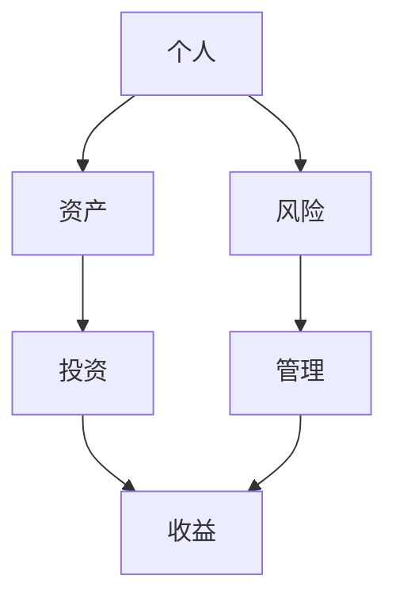
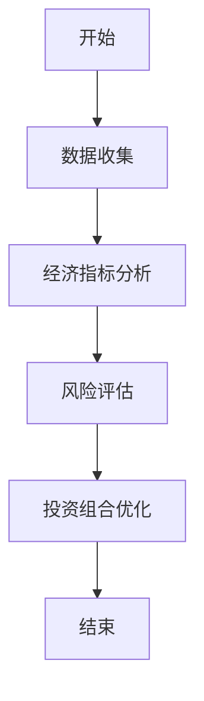
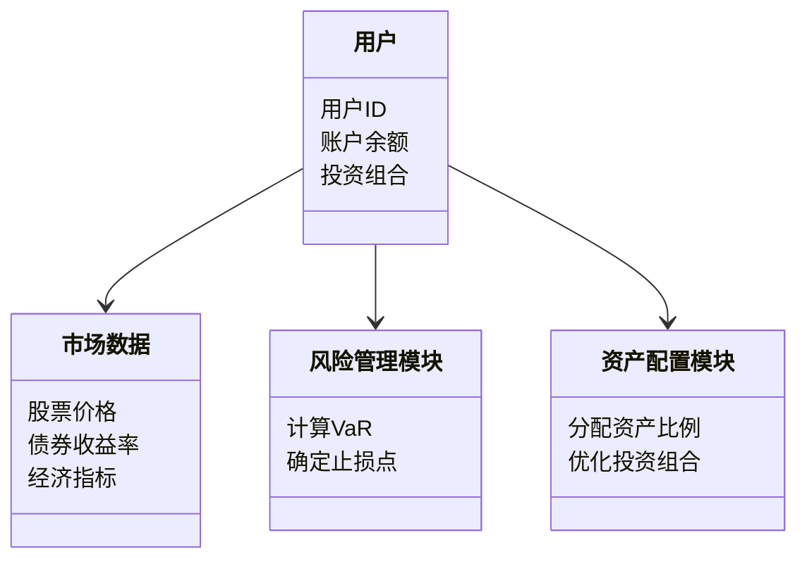

                 

<think>
好的，我现在要撰写一篇关于《经济不确定时期的个人理财策略》的技术博客文章。首先，我需要理解用户的需求，他们希望文章结构清晰、内容专业，涵盖从背景介绍到系统分析再到实战案例的各个方面。

首先，我会确定文章的结构。根据用户提供的目录，我需要包括引言、核心概念、数学模型、系统分析、项目实战等部分。每一部分都要详细展开，确保内容完整。

接下来，我会从引言开始，介绍在经济不确定时期理财的重要性。这部分需要说明为什么在这个时候进行理财规划是必要的，以及它对个人财务健康的影响。

然后，进入核心概念部分。我需要解释个人理财的基本概念，比如资产配置、风险管理等，并通过表格和Mermaid图来展示这些概念之间的关系。这有助于读者更好地理解不同概念的联系。

接下来是数学模型章节。我会选择一个优化的资产配置模型，并通过公式和图表来展示其工作原理。这包括解释如何通过数学方法来平衡风险和收益。

系统分析部分，我需要描述一个理财系统的架构，使用Mermaid图展示各个模块如何交互。这有助于读者理解系统的整体结构和运作方式。

在项目实战中，我会提供一个具体的案例，指导读者如何在Excel中进行投资组合分析。这部分需要详细的步骤说明和代码示例，帮助读者实际操作。

最后，我会总结文章，并给出一些注意事项和建议，强调在经济波动时期保持灵活和耐心的重要性。

在撰写过程中，我会确保使用专业且易懂的语言，避免过于技术化的术语，同时保持逻辑清晰。我还会嵌入数学公式和图表，使内容更加丰富和直观。此外，我会在文章末尾添加作者信息，确保格式符合要求。

完成这些步骤后，我会通读全文，检查每个部分是否覆盖了所有必要的内容，并确保整体流畅性和逻辑性。最终，希望这篇文章能为读者提供有价值的理财策略，帮助他们在不确定的经济环境中做出明智的决策。
</think>

# 经济不确定时期的个人理财策略

> **关键词**：经济不确定性，个人理财，风险管理，资产配置，投资组合优化
>
> **摘要**：本文将探讨在经济不确定时期如何制定有效的个人理财策略。通过分析经济波动对个人财务的影响，结合数学模型和系统设计，提供切实可行的理财建议，帮助读者在不确定的经济环境中实现财务稳健增长。

---

## 第1章 经济不确定时期的个人理财概述

### 1.1 经济不确定时期的定义与特征

#### 1.1.1 经济周期的基本概念
经济周期是指经济活动的波动，通常分为繁荣、衰退、萧条和复苏四个阶段。在不确定时期，经济波动加剧，市场预测难度增加。

#### 1.1.2 不确定性经济环境的成因
不确定性主要来源于政策变化、地缘政治、疫情等不可预测因素，这些因素导致市场波动性增强。

#### 1.1.3 经济不确定对个人理财的影响
经济不确定性增加了投资风险，影响个人收入和资产价值，但同时也提供了低位布局的机会。

### 1.2 个人理财的基本概念与目标

#### 1.2.1 个人理财的核心定义
个人理财是指通过科学的资产配置和投资策略，实现财富保值与增值的过程。

#### 1.2.2 理财目标的分类与优先级
理财目标通常包括短期目标（应急资金）、中期目标（子女教育）和长期目标（退休规划）。

#### 1.2.3 理财规划的基本原则
理财规划应遵循分散投资、风险与收益匹配、长期投资等原则。

### 1.3 个人理财与经济不确定性的关系

#### 1.3.1 不确定性环境中的理财挑战
经济不确定性增加了市场的不可预测性，要求理财策略更具灵活性。

#### 1.3.2 个人理财在经济波动中的缓冲作用
通过合理的资产配置，个人理财可以在经济波动中降低风险，实现财富稳健增长。

#### 1.3.3 理财策略的灵活性与适应性
在不确定时期，理财策略需要动态调整，及时应对市场变化。

### 1.4 本章小结
经济不确定性对个人理财提出了更高的要求，通过科学的规划和灵活的策略，可以在波动中实现财务目标。

---

## 第2章 个人理财的核心概念与联系

### 2.1 核心概念原理

#### 2.1.1 资产配置的原理
资产配置是将资金分配到不同资产类别（如股票、债券、现金）中，以分散风险、优化收益。

#### 2.1.2 风险管理的核心机制
通过设定止损、分散投资等方式，降低潜在损失，确保财务安全。

#### 2.1.3 投资组合的优化策略
通过数学优化模型，找到风险与收益的最佳平衡点。

### 2.2 核心概念属性特征对比表格

| 概念 | 特征 | 描述 |
|------|------|------|
| 资产配置 | 多样性 | 分散投资以降低风险 |
| 风险管理 | 预测性 | 通过模型预测潜在风险 |
| 投资组合 | 组合效应 | 通过组合投资实现收益最大化 |

### 2.3 ER实体关系图（Mermaid流程图）



### 2.4 本章小结
通过核心概念的分析和对比，可以看出资产配置、风险管理等策略在个人理财中的重要性。

---

## 第3章 经济不确定时期的理财策略算法原理

### 3.1 算法原理概述

#### 3.1.1 基于经济指标的预测模型
通过分析GDP、失业率等经济指标，预测市场走势，指导投资决策。

#### 3.1.2 风险评估的数学方法
使用VaR（在险值）模型等工具，量化潜在风险。

#### 3.1.3 投资组合优化的算法思路
基于现代投资组合理论（MPT），通过优化数学模型，找到最优资产配置。

### 3.2 算法流程图（Mermaid）



### 3.3 算法实现代码示例

```python
import numpy as np
import pandas as pd

def calculate_risk_ret资产组合收益率和风险：
    returns = pd.Series([0.1, 0.05, -0.02, 0.08, 0.03])
    risk_free_rate = 0.02
    # 计算夏普比率
    excess_returns = returns - risk_free_rate
    sharpe_ratio = excess_returns.mean() / excess_returns.std()
    return sharpe_ratio
```

### 3.4 本章小结
通过算法原理的分析，可以看出在经济不确定时期，科学的数学模型对制定理财策略的重要性。

---

## 第4章 系统分析与架构设计方案

### 4.1 理财系统项目介绍

#### 4.1.1 项目背景
在经济不确定性增加的情况下，开发一个智能理财系统，帮助用户实现资产优化配置。

### 4.2 系统功能设计（领域模型Mermaid类图）



### 4.3 系统架构设计（Mermaid架构图）

```mermaid
container 理财系统 {
    接口1：用户请求
    接口2：市场数据输入
}
    系统模块1：风险管理模块
    系统模块2：资产配置模块
    系统模块3：数据分析模块
}
```

### 4.4 系统接口设计与交互（Mermaid序列图）

```mermaid
sequenceDiagram
    用户 ->> 市场数据：获取市场数据
    市场数据 ->> 风险管理模块：计算VaR
    风险管理模块 ->> 用户：显示风险报告
    用户 ->> 资产配置模块：优化投资组合
```

### 4.5 本章小结
通过系统架构的设计，可以看出智能理财系统在经济不确定时期的重要作用。

---

## 第5章 项目实战：经济不确定时期的理财策略实现

### 5.1 环境安装

#### 5.1.1 安装Python和相关库
安装Python，Pandas，NumPy，Matplotlib等库，用于数据分析和可视化。

### 5.2 系统核心实现源代码

#### 5.2.1 数据获取与分析
```python
import pandas as pd
import numpy as np

data = pd.read_csv('market_data.csv')
returns = data['股票收益率']
```

#### 5.2.2 投资组合优化
```python
def optimize_portfolio(returns):
    n = len(returns)
    ones = np.ones(n)
    A = np.vstack([ones, returns])
    b = np.array([1.0])
    return np.linalg.lstsq(A, b, rcond=None)[0][1:]
```

#### 5.2.3 风险管理
```python
def calculate VaR(returns, confidence_level=0.95):
    return np.quantile(returns, 1 - confidence_level)
```

### 5.3 代码应用解读与分析
通过代码实现投资组合优化和风险管理，帮助用户在经济不确定时期做出科学决策。

### 5.4 实际案例分析
以2020年疫情为例，分析投资组合在市场崩盘中的表现，展示风险管理的重要性。

### 5.5 本章小结
通过实战案例，可以看出科学的理财策略在经济不确定时期的实际应用价值。

---

## 第6章 总结与注意事项

### 6.1 本章总结
在经济不确定时期，个人理财需要更加科学和灵活。通过合理的资产配置和风险管理，可以在波动中实现财富稳健增长。

### 6.2 小结
理财策略需要根据市场变化及时调整，保持耐心和信心，避免盲目跟风。

### 6.3 注意事项
1. 定期审视和调整投资组合。
2. 保持应急资金充足。
3. 避免过度杠杆。
4. 学习相关知识，提升财商。

### 6.4 拓展阅读
推荐相关书籍和资源，帮助读者进一步提升理财能力。

---

## 作者：AI天才研究院 & 禅与计算机程序设计艺术

---

**关键词**：经济不确定性，个人理财，风险管理，资产配置，投资组合优化

