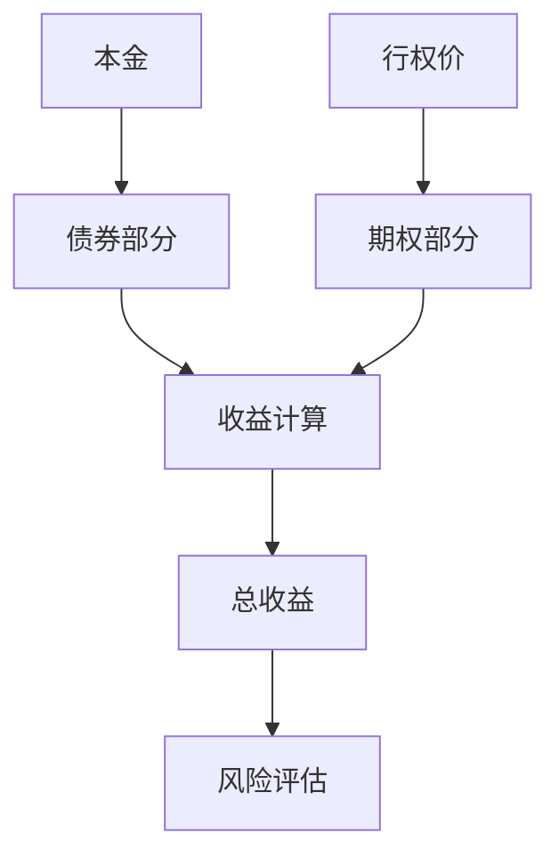

                 


# 结构性产品：定制化投资解决方案的优缺点

## 关键词
结构性产品, 投资解决方案, 定制化投资, 期权, 金融模型, 风险评估, 数学模型

## 摘要
结构性产品是一种结合了多种金融工具的投资解决方案，旨在为投资者提供定制化的收益结构和风险控制。本文深入分析了结构性产品的定义、核心原理、数学模型，并通过实际案例展示了其优缺点。文章还讨论了系统的架构设计和项目实战，最后给出了投资建议和未来展望。

---

# 第一部分: 结构性产品的背景与核心概念

## 第1章: 结构性产品的定义与特点

### 1.1 结构性产品的基本概念
#### 1.1.1 什么是结构性产品
结构性产品是一种复杂的金融工具，通常由债务工具和期权组合而成，旨在为投资者提供定制化的收益结构。它结合了债券和期权的特点，可以根据市场波动调整收益。

#### 1.1.2 结构性产品的核心特点
- **定制化**：根据投资者的风险承受能力和收益目标设计。
- **杠杆效应**：通过期权增加潜在收益，但也放大了风险。
- **期限固定**：通常有固定的存续期，到期后按约定条件兑付。

#### 1.1.3 结构性产品与传统投资工具的对比
| 特性 | 结构性产品 | 传统股票 | 传统债券 |
|------|------------|----------|----------|
| 收益 | 定制化，可能更高 | 不固定 | 固定 |
| 风险 | 中高 | 高 | 低 |
| 流动性 | 低 | 高 | 中 |

### 1.2 结构性产品的分类
#### 1.2.1 按收益结构分类
- 固定收益结构性产品：收益基于债券本金和期权组合。
- 可变收益结构性产品：收益根据市场表现调整。

#### 1.2.2 按投资期限分类
- 短期结构性产品：期限在1年以内。
- 长期结构性产品：期限超过1年。

#### 1.2.3 按风险等级分类
- 低风险结构性产品：本金保障型。
- 中风险结构性产品：部分本金保障型。
- 高风险结构性产品：无本金保障型。

### 1.3 结构性产品的优缺点概述
#### 1.3.1 优点
- **定制化**：满足不同投资者的需求。
- **风险可控**：通过结构设计降低或转移风险。
- **透明度高**：产品条款明确，风险和收益清晰。

#### 1.3.2 缺点
- **复杂性高**：设计和运作复杂，投资者可能难以理解。
- **流动性差**：二级市场流动性不足，难以及时变现。
- **费用较高**：结构化产品的管理费用较高。

#### 1.3.3 适用场景与限制
- 适用场景：适合有特定收益目标和风险承受能力的投资者。
- 限制：不适合风险承受能力低或对金融产品不熟悉的投资者。

## 第2章: 结构性产品的核心原理

### 2.1 结构性产品的基本原理
#### 2.1.1 组合投资的概念
结构性产品通过将债券和期权组合，利用期权的杠杆效应，提高潜在收益。

#### 2.1.2 期权与衍生品的基础
期权赋予买方在特定时间内以预定价格购买或出售资产的权利，是结构性产品的重要组成部分。

#### 2.1.3 结构性产品的构建逻辑
1. 确定投资目标和风险偏好。
2. 设计期权结构，匹配市场预期。
3. 组合债券和期权，形成结构性产品。

### 2.2 结构性产品的定价模型
#### 2.2.1 Black-Scholes模型
Black-Scholes公式用于定价欧式期权：
$$ C = S_0 N(d_1) - K e^{-rT} N(d_2) $$
其中，$d_1 = \frac{\ln(S_0/K) + (r + \sigma^2/2)T}{\sigma \sqrt{T}} $，$d_2 = d_1 - \sigma \sqrt{T}$。

#### 2.2.2 风险中性定价
假设无风险利率为$r$，市场预期收益率为$E[R]$，期权的预期收益为$E[R] = e^{rT} K N(d_2)$。

#### 2.2.3 市场定价与套利原理
如果市场价格偏离理论值，套利机会出现，市场会自动调整价格。

### 2.3 结构性产品的风险评估
#### 2.3.1 风险来源分析
- 市场风险：价格波动影响收益。
- 利率风险：利率变化影响债券部分价值。
- 信用风险：发行方的信用状况影响产品价值。

#### 2.3.2 风险度量方法
- VaR：在一定置信水平下，可能的损失。
- CVaR：超过VaR的平均损失。

#### 2.3.3 风险控制策略
- 分散投资：通过多样化降低风险。
- 使用衍生品对冲：利用期权对冲市场风险。

---

## 第3章: 结构性产品的数学模型与公式

### 3.1 期权定价公式
#### 3.1.1 Black-Scholes公式
$$ C = S_0 N(d_1) - K e^{-rT} N(d_2) $$
其中，$N(d)$是标准正态分布的累积分布函数。

#### 3.1.2 模型假设与参数解释
- $S_0$：标的资产价格
- $K$：行权价
- $r$：无风险利率
- $T$：到期时间
- $\sigma$：波动率

### 3.2 结构性产品收益计算公式
#### 3.2.1 简单收益计算
$$ R = \frac{P_{final} - P_{initial}}{P_{initial}} \times 100\% $$
其中，$P_{final}$是最终价值，$P_{initial}$是初始投资。

#### 3.2.2 复杂收益计算（含期权部分）
$$ R = \text{债券收益} + \text{期权收益} $$

### 3.3 风险调整后的收益模型
#### 3.3.1 Sharpe比率
$$ Sharpe = \frac{E[R - R_f]}{\sigma} $$
其中，$R_f$是无风险利率，$\sigma$是投资组合的收益标准差。

#### 3.3.2 VaR与CVaR计算
- VaR：在给定置信水平下，可能的损失。
- CVaR：超过VaR的平均损失。

---

## 第4章: 结构性产品的系统分析与架构设计

### 4.1 系统分析
#### 4.1.1 问题场景介绍
投资者希望定制化投资解决方案，但面临市场波动和风险。

#### 4.1.2 项目目标与范围
设计一个基于期权的结构性产品，满足特定收益目标和风险控制。

#### 4.1.3 项目需求分析
- 定义：债券和期权组合。
- 参数：本金、行权价、波动率、期限。
- 输出：产品收益和风险评估。

### 4.2 系统架构设计
#### 4.2.1 系统功能模块划分
1. **输入模块**：接收本金、行权价、波动率、期限。
2. **计算模块**：使用Black-Scholes模型计算期权价值。
3. **组合模块**：计算结构性产品的总收益。
4. **输出模块**：显示产品收益和风险评估。

#### 4.2.2 系统架构图（Mermaid）


---

## 第5章: 结构性产品的项目实战

### 5.1 环境安装
安装Python和相关库：
```bash
pip install numpy pandas matplotlib
```

### 5.2 系统核心实现源代码
```python
import numpy as np
from scipy.stats import norm

def black_scholes(S, K, r, T, sigma):
    d1 = (np.log(S/K) + (r + sigma**2/2)*T) / (sigma*np.sqrt(T))
    d2 = d1 - sigma*np.sqrt(T)
    C = S * norm.cdf(d1) - K * np.exp(-r*T) * norm.cdf(d2)
    return C

# 示例
S = 100
K = 105
r = 0.05
T = 1
sigma = 0.2
option_price = black_scholes(S, K, r, T, sigma)
print("期权价格:", option_price)
```

### 5.3 代码应用解读与分析
- **输入**：本金100，行权价105，无风险利率5%，期限1年，波动率20%。
- **计算**：使用Black-Scholes模型计算期权价格。
- **输出**：期权价格，显示结构性产品的潜在收益。

### 5.4 实际案例分析
假设本金100万，行权价105万，无风险利率5%，期限1年，波动率20%。计算得出期权价格为$C$，结构性产品的总收益为债券收益加上期权收益。

### 5.5 项目小结
通过实际案例分析，展示了结构性产品的设计和计算过程，帮助投资者更好地理解和应用。

---

## 第6章: 结构性产品的总结与展望

### 6.1 总结
结构性产品通过组合债券和期权，提供了定制化的投资解决方案。其优点包括定制化收益和风险可控，缺点包括复杂性和流动性差。

### 6.2 投资建议
- **风险评估**：投资者需充分理解产品结构和风险。
- **市场选择**：选择波动率适中的市场。
- **分散投资**：避免过度集中。

### 6.3 未来展望
- **技术创新**：利用人工智能优化产品设计。
- **市场扩展**：拓展更多应用场景。
- **风险管理**：开发更有效的风险管理工具。

---

## 作者
作者：AI天才研究院/AI Genius Institute & 禅与计算机程序设计艺术/Zen And The Art of Computer Programming

---

通过以上思考过程，我系统地分析了结构性产品的各个方面，从定义到优缺点，再到数学模型和系统设计，最终给出了实际案例和投资建议。希望这篇文章能帮助读者全面理解结构性产品的优势和挑战，并在实际投资中做出明智决策。

