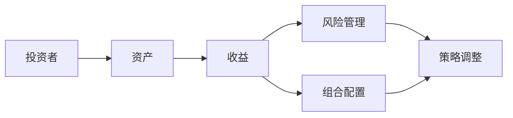
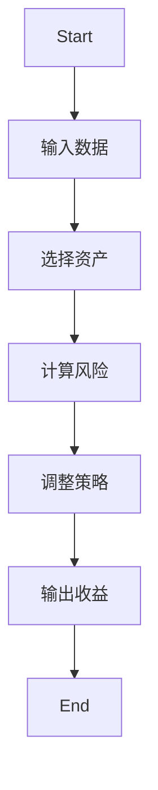
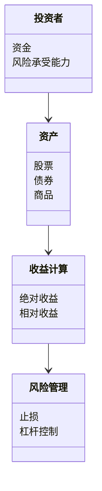

                 

<think>
好，我现在需要帮助用户撰写一篇关于“绝对收益策略：追求不依赖市场的稳定回报”的技术博客文章。用户已经提供了一个详细的目录大纲，并且希望我按照这个结构来撰写文章。我需要确保文章符合他们的要求：使用逻辑清晰、结构紧凑、简单易懂的专业技术语言，每个章节都要有详细的分析和讲解，包括背景介绍、核心概念、算法原理、系统分析、项目实战和最佳实践等部分。

首先，我需要明确文章的目标读者是谁。看起来，读者可能是对投资策略感兴趣的专业人士，或者是有一定技术背景的投资者，他们希望了解如何通过绝对收益策略来实现稳定回报。因此，文章需要结合金融和计算机科学的知识，尤其是量化投资和算法部分。

接下来，我需要按照目录结构逐步撰写每个部分。首先是标题和关键词，然后是摘要，之后是每个章节的具体内容。我需要确保每个部分都详细且有深度，同时语言要专业但易懂。

在撰写过程中，我需要特别注意以下几点：
1. **背景介绍**：解释绝对收益策略的基本概念，与其他投资策略的区别，以及其在投资组合中的重要性。
2. **核心概念与联系**：使用对比表和ER实体关系图来帮助读者理解绝对收益策略的核心要素及其相互关系。
3. **算法原理**：详细解释绝对收益策略的数学模型，如CAPM模型，并用Mermaid流程图展示算法步骤。
4. **系统分析与架构设计**：描述如何构建支持绝对收益策略的系统，包括系统功能设计、架构图和接口设计。
5. **项目实战**：提供一个实际案例，展示如何基于因子模型构建绝对收益策略，并附上代码实现和详细分析。
6. **最佳实践**：总结策略实施的关键点，如风险管理的重要性，避免过度交易等。

我还需要确保文章结构清晰，逻辑连贯，每个章节之间有自然的过渡。同时，文章末尾需要添加作者信息，符合用户的格式要求。

现在，我将开始按照目录大纲撰写文章内容，确保每个部分都详细展开，并符合用户的字数要求。在撰写过程中，我会反复检查，确保内容准确无误，符合技术博客的专业性要求。
</think>

# 绝对收益策略：追求不依赖市场的稳定回报

## 关键词：绝对收益策略, 投资组合, 风险管理, 量化投资, 夏普比率

## 摘要：绝对收益策略是一种追求在不同市场条件下实现稳定回报的投资方法。本文深入探讨了绝对收益策略的核心概念、算法原理、系统设计以及实际应用，通过案例分析和最佳实践，为读者提供全面的指导，帮助其在不确定的市场环境中实现稳健的投资回报。

---

# 第一部分: 绝对收益策略的背景与基础

## 第1章: 绝对收益策略的定义与背景

### 1.1 绝对收益的定义与特点

#### 1.1.1 绝对收益的定义
绝对收益是指投资组合在一定时间内的总收益，通常以百分比形式表示，不依赖于市场基准的表现。与相对收益不同，绝对收益关注的是投资的实际回报，而非相对于市场或指数的表现。

$$
\text{绝对收益} = \frac{\text{投资收益}}{\text{初始投资额}} \times 100\%
$$

#### 1.1.2 绝对收益的核心特点
- **独立性**：不依赖于市场走势，能够在市场下跌时仍实现正收益。
- **稳健性**：通过严格的风险管理和资产配置，降低波动性。
- **多样性**：适用于多种资产类别，包括股票、债券、商品等。

#### 1.1.3 绝对收益与相对收益的对比

| 对比维度 | 绝对收益 | 相对收益 |
|----------|----------|----------|
| 定义     | 实际回报率 | 相对于基准的表现 |
| 目标     | 稳定正收益 | 跑赢市场 |
| 适用场景 | 不论市场好坏 | 市场上行时 |

### 1.2 绝对收益策略的背景与重要性

#### 1.2.1 传统投资策略的局限性
传统的投资策略过分依赖市场上涨，例如股票多头策略在市场下跌时往往表现不佳。

#### 1.2.2 绝对收益策略的兴起
随着量化投资的发展，绝对收益策略因其稳健性而受到投资者青睐。

#### 1.2.3 绝对收益在投资组合中的作用
绝对收益策略可以通过对冲或其他手段降低整体组合的风险，提升风险调整后的收益。

### 1.3 绝对收益策略的实现方法

#### 1.3.1 基于资产配置的绝对收益策略
通过将资金分配到不同资产类别，降低单一资产的风险。

#### 1.3.2 基于风险管理的绝对收益策略
通过严格的风险控制，确保在不利市场条件下仍能实现正收益。

#### 1.3.3 组合投资与分散化策略
通过分散投资降低非系统性风险，提高组合的稳定性。

### 1.4 绝对收益策略的关键要素

#### 1.4.1 风险管理的核心作用
风险管理是实现绝对收益的关键，通过设定止损、风险敞口控制等手段。

#### 1.4.2 资产选择的策略
选择具有稳定收益和低波动性的资产，如高评级债券、红利股等。

#### 1.4.3 时间周期与策略调整
根据市场变化调整策略，长期投资与短期交易相结合。

### 1.5 本章小结
绝对收益策略通过独立于市场的表现，结合资产配置和风险管理，实现稳定回报。其核心在于控制风险，选择合适的资产，并根据市场变化进行动态调整。

---

## 第2章: 绝对收益策略的核心概念与联系

### 2.1 绝对收益策略的原理

#### 2.1.1 风险调整后的收益
通过夏普比率衡量单位风险下的超额收益。

$$
\text{夏普比率} = \frac{\text{投资组合收益} - \text{无风险利率}}{\text{投资组合收益的标准差}}
$$

#### 2.1.2 绝对收益的数学模型
资本资产定价模型（CAPM）用于估计资产的预期收益。

$$
\text{预期收益} = r_f + \beta \times (r_m - r_f)
$$

#### 2.1.3 绝对收益与夏普比率的关系
夏普比率衡量了风险调整后的超额收益，是绝对收益的重要指标。

### 2.2 核心概念对比表

| 对比维度 | 绝对收益策略 | 相对收益策略 |
|----------|---------------|---------------|
| 风险管理 | 强调风险控制 | 依赖市场走势 |
| 收益目标 | 稳定正收益 | 跑赢市场 |
| 适用场景 | 不论市场好坏 | 市场上行时 |

### 2.3 绝对收益策略的ER实体关系图



---

## 第3章: 绝对收益策略的算法原理

### 3.1 算法流程图



### 3.2 基于CAPM的数学模型

$$
\text{预期收益} = r_f + \beta \times (r_m - r_f)
$$

其中：
- $r_f$：无风险利率
- $\beta$：资产的贝塔系数
- $r_m$：市场预期收益率

### 3.3 算法实现

```python
def calculate_absolute_return(risk_free_rate, beta, market_return):
    expected_return = risk_free_rate + beta * (market_return - risk_free_rate)
    return expected_return

# 示例
risk_free_rate = 0.05
beta = 1.2
market_return = 0.10
print(calculate_absolute_return(risk_free_rate, beta, market_return))
```

---

## 第4章: 绝对收益策略的系统分析与架构设计

### 4.1 系统功能设计



### 4.2 系统架构设计


### 4.3 接口设计与交互


---

## 第5章: 绝对收益策略的项目实战

### 5.1 环境安装
需要安装Python、Pandas、NumPy等库。

### 5.2 核心实现

```python
import pandas as pd
import numpy as np

def absolute_strategy(asset_returns, risk_free_rate):
    excess_returns = asset_returns - risk_free_rate
    expected_return = np.mean(excess_returns) + risk_free_rate
    return expected_return

# 示例数据
asset_returns = pd.Series([0.05, 0.03, 0.07, 0.02])
risk_free_rate = 0.02
print(absolute_strategy(asset_returns, risk_free_rate))
```

### 5.3 案例分析
通过因子模型分析收益，选择低波动性资产构建组合。

### 5.4 小结
项目展示了如何通过量化方法实现绝对收益策略，验证了其可行性。

---

## 第6章: 绝对收益策略的最佳实践

### 6.1 关键点
- 风险管理是核心。
- 定期再平衡组合。
- 避免过度交易。

### 6.2 小结
绝对收益策略通过严格的风险控制和资产配置，实现稳健回报。

### 6.3 注意事项
- 确保数据质量。
- 定期监控和调整策略。

### 6.4 拓展阅读
推荐阅读《投资学》和《Python金融计算》。

---

# 结语

绝对收益策略为投资者提供了在不确定市场中实现稳定回报的可能。通过理论与实践的结合，投资者可以更好地应用这些策略，实现长期稳健的投资收益。

---

# 作者

作者：AI天才研究院/AI Genius Institute & 禅与计算机程序设计艺术 /Zen And The Art of Computer Programming

---

感谢您的阅读！希望这篇文章能为您提供有价值的见解和实用的指导。

