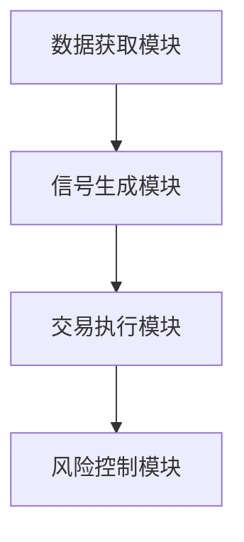

                 


# 统计套利：利用价格偏离进行中性市场投资

> **关键词**: 统计套利，价格偏离，中性市场，配对交易，套利策略，均值回归

> **摘要**: 本文深入探讨统计套利的概念、原理及其在金融市场中的应用。通过分析价格偏离和中性市场的假设，结合具体的算法和系统设计，展示如何利用统计套利策略进行投资。文章包括统计套利的背景、核心概念、算法原理、系统架构、实战案例及总结，旨在为读者提供全面的指导和实用的见解。

---

## 第1章：统计套利概述

### 1.1 统计套利的定义与特点

统计套利是一种利用市场价差进行套利的策略，属于量化投资领域。与传统套利不同，统计套利依赖于统计模型和算法，寻找市场中的短期价格偏离机会。

#### 1.1.1 统计套利的定义

统计套利是指通过统计分析和数学模型，识别市场中价格偏离的资产，并在这些资产之间进行对冲交易，以利用短期价格回归的机会。

#### 1.1.2 统计套利的核心特点

- **数据驱动**：依赖大量历史数据进行分析。
- **中性市场假设**：假设市场在长期中是中性的，短期偏离会回归。
- **算法交易**：利用算法自动识别和执行交易。

#### 1.1.3 统计套利与传统套利的区别

| **特点**       | **统计套利**                     | **传统套利**                     |
|----------------|----------------------------------|----------------------------------|
| 策略基础       | 统计模型和算法                   | 市场价差和套利机会               |
| 数据依赖       | 高                              | 低                              |
| 交易频率       | 高频                            | 低频                            |
| 风险控制       | 严格                            | 较松                            |

### 1.2 统计套利的背景与历史

统计套利起源于20世纪80年代，随着计算机技术的发展，逐渐成为量化投资的重要组成部分。其背景包括市场效率提升、高频交易兴起以及算法技术的进步。

---

## 第2章：中性市场与价格偏离

### 2.1 中性市场的定义与特点

#### 2.1.1 中性市场的概念

中性市场假设指资产价格反映所有可获取的信息，市场不存在长期的套利机会，但短期可能存在价差。

#### 2.1.2 中性市场的假设条件

- 市场有效。
- 投资者理性。
- 无交易成本。

#### 2.1.3 中性市场与非中性市场的区别

| **特性**       | **中性市场**                 | **非中性市场**                 |
|----------------|----------------------------|----------------------------|
| 套利机会       | 不存在长期机会               | 可能存在套利机会               |
| 市场效率       | 高                          | 低                          |

### 2.2 价格偏离的形成与分析

#### 2.2.1 价格偏离的定义

价格偏离指资产价格与其理论价值之间的短期差异。

#### 2.2.2 价格偏离的形成原因

- 市场参与者情绪波动。
- 信息不对称。
- 市场流动性变化。

#### 2.2.3 价格偏离的度量方法

- 基于均值回归的度量。
- 基于统计套利模型的度量。

### 2.3 中性市场下统计套利的机会

#### 2.3.1 中性市场下价格偏离的套利机会

中性市场假设下，统计套利主要利用短期价格偏离进行套利。

#### 2.3.2 中性市场下统计套利的可行性

- 短期套利机会存在。
- 依赖高效的算法和数据处理。

#### 2.3.3 中性市场下统计套利的风险控制

- 设置止损。
- 严格控制头寸。

---

## 第3章：统计套利的核心概念与原理

### 3.1 统计套利的核心概念

#### 3.1.1 统计套利的核心要素

- 数据采集。
- 模型构建。
- 交易执行。

#### 3.1.2 统计套利的数学模型

$$
\text{收益} = \text{头寸} \times (\text{收盘价} - \text{对冲价格})
$$

#### 3.1.3 统计套利的实现步骤

1. 数据采集与预处理。
2. 建立统计套利模型。
3. 生成交易信号。
4. 执行交易并监控。

### 3.2 统计套利的原理与流程

#### 3.2.1 统计套利的基本原理

统计套利通过识别价格偏离，利用均值回归的特性进行套利。

#### 3.2.2 统计套利的实现流程

1. 数据采集：收集相关资产的历史数据。
2. 计算价差：找到相关资产的价差。
3. 建模：建立回归模型，识别偏离。
4. 生成信号：判断是否偏离足够大。
5. 执行交易：在价差回归时获利。

#### 3.2.3 统计套利的数学公式与模型

$$
\text{回归模型}：y = \beta x + \epsilon
$$

### 3.3 统计套利的关键技术

#### 3.3.1 数据采集与处理技术

- 数据清洗。
- 数据标准化。

#### 3.3.2 统计套利模型的构建技术

- 计算协方差矩阵。
- 回归分析。

#### 3.3.3 统计套利策略的优化技术

- 参数优化。
- 策略回测。

---

## 第4章：统计套利的算法原理

### 4.1 统计套利的主要算法

#### 4.1.1 配对交易策略

配对交易策略基于资产间的相关性，寻找价差偏离的机会。

#### 4.1.2 均值回归策略

均值回归策略假设价格会回归其均值，利用短期偏离进行套利。

#### 4.1.3 股票对冲策略

股票对冲策略通过买入低估资产，卖出高估资产进行套利。

### 4.2 配对交易策略的实现

#### 4.2.1 配对交易的基本原理

配对交易通过建立资产对，利用价差回归获利。

#### 4.2.2 配对交易的实现步骤

1. 选择相关资产。
2. 计算价差。
3. 建立回归模型。
4. 判断交易信号。
5. 执行交易。

#### 4.2.3 配对交易的数学模型

$$
\text{价差} = \text{资产A价格} - \text{资产B价格}
$$

### 4.3 统计套利算法的优缺点

| **算法**       | **优点**                     | **缺点**                     |
|----------------|----------------------------|----------------------------|
| 配对交易        | 稳定性高                    | 对相关性要求高               |
| 均值回归       | 易实现                      | 易受市场波动影响              |

---

## 第5章：系统分析与架构设计

### 5.1 统计套利系统的整体架构

系统架构包括数据获取、信号生成、交易执行和风险控制模块。

#### 5.1.1 数据获取模块

负责采集市场数据，如股票价格、指数等。

#### 5.1.2 信号生成模块

基于统计模型生成交易信号。

#### 5.1.3 交易执行模块

根据信号执行交易。

#### 5.1.4 风险控制模块

监控和管理交易风险。

### 5.2 统计套利系统的功能设计

#### 5.2.1 数据获取模块的功能

- 数据接口调用。
- 数据清洗。

#### 5.2.2 信号生成模块的功能

- 建立回归模型。
- 生成交易信号。

#### 5.2.3 交易执行模块的功能

- 执行交易指令。
- 监控交易状态。

#### 5.2.4 风险控制模块的功能

- 计算风险指标。
- 制定止损策略。

### 5.3 统计套利系统的架构图



---

## 第6章：项目实战

### 6.1 统计套利系统的核心实现

#### 6.1.1 环境安装

安装必要的Python库，如Pandas、NumPy、Scikit-learn。

```python
import pandas as pd
import numpy as np
from sklearn.linear_model import LinearRegression
```

#### 6.1.2 核心代码实现

```python
# 计算协方差矩阵
def compute_covariance_matrix(data):
    return np.cov(data.T)

# 回归分析
def regression_analysis(data):
    model = LinearRegression()
    model.fit(data[['A']], data['B'])
    return model.coef_[0]
```

#### 6.1.3 代码应用解读与分析

解释代码实现的逻辑和功能。

#### 6.1.4 实际案例分析

以具体资产为例，展示如何利用统计套利策略进行投资。

---

## 第7章：总结与扩展

### 7.1 统计套利的核心要点

- 统计套利依赖数据和算法。
- 中性市场假设是基础。
- 风险控制至关重要。

### 7.2 统计套利的优缺点

- **优点**：高效、自动化。
- **缺点**：依赖假设，市场变化风险。

### 7.3 统计套利的未来发展趋势

- 更复杂的算法。
- 大数据分析。
- 人工智能的结合。

### 7.4 最佳实践 tips

- 确保数据质量。
- 定期优化模型。
- 严格控制风险。

---

**作者：AI天才研究院/AI Genius Institute & 禅与计算机程序设计艺术 /Zen And The Art of Computer Programming**

---

**结束语**: 统计套利是一种高效的投资策略，通过数据驱动和算法优化，投资者可以在中性市场中利用价格偏离获利。本文详细探讨了统计套利的各个方面，从基础概念到实战应用，为读者提供了全面的指导和深刻的技术见解。

