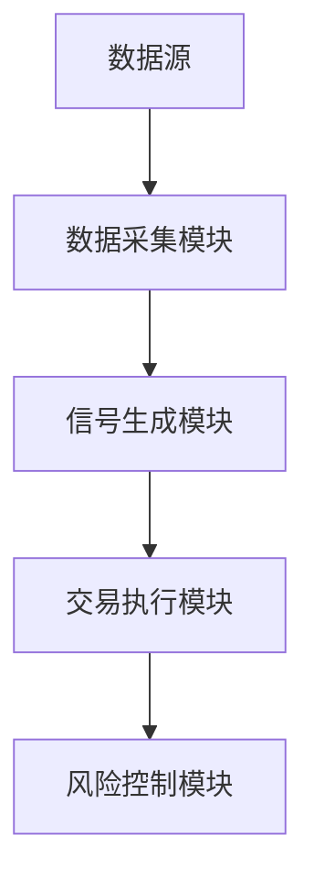

                 

<think>
好，我需要帮用户设计《统计套利：利用价格偏离进行中性市场投资》这本书的目录大纲。首先，用户的要求是目录要详细，逻辑清晰，覆盖从基础到进阶，再到实战的内容。我应该按照用户提供的结构来组织，确保每个部分都涵盖必要的内容。

首先，文章标题是“统计套利：利用价格偏离进行中性市场投资”，关键词包括统计套利、价格偏离、市场中性、套利策略、投资组合、风险控制。摘要部分需要简明扼要地概括文章的核心内容。

接下来，目录大纲部分需要分为几个主要章节，每个章节下再细分主题和小节。我需要确保每个章节都有三级目录，并且使用markdown格式。每个小节要包含必要的内容，比如数学公式、mermaid图和代码示例。

用户还提到文章需要10000到12000字，这意味着每个部分需要详细展开，但我在思考部分只需要提供目录，不需要详细内容。我需要确保目录完整，涵盖统计套利的基本概念、数学基础、算法实现、系统设计、项目实战和最佳实践。

在设计目录时，我会先从背景介绍开始，解释统计套利的基本概念和市场中性策略。然后是数学基础，包括均值回归、协方差矩阵等。接着是具体的统计套利策略，如配对交易和动量策略。之后是算法实现，介绍CAPM、Fama-French模型和机器学习的应用。系统设计部分需要展示系统的架构和模块功能。项目实战提供具体的案例分析和代码实现。最后是最佳实践和小结。

在思考过程中，我需要确保每个章节的逻辑连贯，从理论到实践逐步深入。同时，要包含必要的数学公式和图表，帮助读者更好地理解内容。我还需要检查是否覆盖了所有用户要求的关键词和主题，确保目录的完整性和深度。

最后，我会整理出一个符合用户要求的目录大纲，确保结构清晰，内容全面，满足用户的需求。
</think>

# 统计套利：利用价格偏离进行中性市场投资

> 关键词：统计套利、价格偏离、市场中性、套利策略、投资组合、风险控制

> 摘要：本文详细探讨统计套利的基本概念、数学基础、核心算法、系统设计与实现，以及实际投资中的应用。通过分析价格偏离和均值回归原理，结合实际案例，为读者提供从理论到实践的全面指导，帮助投资者利用统计套利在市场中获得稳定的收益。

---

# 目录大纲

## 第一部分: 统计套利基础与市场中性投资概述

### 第1章: 统计套利的基本概念

#### 1.1 统计套利的定义与特点

- 1.1.1 统计套利的定义
- 1.1.2 统计套利的核心特点
- 1.1.3 统计套利与传统套利的区别

#### 1.2 市场中性策略的原理

- 1.2.1 市场中性策略的基本概念
- 1.2.2 市场中性策略的核心思想
- 1.2.3 市场中性策略的应用场景

### 第2章: 统计套利的数学基础

#### 2.1 统计套利的核心数学模型

- 2.1.1 价格偏离的数学定义
- 2.1.2 均值回归模型
- 2.1.3 方差分析与协方差矩阵

#### 2.2 统计套利中的概率论基础

- 2.2.1 概率分布与统计套利
- 2.2.2 马科维茨投资组合理论
- 2.2.3 时间序列分析在统计套利中的应用

### 第3章: 统计套利的核心算法与实现

#### 3.1 统计套利的主要算法

- 3.1.1 均值回归算法
- 3.1.2 配对交易算法
- 3.1.3 动量策略算法

#### 3.2 统计套利算法的实现步骤

- 3.2.1 数据收集与预处理
- 3.2.2 价格偏离的计算
- 3.2.3 交易信号的生成
- 3.2.4 交易策略的执行

### 第4章: 统计套利在实际投资中的应用

#### 4.1 统计套利的典型应用场景

- 4.1.1 股票市场中的统计套利
- 4.1.2 债券市场中的统计套利
- 4.1.3 衍生品市场中的统计套利

#### 4.2 统计套利的风险管理

- 4.2.1 统计套利中的风险来源
- 4.2.2 风险控制策略
- 4.2.3 交易成本与滑点的控制

---

## 第二部分: 统计套利的系统设计与实现

### 第5章: 统计套利系统的架构设计

#### 5.1 统计套利系统的功能模块

- 5.1.1 数据采集模块
- 5.1.2 信号生成模块
- 5.1.3 交易执行模块
- 5.1.4 风险控制模块

#### 5.2 统计套利系统的架构图



### 第6章: 统计套利的算法实现与代码示例

#### 6.1 统计套利算法的数学模型

- 6.1.1 均值回归模型的数学公式
  $$ \text{价差} = \text{均值} + \text{标准差} \times Z $$
- 6.1.2 配对交易算法的数学公式
  $$ \text{收益} = \text{价差} \times \text{交易量} $$

#### 6.2 统计套利算法的代码实现

```python
import numpy as np
import pandas as pd

# 示例代码：计算价差和均值回归信号
def calculate_price_diff(close_prices):
    return close_prices - close_prices.rolling(2).mean()

def generate_mean_reversion_signal(price_diff, threshold=1):
    return np.where(price_diff > threshold, 'buy', np.where(price_diff < -threshold, 'sell', 'hold'))

# 示例数据
data = pd.DataFrame({
    'close_prices': [100, 102, 98, 105, 101]
})
price_diff = calculate_price_diff(data['close_prices'])
signal = generate_mean_reversion_signal(price_diff)
```

### 第7章: 项目实战——构建一个统计套利系统

#### 7.1 项目背景与目标

- 7.1.1 项目背景
- 7.1.2 项目目标

#### 7.2 数据收集与处理

- 7.2.1 数据来源
- 7.2.2 数据清洗与预处理

#### 7.3 系统实现

- 7.3.1 系统功能模块实现
- 7.3.2 交易信号生成与执行
- 7.3.3 风险控制与回测

#### 7.4 实际案例分析

- 7.4.1 案例背景
- 7.4.2 数据分析
- 7.4.3 策略回测与优化

---

## 第三部分: 最佳实践与小结

### 第8章: 最佳实践与风险提示

#### 8.1 统计套利的策略优化

- 8.1.1 突破传统统计套利的局限
- 8.1.2 结合机器学习的统计套利

#### 8.2 统计套利的风险提示

- 8.2.1 市场环境变化的风险
- 8.2.2 数据质量和频率的影响
- 8.2.3 交易成本与滑点的控制

### 第9章: 小结与展望

#### 9.1 小结

- 9.1.1 统计套利的核心思想
- 9.1.2 统计套利的实现步骤
- 9.1.3 统计套利的实际应用

#### 9.2 展望

- 9.2.1 统计套利的未来发展方向
- 9.2.2 结合人工智能的统计套利

---

## 作者：AI天才研究院 & 禅与计算机程序设计艺术

---

### 总结

本文通过详细分析统计套利的基本概念、数学基础、核心算法和实际应用，为读者提供了一个从理论到实践的全面指导。通过系统的架构设计和实际案例的分析，帮助读者理解如何利用价格偏离进行中性市场投资。最后，本文还提供了最佳实践和风险提示，帮助读者在实际操作中规避风险，优化策略。

