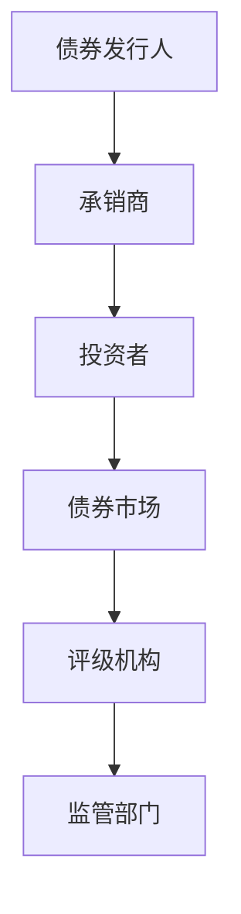

                 

# 绿色债券：可持续金融的新兴投资工具

> **关键词**：绿色债券、可持续金融、债券发行、环境效益、投资工具

> **摘要**：绿色债券作为一种新兴的可持续金融工具，正在全球范围内迅速崛起。本文将深入探讨绿色债券的核心概念、发行机制、市场现状、投资策略以及面临的挑战。通过分析绿色债券的定义、分类、发行流程、评级体系以及实际案例，本文旨在为读者提供一个全面的视角，了解绿色债券在推动可持续发展中的重要作用。

---

## 第一部分：绿色债券的背景与核心概念

### 第1章：绿色债券的背景介绍

#### 1.1 绿色债券的基本概念

##### 1.1.1 什么是绿色债券
绿色债券是一种专门用于支持具有环境效益的项目的债券。与传统债券不同，绿色债券的募集资金必须用于支持环保项目，如可再生能源、节能建筑、污染治理等。

##### 1.1.2 绿色债券的定义与特征
绿色债券的定义可以归纳为以下几点：
- **募集资金用途**：专门用于支持具有环境效益的项目。
- **发行主体**：通常由政府、企业和金融机构发行。
- **评级与认证**：需要经过第三方机构的评级和认证，确保资金用途的合规性。
- **透明度**：要求发行人定期披露资金使用情况和项目进展。

##### 1.1.3 绿色债券与传统债券的区别
以下是绿色债券与传统债券的主要区别：

| 属性                | 绿色债券                          | 传统债券                          |
|---------------------|------------------------------------|------------------------------------|
| **募集资金用途**     | 专门用于环保项目                  | 用于一般性用途或特定项目          |
| **评级要求**         | 需要第三方环境评级                | 无特殊评级要求                    |
| **披露要求**         | 需要披露资金使用情况和项目进展    | 只需披露财务信息                  |
| **市场定位**         | 强调环境效益                      | 以财务回报为核心                |

#### 1.2 绿色债券的发展背景

##### 1.2.1 全球可持续发展的需求
随着全球气候变化问题的加剧，各国政府和企业开始意识到环境保护的重要性。绿色债券作为一种融资工具，能够有效地支持环保项目的实施，从而推动全球可持续发展。

##### 1.2.2 金融市场的绿色转型
近年来，全球金融市场掀起一股“绿色金融”的浪潮。越来越多的投资者开始关注具有环境效益的投资工具，绿色债券因此成为金融市场的热点。

##### 1.2.3 政策支持与监管框架
各国政府和国际组织纷纷出台政策，支持绿色债券的发展。例如，欧盟的“绿色债券标准”和中国的“绿色债券指引”等，为绿色债券的发行提供了政策保障。

#### 1.3 绿色债券的分类与应用场景

##### 1.3.1 绿色债券的分类
绿色债券可以根据不同的标准进行分类，以下是常见的分类方式：
- **按发行主体**：政府绿色债券、企业绿色债券、金融机构绿色债券。
- **按期限**：短期绿色债券、中期绿色债券、长期绿色债券。
- **按用途**：可再生能源绿色债券、节能建筑绿色债券、污染治理绿色债券。

##### 1.3.2 绿色债券的主要应用场景
绿色债券的应用场景非常广泛，主要包括以下领域：
- **可再生能源**：如风能、太阳能等项目的融资。
- **节能建筑**：如绿色建筑、低碳建筑的建设。
- **污染治理**：如污水处理、空气净化等项目。
- **可持续交通**：如电动汽车充电站、轨道交通等。

##### 1.3.3 绿色债券的市场现状
近年来，全球绿色债券市场呈现快速增长态势。根据相关数据，2022年全球绿色债券发行规模超过5000亿美元，较2021年增长了30%以上。中国作为全球第二大经济体，也在积极推动绿色债券市场的发展。

---

## 第二部分：绿色债券的核心概念与联系

### 第2章：绿色债券的核心概念与联系

#### 2.1 绿色债券的核心原理

##### 2.1.1 绿色债券的发行机制
绿色债券的发行机制与传统债券类似，但具有以下特点：
- **募集资金用途**：必须用于环保项目。
- **第三方认证**：需要经过评级机构的认证，确保资金用途的合规性。
- **信息披露**：发行人需要定期披露资金使用情况和项目进展。

##### 2.1.2 绿色债券的评级体系
绿色债券的评级体系主要关注以下方面：
- **环境效益**：项目的环境效益是否显著。
- **资金用途**：募集资金是否用于指定的环保项目。
- **发行人信用**：发行人的信用评级。

##### 2.1.3 绿色债券的生命周期
绿色债券的生命周期包括以下几个阶段：
1. **发行阶段**：发行人确定发行规模、期限和用途。
2. **认购阶段**：投资者认购债券。
3. **存续阶段**：发行人定期披露资金使用情况。
4. **到期阶段**：发行人偿还本金和利息。

#### 2.2 绿色债券与可持续发展的关系

##### 2.2.1 绿色债券在可持续金融中的作用
绿色债券是可持续金融的重要组成部分。它通过引导资金流向环保项目，推动经济的可持续发展。

##### 2.2.2 绿色债券对环境保护的贡献
绿色债券为环保项目提供了资金支持，有助于减少碳排放、改善空气质量、保护生态系统等。

##### 2.2.3 绿色债券的社会经济效益
绿色债券不仅具有环境效益，还具有显著的社会经济效益。例如，通过支持可再生能源项目，可以减少对化石能源的依赖，降低能源成本。

#### 2.3 绿色债券的实体关系图

---

## 第三部分：绿色债券的发行与监管

### 第3章：绿色债券的发行与监管

#### 3.1 绿色债券的发行流程

##### 3.1.1 确定发行目的
发行人需要明确募集资金的用途，例如支持可再生能源项目。

##### 3.1.2 确定发行规模
发行人需要根据项目需求和市场情况确定发行规模。

##### 3.1.3 确定发行方式
绿色债券可以通过公开发行或私募发行的方式进行。

#### 3.2 绿色债券的评级与认证

##### 3.2.1 绿色债券评级标准
绿色债券的评级需要符合国际或地区的标准，例如欧盟的“绿色债券标准”和中国的“绿色债券指引”。

##### 3.2.2 第三方认证机构的作用
第三方认证机构负责对绿色债券的募集资金用途和项目进行审核，确保其符合绿色债券的要求。

##### 3.2.3 评级结果的应用
评级结果将影响债券的发行利率和投资者的认购意愿。

#### 3.3 绿色债券的监管框架

##### 3.3.1 全球监管标准
国际上主要采用欧盟的“绿色债券标准”和国际资本市场协会（ICMA）的“绿色债券原则”。

##### 3.3.2 地区性监管要求
中国等国家和地区也制定了绿色债券的监管要求，例如中国的“绿色债券指引”。

##### 3.3.3 监管机构的职责
监管机构负责对绿色债券的发行、评级和信息披露进行监督，确保市场的规范运行。

---

## 第四部分：绿色债券的市场分析与投资策略

### 第4章：绿色债券的市场分析与投资策略

#### 4.1 绿色债券市场的现状分析

##### 4.1.1 全球绿色债券市场的发展趋势
全球绿色债券市场呈现快速增长态势，预计未来几年将继续保持增长。

##### 4.1.2 中国绿色债券市场的现状
中国是全球最大的绿色债券市场之一，近年来发行规模迅速增长。

##### 4.1.3 绿色债券市场的未来展望
随着全球可持续发展理念的推进，绿色债券市场将保持长期增长。

#### 4.2 绿色债券的投资策略

##### 4.2.1 投资者如何选择绿色债券
投资者需要关注发行人的信用评级、项目的环境效益以及债券的期限和收益率。

##### 4.2.2 绿色债券的风险管理
投资者需要关注绿色债券的信用风险、市场风险和流动性风险。

##### 4.2.3 绿色债券的收益与风险平衡
绿色债券通常具有较高的社会和环境效益，但收益率可能略低于传统债券。

---

## 第五部分：绿色债券的创新与挑战

### 第5章：绿色债券的创新与挑战

#### 5.1 绿色债券的创新模式

##### 5.1.1 绿色债券的多样化产品
市场上已经出现了多种绿色债券产品，例如浮动利率绿色债券、挂钩指数的绿色债券等。

##### 5.1.2 绿色债券的创新发行方式
绿色债券可以通过区块链等技术创新实现智能化发行和管理。

##### 5.1.3 绿色债券的技术创新
技术创新可以提高绿色债券的发行效率和透明度，例如智能合约的应用。

#### 5.2 绿色债券面临的挑战

##### 5.2.1 市场流动性问题
绿色债券的市场流动性较低，可能影响投资者的流动性需求。

##### 5.2.2 信息不对称问题
投资者可能难以获取足够的信息来评估绿色债券的风险和收益。

##### 5.2.3 监管协调问题
不同地区和国家的监管标准不一，可能影响绿色债券的发行和交易。

#### 5.3 绿色债券的未来发展趋势

##### 5.3.1 数字化与智能化趋势
绿色债券将更加依赖数字化技术，实现智能化发行和管理。

##### 5.3.2 绿色债券的全球化发展
随着全球可持续发展理念的推进，绿色债券将实现更广泛的全球化发展。

##### 5.3.3 绿色债券的可持续发展
绿色债券将更加注重长期的可持续发展，支持更具环境效益的项目。

---

## 第六部分：绿色债券的案例分析与实际操作

### 第6章：绿色债券的案例分析与实际操作

#### 6.1 绿色债券的典型案例

##### 6.1.1 国际绿色债券案例
例如，法国政府发行的绿色债券用于支持可再生能源项目。

##### 6.1.2 中国绿色债券案例
例如，中国国家电网公司发行的绿色债券用于支持智能电网建设。

##### 6.1.3 行业绿色债券案例
例如，某新能源公司发行的绿色债券用于支持风力发电项目。

#### 6.2 绿色债券的实际操作步骤

##### 6.2.1 确定发行目标
发行人需要明确募集资金的用途和规模。

##### 6.2.2 确定发行方式
发行人可以选择公开发行或私募发行。

##### 6.2.3 确定评级机构
发行人需要选择一家第三方评级机构对债券进行评级。

##### 6.2.4 发行债券
发行人通过承销商将债券发行给投资者。

##### 6.2.5 管理债券
发行人需要定期披露资金使用情况和项目进展。

---

## 作者：AI天才研究院/AI Genius Institute & 禅与计算机程序设计艺术 /Zen And The Art of Computer Programming

---

以上是《绿色债券：可持续金融的新兴投资工具》的技术博客文章的完整目录大纲，涵盖了绿色债券的核心概念、发行机制、市场分析、投资策略以及实际案例。通过本文的分析，读者可以全面了解绿色债券在可持续金融中的重要作用，并掌握绿色债券的实际操作方法。

