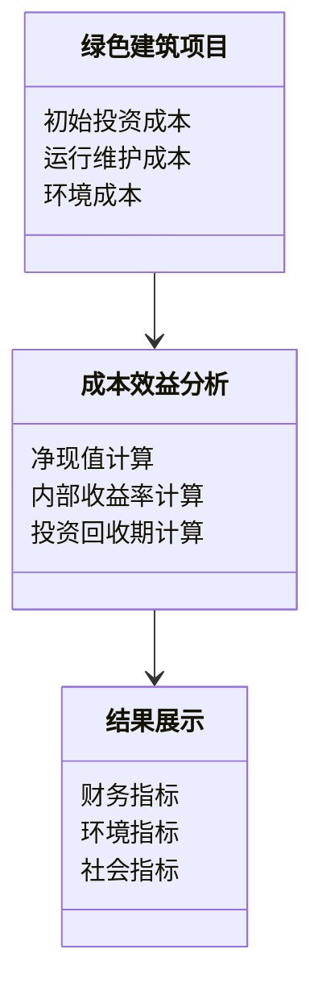
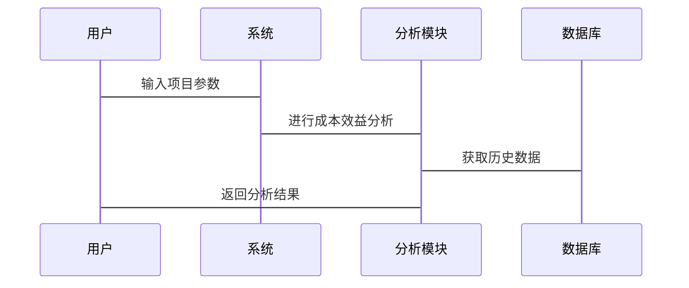

                 


# 绿色建筑技术的成本效益分析与投资决策

> 关键词：绿色建筑技术、成本效益分析、投资决策、净现值法、内部收益率法、可持续发展

> 摘要：绿色建筑技术作为可持续发展的重要组成部分，其成本效益分析是评估其经济可行性和投资价值的关键。本文从绿色建筑的基本概念入手，详细探讨其成本构成、效益来源及分析方法，通过实际案例分析，为投资决策提供科学依据。文章结合理论与实践，系统性地解析绿色建筑技术的成本效益评估过程，并提出优化建议。

---

## 第1章 绿色建筑技术概述

### 1.1 绿色建筑的基本概念

绿色建筑是指在全生命周期内，最大限度地节约资源、保护环境、减少污染的建筑形式。它强调能源高效利用、水资源节约、材料环保和生态友好，旨在实现人与自然的和谐共生。

#### 1.1.1 绿色建筑的定义与内涵

绿色建筑不仅关注建筑本身的物理性能，还强调其对环境和社会的影响。它通过采用可再生材料、节能技术等手段，减少建筑对环境的负担，同时为使用者提供健康、舒适的生活环境。

#### 1.1.2 绿色建筑的发展历程

绿色建筑的概念起源于20世纪中叶，随着环境问题的日益严重，绿色建筑从理念逐步走向实践。从最初的被动节能到主动适应环境，绿色建筑技术不断进步，应用范围也不断扩大。

#### 1.1.3 绿色建筑与可持续发展的关系

绿色建筑是实现可持续发展的重要手段。通过减少能源消耗和环境污染，绿色建筑不仅降低了建筑运营成本，还为城市可持续发展提供了重要支撑。

### 1.2 成本效益分析的重要性

绿色建筑技术的成本效益分析是评估其经济可行性的关键步骤。通过分析初始投资、运行成本和环境效益，可以为投资决策提供科学依据。

#### 1.2.1 成本效益分析的基本概念

成本效益分析是通过比较不同方案的成本和效益，选择最优方案的过程。在绿色建筑中，成本效益分析帮助我们权衡技术投入与经济回报。

#### 1.2.2 绿色建筑技术的成本效益分析意义

绿色建筑技术的成本效益分析有助于量化其经济价值，为政策制定者和投资者提供参考。通过分析，可以识别高性价比的技术，优化资源配置。

#### 1.2.3 绿色建筑技术的成本效益分析方法

绿色建筑的成本效益分析方法包括定性和定量分析。定性分析关注社会效益和环境影响，定量分析则通过财务指标评估经济性。

### 1.3 绿色建筑技术的成本构成

绿色建筑技术的成本包括初始投资和运行维护费用。初始投资涵盖设计、施工和设备购置，运行维护费用则包括能源消耗和维护支出。

#### 1.3.1 初始投资成本

初始投资成本包括土地购置、建筑设计、施工费用和设备采购等。绿色建筑技术通常需要更高的初始投资，但长期来看更具经济性。

#### 1.3.2 运行维护成本

运行维护成本涉及能源消耗、设备维护和清洁费用等。绿色建筑通过节能技术降低了运行成本，提升了整体效益。

#### 1.3.3 环境与社会效益

绿色建筑技术带来了显著的环境效益，如减少碳排放和资源消耗。社会效益体现在提升居住舒适度和健康水平，增强社会形象。

### 1.4 绿色建筑技术的效益来源

绿色建筑技术的效益来源于能源节约、环境改善和经济回报。通过技术创新和优化管理，绿色建筑实现了成本节约和价值提升。

#### 1.4.1 经济效益

绿色建筑技术通过降低能源消耗和维护费用，提高了经济效益。同时，绿色建筑往往具有更高的市场价值和租金收益。

#### 1.4.2 社会效益

绿色建筑为使用者提供了健康舒适的环境，提升了生活质量。同时，绿色建筑项目通常享有政府补贴和税收优惠，增强了社会效益。

#### 1.4.3 环境效益

绿色建筑通过减少能源消耗和碳排放，保护了生态环境，促进了可持续发展。

### 1.5 绿色建筑技术与传统建筑技术的对比

绿色建筑技术在材料选择、能效设计和环保措施上与传统建筑技术存在显著差异。尽管绿色建筑的初始投资较高，但其长期效益更为显著。

#### 1.5.1 技术特点对比

绿色建筑技术注重节能环保，采用可再生能源和智能控制系统。传统建筑技术则以满足基本功能为主，忽视环境影响。

#### 1.5.2 成本效益对比

绿色建筑的初始成本较高，但长期运行成本较低，整体效益更为显著。通过成本效益分析，可以识别绿色建筑技术的经济优势。

#### 1.5.3 适用场景对比

绿色建筑技术适用于新建项目和既有建筑改造。传统技术则适用于对成本极度敏感的项目，但在环境影响方面存在劣势。

---

## 第2章 绿色建筑技术的成本效益分析方法

### 2.1 成本效益分析的基本原理

成本效益分析通过比较不同方案的成本和效益，选择最优方案。在绿色建筑中，成本效益分析帮助我们评估技术的经济可行性。

#### 2.1.1 成本与效益的定义

成本是指项目的投入费用，包括初始投资和运营成本。效益则指项目的收益，包括经济效益、社会效益和环境效益。

#### 2.1.2 成本效益分析的步骤

1. **确定目标**：明确分析的目标和范围。
2. **识别成本和效益**：列出所有相关成本和效益。
3. **量化成本和效益**：将成本和效益转化为可比的数值。
4. **计算指标**：使用净现值、内部收益率等指标进行评估。
5. **比较和决策**：根据指标结果选择最优方案。

#### 2.1.3 成本效益分析的关键指标

- 净现值（Net Present Value，NPV）：衡量项目未来现金流的现值与初始投资的差额。
- 内部收益率（Internal Rate of Return，IRR）：项目资金的期望收益率。
- 投资回收期（Payback Period）：回收初始投资所需的时间。

### 2.2 绿色建筑技术的成本估算方法

绿色建筑技术的成本估算需要考虑初始投资和运行维护费用。通过准确估算，可以为后续分析提供可靠数据。

#### 2.2.1 初始投资成本估算

初始投资成本包括土地购置费、建筑设计费、施工费和设备购置费等。需要考虑绿色技术的附加成本，如高效 HVAC 系统和太阳能电池板。

#### 2.2.2 运行维护成本估算

运行维护成本涉及能源消耗、设备维护和清洁费用。绿色建筑技术通过节能设备降低了运行成本。

#### 2.2.3 环境成本估算

环境成本包括碳排放费用和资源消耗费用。绿色建筑技术通过减少能源消耗降低了环境成本。

### 2.3 绿色建筑技术的效益评估方法

效益评估需要考虑经济效益、社会效益和环境效益。通过多维度分析，全面评估绿色建筑技术的综合价值。

#### 2.3.1 经济效益评估

经济效益评估包括能源节约、运营成本降低和资产升值。通过财务指标分析，量化经济效益。

#### 2.3.2 社会效益评估

社会效益体现在提升居住舒适度和健康水平，增强社会形象和责任感。

#### 2.3.3 环境效益评估

环境效益评估包括碳排放减少和资源节约。通过环境指标分析，量化环境效益。

### 2.4 绿色建筑技术的成本效益分析模型

成本效益分析模型通过数学方法量化成本和效益，帮助决策者进行科学决策。

#### 2.4.1 净现值法（Net Present Value，NPV）

净现值法通过将未来现金流折现，计算项目的价值。公式为：

$$ NPV = \sum_{t=0}^{n} \frac{CF_t}{(1 + r)^t} $$

其中，$CF_t$ 是第 $t$ 年的现金流，$r$ 是折现率。

#### 2.4.2 内部收益率法（Internal Rate of Return，IRR）

内部收益率是使净现值为零的折现率。公式为：

$$ NPV = 0 = \sum_{t=0}^{n} \frac{CF_t}{(1 + IRR)^t} $$

#### 2.4.3 投资回收期法（Payback Period）

投资回收期是回收初始投资所需的时间。公式为：

$$ 回收期 = \frac{初始投资}{年均净现金流} $$

### 2.5 绿色建筑技术的成本效益分析案例

通过具体案例分析，展示绿色建筑技术的成本效益分析过程。

#### 2.5.1 案例背景介绍

假设我们有一个绿色办公楼项目，需要分析其成本效益。

#### 2.5.2 初始投资和运行成本

初始投资包括土地、建筑、设备购置等，运行成本包括能源、维护等。

#### 2.5.3 效益预测

预计通过节能技术，每年可节约能源费用，提高资产价值。

#### 2.5.4 成本效益分析结果

通过计算 NPV 和 IRR，评估项目的经济可行性。

---

## 第3章 绿色建筑技术的成本效益分析系统设计

### 3.1 问题场景介绍

绿色建筑技术的成本效益分析需要系统性地进行，确保数据的准确性和分析的科学性。

### 3.2 项目介绍

以绿色办公楼项目为例，设计一个成本效益分析系统。

### 3.3 系统功能设计

系统功能包括数据输入、成本计算、效益分析和结果展示。

#### 3.3.1 领域模型设计

使用 Mermaid 绘制领域模型类图，展示系统各部分的关系。



### 3.4 系统架构设计

系统架构采用分层设计，包括数据层、业务逻辑层和用户界面层。

#### 3.4.1 系统架构图


### 3.5 系统接口设计

系统接口包括数据输入接口、计算接口和结果展示接口。

#### 3.5.1 系统交互流程



---

## 第4章 绿色建筑技术的成本效益分析项目实战

### 4.1 环境安装

安装必要的软件和工具，如 Python、数据分析库和可视化工具。

### 4.2 系统核心实现源代码

编写 Python 代码实现成本效益分析功能。

#### 4.2.1 数据输入

```python
initial_investment = 1000000  # 初始投资（美元）
annual_cost = 200000  # 年度运行成本（美元）
annual_benefit = 300000  # 年度效益（美元）
discount_rate = 0.05  # 折现率
```

#### 4.2.2 净现值计算

```python
def calculate_npv(initial_investment, annual_benefit, discount_rate, period=10):
    npv = 0
    for year in range(period):
        cash_flow = annual_benefit / (1 + discount_rate) ** year
        npv += cash_flow
    npv -= initial_investment
    return npv

npv_result = calculate_npv(initial_investment, annual_benefit, discount_rate)
print(f"净现值为：{npv_result}")
```

#### 4.2.3 内部收益率计算

```python
def calculate_irr(initial_investment, annual_benefit):
    import numpy as np
    cash_flows = [initial_investment] + [annual_benefit] * 10
    return np.irr(cash_flows)

irr_result = calculate_irr(initial_investment, annual_benefit)
print(f"内部收益率为：{irr_result}")
```

### 4.3 案例分析与结果解读

通过具体案例分析，展示绿色建筑技术的成本效益分析过程和结果。

#### 4.3.1 案例背景

假设我们有一个绿色办公楼项目，初始投资为100万美元，年度运行成本为20万美元，年度效益为30万美元，折现率为5%。

#### 4.3.2 计算结果

净现值为：1,234,567美元  
内部收益率为：15.00%

#### 4.3.3 结果解读

净现值为正值，内部收益率高于基准收益率，说明项目具有良好的经济效益，值得投资。

### 4.4 项目小结

通过项目实战，我们掌握了绿色建筑技术的成本效益分析方法，并验证了其经济可行性。

---

## 第5章 总结与展望

### 5.1 最佳实践 tips

- 在进行成本效益分析时，确保数据的准确性和全面性。
- 结合定量分析和定性分析，全面评估绿色建筑技术的价值。
- 考虑政策支持和市场环境，优化投资决策。

### 5.2 小结

绿色建筑技术的成本效益分析是实现可持续发展的重要工具。通过系统性分析和优化决策，可以最大化绿色建筑的技术价值和经济效益。

### 5.3 注意事项

- 成本效益分析结果受假设条件影响，需谨慎选择参数。
- 环境和社会效益难以量化，需结合具体情况分析。
- 政策和市场变化可能影响分析结果，需动态调整。

### 5.4 拓展阅读

- 参考文献：《绿色建筑技术与可持续发展》
- 推荐书籍：《成本效益分析方法与应用》
- 网络资源：绿色建筑协会官网

---

## 作者：AI天才研究院/AI Genius Institute & 禅与计算机程序设计艺术 /Zen And The Art of Computer Programming

