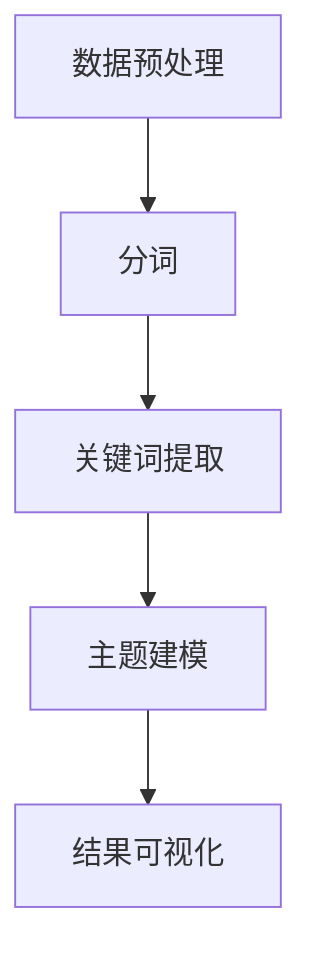
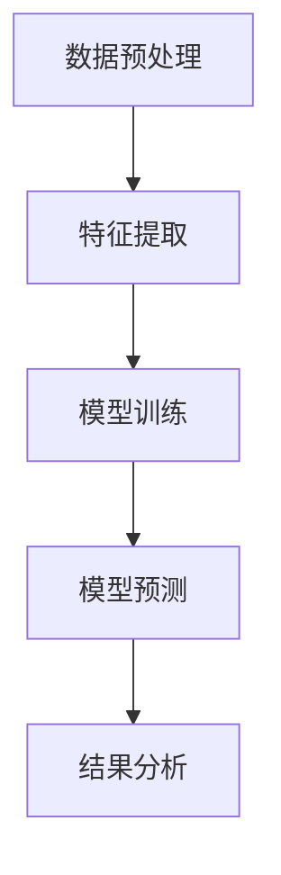

                 


# 绿色技术专利分析与投资机会识别方法

> 关键词：绿色技术，专利分析，投资机会，技术分类，专利布局，市场分析

> 摘要：绿色技术作为推动全球可持续发展的重要力量，其技术创新和专利布局日益受到关注。本文通过分析绿色技术的专利分布、技术领域、申请人和引用网络，揭示绿色技术的发展趋势和投资机会。结合文本挖掘和机器学习算法，本文提出了一套系统化的专利分析方法，并基于实际案例展示了如何将专利分析结果转化为投资决策。通过本研究，投资者可以更有效地识别高潜力的技术领域和企业，从而在绿色技术市场中获得竞争优势。

---

# 第1章 绿色技术与专利分析概述

## 1.1 绿色技术的定义与背景

### 1.1.1 绿色技术的定义  
绿色技术是指能够减少资源消耗、降低环境污染、提高能源利用效率的技术。它涵盖可再生能源、节能减排、循环经济等多个领域。

### 1.1.2 绿色技术的重要性  
绿色技术是实现全球可持续发展目标的核心手段，对应对气候变化、能源危机和环境污染具有重要意义。

### 1.1.3 绿色技术的核心领域  
- 可再生能源：太阳能、风能、生物质能等。  
- 节能减排：工业节能、建筑节能、交通节能等。  
- 循环经济：资源再生、废弃物利用等。  

## 1.2 专利分析的定义与作用

### 1.2.1 专利分析的定义  
专利分析是通过对专利数据的收集、处理和分析，研究技术发展趋势、竞争格局和创新主体行为的过程。

### 1.2.2 专利分析的作用与意义  
- 揭示技术发展趋势。  
- 分析竞争格局和市场动态。  
- 识别技术空白和创新机会。  

### 1.2.3 绿色技术专利分析的独特性  
绿色技术专利分析需要结合环境科学、技术科学和经济学等多学科知识，具有跨领域性和政策导向性。

## 1.3 绿色技术专利分析的目标与边界

### 1.3.1 绿色技术专利分析的目标  
- 描述绿色技术的专利分布情况。  
- 分析技术发展趋势和热点领域。  
- 识别高潜力的技术和企业。  

### 1.3.2 分析的边界与外延  
- 数据范围：限定时间、地域和申请类型。  
- 技术领域：聚焦绿色技术的核心领域。  
- 分析深度：从宏观趋势到微观技术细节。  

### 1.3.3 核心概念与要素组成  
- 专利数据：申请时间、申请人、技术领域等。  
- 技术分类：IPC分类号或其他分类方法。  
- 引用网络：专利之间的引用关系。  

---

# 第2章 绿色技术专利分析的核心概念与联系

## 2.1 绿色技术与专利的关系

### 2.1.1 绿色技术创新与专利保护  
绿色技术创新需要专利保护来激励创新者，同时专利可以作为技术扩散的桥梁。

### 2.1.2 专利对绿色技术发展的推动作用  
- 提供技术标准和规范。  
- 建立技术壁垒，保护创新成果。  
- 促进技术交流与合作。  

### 2.1.3 绿色技术专利的生命周期  
从申请、授权、使用到失效，绿色技术专利的生命周期与技术创新周期密切相关。

## 2.2 绿色技术专利分析的关键指标

### 2.2.1 专利数量与分布  
- 专利数量：衡量技术创新活跃度。  
- 地域分布：分析不同国家或地区的创新情况。  
- 技术领域分布：识别技术热点和空白。  

### 2.2.2 专利技术领域分布  
- 可再生能源：太阳能电池、风力发电技术。  
- 节能减排：碳捕集与封存、能效优化技术。  
- 循环经济：废弃物资源化利用技术。  

### 2.2.3 专利申请人分析  
- 企业：分析主要申请人的技术创新能力。  
- 机构：研究高校和研究机构的贡献。  
- 合作网络：识别技术合作和研发联盟。  

### 2.2.4 专利引用网络分析  
- 引用网络：揭示技术关联性和创新路径。  
- 关键专利：识别技术核心和前沿。  

## 2.3 绿色技术专利分析的流程与方法

### 2.3.1 数据收集与预处理  
- 数据来源：专利数据库（如Patentscope、USPTO）。  
- 数据清洗：去除重复和无效数据。  
- 数据标注：根据技术领域进行分类。  

### 2.3.2 数据分析与挖掘  
- 文本挖掘：提取专利文本中的关键词和主题。  
- 机器学习：预测技术趋势和潜在机会。  
- 图论分析：构建专利引用网络和社群分析。  

### 2.3.3 结果可视化与解读  
- 技术趋势图：展示技术发展的时序变化。  
- 网络图：可视化专利引用关系。  
- 地域分布图：分析不同地区的专利布局。  

## 2.4 本章小结

### 2.4.1 核心概念总结  
绿色技术专利分析需要结合专利数据和技术创新趋势，识别高潜力的技术领域和企业。

### 2.4.2 分析流程与方法总结  
从数据收集到分析挖掘，再到结果可视化，绿色技术专利分析是一个系统化的过程。

---

# 第3章 绿色技术专利分析的算法原理与实现

## 3.1 绿色技术专利分析的主要算法

### 3.1.1 文本挖掘算法  
- 分词：使用自然语言处理工具（如NLTK）对专利文本进行分词。  
- 关键词提取：使用TF-IDF方法提取重要关键词。  
- 主题建模：使用LDA（Latent Dirichlet Allocation）模型进行主题分析。  

### 3.1.2 机器学习算法  
- 分类：使用SVM或随机森林对专利进行分类。  
- 聚类：使用K-means对技术领域进行聚类分析。  
- 预测：使用时间序列模型预测技术发展趋势。  

### 3.1.3 图论算法  
- 社群检测：使用Louvain算法识别专利引用网络中的社群结构。  
- 中心性分析：使用度中心性和介数中心性识别关键专利。  

## 3.2 算法原理与流程图

### 3.2.1 文本挖掘流程图  


### 3.2.2 机器学习流程图  


## 3.3 算法实现与代码示例

### 3.3.1 文本挖掘代码示例  
```python
import nltk
text = "This is a sample text for text mining."
tokens = nltk.word_tokenize(text)
print(tokens)
```

### 3.3.2 主题建模代码示例  
```python
from gensim.models import LdaModel
from gensim.corpora import Dictionary

corpus = [tokenized_text]
dictionary = Dictionary(corpus)
corpus bows = [dictionary.doc2bow(text) for text in corpus]
lda = LdaModel(corpus bows, num_topics=5, id2word=dictionary)
print(lda.print_topics())
```

---

# 第4章 投资机会识别方法

## 4.1 投资机会识别的核心思路  
结合专利分析结果和市场趋势，识别具有高技术潜力和商业价值的技术领域和企业。

## 4.2 技术潜力评估  
- 技术成熟度：评估技术的商业化潜力。  
- 技术壁垒：分析技术的专利布局和技术难度。  
- 市场需求：结合行业趋势和市场规模。  

## 4.3 商业价值评估  
- 市场定位：评估技术在市场中的竞争优势。  
- 投资回报：结合专利的经济价值和市场前景。  

## 4.4 投资策略  
- 风险评估：识别技术风险和市场风险。  
- 投资组合：分散投资，降低风险。  

---

# 第5章 实战案例分析

## 5.1 案例背景  
分析某一具体绿色技术领域的专利分布和投资机会。

## 5.2 数据收集与处理  
- 数据来源：选取特定领域的专利数据。  
- 数据清洗：处理无效专利和重复数据。  

## 5.3 分析过程  
- 技术领域分析：识别技术热点和空白。  
- 申请人分析：分析主要申请人的技术创新能力。  
- 引用网络分析：识别关键专利和潜在合作机会。  

## 5.4 投资建议  
基于分析结果，提出具体的投资建议，包括技术领域选择和投资标的筛选。

---

# 第6章 总结与展望

## 6.1 本章总结  
总结绿色技术专利分析的核心内容和投资机会识别的关键方法。

## 6.2 未来展望  
展望绿色技术专利分析的未来发展，包括技术进步和数据源的扩展。

---

# 作者

作者：AI天才研究院/AI Genius Institute & 禅与计算机程序设计艺术 /Zen And The Art of Computer Programming

---

这篇文章通过系统化的分析和实际案例，帮助读者全面理解绿色技术专利分析的方法，并掌握如何将分析结果应用于投资决策。希望对绿色技术领域的研究人员和投资者有所帮助。

