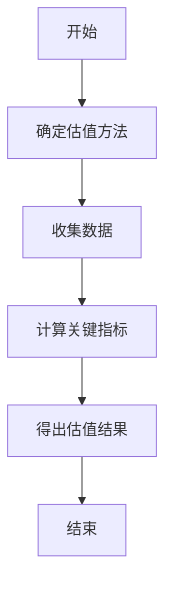
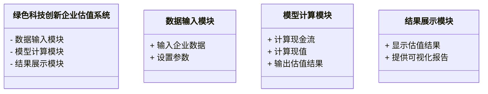

                 


# 绿色科技创新企业的估值挑战与机遇

## 关键词：绿色科技、科技创新企业、企业估值、动态贴现现金流模型、可持续发展、绿色创新

## 摘要：绿色科技创新企业作为推动可持续发展的重要力量，其估值不仅是对企业价值的衡量，更是对社会价值的评估。本文从绿色科技创新企业的定义、核心概念、估值方法、系统架构等多方面展开，分析其估值面临的挑战与机遇，探讨创新的估值算法和系统架构设计，最后通过实际案例展示绿色科技创新企业的估值过程和成果。

---

## 第一部分：绿色科技创新企业的估值背景与概念

### 第1章：绿色科技创新企业的定义与特征

#### 1.1 绿色科技的定义与内涵

绿色科技，即环境技术，是指那些能够减少对环境负面影响、提高资源利用效率、促进可持续发展的技术。它涵盖清洁能源、节能环保、生态修复等多个领域。绿色科技的核心在于通过技术创新解决环境问题，推动社会的可持续发展。

绿色科技不仅关注技术本身的环保性，还强调技术在应用过程中的经济性和社会价值。它不仅仅是对环境的保护，更是对资源的高效利用和对人类生活质量的提升。

绿色科技与可持续发展的关系密不可分。可持续发展要求我们满足当前需求的同时，不损害后代发展的能力。绿色科技通过技术创新，为实现这一目标提供了技术支撑。

---

#### 1.2 绿色科技创新企业的概念

绿色科技创新企业是指那些以绿色科技为核心，通过技术创新推动可持续发展的企业。这类企业通常具有以下特征：

- **技术驱动**：企业的发展依赖于技术创新，研发投入占比较高。
- **可持续性**：在产品设计、生产过程中注重环保，减少资源消耗和污染。
- **社会价值**：通过技术创新解决社会问题，如气候变化、资源枯竭等。

绿色科技创新企业与传统企业的区别在于其核心竞争力是技术创新带来的环境效益和社会效益，而非单纯的经济效益。

---

#### 1.3 绿色科技创新企业的边界与外延

绿色科技创新企业的边界在于其核心业务必须是绿色科技相关领域。例如，一家生产太阳能电池的企业，其核心技术是清洁能源技术，符合绿色科技的定义。而一家传统制造企业，虽然也注重环保，但如果其核心技术并非绿色科技，则不属于绿色科技创新企业。

绿色科技创新企业的外延则包括与绿色科技相关的上下游产业。例如，绿色科技企业可能与环保设备供应商、能源服务公司等有密切合作，形成一个完整的绿色科技产业链。

---

## 第二部分：绿色科技创新企业的估值核心概念与联系

### 第2章：绿色科技创新企业的核心概念与联系

#### 2.1 绿色科技创新企业的核心概念

绿色科技创新企业的估值需要考虑以下几个核心概念：

- **技术驱动**：企业的价值不仅在于其当前的收益，还在于其技术的未来潜力。
- **可持续性**：企业的环保表现会影响其长期价值。
- **创新性**：企业的创新能力决定了其在行业中的竞争力。

---

#### 2.2 绿色科技创新企业的概念属性特征对比

下表对比了绿色科技创新企业与其他类型企业的主要特征：

| 特性                | 绿色科技创新企业       | 传统企业       | 创业企业       |
|---------------------|------------------------|----------------|----------------|
| 核心竞争力          | 绿色技术创新           | 传统技术或成本 | 创新性          |
| 可持续性            | 高                    | 低或中          | 低或中          |
| 市场定位            | 绿色市场、可持续发展   | 传统市场       | 创新市场        |

---

#### 2.3 绿色科技创新企业的ER实体关系图

以下是绿色科技创新企业的ER实体关系图：

```mermaid
er
  企业
    员工
    股东
    产品
    项目
```

---

## 第三部分：绿色科技创新企业的估值算法原理讲解

### 第3章：绿色科技创新企业的估值算法原理

#### 3.1 绿色科技创新企业的估值方法

常用的估值方法包括：

- **现金流贴现法**：通过预测未来现金流，将其贴现到现值，评估企业价值。
- **市盈率法**：根据企业的市盈率和净利润进行估值。
- **市净率法**：根据企业的市净率和净资产进行估值。

---

#### 3.2 绿色科技创新企业的估值算法流程

以下是估值算法的流程图：



---

#### 3.3 绿色科技创新企业的估值算法实现

以下是使用动态贴现现金流模型的Python代码示例：

```python
import numpy as np

def green_tech_valuation(company_data):
    # 输入参数
    revenue = company_data['revenue']
    growth_rate = company_data['growth_rate']
    discount_rate = company_data['discount_rate']
    period = company_data['period']
    
    # 计算未来现金流
    cash_flows = []
    for i in range(period):
        cash_flow = revenue * (1 + growth_rate/100)**i
        cash_flows.append(cash_flow)
    
    # 计算现值
    present_value = np.npv(discount_rate, cash_flows)
    
    return present_value

# 示例数据
company_data = {
    'revenue': 1000000,
    'growth_rate': 20,
    'discount_rate': 10,
    'period': 5
}

# 调用函数
valuation = green_tech_valuation(company_data)
print(f"企业估值：${valuation:.2f}")
```

---

## 第四部分：绿色科技创新企业的系统分析与架构设计

### 第4章：绿色科技创新企业的系统分析与架构设计

#### 4.1 问题场景介绍

绿色科技创新企业的估值系统需要解决以下问题：

- 如何准确预测企业的未来现金流？
- 如何选择合适的贴现率？
- 如何将企业的社会价值纳入估值模型？

---

#### 4.2 系统功能设计

以下是系统功能设计的类图：



---

## 第五部分：绿色科技创新企业的项目实战

### 第5章：绿色科技创新企业的项目实战

#### 5.1 环境安装

需要安装以下Python库：

```bash
pip install numpy pandas matplotlib
```

---

#### 5.2 核心代码实现

以下是核心代码：

```python
import numpy as np
import matplotlib.pyplot as plt

def calculate_green_tech_valuation(revenue, growth_rate, discount_rate, periods):
    cash_flows = [revenue * (1 + growth_rate/100)**i for i in range(periods)]
    present_value = np.npv(discount_rate, cash_flows)
    return present_value, cash_flows

# 参数设置
revenue = 1000000
growth_rate = 20
discount_rate = 10
periods = 5

# 计算
valuation, cash_flows = calculate_green_tech_valuation(revenue, growth_rate, discount_rate, periods)

# 可视化
plt.figure(figsize=(10, 6))
plt.plot(range(periods), cash_flows, label='现金流')
plt.title('绿色科技创新企业现金流与估值')
plt.xlabel('年份')
plt.ylabel('金额')
plt.grid(True)
plt.legend()
plt.show()

print(f"企业估值：${valuation:.2f}")
```

---

## 第六部分：总结与展望

### 第6章：绿色科技创新企业的总结与展望

绿色科技创新企业的估值是一个复杂的系统工程，需要考虑企业的技术、经济和社会价值。通过动态贴现现金流模型和系统架构设计，我们可以更准确地评估绿色科技创新企业的价值。

未来，随着绿色科技的不断发展，估值方法和系统架构也将更加完善。绿色科技创新企业将继续在推动可持续发展中发挥重要作用。

---

## 作者：AI天才研究院/AI Genius Institute & 禅与计算机程序设计艺术/Zen And The Art of Computer Programming

---

以上是《绿色科技创新企业的估值挑战与机遇》的完整目录大纲和文章内容。

