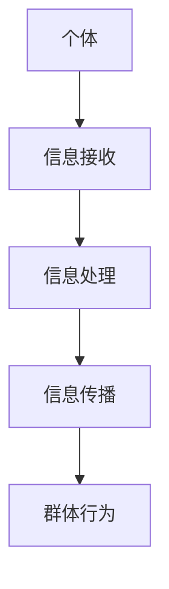
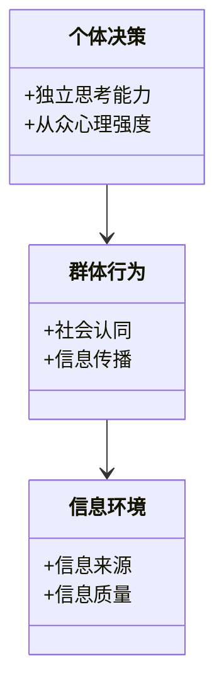

                 


# 羊群效应：理解并避免从众心理陷阱

> **关键词**：羊群效应、从众心理、社会影响、独立思考、信息过载、群体决策、心理学机制  
> **摘要**：羊群效应是一种普遍存在于人类社会的现象，它描述了个体在面对不确定性时，倾向于跟随大多数人的行为模式，从而可能导致非理性的集体决策。本文将深入分析羊群效应的定义、心理学机制、社会影响，探讨信息过载如何加剧羊群效应，并提供避免掉入从众心理陷阱的策略和方法。通过系统分析与架构设计，本文将为读者提供一套完整的解决方案，帮助他们在复杂的社会环境中做出更明智的决策。

---

## 第1章：引言

### 1.1 羊群效应的背景与重要性

羊群效应（Herding Effect）是指个体在面对不确定性时，倾向于跟随大多数人的行为模式，从而可能导致集体的非理性决策。这一现象不仅存在于人类社会中，也在动物群居行为中有所体现。羊群效应的核心在于个体对“安全感”的追求，以及对社会认同的渴望。在现代社会中，羊群效应的表现形式多种多样，例如社交媒体上的跟风行为、金融市场的非理性波动等。理解羊群效应的本质，可以帮助我们更好地做出独立决策，避免掉入从众心理的陷阱。

---

## 第2章：羊群效应的定义与心理学机制

### 2.1 心理学基础

#### 2.1.1 从众心理的定义

从众心理（Conformity）是指个体在群体压力下，为了与群体保持一致而调整自己的行为或信念的现象。从众心理可以是显性的（公开跟随群体）或隐性的（内心接受但不表现出来）。心理学研究表明，从众心理的核心驱动力是人类对社会认同的渴望以及对孤立的恐惧。

#### 2.1.2 羊群效应与从众心理的关系

羊群效应可以看作是从众心理的一种表现形式。在羊群效应中，个体的行为不仅受到群体压力的影响，还受到信息不对称和信息过载的推动。例如，在社交媒体上，一条未经验证的消息因为被广泛转发而被更多人相信，这就是典型的羊群效应。

#### 2.1.3 心理学实验与案例

**案例分析**：米尔格拉姆的服从实验（Milgram Experiment）  
米尔格拉姆的实验揭示了人类在权威压力下的服从性。实验中，参与者被要求对“犯错者”进行电击惩罚，尽管参与者内心可能认为这是不道德的行为，但因为他们服从权威的指令，最终还是执行了命令。这一实验表明，个体在群体压力下，往往会倾向于跟随大多数人的行为，即使这可能违背自己的判断。

---

### 2.2 羊群效应的核心概念

#### 2.2.1 羊群效应的特征

1. **非理性决策**：个体在羊群效应影响下，往往做出与理性分析相悖的决策。
2. **信息依赖性**：个体依赖于群体提供的信息，而非基于个人独立思考。
3. **传染性**：羊群效应具有传染性，个体的从众行为会进一步引发更多人的从众行为。

#### 2.2.2 羊群效应的形成机制

1. **信息不对称**：个体在决策过程中，往往依赖于外部信息，而这些信息可能是不完整或误导性的。
2. **社会压力**：个体在群体中感到孤立的压力，从而倾向于跟随大多数人的行为。
3. **缺乏独立思考**：个体缺乏独立思考的能力或动力，倾向于依赖群体的判断。

---

## 第3章：羊群效应的社会影响

### 3.1 羊群效应在社会中的表现

#### 3.1.1 羊群效应在群体决策中的作用

1. **金融市场的波动**：羊群效应可以导致金融市场的非理性波动，例如股灾或泡沫的形成。
2. **社交媒体上的信息传播**：虚假信息在社交媒体上的快速传播，往往是羊群效应的直接结果。

#### 3.1.2 羊群效应在社交媒体中的传播

社交媒体为羊群效应提供了理想的传播环境。个体在社交媒体上的行为往往受到“点赞数”“转发数”等社会认同指标的影响，从而进一步加剧了羊群效应。

#### 3.1.3 羊群效应在金融市场的波动

金融市场的羊群效应表现为投资者的非理性行为，例如盲目跟风买入某只股票，导致股价短期内快速上涨或下跌。

---

### 3.2 羊群效应的正反两面

#### 3.2.1 羊群效应的优点

1. **降低决策成本**：在某些情况下，跟随大多数人的行为可以降低个体的决策成本。
2. **促进社会稳定**：羊群效应在某些情况下可以帮助社会形成共识，从而促进社会稳定。

#### 3.2.2 羊群效应的缺点

1. **非理性决策**：羊群效应可能导致集体的非理性决策，例如盲目跟风投资。
2. **信息失真**：羊群效应可能导致信息的失真和传播的误导。

#### 3.2.3 平衡羊群效应的策略

1. **提高个体独立思考能力**：通过教育和培训，帮助个体提高独立思考的能力。
2. **建立信息筛选机制**：通过技术手段，建立信息筛选机制，避免虚假信息的传播。

---

## 第4章：信息过载与羊群效应

### 4.1 信息过载的定义与影响

#### 4.1.1 信息过载的概念

信息过载（Information Overload）是指个体在面对大量信息时，由于信息的不完整、不一致或复杂性，导致决策困难的现象。

#### 4.1.2 信息过载对决策的影响

信息过载会导致个体决策能力下降，因为个体无法有效处理大量信息，从而倾向于依赖群体的判断。

#### 4.1.3 信息过载与羊群效应的关系

信息过载为羊群效应提供了温床。在信息过载的情况下，个体更容易依赖群体的判断，从而引发羊群效应。

---

### 4.2 羊群效应在信息过载中的表现

#### 4.2.1 信息过载如何引发羊群效应

1. **信息的不完整性和复杂性**：个体在面对复杂信息时，倾向于依赖群体的判断。
2. **社会认同的需求**：个体在信息过载的情况下，更容易寻求社会认同，从而引发羊群效应。

#### 4.2.2 羊群效应如何加剧信息过载

1. **信息的快速传播**：羊群效应会导致信息的快速传播，从而加剧信息过载。
2. **信息的失真**：羊群效应可能导致信息的失真，进一步加剧信息过载。

---

## 第5章：羊群效应的形成机制

### 5.1 个体决策与羊群效应

#### 5.1.1 个体决策的影响因素

1. **外部压力**：来自社会的压力，例如群体压力、权威压力等。
2. **信息依赖性**：个体依赖于外部信息，而非基于个人判断。

#### 5.1.2 个体决策如何影响群体行为

个体的从众行为会进一步引发更多人的从众行为，从而形成羊群效应。

#### 5.1.3 羊群效应的个体层面分析

1. **个体的从众心理**：个体倾向于跟随大多数人的行为，以获得社会认同。
2. **个体的决策能力**：个体的决策能力越弱，越容易受到羊群效应的影响。

---

### 5.2 羊群效应的信息传播机制

#### 5.2.1 信息传播的路径

1. **直接传播**：个体之间直接传播信息。
2. **间接传播**：通过媒体、社交平台等间接传播信息。

#### 5.2.2 信息传播的速度与范围

1. **信息传播的速度**：在社交媒体上，信息可以以指数速度传播。
2. **信息传播的范围**：信息可以迅速覆盖全球，影响大量人群。

#### 5.2.3 羊群效应的信息传播模型



---

## 第6章：避免羊群效应的策略

### 6.1 提高个体独立思考能力

#### 6.1.1 独立思考的定义与重要性

独立思考是指个体基于自己的判断，而非依赖于群体的判断，做出决策的能力。提高独立思考能力可以帮助个体避免掉入羊群效应的陷阱。

#### 6.1.2 独立思考的训练方法

1. **批判性思维训练**：通过批判性思维训练，帮助个体学会分析信息的真伪。
2. **多角度思考**：鼓励个体从多个角度思考问题，避免单一维度的判断。

---

### 6.2 建立信息筛选机制

#### 6.2.1 信息筛选的定义

信息筛选是指通过一定的方法，识别和去除虚假信息，确保信息的真实性和可靠性。

#### 6.2.2 信息筛选的关键步骤

1. **信息来源验证**：验证信息的来源是否可靠。
2. **信息交叉验证**：通过多个来源验证信息的真实性。
3. **信息质量评估**：评估信息的质量和价值。

---

### 6.3 羊群效应的数学模型

#### 6.3.1 数学模型的建立

我们可以建立一个简单的数学模型，描述羊群效应的信息传播过程。假设在某个群体中，信息的传播速度与群体的规模成正比，同时与个体的独立思考能力成反比。

$$ 信息传播速度 = k \times 群体规模 / 独立思考能力 $$

其中，\( k \) 是一个常数，表示信息传播的效率。

---

## 第7章：系统分析与架构设计

### 7.1 问题场景介绍

在现代社会中，信息过载和羊群效应的问题日益严重。特别是在社交媒体和金融市场中，羊群效应的表现尤为明显。我们需要设计一个系统，帮助个体和组织识别和避免羊群效应的影响。

---

### 7.2 系统功能设计

#### 7.2.1 领域模型



#### 7.2.2 系统架构设计


---

## 第8章：项目实战

### 8.1 环境安装

为了实现羊群效应的分析与解决方案，我们需要安装以下工具：

1. **编程语言**：Python
2. **数据可视化工具**：Matplotlib
3. **网络分析工具**：NetworkX

---

### 8.2 核心实现源代码

#### 8.2.1 羊群效应的模拟

```python
import networkx as nx
import matplotlib.pyplot as plt

# 创建一个空图
G = nx.Graph()

# 添加节点
G.add_nodes_from(['A', 'B', 'C', 'D', 'E'])

# 添加边
G.add_edges_from([('A', 'B'), ('B', 'C'), ('C', 'D'), ('D', 'E'), ('A', 'C')])

# 绘制图
nx.draw(G, with_labels=True)
plt.show()
```

---

## 第9章：总结与展望

### 9.1 最佳实践 Tips

1. **保持独立思考**：在面对决策时，尽量基于自己的判断，而非盲目跟随群体。
2. **建立信息筛选机制**：通过多种渠道验证信息的真实性，避免虚假信息的误导。
3. **提高决策能力**：通过教育和培训，提高自己的决策能力，以应对复杂的社会环境。

### 9.2 小结

羊群效应是一种普遍存在于人类社会的现象，它不仅影响个体的决策，还影响整个社会的运行。通过理解羊群效应的形成机制，我们可以采取有效的策略，避免掉入从众心理的陷阱。

### 9.3 注意事项

1. **避免信息过载**：在信息爆炸的时代，我们需要学会筛选信息，避免信息过载的影响。
2. **保持理性思考**：在面对决策时，保持理性和冷静，避免被情绪和群体压力左右。

### 9.4 拓展阅读

1. 《乌合之众：群众心理学研究》——勒庞
2. 《思考，快与慢》——丹尼尔·卡尼曼

---

**作者：AI天才研究院/AI Genius Institute & 禅与计算机程序设计艺术 /Zen And The Art of Computer Programming**

