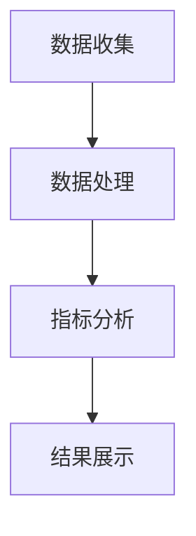

                 


# 美国作为全球最大经济体的市场估值特点

> 关键词：美国经济，市场估值，GDP，经济结构，美元地位，全球经济影响

> 摘要：本文探讨了美国作为全球最大经济体的市场估值特点，分析了其经济结构、GDP计算方法、影响因素以及对全球经济的影响。通过详细解释核心概念、提供数学模型和实际案例，本文为理解美国经济的市场估值提供了全面的视角。

---

## 第一章：背景与概述

### 1.1 美国经济的基本情况

#### 1.1.1 美国经济的定义
美国经济是全球最大的经济体，以美元为货币，采用市场经济体制，政府在经济中扮演监管角色。

#### 1.1.2 美国经济的核心特点
- **经济规模**：GDP总量远超其他国家，2022年约为26.26万亿美元。
- **经济结构**：多元化，涵盖科技、金融、制造业等多个领域。
- **经济政策**：自由市场导向，政府干预较少，但也有凯恩斯主义的影响。

#### 1.1.3 美国经济的全球地位
作为全球经济的领导者，美国在国际贸易、科技和金融领域具有重要影响力。

### 1.2 美国市场估值的重要性
- 市场估值是衡量经济健康的重要指标，影响投资决策和政策制定。
- 美国市场估值的变化对全球资本市场有重大影响，如美联储政策调整引发全球波动。

---

## 第二章：市场估值的核心概念与分析

### 2.1 GDP的定义与计算方法

#### 2.1.1 GDP的定义
国内生产总值（GDP）是衡量一个国家或地区经济活动的重要指标，代表所有最终产品和服务的市场价值。

#### 2.1.2 GDP的计算公式
$$ GDP = C + I + G + (X - M) $$
其中：
- C：消费
- I：投资
- G：政府支出
- X：出口
- M：进口

#### 2.1.3 GDP的组成部分
- **消费**：家庭和个人的支出，占GDP的大部分。
- **投资**：企业用于设备、厂房和存货的支出。
- **政府支出**：政府在商品和服务上的支出。
- **净出口**：出口减去进口，反映贸易平衡。

### 2.2 市场结构与估值方法

#### 2.2.1 市场结构的多样性
美国市场由多个行业组成，每个行业的估值方法不同，如科技行业的估值更依赖于未来现金流预测。

#### 2.2.2 估值方法的选择
- **历史成本法**：基于历史交易数据。
- **市场法**：基于市场交易价格。
- **收益法**：基于未来收益的折现值。

---

## 第三章：影响美国市场估值的关键因素

### 3.1 技术创新对估值的影响

#### 3.1.1 技术创新的定义
技术创新是指在科技领域的创新，如人工智能、云计算等，推动生产力提升和经济增长。

#### 3.1.2 技术创新对估值的推动作用
- 提高生产效率，降低成本，增加企业利润。
- 创新技术产品的需求增加，推动相关企业估值上升。

### 3.2 美元地位的影响

#### 3.2.1 美元的全球地位
美元是全球主要储备货币和国际贸易结算货币，影响全球资本流动和市场估值。

#### 3.2.2 美元波动对估值的影响
- 美元升值会导致进口成本上升，影响企业利润。
- 美元贬值可能吸引外国投资，推动资产价格上升。

---

## 第四章：市场估值方法与模型

### 4.1 资产定价模型

#### 4.1.1 资本资产定价模型（CAPM）
$$ E(r_i) = r_f + \beta_i (E(r_m) - r_f) $$
其中：
- $E(r_i)$：资产i的预期回报率
- $r_f$：无风险利率
- $\beta_i$：资产i的贝塔系数
- $E(r_m)$：市场预期回报率

#### 4.1.2 市场估值的应用
CAPM用于评估资产的公允价值，帮助投资者进行决策。

### 4.2 GDP增长率的计算

#### 4.2.1 GDP增长率的公式
$$ GDP增长率 = \frac{GDP_{\text{当前}} - GDP_{\text{前一期}}}{GDP_{\text{前一期}}} \times 100\% $$

#### 4.2.2 经济周期分析
经济周期波动影响GDP增长率，从而影响市场估值。例如，经济衰退可能导致GDP下降，企业估值下降。

---

## 第五章：美国经济对全球经济的影响

### 5.1 美国经济的全球贸易

#### 5.1.1 美国出口的主要商品
- 高科技产品
- 农产品
- 机械设备

#### 5.1.2 美国进口的主要商品
- 原材料
- 中间产品
- 消费品

### 5.2 汇率的影响

#### 5.2.1 美元汇率的波动
美元汇率波动影响国际贸易和投资，进而影响全球市场估值。

#### 5.2.2 美联储政策对全球经济的影响
美联储的利率政策和货币政策调整会影响全球资本流动和市场估值，例如加息可能导致全球资本回流美国。

---

## 第六章：系统分析与架构设计

### 6.1 系统分析框架

#### 6.1.1 数据收集模块
- 数据来源：政府统计、公司财报、市场报告。
- 数据类型：GDP数据、企业利润、股价等。

#### 6.1.2 分析模块
- 数据处理：清洗、转换。
- 指标分析：计算GDP增长率、企业估值等。

#### 6.1.3 结果展示模块
- 图表展示：柱状图、折线图等。
- 报告生成：总结分析结果。

### 6.2 系统架构设计

#### 6.2.1 系统架构图


#### 6.2.2 实际应用
使用Python进行数据处理和分析，例如：
```python
import pandas as pd

gdp_data = pd.read_csv('gdp.csv')
gdp_growth = gdp_data['gdp'].pct_change() * 100
print(gdp_growth)
```

---

## 第七章：实际案例分析

### 7.1 科技行业的影响

#### 7.1.1 美国科技行业的市场估值
- 科技行业占美国股市的很大比例，如苹果、微软等公司市值庞大。
- 技术创新和市场扩展推动了科技行业的估值增长。

#### 7.1.2 疫情对科技行业的估值影响
疫情期间，科技行业需求激增，推动其估值上升，如远程办公软件的需求增加。

---

## 第八章：总结与展望

### 8.1 总结
- 美国经济的市场估值受多种因素影响，包括技术创新、美元地位和全球经济环境。
- 理解这些因素有助于更好地进行投资决策和政策制定。

### 8.2 展望
- 随着科技的发展和全球经济的变化，美国经济的市场估值将继续受到新的挑战和机遇。
- 未来的研究可以关注绿色经济和可持续发展对市场估值的影响。

---

## 附录

### 附录A：数据来源
- 美国经济分析局（BEA）
- 美联储（Federal Reserve）
- 公司财报和市场报告

### 附录B：工具与方法
- 数据分析工具：Python、R、Excel
- 可视化工具：Matplotlib、Tableau

---

作者：AI天才研究院/AI Genius Institute & 禅与计算机程序设计艺术 /Zen And The Art of Computer Programming

