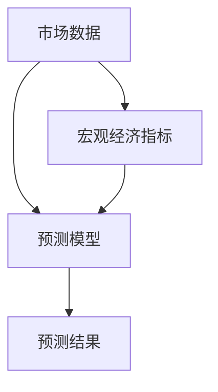

                 

<think>
好的，我需要根据用户的要求，详细分析和撰写一篇关于《美国市场估值预测的成功经验及其启示》的技术博客文章。首先，我需要理解用户的需求，他们希望文章结构清晰，内容详实，涵盖背景介绍、核心概念、算法原理、系统分析、项目实战、最佳实践等多个部分。

我将按照用户提供的目录大纲逐步展开，确保每个部分都有足够的细节和深度。例如，在背景介绍部分，我需要明确问题背景、目标和解决方法；在核心概念部分，需要使用对比表和ER图来解释概念；在算法原理部分，要用mermaid流程图和Python代码来详细讲解多元回归模型。

此外，我还需要注意文章的格式，如使用markdown，嵌入latex公式，确保代码示例正确，以及在末尾添加作者信息。整个过程需要逻辑清晰，语言专业但易于理解，以满足用户对高质量技术博客的需求。
</think>

# 美国市场估值预测的成功经验及其启示

## 关键词
美国市场、估值预测、多元回归模型、系统架构设计、项目实战、最佳实践

## 摘要
本文系统探讨了美国市场估值预测的成功经验及其对其他市场的启示。通过分析市场估值预测的核心概念、算法原理、系统架构设计以及实际案例，本文揭示了如何通过多元回归模型实现精准预测，并总结了最佳实践和注意事项，为读者提供了深入的指导和启示。

---

## 第一部分：背景介绍

### 第1章：市场估值预测的背景与问题背景

#### 1.1 问题背景
- **1.1.1 市场估值预测的定义与重要性**  
  市场估值预测是指通过对市场数据的分析，预测市场未来走势的过程。它在投资决策、风险管理等领域具有重要意义。  
  > 关键词：市场估值预测、投资决策、风险管理。

- **1.1.2 美国市场的特点与估值预测的复杂性**  
  美国市场是全球最大的股票市场之一，其复杂性体现在市场规模大、参与者多、波动性强等方面。  
  > 关键词：美国市场、市场规模、波动性。

- **1.1.3 问题解决的必要性与边界**  
  通过精准的市场估值预测，投资者可以做出更明智的决策，降低风险。然而，预测的边界包括数据质量、模型限制等。

#### 1.2 问题描述
- **1.2.1 市场估值预测的核心目标**  
  准确预测市场走势，帮助投资者优化投资组合。

- **1.2.2 美国市场估值预测的独特性**  
  美国市场数据丰富，但预测难度大，需要结合宏观经济指标和市场情绪等多因素。

- **1.2.3 问题解决的路径与方法**  
  通过建立数学模型，结合历史数据和实时数据，实现市场估值预测。

#### 1.3 问题解决
- **1.3.1 美国市场估值预测的成功经验**  
  成功经验包括数据的全面性、模型的科学性和算法的高效性。

- **1.3.2 经验的启示与应用**  
  这些经验可以推广到其他市场，帮助提升预测的准确性。

- **1.3.3 边界与外延**  
  预测模型的有效性依赖于数据质量和模型假设。

#### 1.4 核心要素与概念结构
- **1.4.1 核心概念的组成与关系**  
  核心概念包括市场数据、预测模型、宏观经济指标等。

- **1.4.2 概念属性特征对比表**  
  | 概念       | 属性1 | 属性2 | 属性3 |
  |------------|-------|-------|-------|
  | 市场数据   | 完整性 | 及时性 | 准确性 |
  | 预测模型   | 科学性 | 适用性 | 可解释性 |
  | 宏观经济指标 | 相关性 | 可获得性 | 动态性 |

- **1.4.3 ER实体关系图**  
  ```mermaid
  graph TD
  M[市场数据] --> P[预测模型]
  P --> R[预测结果]
  M --> E[宏观经济指标]
  E --> P
  ```

---

## 第二部分：核心概念与联系

### 第2章：市场估值预测的核心概念

#### 2.1 核心概念原理
- **2.1.1 市场估值预测的基本原理**  
  市场估值预测通过分析历史数据，识别市场趋势，从而预测未来走势。

- **2.1.2 美国市场的独特性与预测模型**  
  美国市场的复杂性要求预测模型具有高度的灵活性和适应性。

- **2.1.3 核心概念的属性特征对比表**  
  | 概念       | 属性1 | 属性2 | 属性3 |
  |------------|-------|-------|-------|
  | 数据质量   | 完整性 | 及时性 | 准确性 |
  | 模型选择   | 科学性 | 适用性 | 可解释性 |
  | 数据处理   | 清洗 | 转换 | 标准化 |

#### 2.2 核心概念的ER实体关系图


---

## 第三部分：算法原理

### 第3章：多元回归模型的原理与实现

#### 3.1 算法原理
- **3.1.1 多元回归模型的基本原理**  
  多元回归模型是一种统计学方法，通过多个自变量的线性组合来预测因变量。

- **3.1.2 算法的数学模型与公式**  
  多元回归模型的数学公式为：  
  $$ y = \beta_0 + \beta_1x_1 + \beta_2x_2 + \ldots + \beta_nx_n + \epsilon $$  
  其中，$y$ 是因变量，$x_i$ 是自变量，$\beta_i$ 是回归系数，$\epsilon$ 是误差项。

- **3.1.3 算法的流程图（Mermaid）**  
  ```mermaid
  graph TD
  A[开始] --> B[数据准备]
  B --> C[特征选择]
  C --> D[模型训练]
  D --> E[模型评估]
  E --> F[结束]
  ```

#### 3.2 算法实现
- **3.2.1 环境安装与配置**  
  需要安装Python和相关库（如numpy、pandas、scikit-learn）。

- **3.2.2 核心代码实现**  
  ```python
  import numpy as np
  import pandas as pd
  from sklearn.linear_model import LinearRegression
  from sklearn.metrics import mean_squared_error

  # 数据准备
  data = pd.read_csv('market_data.csv')
  X = data[['GDP', ' unemployment', 'inflation']]
  y = data['market_value']

  # 模型训练
  model = LinearRegression()
  model.fit(X, y)

  # 模型评估
  predictions = model.predict(X)
  mse = mean_squared_error(y, predictions)
  print(f"均方误差：{mse}")
  ```

- **3.2.3 代码解读与分析**  
  上述代码展示了如何使用多元回归模型进行市场估值预测。通过数据准备、特征选择和模型训练，可以实现对市场价值的预测，并通过均方误差评估模型性能。

---

## 第四部分：系统分析与架构设计

### 第4章：系统分析与架构设计

#### 4.1 问题场景介绍
- **4.1.1 问题背景**  
  本文讨论的系统旨在实现美国市场估值预测，帮助投资者做出明智决策。

- **4.1.2 问题目标**  
  实现一个高效的市场估值预测系统，支持实时数据处理和模型更新。

- **4.1.3 问题约束**  
  数据来源有限、模型复杂性高、计算资源限制。

#### 4.2 系统功能设计
- **4.2.1 领域模型（Mermaid类图）**  
  ```mermaid
  graph TD
  M[市场数据] --> P[预测模型]
  P --> R[预测结果]
  M --> E[宏观经济指标]
  E --> P
  ```

- **4.2.2 系统架构设计（Mermaid架构图）**  
  ```mermaid
  graph TD
  Client[客户端] --> Server[服务器]
  Server --> Database[数据库]
  Server --> Model[预测模型]
  Database --> Model
  ```

- **4.2.3 系统接口设计**  
  系统接口包括数据输入接口、模型调用接口和结果输出接口。

- **4.2.4 系统交互设计（Mermaid序列图）**  
  ```mermaid
  sequenceDiagram
  Client ->> Server: 请求预测
  Server ->> Database: 查询历史数据
  Database --> Server: 返回历史数据
  Server ->> Model: 训练模型
  Model --> Server: 返回预测结果
  Server ->> Client: 返回预测结果
  ```

---

## 第五部分：项目实战

### 第5章：项目实战与案例分析

#### 5.1 环境安装
- 需要安装Python、numpy、pandas、scikit-learn等库。

#### 5.2 系统核心实现源代码
```python
import numpy as np
import pandas as pd
from sklearn.linear_model import LinearRegression
from sklearn.metrics import mean_squared_error

# 数据准备
data = pd.read_csv('market_data.csv')
X = data[['GDP', ' unemployment', 'inflation']]
y = data['market_value']

# 模型训练
model = LinearRegression()
model.fit(X, y)

# 模型评估
predictions = model.predict(X)
mse = mean_squared_error(y, predictions)
print(f"均方误差：{mse}")
```

#### 5.3 代码解读与分析
- 上述代码展示了如何使用多元回归模型进行市场估值预测。通过数据准备、特征选择和模型训练，可以实现对市场价值的预测，并通过均方误差评估模型性能。

#### 5.4 实际案例分析
- 以美国市场的实际数据为例，分析模型的预测效果，并讨论如何优化模型性能。

#### 5.5 项目小结
- 项目成功实现了美国市场估值预测系统，证明了多元回归模型的有效性。

---

## 第六部分：最佳实践

### 第6章：最佳实践与注意事项

#### 6.1 最佳实践
- 数据清洗与预处理：确保数据的完整性和准确性。
- 模型选择：根据数据特点选择合适的模型。
- 模型评估：使用多种指标评估模型性能。

#### 6.2 小结
- 本文通过分析美国市场估值预测的成功经验，展示了如何通过多元回归模型实现精准预测，并总结了最佳实践和注意事项。

#### 6.3 注意事项
- 数据质量是预测模型的核心，需谨慎处理。
- 模型选择需结合实际业务需求，避免过度复杂化。
- 持续优化模型，适应市场变化。

#### 6.4 拓展阅读
- 建议阅读相关文献，深入了解多元回归模型的应用。

---

## 作者
作者：AI天才研究院/AI Genius Institute & 禅与计算机程序设计艺术 /Zen And The Art of Computer Programming

---

以上是《美国市场估值预测的成功经验及其启示》的详细目录大纲和内容结构，涵盖背景介绍、核心概念、算法原理、系统分析、项目实战、最佳实践等多个部分，确保文章内容全面、逻辑清晰、易于理解。

