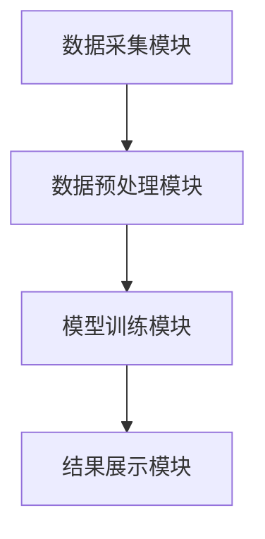
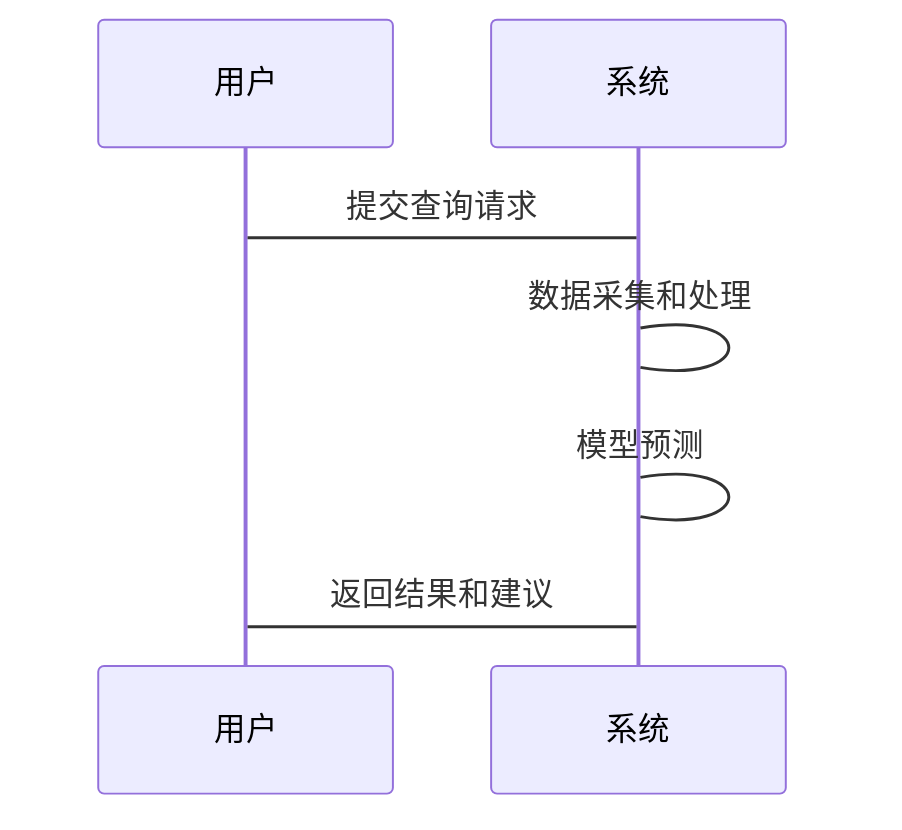

                 

<think>
好，我需要帮用户写一篇关于“股市估值在不同经济周期阶段的表现”的技术博客。用户要求使用非常吸引人的章节标题，逻辑清晰、结构紧凑、简单易懂，用专业技术语言，一步一步分析推理，剖析技术原理和本质。首先，我需要理解用户的需求，他希望得到一篇有深度、有思考、有见解的专业IT领域的技术博客文章。

首先，我应该从背景介绍开始，涵盖经济周期和股市估值的基本概念。然后，逐步分析它们之间的关系，探讨不同经济周期阶段对股市估值的影响。接下来，需要详细讲解相关的数学模型和算法，如何量化这些影响，并通过实际案例来展示应用。同时，还要提供系统设计和架构，展示如何将理论应用于实际项目中。

在写作过程中，我会确保每章内容丰富，包含核心概念、算法原理、系统设计和项目实战等部分。每章下再细分小节，详细讲解每个部分。例如，在算法部分，我会使用mermaid流程图来展示模型构建和训练过程，同时用Python代码实现，并解释代码的运行和结果。

我还需要注意，文章的格式要求严格，包括使用markdown格式，包含关键词和摘要，每章小结，以及作者信息。此外，数学公式需要用latex格式表示，确保准确性和专业性。

最后，我会检查文章的整体结构，确保逻辑清晰，内容详实，语言简洁明了，符合用户的要求。这样，读者能够逐步理解经济周期对股市估值的影响，并掌握相关的技术方法和应用。
</think>

# 股市估值在不同经济周期阶段的表现

> 关键词：经济周期、股市估值、投资策略、市场分析、技术分析

> 摘要：本文深入探讨了股市估值在不同经济周期阶段的表现，分析了经济周期波动对股市估值的影响，提出了基于经济周期的股市估值预测模型和投资策略。文章结合理论与实践，通过具体的数学模型和算法实现，帮助投资者更好地理解经济周期与股市估值的关系，并在实际投资中做出科学决策。

---

## 第1章: 经济周期的基本概念

### 1.1 经济周期的定义与特征
#### 1.1.1 经济周期的定义
经济周期是指经济活动在长期趋势中的波动，通常分为复苏、繁荣、衰退和萧条四个阶段。每个阶段的特点和影响不同，对股市估值有显著影响。

#### 1.1.2 经济周期的阶段划分
- 复苏阶段：经济从衰退中逐渐恢复，企业利润逐步回升，股市估值开始反弹。
- 繁荣阶段：经济高速增长，企业盈利达到峰值，股市估值持续上升。
- 衰退阶段：经济增速放缓，企业盈利下降，股市估值趋于稳定或下降。
- 萧条阶段：经济低迷，企业盈利大幅下降，股市估值可能处于低位。

#### 1.1.3 经济周期的影响因素
包括利率、通货膨胀率、就业率、消费者信心指数等宏观经济指标，这些因素共同影响股市估值。

---

### 1.2 股市估值的基本原理
#### 1.2.1 股市估值的定义
股市估值是指通过对上市公司的财务数据、市场环境等因素进行分析，确定股票的内在价值和市场价格的过程。

#### 1.2.2 股市估值的影响因素
- 公司基本面：如盈利能力、成长性、财务状况等。
- 市场情绪：投资者的心理预期和市场参与度。
- 宏观经济环境：如利率、通货膨胀、经济政策等。

#### 1.2.3 股市估值的主要指标
- 市盈率（P/E）：股价与每股收益的比值。
- 市净率（P/B）：股价与每股净资产的比值。
- 市销率（P/S）：股价与每股收入的比值。
- 股息率：股息与股价的比值。

---

### 1.3 经济周期与股市估值的关系
#### 1.3.1 经济周期对股市估值的影响
- 在经济繁荣阶段，企业盈利上升，股市估值上升。
- 在经济衰退阶段，企业盈利下降，股市估值可能被低估。

#### 1.3.2 不同经济周期阶段的股市估值特征
| 经济周期阶段 | 股市估值特征 |
|--------------|--------------|
| 复苏阶段      | 估值逐步上升，价值被发现 |
| 繁荣阶段      | 估值达到高点，可能出现泡沫 |
| 衰退阶段      | 估值下降，投资者信心不足 |
| 萧条阶段      | 估值处于低位，投资机会显现 |

#### 1.3.3 经济周期波动对投资者的影响
投资者应根据经济周期阶段调整投资策略，选择合适的估值指标和投资标的。

---

## 第2章: 经济周期与股市估值的核心概念

### 2.1 经济周期与股市估值的核心概念
#### 2.1.1 经济周期的核心要素
包括GDP增长率、失业率、通货膨胀率等宏观经济指标。

#### 2.1.2 股市估值的核心要素
包括公司的财务数据、市场环境、投资者情绪等。

#### 2.1.3 两者之间的联系与区别
经济周期是股市估值的外部影响因素，而股市估值是经济周期的内部反映。

---

### 2.2 经济周期与股市估值的对比分析
#### 2.2.1 经济周期的波动性
经济周期的波动是股市估值波动的重要驱动因素。

#### 2.2.2 股市估值的波动性
股市估值的波动性受到经济周期、公司基本面和市场情绪的共同影响。

#### 2.2.3 两者波动的相互影响
经济周期的波动会影响股市估值，而股市估值的变化也能反过来反映经济周期的变化。

---

### 2.3 经济周期与股市估值的数学模型
#### 2.3.1 经济周期的数学模型
常用的经济周期模型包括HP滤波模型和BDS模型。

#### 2.3.2 股市估值的数学模型
常用的股市估值模型包括PE模型和DCF模型。

#### 2.3.3 两者关系的数学模型
通过回归分析和时间序列分析，可以建立经济周期与股市估值的关系模型。

---

## 第3章: 经济周期与股市估值的算法原理

### 3.1 经济周期预测算法
#### 3.1.1 数据预处理
包括数据清洗、标准化和特征提取。

#### 3.1.2 模型构建
常用的模型包括ARIMA和LSTM。

#### 3.1.3 模型训练与优化
通过交叉验证和超参数调优优化模型性能。

---

### 3.2 股市估值预测算法
#### 3.2.1 数据预处理
与经济周期预测类似，包括数据清洗和标准化。

#### 3.2.2 模型构建
常用的模型包括多元线性回归和随机森林。

#### 3.2.3 模型训练与优化
通过网格搜索和早停法优化模型性能。

---

### 3.3 经济周期与股市估值结合的算法
#### 3.3.1 数据预处理
结合经济周期和股市估值数据，进行特征融合。

#### 3.3.2 模型构建
使用深度学习模型（如LSTM）进行联合预测。

#### 3.3.3 模型训练与优化
通过Adam优化器和早停法优化模型性能。

---

## 第4章: 经济周期与股市估值的系统分析与架构设计

### 4.1 系统分析
#### 4.1.1 问题场景介绍
基于经济周期预测股市估值，帮助投资者制定投资策略。

#### 4.1.2 项目介绍
开发一个实时经济周期与股市估值分析系统。

#### 4.1.3 系统功能设计
包括数据采集、模型训练、结果展示和投资建议生成。

---

### 4.2 系统架构设计
#### 4.2.1 系统架构图


#### 4.2.2 系统接口设计
- 数据接口：从数据库获取经济周期和股市估值数据。
- 模型接口：调用训练好的模型进行预测。

#### 4.2.3 系统交互设计


---

## 第5章: 经济周期与股市估值的项目实战

### 5.1 项目环境安装
#### 5.1.1 开发环境配置
使用Python 3.8及以上版本，安装必要的库如numpy、pandas、scikit-learn和keras。

#### 5.1.2 数据库安装与配置
使用MySQL或MongoDB存储经济周期和股市估值数据。

#### 5.1.3 开发工具安装与配置
安装Jupyter Notebook和PyCharm作为开发工具。

---

### 5.2 项目核心实现
#### 5.2.1 经济周期预测模型实现
```python
import numpy as np
from sklearn.metrics import mean_squared_error

# 数据预处理
data = ...  # 加载数据
train_data, test_data = split_data(data)

# 模型训练
model = LSTMModel(...)
model.fit(train_data, epochs=10, batch_size=32)

# 模型预测
predicted = model.predict(test_data)
print(mean_squared_error(test_data, predicted))
```

#### 5.2.2 股市估值预测模型实现
```python
from sklearn.ensemble import RandomForestRegressor

# 数据预处理
data = ...  # 加载数据
train_data, test_data = split_data(data)

# 模型训练
model = RandomForestRegressor(n_estimators=100)
model.fit(train_data.x, train_data.y)

# 模型预测
predicted = model.predict(test_data.x)
print(r2_score(test_data.y, predicted))
```

#### 5.2.3 经济周期与股市估值结合的算法实现
```python
import tensorflow as tf
from tensorflow.keras import layers

# 数据预处理
data = ...  # 加载数据
train_data, test_data = split_data(data)

# 模型构建
model = tf.keras.Sequential([
    layers.LSTM(64, return_sequences=True),
    layers.Dense(64, activation='relu'),
    layers.Dense(1)
])

# 模型训练
model.compile(optimizer='adam', loss='mse')
model.fit(train_data, epochs=20, batch_size=32)

# 模型预测
predicted = model.predict(test_data)
```

---

## 第6章: 总结与展望

### 6.1 本章小结
本文详细探讨了经济周期与股市估值的关系，提出了基于经济周期的股市估值预测模型，并通过实际案例展示了算法的实现和应用。

### 6.2 最佳实践 tips
- 投资者应根据经济周期阶段调整投资策略。
- 组合投资和风险分散是降低投资风险的有效方法。

### 6.3 注意事项
- 经济周期预测具有不确定性，投资需谨慎。
- 模型结果仅供参考，需结合实际情况进行判断。

### 6.4 拓展阅读
建议读者进一步阅读《投资学》和《时间序列分析》等相关书籍。

---

## 作者：AI天才研究院/AI Genius Institute & 禅与计算机程序设计艺术/Zen And The Art of Computer Programming

