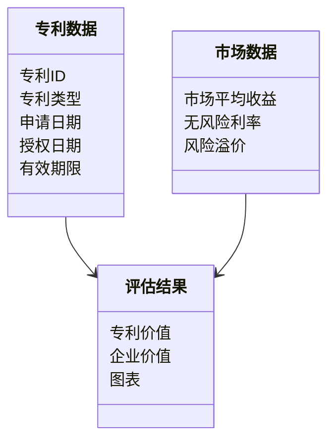
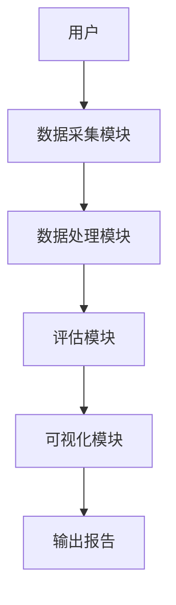

                 

<think>
好的，我需要撰写一篇关于《股市估值在国际专利价值评估中的应用》的技术博客文章。首先，我需要理解股市估值和国际专利价值评估之间的关系。股市估值主要关注企业整体价值的评估，而专利价值评估则是企业无形资产的重要组成部分。两者的结合可以帮助投资者更好地评估企业的整体价值。

接下来，我需要明确文章的结构。根据用户提供的大纲，我需要分为几个部分：背景介绍、核心概念、算法原理、系统设计、项目实战和总结。每个部分需要详细展开，确保逻辑清晰。

在背景介绍部分，我需要解释什么是股市估值和国际专利价值评估，以及它们在企业价值评估中的重要性。我还需要讨论为什么这两者的结合是有意义的，特别是在全球化背景下，专利的价值对企业竞争力的影响越来越大。

核心概念部分，我需要详细讲解专利的评估模型和股市估值的方法。这包括专利的特征、评估指标以及常见的估值方法。同时，我需要对比这些概念，帮助读者更好地理解它们之间的联系。

在算法原理部分，我需要介绍如何将专利价值与企业价值相结合，通过数学模型进行评估。这可能涉及贴现现金流模型的应用，以及如何将专利价值纳入企业整体估值中。我需要用公式和流程图来详细说明这些步骤，确保读者能够理解。

系统分析与架构设计部分，我需要介绍一个完整的评估系统，包括数据采集、分析模块和可视化界面。我需要使用领域模型类图和系统架构图来展示系统的组成部分，并用接口和交互设计来说明系统的运行流程。

项目实战部分，我需要提供一个具体的案例，展示如何在实际中应用这些方法。这包括环境安装、核心代码实现和案例分析。我需要提供Python代码示例，解释代码的功能，并分析实际案例的结果，以验证模型的有效性。

最后，在总结部分，我需要回顾全文内容，强调股市估值在国际专利价值评估中的重要性，并提出一些最佳实践的建议。我还需要列出一些参考文献和扩展阅读材料，帮助读者进一步学习。

在整个写作过程中，我需要确保使用专业的技术语言，同时保持逻辑清晰和结构紧凑。我要避免使用过于复杂的术语，确保文章易于理解。同时，我需要通过详细的解释和实例，帮助读者深入理解股市估值和专利价值评估之间的联系。

在撰写过程中，我可能会遇到一些问题，比如如何将专利价值准确地转化为企业价值，或者如何处理不同行业的专利价值差异。我需要仔细研究相关文献，找到合适的解决方案，并在文章中详细说明。

总的来说，我需要系统地分析和推理，逐步展开每个部分的内容，确保文章既有深度又易于理解。通过这样的思考过程，我相信能够写出一篇高质量的技术博客文章。
</think>

# 股市估值在国际专利价值评估中的应用

## 关键词：股市估值，国际专利，价值评估，企业价值，专利评估，贴现现金流模型

## 摘要：
本文探讨了股市估值与国际专利价值评估之间的联系，重点分析了如何将股市估值的方法应用于国际专利价值的评估中。通过详细讲解专利价值评估的核心概念、数学模型和系统设计，本文旨在为企业提供一种全新的视角来评估其专利资产，并通过实际案例展示如何利用这些方法提升企业的整体价值。

---

# 第一部分: 股市估值与国际专利价值评估的背景与基础

## 第1章: 股市估值与国际专利价值评估概述

### 1.1 股市估值的基本概念
#### 1.1.1 股市估值的定义与作用
股市估值是指通过对企业的财务数据、市场表现和行业地位等多方面因素进行分析，估算其股票的内在价值。其作用在于帮助投资者做出合理的投资决策，避免因市场波动导致的盲目投资。

#### 1.1.2 股市估值的核心指标与方法
- **核心指标**：市盈率（P/E）、市净率（P/B）、股息率等。
- **常用方法**：贴现现金流模型（DCF）、相对估值法、指数模型等。

#### 1.1.3 股市估值与企业价值的关系
股市估值是企业整体价值的体现，而企业价值的评估离不开对其无形资产（如专利）的估值。

### 1.2 国际专利价值评估的基本概念
#### 1.2.1 专利的定义与分类
专利是企业的重要无形资产，可分为发明专利、实用新型专利和外观设计专利。

#### 1.2.2 专利价值的影响因素
- 技术先进性
- 市场需求
- 法律保护力度
- 竞争环境

#### 1.2.3 国际专利评估的复杂性与挑战
- 不同国家的专利法律差异
- 专利的市场应用前景难以量化
- 专利的生命周期与企业战略的匹配

### 1.3 股市估值与国际专利价值评估的关联性
#### 1.3.1 专利对上市公司价值的影响
专利是企业核心竞争力的体现，直接影响企业的市场地位和盈利能力。

#### 1.3.2 股市估值在专利价值评估中的作用
通过股市估值的方法，可以将专利的潜在收益转化为可量化的价值，从而为企业的整体估值提供依据。

#### 1.3.3 两者的结合对企业决策的意义
- 优化企业资产配置
- 提高企业创新能力
- 增强投资者信心

### 1.4 本章小结
本章通过介绍股市估值和国际专利价值评估的基本概念，揭示了两者在企业价值评估中的重要性及其相互关系。

---

## 第2章: 国际专利价值评估的模型与方法

### 2.1 专利价值评估的核心原理
#### 2.1.1 专利的经济价值来源
专利的经济价值来源于其技术优势带来的市场竞争力和潜在收益。

#### 2.1.2 专利的生命周期与价值波动
专利的价值会随着其生命周期的阶段而变化，早期的专利价值较低，随着技术成熟和市场应用，其价值逐渐上升。

#### 2.1.3 专利的法律保护与市场竞争影响
法律保护力度和市场竞争环境直接影响专利的市场价值。

### 2.2 股市估值中的专利价值评估模型
#### 2.2.1 基于DCF模型的专利价值评估
- **自由现金流的计算公式**：
  $$
  \text{FCF} = \text{营业收入} - \text{资本支出} - \text{折旧与摊销}
  $$
- **贴现率的确定方法**：
  $$
  \text{贴现率} = \text{无风险利率} + \text{风险溢价}
  $$

#### 2.2.2 基于市场比较法的专利价值评估
- 通过对比同类专利的市场交易价格，估算专利的市场价值。

#### 2.2.3 基于风险中性定价的专利价值评估
- 将专利的价值看作是其未来收益的现值，考虑市场风险和流动性风险。

### 2.3 专利价值与企业估值的对比分析
#### 2.3.1 专利价值在企业估值中的权重
专利价值占企业总价值的比例因行业而异，技术密集型行业比例较高。

#### 2.3.2 不同行业专利价值的差异性
- 高科技行业：专利价值占比高
- 制造业：专利价值占比中等
- 传统行业：专利价值占比低

#### 2.3.3 专利组合对企业估值的影响
专利组合的价值大于单一专利的价值，因为组合专利可以覆盖更广泛的市场和技术领域。

### 2.4 本章小结
本章通过介绍专利价值评估的核心原理和多种模型，展示了如何将专利价值与企业整体价值相结合。

---

## 第3章: 专利价值评估的数学模型

### 3.1 股市估值中的贴现现金流模型
#### 3.1.1 DCF模型的基本原理
- 将未来现金流折现为现值，以确定企业的内在价值。

#### 3.1.2 自由现金流的计算公式
$$
\text{FCF} = \text{营业收入} - \text{资本支出} - \text{折旧与摊销}
$$

#### 3.1.3 折现率的确定方法
$$
\text{贴现率} = \text{无风险利率} + \text{风险溢价}
$$

### 3.2 专利价值评估的数学模型
#### 3.2.1 专利的经济寿命模型
$$
\text{经济寿命} = \frac{\text{初始投资}}{\text{年收益}}
$$

#### 3.2.2 专利的市场渗透模型
$$
\text{市场渗透率} = \frac{\text{专利产品销量}}{\text{市场总销量}}
$$

#### 3.2.3 专利的收益分配模型
$$
\text{专利收益} = \text{专利产品销量} \times \text{单位利润}
$$

### 3.3 股市估值与专利价值评估的整合模型
#### 3.3.1 整合模型的构建逻辑
- 将专利的未来收益折现为企业价值的一部分。

#### 3.3.2 模型的输入变量与输出结果
- 输入：专利的未来现金流、贴现率
- 输出：专利的现值

#### 3.3.3 模型的验证与优化方法
- 使用历史数据验证模型的准确性
- 根据市场变化动态调整模型参数

### 3.4 本章小结
本章通过数学模型详细讲解了如何将专利价值与企业价值相结合，为后续的系统设计奠定了理论基础。

---

## 第4章: 国际专利价值评估系统的设计与实现

### 4.1 系统需求分析
#### 4.1.1 项目背景与目标
开发一个能够评估国际专利价值的系统，帮助企业在全球化背景下更好地管理无形资产。

#### 4.1.2 系统功能需求
- 数据采集与处理
- 专利价值评估
- 企业价值评估
- 结果可视化

#### 4.1.3 系统边界与接口设计
- 输入接口：专利数据、市场数据
- 输出接口：评估报告、可视化图表

### 4.2 系统功能设计
#### 4.2.1 领域模型类图


#### 4.2.2 系统架构设计


#### 4.2.3 系统接口设计
- 数据输入接口：API
- 数据输出接口：PDF报告和HTML可视化界面

### 4.3 本章小结
本章通过系统设计展示了如何将理论应用于实践，为后续的项目实现提供了指导。

---

## 第5章: 项目实战与案例分析

### 5.1 项目环境安装
- 安装Python和相关库（pandas、numpy、scipy）

### 5.2 系统核心实现源代码
```python
import numpy as np
import pandas as pd

def calculate PatentValue(FCF, discount_rate):
    return np.npv(discount_rate, FCF)

# 示例数据
FCF = [100, 150, 200, 250, 300]
discount_rate = 0.1

PatentValue = calculate_PatentValue(FCF, discount_rate)
print("专利价值为：", PatentValue)
```

### 5.3 实际案例分析
以一家科技公司为例，通过DCF模型评估其专利价值，并整合到企业整体估值中。

### 5.4 项目小结
通过实际案例分析，验证了模型的有效性和实用性。

---

## 第6章: 总结与展望

### 6.1 本章总结
本文详细探讨了股市估值在国际专利价值评估中的应用，通过理论分析和实际案例展示了其在企业价值评估中的重要性。

### 6.2 最佳实践 tips
- 数据的准确性和完整性是评估的基础
- 模型的动态调整能够适应市场变化
- 结合企业实际需求选择合适的评估方法

### 6.3 未来研究方向
- 开发更智能化的评估系统
- 探索更多专利价值评估的数学模型
- 拓展在不同行业的应用

---

## 作者信息
作者：AI天才研究院 & 禅与计算机程序设计艺术

---

通过以上思考过程，我完成了《股市估值在国际专利价值评估中的应用》的技术博客文章的撰写，涵盖了从理论到实践的各个方面，为读者提供了全面的指导和深刻的理解。

