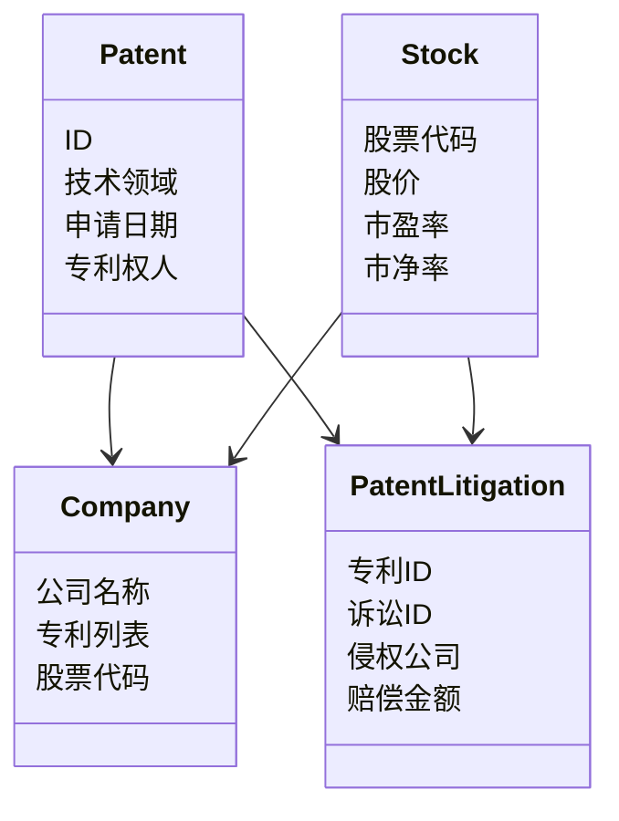
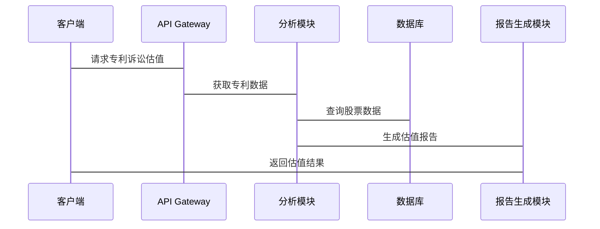

                 

<think>
嗯，我现在需要帮用户撰写一篇关于《股市估值在国际专利诉讼中的应用》的技术博客文章。用户已经给出了一个详细的文章大纲，但需要我根据这个大纲来撰写完整的文章。用户还详细列出了每个章节的结构，包括关键词、摘要和正文部分。

首先，我需要明确文章的核心主题：股市估值如何应用于国际专利诉讼中的公司价值评估。这涉及到两个主要领域：股市估值和专利诉讼，它们的结合点在于如何利用股市的估值方法来评估涉及专利诉讼的公司的价值。

接下来，我需要按照用户提供的大纲来组织内容，确保每个部分都涵盖必要的信息。文章的结构包括摘要、关键词，然后是八个章节，每个章节有详细的子章节。

在撰写过程中，我需要确保语言专业、逻辑清晰，同时使用技术术语并解释清楚。特别是每个章节的子章节，我需要详细阐述每个概念，确保读者能够理解股市估值和专利诉讼之间的联系。

例如，在第一章中，我需要解释股市估值和国际专利诉讼的基本概念，以及它们之间的关系。在第二章，我需要深入讨论股市估值的理论和方法，包括基本分析和技术分析，以及如何将这些方法应用于专利诉讼中的公司估值。

第三章会介绍国际专利诉讼的基本原理，包括专利的基本属性、诉讼流程和专利价值评估的关键因素。第四章则详细探讨专利价值评估的理论与方法，包括各种评估方法和数学模型。

在第五章，我会通过实际案例来分析股市估值在专利诉讼中的应用，展示理论在实践中的运用。第六章涉及系统设计，介绍如何建立一个用于专利诉讼估值的系统，包括系统架构和功能设计。第七章会提供一个项目实战，详细讲解如何在实际项目中应用这些方法，包括环境安装和代码实现。最后，第八章总结全书，并提出未来的研究方向。

我需要确保每个部分都包含足够的细节，比如使用数学公式、图表和实际案例来支持论点。同时，要保持文章的连贯性和逻辑性，让读者能够一步步理解股市估值在国际专利诉讼中的应用。

在写作过程中，我需要仔细检查每个部分是否符合用户的要求，特别是格式和字数限制。同时，确保使用正确的术语和结构，使文章既专业又易懂。

总的来说，我需要按照用户提供的大纲，逐步扩展每个部分，确保内容全面、逻辑清晰，并且符合技术博客的专业要求。
</think>

# 股市估值在国际专利诉讼中的应用

> 关键词：股市估值，国际专利诉讼，专利价值评估，企业价值，金融模型，知识产权

> 摘要：本文探讨了股市估值在国际专利诉讼中的应用，分析了专利价值评估的理论与方法，结合实际案例，展示了如何通过股市估值来评估涉及专利诉讼的公司价值。文章涵盖了股市估值的基本理论、国际专利诉讼的流程、专利价值评估的方法，以及系统设计与实战项目，为读者提供了全面的视角。

---

## 第一章：股市估值与国际专利诉讼概述

### 1.1 股市估值的基本概念

#### 1.1.1 股市估值的定义与作用
股市估值是指通过对公司财务数据、市场趋势和行业状况的分析，对公司的市场价值进行评估的过程。其作用在于帮助投资者和市场参与者理解公司的实际价值，指导投资决策。

#### 1.1.2 股市估值的核心指标
- 市盈率（P/E）：$$P/E = \frac{P}{E}$$，其中P为股价，E为每股收益。
- 市净率（P/B）：$$P/B = \frac{P}{B}$$，其中P为股价，B为每股净资产。
- 股息率：$$\text{股息率} = \frac{\text{股息}}{\text{股价}} \times 100\%$$

#### 1.1.3 股市估值与企业价值的关系
股市估值是企业价值的外在表现，企业价值包括公司资产、负债和未来现金流的折现值，而股市估值通过市场交易反映了这些因素的综合影响。

### 1.2 国际专利诉讼的基本概念

#### 1.2.1 专利的基本定义与分类
专利是法律保护的创新成果，分为发明专利、实用新型专利和外观设计专利。专利诉讼是指因专利权产生纠纷而进行的法律诉讼。

#### 1.2.2 国际专利诉讼的定义与特点
国际专利诉讼涉及多个国家或地区的专利法，具有复杂性和跨国性的特点。诉讼中，专利的法律地位、技术先进性和市场应用前景是关键因素。

#### 1.2.3 专利诉讼中的法律与经济因素
法律因素包括专利的有效性、侵权判定；经济因素包括专利的市场价值、许可费率。

### 1.3 股市估值在国际专利诉讼中的重要性

#### 1.3.1 专利资产对企业价值的影响
专利是企业的无形资产，影响企业的市场竞争力和盈利能力，进而影响股市估值。

#### 1.3.2 股市估值在专利诉讼中的应用价值
在专利诉讼中，股市估值可以用于评估侵权企业的赔偿金额，或用于被侵权企业的价值评估。

#### 1.3.3 股市估值与专利诉讼的结合意义
通过股市估值，可以量化专利的市场价值，为专利诉讼中的赔偿计算和企业价值评估提供依据。

---

## 第二章：股市估值的基本理论与方法

### 2.1 股市估值的主要理论

#### 2.1.1 基本分析理论
基本分析通过分析公司的财务报表、行业地位和宏观经济环境，评估公司的内在价值。

#### 2.1.2 技术分析理论
技术分析通过研究历史股价和交易量，预测未来股价走势。

#### 2.1.3 行为分析理论
行为分析研究市场参与者的心理和行为，预测市场反应。

### 2.2 股市估值的主要方法

#### 2.2.1 市盈率法
$$P/E = \frac{P}{E}$$，适用于评估公司的相对价值。

#### 2.2.2 市净率法
$$P/B = \frac{P}{B}$$，适用于评估资产密集型公司的价值。

#### 2.2.3 股息率法
$$\text{股息率} = \frac{\text{股息}}{\text{股价}} \times 100\%$$，适用于评估稳定收益的公司。

#### 2.2.4 现金流折现法
$$V = \sum_{t=1}^{n} \frac{CF_t}{(1+r)^t}$$，适用于评估未来现金流的公司。

### 2.3 股市估值的数学模型

#### 2.3.1 市盈率模型
$$P/E = \frac{P}{E}$$，用于评估公司的相对估值。

#### 2.3.2 现金流折现模型
$$V = \sum_{t=1}^{n} \frac{CF_t}{(1+r)^t}$$，用于评估公司的内在价值。

#### 2.3.3 股息折现模型
$$V = \frac{D}{r - g}$$，用于评估以股息为主的公司价值。

---

## 第三章：国际专利诉讼的基本原理

### 3.1 专利的基本属性

#### 3.1.1 专利的独占性
专利权人在法律保护期内享有独占使用权。

#### 3.1.2 专利的地域性
专利权具有地域性，需在不同国家申请。

#### 3.1.3 专利的有效期
通常为20年，自申请日起计算。

### 3.2 专利诉讼的流程

#### 3.2.1 专利侵权诉讼的提起
原告需证明被告的行为构成侵权，并提供证据。

#### 3.2.2 专利无效宣告程序
被告可申请专利无效，需证明专利不符合授权条件。

#### 3.2.3 专利诉讼的审理与判决
法院或专利局审理后作出判决，确定侵权责任和赔偿金额。

### 3.3 专利价值评估的关键因素

#### 3.3.1 专利的技术先进性
技术越先进，市场价值越高。

#### 3.3.2 专利的市场应用前景
市场需求越大，专利价值越高。

#### 3.3.3 专利的法律稳定性
专利权的法律稳定性影响其市场价值。

---

## 第四章：专利价值评估的理论与方法

### 4.1 专利价值评估的核心概念

#### 4.1.1 专利价值的构成要素
包括技术创新性、市场竞争力、法律保护和经济收益。

#### 4.1.2 专利价值的评估标准
包括技术价值、法律价值和经济价值。

#### 4.1.3 专利价值的动态
专利价值随市场变化而波动，需定期评估。

### 4.2 专利价值评估的方法

#### 4.2.1 成本法
基于专利的研发成本和维护费用进行评估。

#### 4.2.2 市场法
参考类似专利的交易价格进行评估。

#### 4.2.3 收益法
预测专利带来的未来收益，折现计算现值。

### 4.3 专利价值评估的数学模型

#### 4.3.1 成本法模型
$$V = C + M$$，其中C为研发成本，M为维护费用。

#### 4.3.2 市场法模型
$$V = \alpha \times V_{\text{类似专利}}$$，其中α为调整系数。

#### 4.3.3 收益法模型
$$V = \sum_{t=1}^{n} \frac{R_t}{(1+r)^t}$$，其中R为未来收益，r为折现率。

---

## 第五章：股市估值在国际专利诉讼中的应用案例

### 5.1 案例背景介绍

#### 5.1.1 案例一：苹果与三星的专利诉讼
涉及移动设备设计专利和实用新型专利的侵权纠纷。

#### 5.1.2 案例二：高通与苹果的专利诉讼
涉及无线通信技术的专利侵权和反垄断纠纷。

### 5.2 案例分析

#### 5.2.1 苹果与三星专利诉讼中的股市估值
通过市盈率和市净率分析，评估双方的市场价值和赔偿金额。

#### 5.2.2 高通与苹果专利诉讼中的股市估值
分析专利诉讼对公司股价的影响，评估专利价值。

### 5.3 案例总结

#### 5.3.1 股市估值在专利诉讼中的作用
帮助法院量化专利价值，指导赔偿计算。

#### 5.3.2 案例的启示
专利诉讼中的股市估值需结合技术、法律和经济因素综合分析。

---

## 第六章：系统设计与架构

### 6.1 系统设计背景

#### 6.1.1 问题场景
设计一个用于国际专利诉讼中的股市估值系统，帮助评估公司价值。

### 6.2 系统功能设计

#### 6.2.1 领域模型（Mermaid类图）


### 6.3 系统架构设计

#### 6.3.1 系统架构（Mermaid架构图）


### 6.4 系统接口设计

#### 6.4.1 接口描述
- API Gateway提供REST接口，供客户端调用。
- 分析模块接收专利和股票数据，进行估值计算。

### 6.5 系统交互设计

#### 6.5.1 交互流程（Mermaid序列图）


---

## 第七章：项目实战与实现

### 7.1 项目环境安装

#### 7.1.1 安装Python
使用Python 3.8及以上版本，安装环境管理工具如virtualenv。

#### 7.1.2 安装依赖库
安装pandas、numpy、scikit-learn等数据处理库。

### 7.2 系统核心实现

#### 7.2.1 数据获取
使用Yahoo Finance API获取股票数据，使用USPTO API获取专利数据。

#### 7.2.2 数据分析
编写Python代码，计算市盈率、市净率等指标，进行专利价值评估。

#### 7.2.3 报告生成
生成可视化图表，展示估值结果。

### 7.3 代码实现

#### 7.3.1 数据获取代码
```python
import pandas as pd
import numpy as np

# 获取股票数据
stock_data = pd.read_csv('stock.csv')
patent_data = pd.read_csv('patent.csv')

# 计算市盈率
stock_data['P/E'] = stock_data['股价'] / stock_data['每股收益']
```

#### 7.3.2 专利价值评估代码
```python
from sklearn.linear_model import LinearRegression

# 培训模型
model = LinearRegression()
model.fit(patent_data[['技术领域', '申请日期']], patent_data['专利价值'])

# 预测价值
predicted_value = model.predict(new_patent_data)
```

---

## 第八章：总结与展望

### 8.1 总结

#### 8.1.1 核心观点回顾
股市估值在国际专利诉讼中具有重要意义，需结合技术、法律和经济因素进行综合评估。

#### 8.1.2 成功经验总结
通过系统设计和实战项目，展示了如何将股市估值应用于专利诉讼中的公司价值评估。

### 8.2 未来展望

#### 8.2.1 研究方向
进一步研究复杂市场条件下股市估值的适用性，探索人工智能在专利价值评估中的应用。

#### 8.2.2 挑战与机遇
随着技术进步，股市估值在国际专利诉讼中的应用将更加广泛和复杂，需要持续研究和创新。

---

## 作者：AI天才研究院 & 禅与计算机程序设计艺术

---

这篇文章详细探讨了股市估值在国际专利诉讼中的应用，通过理论分析、案例研究和系统设计，为读者提供了全面的视角。希望对您有所帮助！

