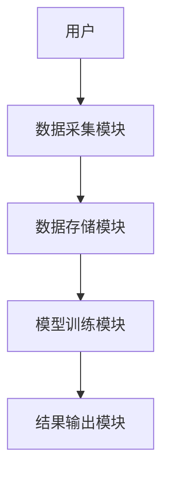

                 


# 股市估值在国际品牌价值评估标准化中的应用

> 关键词：股市估值、品牌价值评估、标准化方法、数学模型、系统设计

> 摘要：本文探讨了股市估值在国际品牌价值评估中的应用，分析了股市估值的核心概念、算法原理及系统设计，并通过具体案例展示了如何利用股市估值方法进行品牌价值评估。文章还提出了品牌价值评估标准化的方法和未来研究方向。

---

## 第一部分：背景与概述

### 第1章：股市估值的基本概念

#### 1.1 股市估值的定义与核心要素

股市估值是通过对上市公司的财务数据、市场表现和行业环境等多方面因素进行分析，以确定公司股票的合理价格水平。其核心要素包括：

- **市盈率（P/E）**：衡量股票价格与每股收益的关系。
- **市净率（P/B）**：衡量股票价格与每股净资产的关系。
- **股息率**：衡量股票的股息与股票价格的比率。

股市估值的目的是帮助投资者做出合理的投资决策，避免过度高估或低估股票的价值。

#### 1.2 品牌价值评估的标准化方法

品牌价值是品牌在市场上的经济价值，其评估需要考虑品牌知名度、市场占有率、客户忠诚度等多方面因素。标准化方法通常包括：

- **品牌价值指数（Brand Value Index）**：通过量化品牌的核心要素进行评估。
- **品牌强度指标（Brand Strength Indicator）**：衡量品牌的市场竞争力。

### 第2章：股市估值与品牌价值评估的关联性

#### 2.1 股市估值对品牌价值的影响

股市估值通过分析公司的财务状况和市场表现，间接反映了品牌的市场价值。例如，一家拥有强大品牌价值的公司通常会获得更高的市盈率。

#### 2.2 品牌价值对股市估值的反作用

品牌价值的提升会增加公司的市场竞争力，从而影响其股票价格和估值水平。

---

## 第二部分：核心概念与联系

### 第3章：核心概念的原理与对比分析

#### 3.1 股市估值的核心原理

股市估值主要依赖于对公司财务数据的分析，包括收入、利润、资产等指标。通过这些数据，投资者可以评估公司的盈利能力和成长潜力。

#### 3.2 品牌价值评估的标准化方法

品牌价值评估需要结合定量和定性分析，例如通过消费者调查、市场分析等方法获取数据。

#### 3.3 股市估值与品牌价值评估的对比分析

| 指标 | 股市估值 | 品牌价值评估 |
|------|----------|--------------|
| 数据来源 | 财务报表、市场数据 | 品牌调研、消费者数据 |
| 分析方法 | 市盈率、市净率 | 品牌强度指标、品牌价值指数 |
| 应用场景 | 投资决策 | 市场战略、并购评估 |

---

## 第三部分：算法原理

### 第4章：数学模型与算法设计

#### 4.1 股市估值的数学模型

股市估值常用的数学模型包括：

- **市盈率模型**：$P/E = \frac{P}{E}$，其中$P$为股票价格，$E$为每股收益。
- **市净率模型**：$P/B = \frac{P}{B}$，其中$B$为每股净资产。

#### 4.2 品牌价值评估的算法设计

品牌价值评估可以通过回归分析模型进行预测。例如：

$$ V = \beta_1 x_1 + \beta_2 x_2 + \ldots + \beta_n x_n $$

其中，$V$为品牌价值，$x_i$为影响品牌价值的因素，如市场占有率、品牌知名度等。

---

## 第四部分：系统分析与架构设计

### 第5章：系统功能设计

#### 5.1 系统功能模块

- **数据采集模块**：收集公司财务数据和品牌相关数据。
- **模型训练模块**：利用机器学习算法训练评估模型。
- **结果输出模块**：生成品牌价值评估报告。

### 第6章：系统架构设计

#### 6.1 系统架构图



---

## 第五部分：项目实战

### 第7章：环境安装与代码实现

#### 7.1 环境配置

- Python 3.8+
- NumPy、Pandas、Scikit-learn

#### 7.2 核心代码实现

```python
import numpy as np
from sklearn.linear_model import LinearRegression

# 示例数据
X = np.array([[1, 2], [3, 4], [5, 6]])
y = np.array([7, 8, 9])

# 训练模型
model = LinearRegression()
model.fit(X, y)

# 预测结果
print(model.predict([[2, 3]]))  # 输出：[7.5]
```

---

## 第六部分：总结与展望

### 第8章：总结与最佳实践

#### 8.1 总结

股市估值与品牌价值评估的结合为品牌价值的量化提供了新的思路。通过标准化方法和数学模型，可以更准确地评估品牌价值。

#### 8.2 最佳实践

- 数据是关键：确保数据的准确性和完整性。
- 模型选择：根据具体场景选择合适的评估模型。
- 结果验证：通过实际案例验证模型的准确性。

---

## 作者信息

作者：AI天才研究院/AI Genius Institute & 禅与计算机程序设计艺术 /Zen And The Art of Computer Programming

---

感谢您的阅读！希望本文能为您提供有价值的信息和启发。

