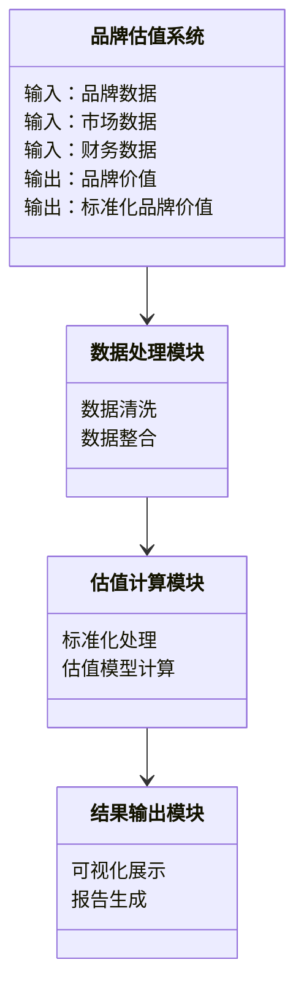
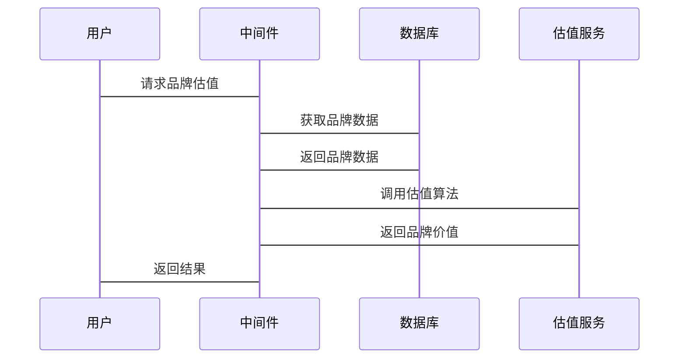

                 


# 股市估值在国际品牌估值标准化中的应用

---

## 关键词：
- 股市估值
- 品牌估值
- 标准化
- 经济价值
- 投资分析

---

## 摘要：
本文探讨了股市估值方法在国际品牌估值中的应用及其标准化问题。通过分析股市估值的核心指标与方法，结合品牌估值的特殊性，提出了一种基于股市估值的国际品牌估值标准化模型。文章详细阐述了品牌价值的构成要素、估值模型的设计思路、标准化流程的实现方法，以及在实际案例中的应用。通过系统化的方法和数学模型，本文为国际品牌估值提供了新的思路和解决方案。

---

## 目录大纲：

# 第一部分：背景与概念

## 第1章：股市估值与品牌估值的概述

### 1.1 股市估值的基本概念
- 1.1.1 股市估值的定义
- 1.1.2 股市估值的核心指标与方法
- 1.1.3 股市估值在企业价值评估中的作用

### 1.2 国际品牌估值的定义与特点
- 1.2.1 品牌价值的定义
- 1.2.2 品牌估值的核心要素
- 1.2.3 国际品牌与国内品牌的估值差异

### 1.3 股市估值在品牌估值中的应用前景
- 1.3.1 股市估值方法的可迁移性
- 1.3.2 品牌估值的标准化需求
- 1.3.3 股市估值在品牌估值中的优势与挑战

## 第2章：股市估值的核心指标与方法

### 2.1 股市估值的核心指标
- 2.1.1 市盈率（P/E）
- 2.1.2 市净率（P/B）
- 2.1.3 市销率（P/S）
- 2.1.4 EV/EBITDA

### 2.2 股市估值方法的优缺点分析
- 2.2.1 相对估值法
- 2.2.2 绝对估值法
- 2.2.3 股票评级法
- 2.2.4 股票分层法

### 2.3 股市估值方法的数学模型
- 2.3.1 市盈率公式
  $$ P/E = \frac{Price}{Earnings} $$
- 2.3.2 市净率公式
  $$ P/B = \frac{Price}{Book\ Value} $$
- 2.3.3 EV/EBITDA公式
  $$ EV = \frac{Market\ Cap + Debt - Cash}{EBITDA} $$

## 第3章：品牌估值的核心要素与模型

### 3.1 品牌价值的构成要素
- 3.1.1 品牌知名度
- 3.1.2 品牌忠诚度
- 3.1.3 品牌影响力
- 3.1.4 品牌资产

### 3.2 品牌估值的核心模型
- 3.2.1 品牌价值公式
  $$ Brand\ Value = (Revenue \times Brand\ Strength) - Cost $$
- 3.2.2 品牌资产模型
- 3.2.3 品牌影响力评估指标

### 3.3 品牌估值的标准化挑战
- 3.3.1 品牌数据的获取与处理
- 3.3.2 品牌估值的主观性问题
- 3.3.3 品牌估值的国际化差异

## 第4章：股市估值方法在品牌估值中的应用

### 4.1 股市估值方法的可迁移性分析
- 4.1.1 市盈率在品牌估值中的应用
- 4.1.2 市净率在品牌估值中的应用
- 4.1.3 EV/EBITDA在品牌估值中的应用

### 4.2 品牌估值的标准化模型设计
- 4.2.1 品牌估值标准化公式
  $$ Standardized\ Brand\ Value = \frac{Brand\ Value}{Market\ Size} $$
- 4.2.2 品牌

---

# 第二部分：算法与系统架构

## 第5章：品牌估值标准化模型的设计与实现

### 5.1 问题场景介绍
- 品牌估值的复杂性
- 标准化需求的迫切性

### 5.2 系统功能设计
- 领域模型设计（Mermaid 类图）


### 5.3 系统架构设计
- 系统架构图（Mermaid 架构图）


### 5.4 系统接口设计
- API 接口定义
  ```python
  def get_brand_value(brand_data):
      # 实现品牌估值计算
      pass
  ```

### 5.5 系统交互设计
- 交互流程图（Mermaid 序列图）


## 第6章：品牌估值标准化模型的实现与案例分析

### 6.1 项目实战：环境安装与数据准备
- 数据源：股票市场数据、品牌数据
- 工具：Python、Pandas、NumPy、Scikit-learn

### 6.2 核心代码实现
```python
import pandas as pd
import numpy as np

def calculate_brand_value(brand_revenue, brand_strength, cost):
    return brand_revenue * brand_strength - cost

def normalize_brand_value(brand_value, market_size):
    return brand_value / market_size

# 示例数据
brand_revenue = 1000000  # 品牌收入
brand_strength = 0.8      # 品牌强度
cost = 200000            # 成本
market_size = 10000000   # 市场规模

# 计算品牌价值
brand_value = calculate_brand_value(brand_revenue, brand_strength, cost)
# 标准化品牌价值
normalized_value = normalize_brand_value(brand_value, market_size)

print(f"品牌价值：${brand_value}")
print(f"标准化品牌价值：${normalized_value}")
```

### 6.3 实际案例分析
- 案例：苹果品牌估值
- 数据分析与结果解读

### 6.4 项目小结
- 项目实现的关键点
- 经验总结
- 改进方向

## 第7章：总结与展望

### 7.1 总结
- 核心观点回顾
- 本文的主要贡献

### 7.2 展望
- 未来的研究方向
- 技术的发展趋势

### 7.3 最佳实践 tips
- 品牌估值的注意事项
- 标准化模型的应用建议

---

# 作者：AI天才研究院/AI Genius Institute & 禅与计算机程序设计艺术 /Zen And The Art of Computer Programming

