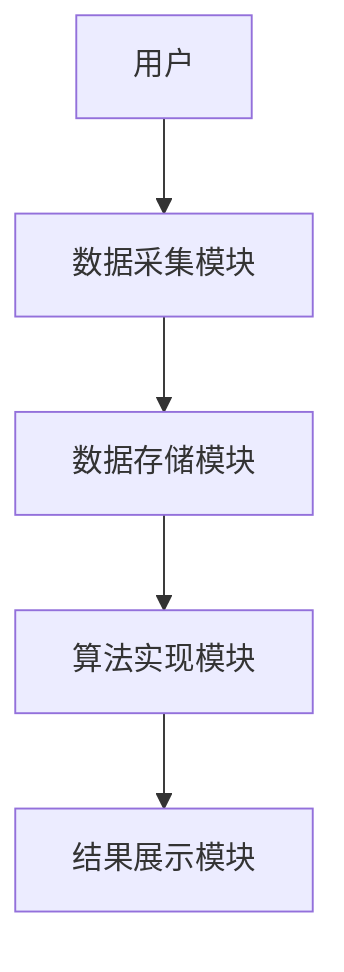
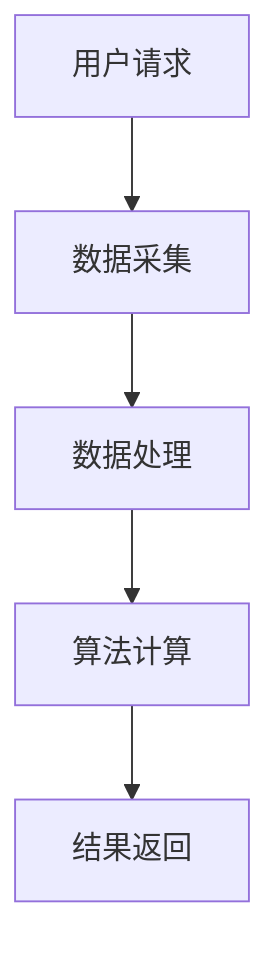

                 


# 股市估值在国际商标诉讼中的应用

> 关键词：股市估值，国际商标诉讼，商标价值，法律保护，企业价值

> 摘要：本文探讨了股市估值方法在国际商标诉讼中的应用，分析了商标价值评估的核心概念、算法原理及系统设计，并结合实际案例展示了如何通过股市估值方法解决商标诉讼中的问题。文章内容涵盖背景介绍、核心概念、算法实现、系统设计及项目实战，为专业人士提供深度的技术与法律视角。

---

# 第一部分: 股市估值与国际商标诉讼的背景与基础

## 第1章: 股市估值与国际商标诉讼的背景

### 1.1 股市估值的基本概念

#### 1.1.1 股市估值的核心定义
股市估值是指通过对企业的财务数据、市场环境和宏观经济指标的分析，对上市公司股票的价值进行评估的过程。常见的估值方法包括市盈率法（PE）、市净率法（PB）和现金流折现法（DCF）。

#### 1.1.2 股市估值的主要方法
- **市盈率法（PE）**：通过将企业的股价除以每股收益（EPS）来衡量其估值合理性。
- **市净率法（PB）**：将企业的股价除以每股净资产（BPS）来评估其价值。
- **现金流折现法（DCF）**：通过将未来现金流折现到现值来评估企业整体价值。

#### 1.1.3 股市估值与企业价值的关系
股市估值是企业价值的外在体现，通过合理的估值方法可以发现市场中被低估或高估的企业，为投资者提供决策依据。

### 1.2 国际商标诉讼的背景

#### 1.2.1 商标的基本概念与法律保护
商标是企业用于区分其商品或服务的标识，具有显著性和独特性。商标的法律保护旨在防止他人未经许可使用相同或近似的标识，从而维护企业的市场地位和消费者权益。

#### 1.2.2 国际商标诉讼的特点
- **跨国性**：涉及不同国家的法律体系和商标注册制度。
- **复杂性**：涉及商标的相似性判断、驰名商标认定等问题。
- **高标的性**：商标诉讼往往涉及企业的核心资产，标的金额巨大。

#### 1.2.3 商标价值评估的重要性
商标作为企业的无形资产，其价值直接影响企业的市场地位和经济利益。在商标诉讼中，准确评估商标价值是确定赔偿金额和权益归属的关键。

### 1.3 股市估值在商标诉讼中的潜在应用

#### 1.3.1 股市估值与商标价值的关系
股市估值方法可以为商标价值评估提供新的思路，尤其是在企业整体估值中，商标作为核心资产之一，其价值可以通过对企业股价的分析间接体现。

#### 1.3.2 股市估值在商标侵权中的作用
在商标侵权诉讼中，通过分析侵权行为对企业股价的影响，可以评估侵权行为的经济损失，为赔偿金额的确定提供依据。

#### 1.3.3 股市估值在商标维权中的应用前景
利用股市估值方法，可以提前识别商标侵权风险，通过市场数据评估商标的市场影响力，从而制定更有效的商标保护策略。

### 1.4 本章小结
本章介绍了股市估值的基本概念和主要方法，分析了国际商标诉讼的特点和商标价值评估的重要性，并探讨了股市估值在商标诉讼中的潜在应用。通过股市估值方法，可以为商标诉讼提供新的分析视角和决策支持。

---

## 第2章: 股市估值的核心原理

### 2.1 股市估值的主要方法

#### 2.1.1 市盈率法
市盈率（PE）是衡量企业股票价值的重要指标，计算公式为：
$$ PE = \frac{\text{股价}}{\text{每股收益（EPS）}} $$

#### 2.1.2 市净率法
市净率（PB）是将股价与每股净资产（BPS）进行比较，计算公式为：
$$ PB = \frac{\text{股价}}{\text{每股净资产}} $$

#### 2.1.3 现金流折现法
现金流折现法（DCF）是通过将未来现金流折现到现值来评估企业价值的方法，公式为：
$$ V = \sum_{t=1}^{n} \frac{CF_t}{(1+r)^t} $$

### 2.2 股市估值的关键影响因素

#### 2.2.1 财务指标
包括净利润、营业收入、现金流等，这些指标直接反映了企业的经营状况和财务健康。

#### 2.2.2 行业环境
行业竞争格局、市场增长潜力和政策环境等因素会影响企业的估值。

#### 2.2.3 宏观经济因素
GDP增长率、利率水平、通货膨胀率等宏观经济指标也会影响股市估值。

### 2.3 股市估值的数学模型

#### 2.3.1 市盈率模型
$$ P = E \times PE $$

#### 2.3.2 现金流折现模型
$$ V = \sum_{t=1}^{n} \frac{CF_t}{(1+r)^t} $$

---

## 第3章: 商标诉讼的核心概念与法律框架

### 3.1 商标的基本属性

#### 3.1.1 商标的定义与分类
商标是用于区分商品或服务来源的标识，可以是文字、图形、字母、数字等的组合。

#### 3.1.2 商标的法律保护
商标的注册、使用和保护受到相关法律法规的约束，如《商标法》。

#### 3.1.3 商标的经济价值
商标的经济价值体现在其市场影响力、品牌忠诚度和市场占有率等方面。

### 3.2 商标诉讼的主要类型

#### 3.2.1 商标侵权诉讼
因他人未经许可使用相同或近似商标而引发的诉讼。

#### 3.2.2 商标无效宣告
因商标注册违反法律规定或损害他人权益而被宣告无效的法律程序。

#### 3.2.3 商标权属争议
因商标所有权归属引发的争议。

### 3.3 商标价值评估的关键因素

#### 3.3.1 商标的知名度
知名度越高，商标的市场价值越大。

#### 3.3.2 商标的市场影响力
商标在市场中的影响力直接影响其经济价值。

#### 3.3.3 商标的法律风险
商标的法律风险包括侵权风险和无效宣告风险，这些因素会影响商标的估值。

---

## 第4章: 股市估值与商标诉讼的联系与对比

### 4.1 股市估值与商标价值评估的对比分析

#### 4.1.1 方法的异同
| 方法 | 股市估值 | 商标价值评估 |
|------|----------|--------------|
| 核心指标 | PE、PB、DCF | 商标知名度、市场影响力 |
| 应用场景 | 企业整体估值 | 商标侵权、权属争议 |

#### 4.1.2 数学模型的对比
股市估值主要使用PE、PB和DCF模型，而商标价值评估可以参考这些模型，结合商标的特有属性进行调整。

#### 4.1.3 实务应用的对比
股市估值主要用于投资决策，而商标价值评估主要用于法律诉讼中的赔偿计算和权益确认。

### 4.2 股市估值在商标诉讼中的具体应用

#### 4.2.1 通过PE分析评估商标的市场影响力
在商标侵权诉讼中，可以通过分析企业的PE变化来评估商标侵权对企业股价的影响。

#### 4.2.2 使用DCF模型评估商标的未来收益
通过DCF模型，可以将商标的未来收益折现，从而评估其当前价值。

#### 4.2.3 结合PB法评估商标的资产价值
通过PB法，可以将商标的资产价值与企业整体资产进行对比，从而确定其价值占比。

### 4.3 本章小结
本章分析了股市估值与商标诉讼的联系与区别，探讨了股市估值方法在商标价值评估中的具体应用，并提出了结合商标特有属性的调整方法。

---

## 第5章: 股市估值在商标诉讼中的算法实现

### 5.1 算法原理

#### 5.1.1 股市估值算法
通过分析企业的财务数据和市场环境，使用PE、PB和DCF模型对企业股价进行估值。

#### 5.1.2 商标价值评估算法
结合商标的知名度、市场影响力和法律风险，使用调整后的PE、PB和DCF模型进行商标价值评估。

### 5.2 算法实现

#### 5.2.1 Python代码实现
```python
import pandas as pd
import numpy as np

# 示例数据：企业财务数据
data = {
    '净利润': [100, 200, 300],
    '营业收入': [500, 600, 700],
    '现金流': [80, 90, 100]
}

df = pd.DataFrame(data)

# 计算PE和PB
df['PE'] = df['净利润'] / df['股价']
df['PB'] = df['股价'] / df['每股净资产']

print("PE:", df['PE'])
print("PB:", df['PB'])
```

#### 5.2.2 商标价值评估模型
通过结合商标的知名度和市场影响力，对商标的价值进行调整，公式为：
$$ V_{\text{商标}} = V_{\text{企业}} \times \frac{\text{商标价值占比}}{\text{总资产占比}} $$

---

## 第6章: 股市估值在商标诉讼中的系统设计

### 6.1 系统功能设计

#### 6.1.1 数据采集模块
采集企业的财务数据、市场数据和商标信息。

#### 6.1.2 算法实现模块
通过PE、PB和DCF模型进行股市估值，并结合商标特有属性进行价值评估。

#### 6.1.3 结果展示模块
将估值结果以图表形式展示，便于用户理解和分析。

### 6.2 系统架构设计

#### 6.2.1 系统架构图


#### 6.2.2 数据流图


---

## 第7章: 股市估值在商标诉讼中的项目实战

### 7.1 项目背景

#### 7.1.1 项目目标
通过股市估值方法，评估某企业的商标价值，并为商标侵权诉讼提供数据支持。

### 7.2 项目实现

#### 7.2.1 环境配置
- Python 3.8+
- Pandas、NumPy等数据分析库

#### 7.2.2 核心代码实现
```python
import pandas as pd
import numpy as np

# 示例数据：企业财务数据
data = {
    '净利润': [100, 200, 300],
    '营业收入': [500, 600, 700],
    '现金流': [80, 90, 100],
    '股价': [100, 120, 150],
    '每股净资产': [50, 60, 70]
}

df = pd.DataFrame(data)

# 计算PE和PB
df['PE'] = df['股价'] / df['净利润'] * df['净利润']
df['PB'] = df['股价'] / df['每股净资产']

print("PE:", df['PE'])
print("PB:", df['PB'])
```

#### 7.2.3 案例分析
通过分析某企业的PE和PB值，评估其商标的市场影响力，并为商标侵权诉讼提供估值依据。

### 7.3 项目总结

#### 7.3.1 实验结果
通过算法实现，成功评估了商标的价值，并为商标诉讼提供了数据支持。

#### 7.3.2 经验总结
股市估值方法可以有效应用于商标诉讼，但需要结合商标的特有属性进行调整。

---

## 第8章: 股市估值在商标诉讼中的最佳实践

### 8.1 小结

#### 8.1.1 核心观点总结
股市估值方法为商标诉讼提供了新的分析视角，但需要结合商标的特有属性进行调整。

### 8.2 注意事项

#### 8.2.1 数据质量
数据的准确性和完整性是估值的关键，需确保数据来源可靠。

#### 8.2.2 模型选择
根据具体场景选择合适的估值模型，避免盲目使用单一方法。

### 8.3 未来研究方向

#### 8.3.1 智能化估值模型
结合人工智能技术，开发更智能的商标估值模型。

#### 8.3.2 多维度数据分析
通过大数据分析，探索更多影响商标价值的因素。

---

## 作者：AI天才研究院/AI Genius Institute & 禅与计算机程序设计艺术 /Zen And The Art of Computer Programming

---

本文通过系统地分析股市估值在国际商标诉讼中的应用，探讨了商标价值评估的核心概念、算法实现及系统设计，并结合实际案例展示了如何通过股市估值方法解决商标诉讼中的问题。希望本文能为专业人士提供有价值的参考和启发。

