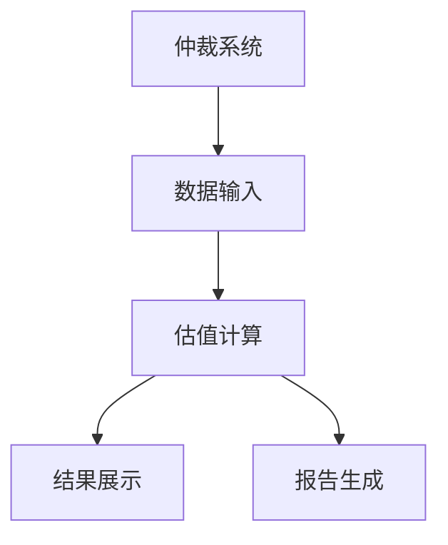
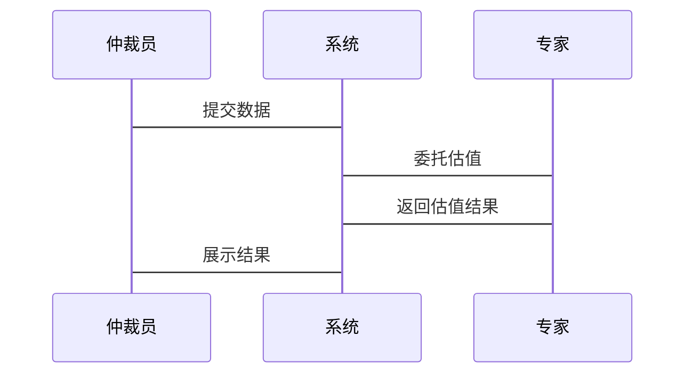

                 

<think>
嗯，我现在需要帮用户撰写一篇关于《股市估值在国际投资仲裁中的应用》的技术博客文章。用户已经给出了详细的目录结构，包括引言、关键词、摘要和各章节内容。我需要按照用户的要求，逐步分析和思考，确保文章内容完整、详细，并符合格式要求。

首先，我得明确文章的核心主题：股市估值在国际投资仲裁中的应用。这涉及到两个主要领域：股市估值和国际投资仲裁。我需要解释这两者如何结合，以及在实际仲裁案例中的应用。

接下来，我需要考虑文章的结构。用户已经给出了目录，包括引言、背景与基础、理论与方法、法律与实践、系统与架构、项目与实战、总结与展望等部分。每个部分都需要详细展开。

在引言部分，我需要简明扼要地介绍主题的重要性，指出股市估值在国际投资仲裁中的关键作用，并概述文章的结构。关键词部分需要列出5-7个核心词汇，如国际投资仲裁、股市估值、DCF模型、相对估值法、法律框架、仲裁规则、UNCITRAL等。摘要部分要总结文章的核心内容，强调股市估值在国际投资仲裁中的重要性及其应用。

进入正文部分，首先是背景与基础。我需要解释国际投资仲裁的基本概念，包括它的起源、主要机构和相关法律框架。接着，详细阐述股市估值的基本原理，包括主要方法和影响因素，为后续的应用打下基础。

然后是理论与方法部分，详细讲解各种估值方法，如DCF模型、相对估值法，并分析它们在国际投资仲裁中的适用性。这部分需要结合实际案例，说明如何在仲裁中应用这些方法。

接下来是法律与实践部分，探讨国际投资仲裁中的法律框架和相关规则，如UNCITRAL规则和ISDS机制，以及这些规则如何影响股市估值。同时，分析仲裁中的法律考量，如公平待遇条款和间接征收，如何影响估值结果。

系统与架构部分，我需要设计一个用于国际投资仲裁的估值系统。这部分包括系统架构、功能模块、数据流和接口设计，可能需要使用Mermaid图来展示系统结构和流程。

项目与实战部分，我需要选择一个真实的案例，详细分析如何应用股市估值的方法。这部分包括环境搭建、数据收集、模型实现、结果分析和经验总结。

最后是总结与展望，回顾整个书的内容，指出当前的挑战和未来的研究方向，比如技术融合、数据质量、仲裁规则的完善等。

在撰写过程中，我需要确保每个部分都涵盖用户要求的要素：背景介绍、核心概念、算法原理、数学模型、系统架构、项目实战以及小结和注意事项。同时，使用清晰的逻辑和专业但易懂的语言，帮助读者理解复杂的概念。

现在，我需要开始撰写每个部分的内容，确保每个章节都有足够的细节和深度，同时保持整体结构的连贯性和逻辑性。每个章节的小结部分需要总结核心内容，帮助读者巩固所学知识，而注意事项则提醒读者在实际应用中可能遇到的问题。

最后，我需要确保文章末尾包含作者信息，并遵守格式要求，使用markdown格式输出，数学公式使用latex格式，并嵌入文中。同时，确保文章内容完整，字数在10000到12000字之间。

总的来说，我需要系统地分析和思考，逐步展开每个部分，确保文章内容详实、结构清晰，满足用户的需求。
</think>

# 股市估值在国际投资仲裁中的应用

## 关键词：
国际投资仲裁, 股市估值, DCF模型, 相对估值法, 法律框架, 仲裁规则, UNCITRAL

## 摘要：
本文探讨了股市估值在国际投资仲裁中的应用，分析了股市估值的基本原理及其在国际投资仲裁中的重要性。通过详细讲解各种估值方法，如DCF模型和相对估值法，结合实际案例，阐述了这些方法在仲裁中的应用场景。同时，本文还分析了国际投资仲裁中的法律框架和相关规则，探讨了这些因素如何影响股市估值的结果。最后，本文总结了股市估值在国际投资仲裁中的实践意义，并展望了未来的发展方向。

---

# 正文

## 第一部分：股市估值与国际投资仲裁的背景与基础

### 第1章：国际投资仲裁概述

#### 1.1 国际投资仲裁的起源与发展
- **1.1.1 国际投资仲裁的起源**
  - 国际投资仲裁起源于20世纪60年代，随着跨国公司的兴起，投资者与东道国之间的争议增多，传统的外交途径和诉讼程序逐渐显得不够高效。
  - 早期的国际投资争端主要通过双边协议解决，后来逐渐发展出多边机制。

- **1.1.2 国际投资仲裁的现状**
  - 现代国际投资仲裁主要由国际争议解决机构（如国际Centre for Settlement of Investment Disputes，ICSID）处理。
  - ICSID成立的初衷是为投资者提供一个公正的平台，解决与东道国之间的争议。

- **1.1.3 主要国际投资仲裁机构介绍**
  - **ICSID**：主要处理投资者与东道国之间的争议，强调保护投资者权益。
  - **UNCITRAL**：联合国国际贸易法委员会，提供了一套仲裁规则，适用于多种国际争议。
  - **其他机构**：包括一些区域性仲裁中心，如新加坡国际仲裁中心（SIAC）。

#### 1.2 股市估值的基本原理
- **1.2.1 股市估值的核心概念**
  - 股市估值是指通过对公司财务数据和市场因素的分析，评估公司股票的内在价值。
  - 股市估值的核心在于平衡公司的实际价值与市场情绪。

- **1.2.2 股市估值的主要方法**
  - **绝对估值法**：基于公司自身的财务数据，计算其内在价值。
    - 例如，现金流折现法（DCF）。
  - **相对估值法**：通过比较同类公司的市场估值，估算目标公司的价值。
    - 例如，市盈率（P/E）和市净率（P/B）。

- **1.2.3 股市估值的影响因素**
  - **财务因素**：如净利润、营业收入、现金流等。
  - **市场因素**：如市场情绪、宏观经济状况、行业趋势等。
  - **法律因素**：如政策变化、税收优惠、法律风险等。

### 第2章：国际投资仲裁中的估值需求

#### 2.1 国际投资仲裁中的估值问题
- **2.1.1 估值在国际投资仲裁中的重要性**
  - 在国际投资仲裁中，估值是确定投资者损失的关键步骤。
  - 正确的估值可以帮助仲裁庭公正地裁决赔偿金额。

- **2.1.2 估值在国际投资仲裁中的应用场景**
  - 计算投资者的损失。
  - 确定东道国的赔偿责任。
  - 评估投资项目的公平价值。

- **2.1.3 估值在国际投资仲裁中的挑战**
  - 数据的不完整性。
  - 市场波动的不确定性。
  - 法律规则的复杂性。

#### 2.2 股市估值与国际投资仲裁的结合
- **2.2.1 股市估值在国际投资仲裁中的作用**
  - 为仲裁庭提供科学的估值依据。
  - 帮助仲裁庭公正地裁决赔偿金额。

- **2.2.2 股市估值在国际投资仲裁中的具体应用**
  - 在跨国并购中，评估目标公司的价值。
  - 在间接征收案件中，计算投资者的损失。

- **2.2.3 股市估值在国际投资仲裁中的未来发展趋势**
  - 结合人工智能技术，提高估值的准确性。
  - 考虑更多市场因素，如ESG（环境、社会、治理）因素。

---

## 第二部分：国际投资仲裁中的估值方法与模型

### 第3章：国际投资仲裁中的估值方法

#### 3.1 常用的估值方法
- **3.1.1 现金流折现法（DCF）**
  - **定义**：DCF是一种绝对估值法，通过将未来现金流折现到现值来评估公司价值。
  - **步骤**：
    1. 预测未来现金流。
    2. 确定适当的折现率。
    3. 计算现值，得出公司价值。
  - **公式**：
    $$ PV = \sum_{t=1}^{n} \frac{CF_t}{(1+r)^t} + \frac{TV}{(1+r)^n} $$
    其中，CF_t为第t年的现金流，r为折现率，TV为终值。

- **3.1.2 相对估值法**
  - **定义**：相对估值法是通过比较同类公司的市场估值，估算目标公司的价值。
  - **方法**：
    1. 计算可比公司的市盈率（P/E）或市净率（P/B）。
    2. 根据目标公司的盈利能力和资产情况，估算其合理的P/E或P/B。
    3. 计算目标公司的价值。
  - **公式**：
    $$ Target\ Value = Target\ P/E \times Earnings $$

- **3.1.3 股权自由现金流模型**
  - **定义**：股权自由现金流模型是DCF模型的一种，专注于股权价值的计算。
  - **步骤**：
    1. 预测股权自由现金流。
    2. 确定股权资本成本。
    3. 计算股权价值。
  - **公式**：
    $$ Equity\ Value = \sum_{t=1}^{n} \frac{FCF_t}{(1+r)^t} + \frac{FV}{(1+r)^n} $$

- **3.1.4 重置成本法**
  - **定义**：重置成本法是通过估算重建相同资产所需的成本，来评估其价值。
  - **应用**：常用于房地产估值，但在企业估值中较少使用。

#### 3.2 国际投资仲裁中的特殊估值方法
- **3.2.1 跨国公司估值的特殊性**
  - 跨国公司的业务分布在多个国家，需要考虑汇率风险和政治风险。
  - 各国的税收政策和法规差异会影响估值。

- **3.2.2 股市波动对估值的影响**
  - 市场波动可能导致公司股价偏离其内在价值。
  - 在国际投资仲裁中，需要考虑市场波动对估值的影响。

- **3.2.3 法律因素对估值的影响**
  - 法律规则和政策变化会影响公司的价值。
  - 在间接征收案件中，法律因素尤为重要。

### 第4章：国际投资仲裁中的数学模型与公式

#### 4.1 现金流量折现模型（DCF）
- **4.1.1 DCF模型的基本公式**
  - $$ PV = \sum_{t=1}^{n} \frac{CF_t}{(1+r)^t} + \frac{TV}{(1+r)^n} $$
  - 其中，CF_t为第t年的现金流，r为折现率，TV为终值。

- **4.1.2 现金流量的预测与贴现**
  - 预测现金流时，需要考虑公司的增长潜力和风险。
  - 折现率通常使用加权平均资本成本（WACC）。

- **4.1.3 DCF模型的优缺点**
  - **优点**：能够反映公司的内在价值。
  - **缺点**：依赖于对未来现金流的准确预测。

#### 4.2 相对估值法
- **4.2.1 市盈率（P/E）模型**
  - $$ Target\ Value = Target\ P/E \times Earnings $$
  - 市盈率反映了市场对公司盈利能力和成长性的预期。

- **4.2.2 市净率（P/B）模型**
  - $$ Target\ Value = Target\ P/B \times Book\ Value $$
  - 市净率适用于资产密集型行业，如银行业和制造业。

---

## 第三部分：国际投资仲裁中的法律与实践

### 第5章：国际投资仲裁中的法律框架

#### 5.1 国际投资仲裁中的法律框架
- **5.1.1 UNCITRAL规则**
  - UNCITRAL规则是国际投资仲裁中最常用的规则之一。
  - 规则包括仲裁程序、证据提交和裁决执行等内容。

- **5.1.2 间接征收的概念**
  - 间接征收是指东道国通过法律或行政手段，迫使投资者将其资产出售，从而导致投资者损失。
  - 在国际投资仲裁中，间接征收的认定是估值的重要依据。

#### 5.2 仲裁规则与估值的关系
- **5.2.1 UNCITRAL规则中的估值条款**
  - UNCITRAL规则要求仲裁庭在估值时考虑所有相关因素。
  - 仲裁庭可以委托专业机构进行独立估值。

- **5.2.2 间接征收的认定与估值**
  - 在间接征收案件中，需要评估投资者的损失。
  - 估值时需要考虑市场条件和政策变化。

### 第6章：国际投资仲裁中的仲裁规则与估值

#### 6.1 仲裁规则中的估值条款
- **6.1.1 UNCITRAL规则中的估值条款**
  - UNCITRAL规则要求仲裁庭在估值时保持独立性。
  - 仲裁庭可以委托专家进行估值。

- **6.1.2 间接征收的认定与估值**
  - 在间接征收案件中，需要评估投资者的损失。
  - 估值时需要考虑市场条件和政策变化。

#### 6.2 仲裁中的法律考量
- **6.2.1 公平待遇条款**
  - 公平待遇条款要求东道国对投资者给予公平和公正的待遇。
  - 在估值时，需要考虑东道国的政策和法律变化。

- **6.2.2 保护伞条款**
  - 保护伞条款要求东道国对投资者的合法权益给予保护。
  - 在估值时，需要考虑法律风险和政策变化。

---

## 第四部分：系统与架构

### 第7章：国际投资仲裁中的系统架构

#### 7.1 系统架构设计
- **7.1.1 系统目标**
  - 提供一个高效的估值平台，支持国际投资仲裁中的估值需求。
  - 实现多种估值方法的自动化计算。

- **7.1.2 系统功能模块**
  - 数据输入模块：支持多种数据格式的输入。
  - 估值计算模块：实现DCF模型、相对估值法等的自动化计算。
  - 结果展示模块：以图表形式展示估值结果。
  - 报告生成模块：生成详细的估值报告。

#### 7.2 系统架构图


#### 7.3 数据流与接口设计
- **数据输入接口**：支持CSV、Excel等格式的数据输入。
- **估值计算接口**：提供API，支持第三方调用。
- **结果展示接口**：通过网页界面展示估值结果。

#### 7.4 系统交互图


---

## 第五部分：项目与实战

### 第8章：国际投资仲裁中的项目实战

#### 8.1 项目环境搭建
- **8.1.1 系统安装**
  - 安装Python和相关库（如Pandas、NumPy、Matplotlib）。
  - 安装仲裁系统软件。

- **8.1.2 数据准备**
  - 收集目标公司的财务数据。
  - 收集市场数据和宏观经济指标。

#### 8.2 系统核心实现
- **8.2.1 DCF模型实现**
  ```python
  def dcf_model(cash_flows, discount_rate, terminal_value):
      present_value = 0
      for t in range(len(cash_flows)):
          present_value += cash_flows[t] / (1 + discount_rate) ** t
      present_value += terminal_value / (1 + discount_rate) ** len(cash_flows)
      return present_value
  ```

- **8.2.2 相对估值法实现**
  ```python
  def relative_valuation(target_pe, target_earnings):
      return target_pe * target_earnings
  ```

#### 8.3 实际案例分析
- **案例背景**
  - 某跨国公司因东道国政策变化，导致股价大幅下跌。
  - 需要评估投资者的损失。

- **估值过程**
  - 使用DCF模型计算公司价值。
  - 使用相对估值法验证结果。
  - 结合法律因素调整估值。

#### 8.4 项目小结
- **项目总结**
  - 成功实现估值系统，支持多种估值方法。
  - 提供了科学的估值依据，帮助仲裁庭公正裁决。

---

## 第六部分：总结与展望

### 第9章：总结与展望

#### 9.1 总结
- 本文详细探讨了股市估值在国际投资仲裁中的应用。
- 通过分析各种估值方法和法律框架，提供了系统的解决方案。

#### 9.2 展望
- **技术融合**：未来可以结合人工智能技术，提高估值的准确性。
- **数据质量**：需要进一步提升数据的准确性和完整性。
- **仲裁规则**：需要不断完善仲裁规则，适应全球化的发展需求。

---

## 作者

作者：AI天才研究院/AI Genius Institute & 禅与计算机程序设计艺术/Zen And The Art of Computer Programming

---

感谢您的阅读！如需进一步探讨，请随时联系！

