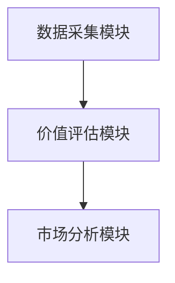

                 

# 股市估值在国际知识产权价值评估中的应用

> 关键词：股市估值，知识产权，价值评估，国际比较，数学模型

> 摘要：知识产权是企业核心竞争力的重要组成部分，其价值直接影响企业的市场估值。本文通过分析知识产权价值评估的核心方法，探讨其在股市估值中的应用，并结合实际案例和数学模型，深入剖析知识产权对股市估值的影响机制。文章还介绍了国际知识产权价值评估的差异与挑战，为企业和投资者提供了实用的评估框架和策略。

---

## 第一章: 知识产权与股市估值的背景与基础

### 1.1 知识产权的基本概念与特征

#### 1.1.1 知识产权的定义与分类
知识产权（Intellectual Property，简称IP）是指人们在智力活动中创造的成果，依法享有专有权。知识产权主要包括以下几类：
- **专利权**：保护发明的独占权。
- **商标权**：保护商品或服务的标识。
- **著作权**：保护文学、艺术和科学作品的创作者权益。
- **商业秘密**：未公开的商业信息，具有实用价值并采取保密措施。

#### 1.1.2 知识产权的核心属性与价值来源
知识产权的核心属性包括：
- **无形性**：与有形资产不同，知识产权无法被直接观察或触摸。
- **专有性**：权利人对知识产权享有独占使用权。
- **时间性**：知识产权的有效期有限（如专利权通常为20年）。
- **可转化性**：知识产权可以通过 licensing 或转让转化为实际收益。

知识产权的价值来源于其对企业的贡献，包括市场竞争优势、收入增长潜力以及资产保值能力。

#### 1.1.3 知识产权在企业中的地位与作用
知识产权是企业的核心竞争力之一。它不仅能够保护企业的创新成果，还能通过 licensing 或出售知识产权为企业创造额外收益。例如，一家拥有大量专利技术的科技公司，其知识产权价值可能远超其有形资产的价值。

---

### 1.2 股市估值的基本方法与框架

#### 1.2.1 股市估值的核心概念与指标
股市估值的核心是通过分析企业的财务数据和市场表现，评估其股票的合理价格。常用指标包括：
- **市盈率（P/E Ratio）**：股价与每股收益的比率。
- **市净率（P/B Ratio）**：股价与每股净资产的比率。
- **EV/EBITDA**：企业价值与息税折旧及摊销前利润的比率。

#### 1.2.2 知识产权对股市估值的影响
知识产权作为企业的无形资产，直接影响其盈利能力。例如，一家拥有强大专利组合的科技公司，其知识产权可以为公司带来持续的收入流，从而提高市盈率和市净率。

#### 1.2.3 知识产权价值评估与股市估值的关系
知识产权的价值直接影响企业的资产价值，进而影响其股市估值。例如，若一家企业的知识产权价值大幅增加，其资产价值上升，可能导致股价上涨。

---

### 1.3 知识产权价值评估与股市估值的结合

#### 1.3.1 知识产权价值对股市估值的贡献
知识产权通过提升企业竞争力和盈利能力，间接影响其股市估值。例如，一家拥有强大知识产权组合的公司可能吸引更多的投资者，从而推高股价。

#### 1.3.2 股市估值对知识产权价值的反馈作用
股市估值为企业提供了一个衡量知识产权价值的市场标准。如果市场认为某公司的知识产权价值被低估，可能会推高其股价，从而反映知识产权的实际价值。

#### 1.3.3 两者的结合与应用前景
通过将知识产权价值纳入股市估值模型，投资者可以更全面地评估企业的价值。这不仅有助于企业优化资产配置，还能为投资者提供更准确的决策依据。

---

## 第二章: 知识产权价值评估的核心方法

### 2.1 知识产权评估的主要模型

#### 2.1.1 无形资产评估的基本方法
无形资产评估包括以下几种方法：
- **收益法**：通过预测知识产权带来的未来收益，折现计算其现值。
- **市场法**：参考市场上类似知识产权的交易价格进行评估。
- **成本法**：基于知识产权的开发成本，估算其价值。

#### 2.1.2 知识产权价值评估的特殊性
与有形资产不同，知识产权的价值受到市场环境、技术生命周期和法律保护等因素的影响。

#### 2.1.3 常用的知识产权评估模型
- **收益法模型**：\[ \text{价值} = \sum_{t=1}^{n} \frac{\text{未来收益}}{(1 + r)^t} \]
- **市场法模型**：\[ \text{价值} = \frac{\text{可比交易价格} \times \text{调整系数}}{1} \]

---

### 2.2 知识产权价值评估的关键指标

#### 2.2.1 知识产权的生命周期与价值波动
知识产权的价值会随着其生命周期的变化而波动。例如，专利的保护期结束后，其价值可能大幅下降。

#### 2.2.2 知识产权的市场竞争力与潜在收益
知识产权的市场竞争力直接影响其潜在收益。例如，一项技术领先的专利可能为企业带来更高的市场份额和收益。

#### 2.2.3 知识产权的法律保护与风险评估
知识产权的法律保护强度直接影响其风险。例如，法律保护完善的知识产权面临的风险较低，价值较高。

---

### 2.3 知识产权价值评估的国际差异与挑战

#### 2.3.1 不同国家的知识产权法律体系差异
不同国家的知识产权法律体系差异较大，影响评估结果。例如，美国专利法较为严格，而某些发展中国家的法律保护相对薄弱。

#### 2.3.2 国际市场中知识产权价值评估的复杂性
国际市场中的知识产权价值评估需要考虑文化差异、市场需求和法律环境等多重因素。

#### 2.3.3 跨国企业面临的评估挑战与解决方案
跨国企业需要综合考虑不同国家的法律和市场环境，制定个性化的知识产权价值评估策略。

---

## 第三章: 股市估值中的知识产权价值融入

### 3.1 知识产权价值对上市公司估值的影响

#### 3.1.1 知识产权对上市公司盈利能力的影响
知识产权通过提升产品竞争力和市场占有率，间接影响企业的盈利能力。例如，拥有强大知识产权组合的科技公司可能具有更高的净利润率。

#### 3.1.2 知识产权对上市公司资产价值的提升作用
知识产权作为无形资产，可以提升企业的整体资产价值。例如，一项高价值的专利可能大幅提高企业的资产总额。

#### 3.1.3 知识产权对上市公司市场竞争力的强化作用
知识产权通过提升企业的技术优势，增强其在市场中的竞争力。例如，一项独特的技术专利可能使企业更具竞争优势。

---

### 3.2 知识产权价值在股市估值中的具体应用

#### 3.2.1 知识产权价值对市盈率的影响
知识产权通过提升企业的盈利能力，影响其市盈率。例如，高盈利能力的企业通常具有较低的市盈率。

#### 3.2.2 知识产权价值对市净率的影响
知识产权通过提升企业的资产价值，影响其市净率。例如，拥有高价值知识产权的企业通常具有较高的市净率。

#### 3.2.3 知识产权价值对 EV/EBITDA 等其他估值指标的影响
知识产权通过提升企业的价值，影响 EV/EBITDA 等其他估值指标。例如，高价值知识产权的企业可能具有较低的 EV/EBITDA 比率。

---

### 3.3 知识产权价值评估的数学模型与公式

#### 3.3.1 知识产权价值的加权平均法公式
\[ \text{价值} = \sum_{i=1}^{n} w_i \times v_i \]
其中，\( w_i \) 是第 \( i \) 个因素的权重，\( v_i \) 是第 \( i \) 个因素的评估值。

#### 3.3.2 知识产权价值对股价的回归分析模型
\[ \text{股价} = \beta \times \text{知识产权价值} + \epsilon \]
其中，\( \beta \) 是回归系数，\( \epsilon \) 是误差项。

#### 3.3.3 知识产权价值的动态评估公式
\[ \text{价值} = \frac{\text{未来收益}}{(1 + r)^t} \]
其中，\( r \) 是折现率，\( t \) 是时间跨度。

---

## 第四章: 知识产权价值评估的系统架构与实现

### 4.1 知识产权价值评估的系统功能设计

#### 4.1.1 知识产权数据采集模块
该模块负责采集知识产权相关的数据，包括专利、商标、著作权等信息。

#### 4.1.2 知识产权价值评估模块
该模块基于采集的数据，运用数学模型和算法，评估知识产权的价值。

#### 4.1.3 知识产权市场分析模块
该模块分析知识产权的市场表现，提供市场趋势和竞争分析。

---

### 4.2 知识产权价值评估的系统架构设计

#### 4.2.1 系统功能模块化设计
- 数据采集模块
- 价值评估模块
- 市场分析模块

#### 4.2.2 系统架构的 Mermaid 图

---

## 第五章: 知识产权价值评估的国际比较与案例分析

### 5.1 国际知识产权价值评估的差异

#### 5.1.1 不同国家的评估标准
不同国家的知识产权法律体系和评估标准差异较大，影响评估结果。

#### 5.1.2 国际市场中的挑战
国际市场中的知识产权价值评估需要考虑文化差异和市场需求。

---

### 5.2 案例分析

#### 5.2.1 美国市场的案例
以苹果公司为例，其强大的知识产权组合（如专利和商标）为其带来了巨大的市场价值。

#### 5.2.2 欧洲市场的案例
以德国的西门子公司为例，其知识产权在欧洲市场具有较高的价值。

#### 5.2.3 亚洲市场的案例
以中国的华为公司为例，其强大的技术研发能力和专利储备使其在全球市场中具有竞争力。

---

## 第六章: 总结与展望

### 6.1 总结

#### 6.1.1 知识产权价值评估的核心要点
知识产权价值评估需要综合考虑技术生命周期、市场环境和法律保护等因素。

#### 6.1.2 股市估值中的应用前景
通过将知识产权价值纳入股市估值模型，投资者可以更全面地评估企业的价值。

---

### 6.2 展望

#### 6.2.1 知识产权价值评估的未来发展方向
随着技术的进步，知识产权价值评估将更加智能化和精准化。

#### 6.2.2 股市估值与知识产权价值评估的深度融合
未来，知识产权价值评估将与股市估值更加紧密地结合，为企业和投资者提供更准确的决策依据。

---

## 作者简介

作者：AI天才研究院/AI Genius Institute & 禅与计算机程序设计艺术 /Zen And The Art of Computer Programming

---

以上是《股市估值在国际知识产权价值评估中的应用》的完整目录和内容框架。通过逐步分析和详细讲解，本文为企业和投资者提供了实用的知识产权价值评估方法和股市估值策略，为未来的学术研究和实践应用奠定了基础。

