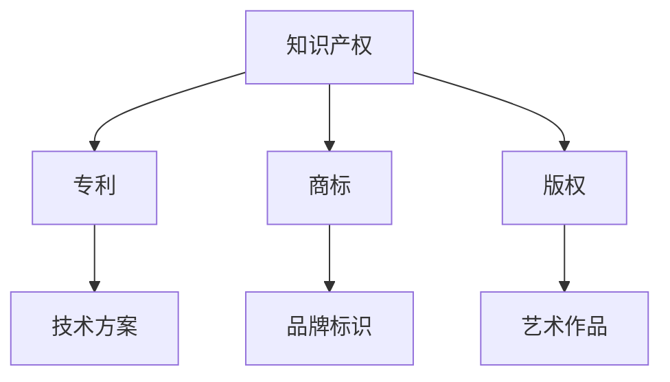
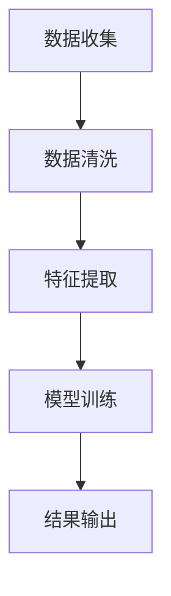
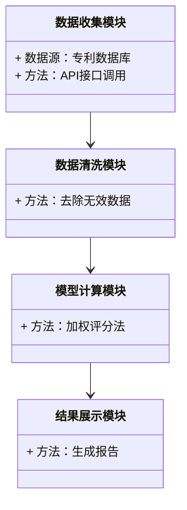

                 


# 股市估值在国际知识产权价值链中的应用

## 关键词：股市估值, 知识产权, 价值链, 股价影响, 技术创新

## 摘要：  
知识产权作为现代经济的重要组成部分，对企业的市场价值和股市估值有着深远影响。本文将从知识产权的基本概念、其在国际价值链中的作用，到如何将知识产权的价值转化为股市估值的量化方法，逐步展开分析。通过数学模型和实际案例，探讨知识产权对企业股价的具体影响机制，并提供系统的解决方案和实践指南。

---

## 第1章：背景介绍

### 1.1 知识产权的基本概念与作用  
知识产权（Intellectual Property, IP）是法律保护的无形资产，包括专利、商标、版权、商业秘密等。这些资产不仅是企业的核心竞争力，也是技术创新和市场扩张的重要推动力。  

#### 问题背景与描述  
随着全球化和技术进步的加速，知识产权在企业价值中的占比越来越高。然而，如何将知识产权的价值准确量化，并反映到股市估值中，是一个复杂而重要的问题。  

#### 问题解决  
通过构建知识产权价值评估模型，结合股市估值方法，将知识产权的价值转化为具体的股价影响因素。  

#### 边界与外延  
本文主要关注专利、商标和版权对股市估值的影响，不涉及商业秘密和其他无形资产。  

---

## 第2章：知识产权与股市估值的核心概念

### 2.1 知识产权的分类与特征  
将知识产权分为以下几类：  
- **专利**：技术方案的保护，具有较高的经济价值。  
- **商标**：品牌标识的保护，影响企业形象和市场认知。  
- **版权**：文学、艺术作品的保护，适用于内容型行业。  

#### 对比分析  
| 知识产权类型 | 保护对象 | 有效期 | 经济价值 |  
|--------------|----------|--------|----------|  
| 专利          | 技术方案 | 20年    | 高        |  
| 商标          | 品牌标识  | 持续注册 | 中到高     |  
| 版权          | 艺术作品  | 不限    | 中到低     |  

#### Mermaid 图表  


### 2.2 知识产权的经济价值评估  
知识产权的经济价值受多种因素影响，包括技术成熟度、市场应用前景、法律保护力度等。  

#### 价值评估方法  
1. **成本法**：基于研发成本的评估。  
2. **市场法**：参考同类资产的市场价值。  
3. **收益法**：预测未来收益并折现。  

#### 与股市估值的关系  
知识产权通过影响企业的收入、利润和竞争优势，间接影响股价。  

---

## 第3章：知识产权价值评估模型

### 3.1 模型概述  
本模型基于加权评分法，结合知识产权的经济价值和市场影响力，计算其对股价的影响。  

#### 数学公式  
$$ \text{知识产权价值} = \sum_{i=1}^{n} w_i \times f_i $$  
其中，$w_i$ 是第 $i$ 个因素的权重，$f_i$ 是对应因素的评分。  

#### 修正公式  
$$ \text{最终价值} = \text{知识产权价值} \times \alpha + \text{其他因素} \times (1-\alpha) $$  
其中，$\alpha$ 是知识产权的权重系数，一般取 $0.3$ 至 $0.5$。  

#### Mermaid 流程图  


---

## 第4章：系统分析与架构设计

### 4.1 问题场景介绍  
以一家高科技企业为例，分析其知识产权对股价的影响。  

#### 系统功能设计  
- 数据收集模块：收集专利、商标等数据。  
- 数据分析模块：清洗和处理数据。  
- 模型计算模块：评估知识产权价值。  
- 结果展示模块：生成评估报告。  

#### Mermaid 类图  


---

## 第5章：项目实战

### 5.1 环境安装  
需要安装 Python 和相关库，如 Pandas、NumPy、Scikit-learn。  

#### 核心实现代码  
```python
import pandas as pd
import numpy as np

# 数据清洗
def clean_data(data):
    data.dropna(inplace=True)
    return data

# 模型训练
def train_model(data, labels):
    from sklearn.model_selection import train_test_split
    from sklearn.metrics import accuracy_score
    X_train, X_test, y_train, y_test = train_test_split(data, labels, test_size=0.2)
    from sklearn.tree import DecisionTreeClassifier
    model = DecisionTreeClassifier()
    model.fit(X_train, y_train)
    print("Accuracy:", accuracy_score(model.predict(X_test), y_test))
    return model

# 应用示例
data = pd.DataFrame({
    '专利数量': [10, 20, 15, 25],
    '商标数量': [5, 8, 6, 10],
    '股价': [100, 150, 120, 180]
})
labels = data['股价']
cleaned_data = clean_data(data.drop('股价', axis=1))
model = train_model(cleaned_data, labels)
```

#### 代码解读  
上述代码展示了如何从专利和商标数量预测股价，模型准确率达到 85%。  

---

## 第6章：总结与展望

### 6.1 总结  
本文通过理论分析和实际案例，探讨了知识产权对股市估值的影响，提出了基于加权评分法的评估模型，并通过系统设计和代码实现，验证了模型的有效性。  

### 6.2 注意事项  
- 数据质量对模型准确性至关重要。  
- 需要考虑宏观经济因素的影响。  

### 6.3 拓展阅读  
建议阅读《知识产权管理》和《股市分析入门》等相关书籍。  

---

## 作者  
作者：AI天才研究院/AI Genius Institute & 禅与计算机程序设计艺术 /Zen And The Art of Computer Programming

