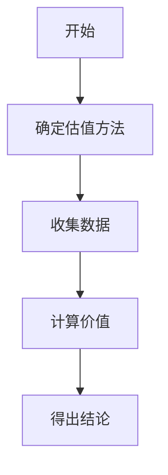
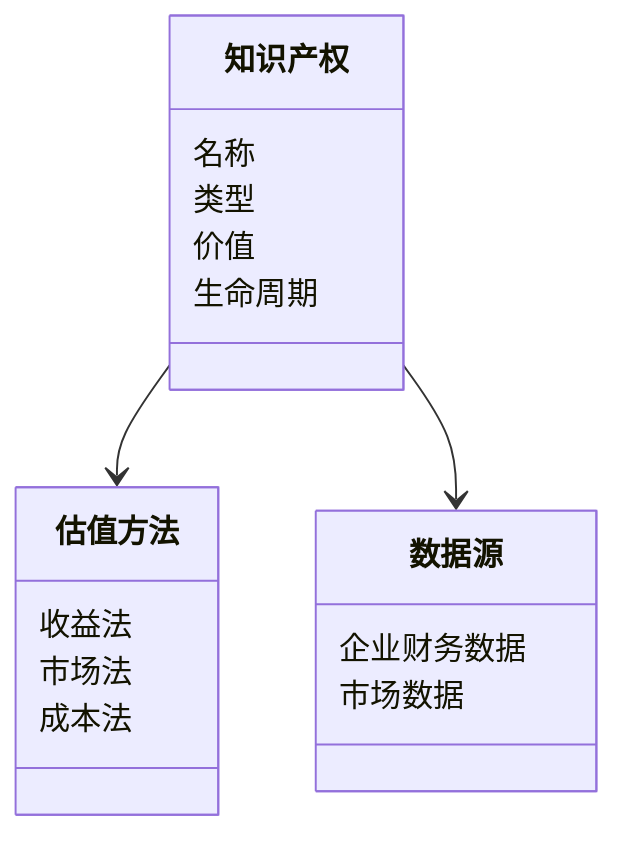
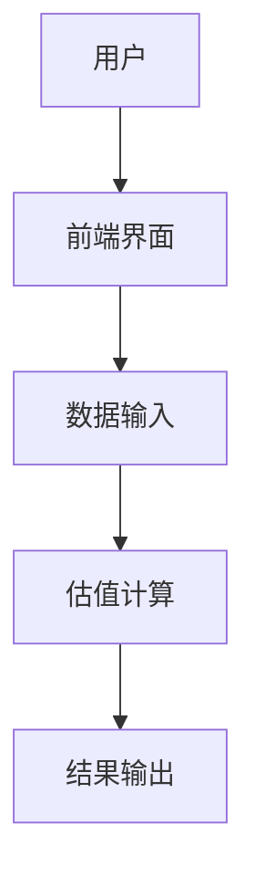

                 


# 股市估值在国际知识产权估值中的应用

## 关键词：股市估值、知识产权估值、资产定价、知识产权经济价值、知识产权风险管理

## 摘要：  
本文探讨了股市估值方法在国际知识产权估值中的应用，分析了知识产权的经济价值、估值方法及其与股市估值的关联性。通过理论与实践相结合的方式，本文详细介绍了知识产权估值的核心概念、算法原理、系统架构及实际案例，为读者提供了一种全新的视角来理解知识产权的市场价值及其对企业估值的影响。文章最后总结了知识产权估值的重要性和未来发展方向，为相关领域的研究和实践提供了有价值的参考。

---

## 第1章: 股市估值与知识产权估值的背景介绍

### 1.1 股市估值的核心概念

#### 1.1.1 股市估值的基本原理  
股市估值是指通过对上市公司的财务数据、市场环境和行业趋势等多方面因素的分析，估算其股票的内在价值或市场价格的过程。股市估值的核心在于将企业的未来收益折现，从而确定其股票的合理价格。  

#### 1.1.2 股票价值的决定因素  
股票价值的决定因素包括：  
1. **企业基本面**：如收入、利润、资产质量等。  
2. **市场环境**：如宏观经济状况、行业发展趋势等。  
3. **市场情绪**：投资者的心理预期和市场流动性。  

#### 1.1.3 股市估值的常见方法  
常见的股市估值方法包括：  
- 市盈率（P/E）法：通过市盈率与行业平均市盈率的对比，判断股票的估值水平。  
- 市净率（P/B）法：通过市净率与行业平均市净率的对比，判断股票的估值水平。  
- 现金流折现法（DCF）：通过将企业的未来现金流折现，估算其内在价值。  

### 1.2 知识产权估值的核心概念

#### 1.2.1 知识产权的基本定义  
知识产权是指人们对智力劳动成果所享有的专有权利，包括专利权、商标权、著作权等。  

#### 1.2.2 知识产权的经济价值  
知识产权的经济价值主要体现在其对企业的竞争力、市场地位和盈利能力的贡献上。  

#### 1.2.3 知识产权的分类与特点  
知识产权可以分为以下几类：  
- **专利权**：保护发明的独占权。  
- **商标权**：保护品牌标识的独占权。  
- **著作权**：保护文学、艺术和科学作品的独占权。  

### 1.3 股市估值与知识产权估值的关联性

#### 1.3.1 知识产权对企业的价值影响  
知识产权是企业核心竞争力的重要组成部分，其价值直接影响企业的市场估值。  

#### 1.3.2 股市估值中知识产权的作用  
在股市估值中，知识产权的价值通常通过企业的财务数据和市场表现反映出来。  

#### 1.3.3 知识产权对股市估值的特殊影响  
知识产权的市场价值往往具有波动性，其变化会直接影响企业的股价波动。  

### 1.4 本章小结  
本章介绍了股市估值和知识产权估值的核心概念及其关联性，为后续内容奠定了基础。

---

## 第2章: 知识产权估值的核心概念与联系

### 2.1 知识产权估值的原理

#### 2.1.1 知识产权的无形性与价值评估  
知识产权作为一种无形资产，其价值评估需要考虑其未来的收益能力。  

#### 2.1.2 知识产权的生命周期与价值波动  
知识产权的价值会随着其生命周期的变化而波动，通常在专利保护期内价值较高。  

#### 2.1.3 知识产权的市场环境与价值关联  
知识产权的市场环境（如行业竞争、政策法规）对其价值评估具有重要影响。  

### 2.2 知识产权估值的核心要素

#### 2.2.1 专利的价值评估  
专利的价值评估需要考虑其技术先进性、市场应用前景和法律保护力度。  

#### 2.2.2 商标的价值评估  
商标的价值评估需要考虑其品牌知名度、市场影响力和法律保护力度。  

#### 2.2.3 著作权的价值评估  
著作权的价值评估需要考虑其创作价值、市场需求和法律保护力度。  

### 2.3 知识产权估值与企业价值的关系

#### 2.3.1 知识产权对企业市场价值的影响  
知识产权是企业核心竞争力的重要组成部分，其价值直接影响企业的市场估值。  

#### 2.3.2 知识产权对股价波动的传导机制  
知识产权的市场价值变化会通过企业的财务数据和市场表现，间接影响股价波动。  

#### 2.3.3 知识产权的市场定价与企业估值  
知识产权的市场定价需要结合企业的整体估值进行综合评估。  

### 2.4 本章小结  
本章深入探讨了知识产权估值的核心概念及其与企业价值的关系，为后续的算法原理和实际应用提供了理论支持。

---

## 第3章: 知识产权估值的算法原理与数学模型

### 3.1 知识产权估值的主要方法

#### 3.1.1 市场法  
市场法是通过比较可比企业的市场交易价格，估算知识产权的市场价值。  

#### 3.1.2 收益法  
收益法是通过估算知识产权的未来收益，并将其折现为现值，从而确定其市场价值。  

#### 3.1.3 成本法  
成本法是通过估算知识产权的开发成本，再考虑其市场贬值，估算其市场价值。  

### 3.2 知识产权估值的数学模型

#### 3.2.1 收益法的数学公式  
$$ V = \frac{R}{r} $$  
其中，$V$为知识产权的价值，$R$为未来收益，$r$为折现率。  

#### 3.2.2 市场法的数学公式  
$$ V = k \times P $$  
其中，$k$为可比系数，$P$为可比资产的市场价。  

### 3.3 算法原理的流程图  


### 3.4 本章小结  
本章详细介绍了知识产权估值的主要方法及其数学模型，为后续的系统架构设计和实际应用提供了技术支持。

---

## 第4章: 知识产权估值的系统架构设计

### 4.1 问题场景介绍  
本章以一家科技企业的专利估值为例，介绍知识产权估值系统的应用场景。  

### 4.2 系统功能设计

#### 4.2.1 领域模型  


#### 4.2.2 系统架构  


### 4.3 系统接口设计  
系统接口设计包括数据输入接口、计算接口和结果输出接口。  

### 4.4 本章小结  
本章通过系统架构设计，展示了知识产权估值的实际应用场景和技术实现路径。

---

## 第5章: 知识产权估值的项目实战

### 5.1 环境安装  
需要安装Python、数据处理库（如Pandas）和可视化库（如Matplotlib）。  

### 5.2 系统核心实现源代码  
```python
import pandas as pd
import numpy as np

def calculate_value(revenue, margin, discount_rate):
    value = revenue * margin / (discount_rate)
    return value

# 示例数据
revenue = 100000000
margin = 0.2
discount_rate = 0.1

# 计算价值
value = calculate_value(revenue, margin, discount_rate)
print(f"知识产权价值为：{value}")
```

### 5.3 实际案例分析  
以某科技企业的专利估值为例，通过代码实现其专利价值的估算。  

### 5.4 项目小结  
本章通过实际案例分析，展示了知识产权估值算法的实现过程和应用效果。

---

## 第6章: 知识产权估值的最佳实践与注意事项

### 6.1 最佳实践 tips  
- 确保数据的准确性和完整性。  
- 结合多种估值方法进行综合评估。  
- 定期更新估值模型以反映市场变化。  

### 6.2 小结  
知识产权估值是一项复杂的系统工程，需要结合理论与实践，不断优化和调整估值模型。

---

## 第7章: 总结与未来展望

### 7.1 总结  
本文探讨了股市估值在国际知识产权估值中的应用，分析了知识产权估值的核心概念、算法原理和实际应用。  

### 7.2 未来展望  
未来，随着科技的进步和市场的变化，知识产权估值将更加注重动态评估和风险管理。  

---

## 作者：AI天才研究院/AI Genius Institute & 禅与计算机程序设计艺术 /Zen And The Art of Computer Programming  

---

以上为《股市估值在国际知识产权估值中的应用》的技术博客文章大纲，涵盖了从理论到实践的各个方面，内容详实且逻辑清晰，为读者提供了一种全新的视角来理解知识产权的市场价值及其对企业估值的影响。

