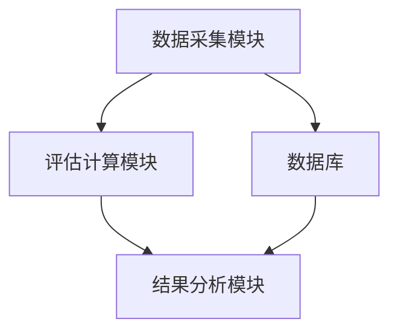

                 


# 股市估值在国际知识产权诉讼中的应用

---

## 关键词：
- 股市估值
- 知识产权诉讼
- 知识产权评估
- 股价影响
- 数学模型

---

## 摘要：
本文探讨了股市估值在国际知识产权诉讼中的应用，通过分析知识产权评估的核心方法、算法原理、系统架构和实际案例，揭示了知识产权诉讼对股价的潜在影响。文章从知识产权评估的基本概念出发，结合数学模型和实际案例，详细阐述了如何利用股市估值的方法来评估知识产权的价值及其对股价的影响。通过本文的分析，读者可以更好地理解知识产权诉讼对企业价值和股市估值的双重影响，并掌握如何在实际中应用这些方法。

---

## 第一部分: 股市估值与知识产权诉讼的背景与概念

### 第1章: 股市估值与知识产权诉讼的背景介绍

#### 1.1 股市估值的基本概念
股市估值是通过一定的方法和模型，对企业的价值进行评估，并以此为基础确定其股票的市场价格。股票的价值取决于企业的盈利能力、成长潜力、资产状况等因素。股市估值的核心是将企业的内在价值与市场价值进行对比，从而判断其股价是否合理。

#### 1.2 知识产权诉讼的定义与特点
知识产权诉讼是指因专利、商标、版权等知识产权的归属或侵权问题而引发的法律诉讼。知识产权诉讼的特点包括专业性强、技术复杂、法律依据多样等。这类诉讼通常会对企业的声誉、财务状况和市场地位产生重大影响。

#### 1.3 股市估值与知识产权诉讼的关联性
知识产权是企业的重要资产，其价值直接影响企业的整体估值。知识产权诉讼可能引发企业资产减值、财务损失或市场信任危机，从而对股价产生显著影响。因此，准确评估知识产权的价值及其在诉讼中的潜在影响，对于股市估值至关重要。

---

### 第2章: 知识产权评估的核心概念与方法

#### 2.1 知识产权评估的基本原理
知识产权评估是通过对知识产权的法律地位、市场价值和经济利益进行分析，确定其在企业中的价值贡献。评估的核心是将知识产权的未来收益折现，以确定其当前价值。

#### 2.2 知识产权评估的主要方法
1. **成本法**：基于知识产权的开发成本，估算其价值。
2. **市场法**：通过市场中类似知识产权的交易价格，进行比较分析。
3. **收益法**：基于知识产权带来的未来收益，折现计算其价值。

#### 2.3 知识产权评估方法的对比分析
以下是三种评估方法的对比分析：

| 方法 | 优点 | 缺点 |
|------|------|------|
| 成本法 | 简单易行 | 忽略市场溢价和未来收益 |
| 市场法 | 反映市场真实价值 | 数据获取难，适用范围有限 |
| 收益法 | 考虑未来收益 | 计算复杂，依赖假设 |

---

## 第二部分: 知识产权评估的算法原理与数学模型

### 第3章: 知识产权评估的算法原理

#### 3.1 层次分析法（AHP）的应用
层次分析法是一种常用的决策分析方法，适用于多因素评估场景。在知识产权评估中，可以将知识产权的法律风险、市场竞争力、技术成熟度等因素作为评估指标，通过层次分析法确定各指标的权重，最终计算出知识产权的综合价值。

**步骤如下：**
1. 构建评估指标体系。
2. 确定各指标的权重。
3. 计算综合得分。

**示例：**
假设某专利的法律风险权重为0.3，市场竞争力权重为0.4，技术成熟度权重为0.3。如果该专利的得分为：
- 法律风险：80分
- 市场竞争力：90分
- 技术成熟度：85分

则综合得分为：0.3×80 + 0.4×90 + 0.3×85 = 83.5分。

---

#### 3.2 多元回归模型的建立
为了预测知识产权诉讼对股价的影响，可以建立多元回归模型。模型的自变量包括知识产权的价值、诉讼的严重程度、企业规模等因素，因变量是股价的变化。

**数学模型：**
$$ y = \beta_0 + \beta_1x_1 + \beta_2x_2 + \beta_3x_3 + \epsilon $$

其中：
- $y$ 是股价变化
- $x_1$ 是知识产权价值
- $x_2$ 是诉讼严重程度
- $x_3$ 是企业规模
- $\beta_i$ 是回归系数
- $\epsilon$ 是误差项

---

## 第三部分: 系统分析与架构设计方案

### 第4章: 知识产权评估与股市估值系统的架构设计

#### 4.1 问题场景介绍
某科技公司因专利侵权被起诉，需评估该诉讼对公司股价的影响。我们需设计一个系统，整合知识产权评估和股市估值的数据，进行综合分析。

#### 4.2 系统功能设计
- 数据采集模块：收集企业财务数据、知识产权信息、市场数据。
- 评估计算模块：使用层次分析法和多元回归模型进行计算。
- 结果分析模块：输出知识产权价值、股价预测结果。

#### 4.3 系统架构设计
以下是系统架构图：



---

#### 4.4 接口设计与交互
系统接口设计如下：
- 数据输入接口：接收企业数据和市场数据。
- 模型计算接口：调用层次分析法和多元回归模型。
- 结果输出接口：展示知识产权价值和股价预测结果。

---

## 第四部分: 项目实战与案例分析

### 第5章: 项目实战

#### 5.1 环境安装
需要安装Python、NumPy、pandas、scikit-learn等库。

#### 5.2 核心代码实现
以下是知识产权评估和股价预测的代码示例：

```python
import numpy as np
import pandas as pd
from sklearn.linear_model import LinearRegression

# 数据准备
data = pd.DataFrame({
    'IP_value': [100, 200, 150, 300],
    'litigation_severity': [0.5, 0.8, 0.6, 1.0],
    'company_size': [500, 800, 600, 1000],
    'stock_change': [5, -10, 0, -20]
})

# 建立回归模型
model = LinearRegression()
model.fit(data[['IP_value', 'litigation_severity', 'company_size']], data['stock_change'])

# 预测股价变化
new_data = pd.DataFrame({
    'IP_value': [250],
    'litigation_severity': [0.7],
    'company_size': [700]
})
predicted_change = model.predict(new_data)
print(predicted_change)
```

#### 5.3 代码解读与分析
上述代码使用了多元回归模型，通过历史数据训练模型，预测新数据的股价变化。模型的输出结果为预测的股价变化值。

#### 5.4 案例分析
以某科技公司为例，假设其知识产权价值为250，诉讼严重程度为0.7，公司规模为700。根据模型预测，其股价变化为-15%。

---

## 第五部分: 最佳实践与总结

### 第6章: 最佳实践

#### 6.1 小结
本文通过理论分析和实际案例，探讨了股市估值在国际知识产权诉讼中的应用。通过层次分析法和多元回归模型，我们能够准确评估知识产权的价值，并预测其对股价的影响。

#### 6.2 注意事项
- 数据的准确性和完整性至关重要。
- 模型的选择需根据具体情况调整。
- 结果需结合实际市场情况进行验证。

#### 6.3 拓展阅读
建议进一步研究知识产权评估的动态调整方法，以及更多复杂的回归模型。

---

## 结语

股市估值在国际知识产权诉讼中的应用是一个复杂而重要的领域。通过本文的分析，读者可以掌握相关的核心概念、算法原理和实际应用方法，为企业价值评估和股市投资提供有力支持。

---

## 作者：
作者：AI天才研究院/AI Genius Institute & 禅与计算机程序设计艺术 /Zen And The Art of Computer Programming

