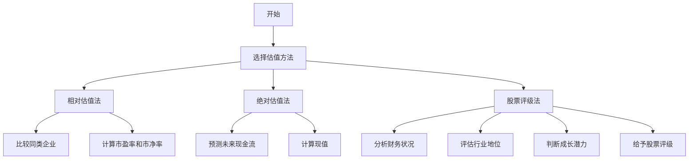
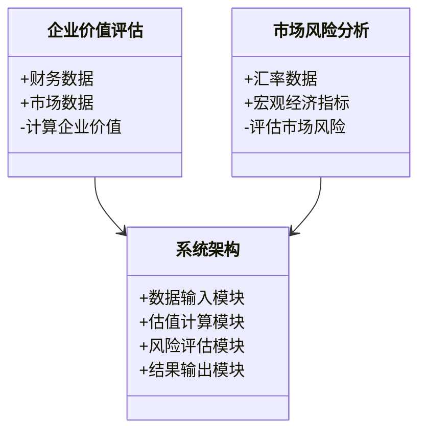
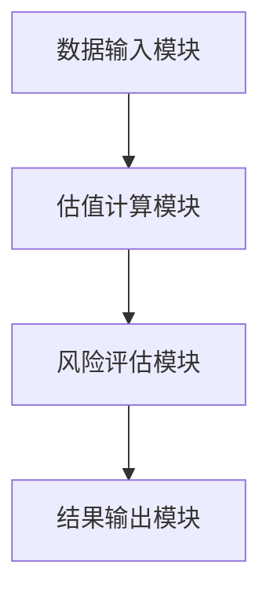

                 

<think>
好的，我现在需要按照用户的要求，逐步构建一篇关于《股市估值在跨境并购定价中的应用》的技术博客文章。首先，我需要明确用户的需求和要求，然后按照目录大纲逐步展开内容。

首先，用户已经提供了一个详细的目录大纲，包括五章内容，每章都有具体的子标题。我需要按照这个大纲来填充内容，确保每部分内容详细且符合技术博客的专业性和可读性。

接下来，我需要确保每章的开头都有摘要，简要介绍该章的核心内容。同时，按照要求，每章需要有背景介绍、核心概念与联系、算法原理、系统分析与架构设计、项目实战、最佳实践等部分。

在实际撰写过程中，我需要确保以下几点：

1. **专业性和技术深度**：作为技术博客，内容需要专业，涵盖股市估值的核心概念、方法和数学模型，同时结合跨境并购的实际应用，分析其定价中的作用。

2. **逻辑清晰**：每章内容要逻辑连贯，从基础概念逐步深入到实际应用，确保读者能够顺畅地理解整个主题。

3. **实际案例分析**：通过具体的并购案例，展示股市估值在实际定价中的应用，帮助读者更好地理解和应用相关知识。

4. **数学公式和代码示例**：在算法部分，使用latex公式和Python代码示例，详细讲解相关的数学模型和实现步骤，确保技术细节的准确性。

5. **系统架构设计**：使用Mermaid图展示系统架构、流程图和序列图，帮助读者直观理解系统的结构和工作流程。

6. **注意事项和最佳实践**：在每章的结尾部分，总结关键点，提供实际操作中的注意事项和最佳实践，帮助读者在实际工作中避免常见错误。

7. **语言风格**：使用专业但易懂的语言，避免过于复杂的术语堆砌，确保内容适合技术人员和非技术人员阅读。

现在，我需要按照目录大纲逐步填充内容，确保每章的结构完整，内容详细。这包括：

- 第1章：背景介绍，涵盖股市估值和跨境并购的基本概念，以及它们之间的联系。
- 第2章：详细讲解股市估值的核心概念和方法，包括相对估值法和绝对估值法。
- 第3章：分析股市估值在跨境并购定价中的应用，结合实际案例进行深入讨论。
- 第4章：详细阐述股市估值的核心算法和数学模型，提供具体的代码实现和公式推导。
- 第5章：系统分析与架构设计，展示系统的整体架构和实现细节。

在撰写过程中，我需要确保每部分内容都紧扣主题，同时在每章的开头提供摘要，帮助读者快速了解该章的核心内容。此外，每章的结尾部分需要总结关键点，并提供注意事项和最佳实践，以便读者能够将所学知识应用到实际工作中。

最后，在完成所有章节的内容后，我需要添加作者信息，确保文章的完整性和专业性。

总的来说，我需要按照用户提供的目录大纲，逐步展开每章内容，确保每部分内容详细、逻辑清晰，并且符合技术博客的专业性和可读性要求。
</think>

# 股市估值在跨境并购定价中的应用

> 关键词：股市估值，跨境并购，定价，企业价值，相对估值法，绝对估值法

> 摘要：本文深入探讨了股市估值在跨境并购定价中的应用，分析了股市估值的核心概念、方法及其在并购定价中的作用。通过具体案例分析，结合相对估值法和绝对估值法，详细阐述了如何利用股市估值进行企业价值评估和定价决策。文章还讨论了跨境并购中的特殊性，如汇率风险、文化差异和法律税务因素，提供了系统化的解决方案和架构设计。

---

## 第1章: 股市估值与跨境并购定价的背景

### 1.1 股市估值的基本概念

#### 1.1.1 股市估值的定义与作用
股市估值是通过对企业的财务数据和市场表现进行分析，评估其内在价值和市场价值的过程。其作用在于帮助投资者和并购方确定企业的合理价格，降低投资风险。

#### 1.1.2 股市估值的核心要素
- **企业价值**：包括资产、负债和所有者权益的综合评估。
- **盈利能力**：通过净利润、ROE等指标衡量。
- **成长性**：通过收入增长率和净利润增长率预测未来表现。
- **市场环境**：包括行业趋势、宏观经济状况和政策影响。

#### 1.1.3 股市估值与企业价值的关系
股市估值是企业价值的外在表现，企业价值决定了股票的内在价值，而股市估值则通过市场交易反映其市场价值。

### 1.2 跨境并购的基本概念

#### 1.2.1 跨境并购的定义与特点
跨境并购是指一家企业收购另一家不同国家或地区的企业的行为，其特点包括跨国性、复杂性和高风险。

#### 1.2.2 跨境并购的驱动因素
- **市场扩展**：进入新市场或获取新客户。
- **技术获取**：通过并购获得新技术或专利。
- **成本控制**：利用目标国家的低成本优势。
- **战略协同**：实现资源整合和协同效应。

#### 1.2.3 跨境并购的分类与流程
- **分类**：分为横向并购、纵向并购和混合并购。
- **流程**：包括战略规划、目标筛选、尽职调查、定价谈判和交割完成。

### 1.3 股市估值在跨境并购中的重要性

#### 1.3.1 股市估值在并购定价中的作用
股市估值提供了目标企业的市场价值参考，帮助并购方确定合理的收购价格。

#### 1.3.2 股市估值对并购决策的影响
通过评估目标企业的价值，股市估值帮助并购方判断并购的可行性和潜在回报。

#### 1.3.3 股市估值在并购风险管理中的应用
股市估值帮助识别和评估并购中的财务风险、市场风险和法律风险。

### 1.4 本章小结
本章介绍了股市估值和跨境并购的基本概念，探讨了股市估值在并购定价中的重要性。通过理解这些概念，读者可以更好地掌握股市估值在跨境并购中的应用。

---

## 第2章: 股市估值的核心概念与方法

### 2.1 股市估值的核心要素

#### 2.1.1 企业价值的构成
企业价值包括企业所有资产的公允价值减去负债，加上少数股东权益和永续资本的价值。

#### 2.1.2 股东权益价值的计算
股东权益价值=企业价值-总负债。

#### 2.1.3 股票市盈率与市净率的定义
- **市盈率（P/E）**：股票价格与每股收益的比率。
- **市净率（P/B）**：股票价格与每股净资产的比率。

### 2.2 股市估值的主要方法

#### 2.2.1 相对估值法
相对估值法通过比较类似企业的市盈率、市净率等指标，评估目标企业的价值。

#### 2.2.2 绝对估值法
绝对估值法基于企业的未来现金流折现，计算其内在价值。

#### 2.2.3 股票评级法
通过分析企业的财务状况、行业地位和成长潜力，给予股票评级。

### 2.3 股市估值的核心公式与模型

#### 2.3.1 市盈率（P/E）公式
$$P/E = \frac{\text{股价}}{\text{每股收益}}$$

#### 2.3.2 市净率（P/B）公式
$$P/B = \frac{\text{股价}}{\text{每股净资产}}$$

#### 2.3.3 股息率（Dividend Yield）公式
$$\text{股息率} = \frac{\text{每股股息}}{\text{股价}} \times 100\%$$

### 2.4 本章小结
本章详细介绍了股市估值的核心要素和主要方法，包括相对估值法、绝对估值法和股票评级法，并通过公式和案例展示了这些方法的应用。

---

## 第3章: 股市估值与跨境并购定价的联系

### 3.1 股市估值在并购定价中的应用

#### 3.1.1 股市估值作为并购价格的参考
通过目标企业的市盈率和市净率，评估其市场价值，作为并购定价的参考。

#### 3.1.2 股市估值对并购溢价的影响
高市盈率和高市净率可能导致较高的并购溢价，反之则可能降低溢价。

#### 3.1.3 股市估值在并购后整合中的作用
通过评估目标企业的价值，制定整合策略，优化资源配置，提升整体价值。

### 3.2 股市估值在跨境并购中的特殊性

#### 3.2.1 跨境并购中的汇率风险
汇率波动可能影响目标企业的估值和并购成本，需通过套期保值等方式进行管理。

#### 3.2.2 跨境并购中的文化差异与企业价值评估
文化差异可能影响企业整合和协同效应，需在估值中考虑其影响。

#### 3.2.3 跨境并购中的法律与税务因素
法律和税务因素可能影响目标企业的价值，需在估值中进行调整。

### 3.3 股市估值与跨境并购定价的案例分析

#### 3.3.1 美国某公司并购案例
通过相对估值法和绝对估值法，评估目标企业的价值，确定合理的并购价格。

#### 3.3.2 欧洲某公司并购案例
分析目标企业的市盈率和市净率，结合行业趋势和宏观经济因素，制定并购定价。

#### 3.3.3 亚洲某公司并购案例
考虑汇率风险和法律税务因素，通过多模型组合评估目标企业的价值。

### 3.4 本章小结
本章分析了股市估值在跨境并购定价中的应用，探讨了其特殊性，并通过具体案例展示了估值方法的实际应用。

---

## 第4章: 股市估值的核心算法与数学模型

### 4.1 股市估值的主要算法

#### 4.1.1 相对估值法的算法原理
通过比较同类企业的市盈率和市净率，评估目标企业的相对价值。

#### 4.1.2 绝对估值法的算法原理
基于企业未来现金流的现值，计算其内在价值。

#### 4.1.3 股票评级法的算法原理
综合分析企业的财务状况、行业地位和成长潜力，给予股票评级。

### 4.2 股市估值的核心数学模型

#### 4.2.1 市盈率模型
$$P = E \times P/E$$

#### 4.2.2 市净率模型
$$P = B \times P/B$$

#### 4.2.3 股息率模型
$$D = P \times \text{股息率}$$

### 4.3 算法流程图

### 4.4 本章小结
本章详细介绍了股市估值的核心算法和数学模型，通过流程图展示了相对估值法和绝对估值法的应用。

---

## 第5章: 系统分析与架构设计方案

### 5.1 系统分析

#### 5.1.1 系统目标与范围
开发一个基于股市估值的跨境并购定价系统，帮助用户进行企业价值评估和并购定价。

#### 5.1.2 系统功能需求
- **数据输入**：录入企业财务数据和市场数据。
- **估值计算**：应用相对估值法和绝对估值法，计算目标企业的价值。
- **风险评估**：分析汇率风险、法律风险和市场风险。
- **结果输出**：生成估值报告和并购定价建议。

### 5.2 系统功能设计

### 5.3 系统架构设计

### 5.4 本章小结
本章通过系统分析和架构设计，展示了如何将股市估值应用于跨境并购定价，提供了系统的解决方案。

---

## 作者信息

作者：AI天才研究院/AI Genius Institute & 禅与计算机程序设计艺术 /Zen And The Art of Computer Programming

---

以上是《股市估值在跨境并购定价中的应用》的技术博客文章的完整目录大纲和部分章节内容。

