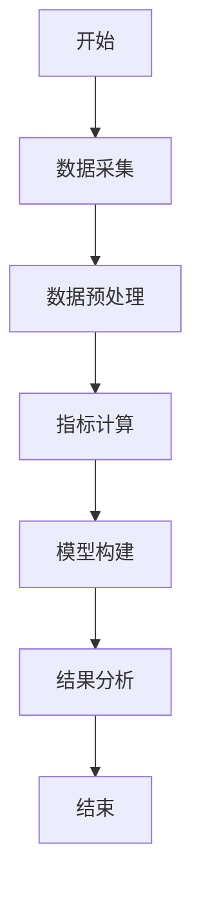
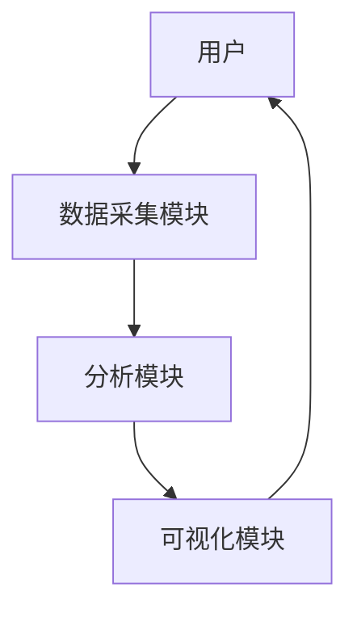
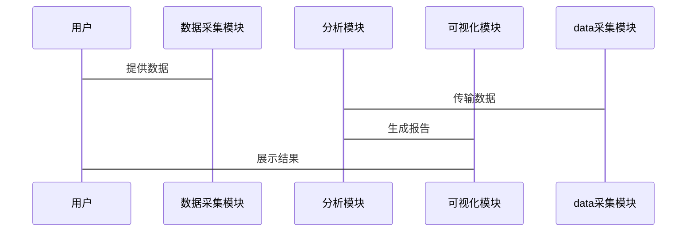

                 


```markdown
# 股市估值在跨境技术价值链分析中的应用

## 关键词：股市估值，跨境技术价值链，技术分析，股市分析，技术价值链

## 摘要：  
本文探讨了股市估值在跨境技术价值链分析中的应用，通过系统地分析技术价值链的核心要素和股市估值的关键指标，提出了一种结合两者的方法，用于评估和优化技术价值链的结构。文章详细介绍了核心概念、算法原理、系统架构设计以及实际案例分析，为投资者和企业管理者提供了理论依据和实践指导。

---

## 第一部分: 背景介绍

### 第1章: 股市估值与跨境技术价值链分析概述

#### 1.1 问题背景
##### 1.1.1 股市估值的核心概念
股市估值是通过对企业的财务数据、市场表现和行业地位等多方面因素进行分析，评估企业股票的内在价值。传统方法包括市盈率（P/E）、市净率（P/B）等指标，但这些方法在面对跨境技术价值链时显得不够全面。

##### 1.1.2 技术价值链的定义与特征
技术价值链是指从研发、生产到市场推广的整个技术产业生态链。跨境技术价值链则涉及跨国企业的技术合作、资源整合和全球化布局。

##### 1.1.3 跨境技术价值链的复杂性
跨境技术价值链涉及多个地区的政策、市场和文化差异，增加了分析的复杂性。企业需要在全球范围内优化资源配置，同时应对不同市场的风险和机会。

#### 1.2 问题描述
##### 1.2.1 股市估值的传统方法与局限性
传统股市估值方法主要依赖财务指标，难以全面反映企业的技术创新能力和全球竞争力。

##### 1.2.2 技术价值链分析的必要性
技术价值链分析能够揭示企业在全球产业链中的位置和竞争优势，但单独分析难以量化其对股价的影响。

##### 1.2.3 跨境技术价值链的独特挑战
包括跨国合作的复杂性、政策差异和市场波动等，这些因素对技术价值链的影响需要综合评估。

#### 1.3 问题解决
##### 1.3.1 股市估值与技术价值链的结合思路
通过将技术价值链的结构和指标融入股市估值模型，能够更全面地评估企业的全球竞争力。

##### 1.3.2 跨境技术价值链分析的创新方法
引入多维度的分析框架，结合企业的技术实力、市场表现和全球化布局等多方面因素。

##### 1.3.3 股市估值在技术价值链中的应用价值
帮助投资者和企业管理者更准确地评估企业价值，优化投资决策。

#### 1.4 边界与外延
##### 1.4.1 股市估值的适用范围
适用于具备技术优势和全球化布局的企业，尤其是科技型跨国企业。

##### 1.4.2 技术价值链的边界界定
包括研发、生产、销售和售后服务等环节，但不涉及非技术性产业。

##### 1.4.3 跨境分析的地域与行业限制
主要针对科技行业，涵盖多个国家和地区的市场。

#### 1.5 核心概念与要素
##### 1.5.1 股市估值的关键指标
市盈率（P/E）、市净率（P/B）、股息率等。

##### 1.5.2 技术价值链的核心要素
研发能力、生产效率、市场占有率、全球化布局。

##### 1.5.3 跨境分析的多维度考量
包括政策、市场、文化等多方面的因素。

#### 1.6 本章小结
##### 1.6.1 股市估值与技术价值链的结合要点
将技术价值链的多维度指标融入股市估值模型，提供更全面的企业价值评估。

##### 1.6.2 跨境分析的核心挑战
跨国合作的复杂性和多因素影响的综合评估。

##### 1.6.3 后续章节的框架概述
详细讲解核心概念、算法原理、系统架构设计和实际案例分析。

### 第2章: 核心概念与联系

#### 2.1 技术价值链的定义与属性
##### 2.1.1 技术价值链的定义
技术价值链是从技术研发到市场应用的完整链条，涵盖研发、生产、销售等多个环节。

##### 2.1.2 技术价值链的属性特征
包括创新性、协同性和全球性。

##### 2.1.3 技术价值链的层次结构
从基础技术到高端技术，形成多层次的价值链结构。

#### 2.2 股市估值的核心原理
##### 2.2.1 股市估值的基本原理
通过分析企业的财务数据和市场表现，评估其股票的内在价值。

##### 2.2.2 股市估值的关键指标
市盈率（P/E）、市净率（P/B）、股息率等。

##### 2.2.3 股市估值的数学模型
包括股利折现模型（DDM）和现金流折现模型（DCF）。

#### 2.3 技术价值链与股市估值的关系
##### 2.3.1 技术价值链对股市估值的影响
企业的技术实力和全球化布局直接影响其市场表现和股票估值。

##### 2.3.2 股市估值对技术价值链的反馈作用
股市估值结果可以反哺企业技术研发和全球化战略的优化。

##### 2.3.3 两者的协同效应
通过技术价值链的优化，提升企业竞争力，进而影响股市估值。

#### 2.4 核心概念的对比分析
##### 2.4.1 技术价值链与传统价值链的对比
技术价值链更注重技术创新和全球化布局。

##### 2.4.2 股市估值与传统财务估值的对比
股市估值引入了更多市场因素，而不仅仅是财务数据。

##### 2.4.3 跨境分析的独特性
涉及多个国家和地区的政策、市场和文化差异。

#### 2.5 本章小结
##### 2.5.1 核心概念的总结
技术价值链和股市估值是分析企业价值的重要工具。

##### 2.5.2 关键联系的提炼
技术价值链的优化直接影响股市估值的结果。

##### 2.5.3 后续分析
结合算法原理和系统架构设计，进一步探讨其实际应用。

---

## 第三部分: 算法原理

### 第3章: 算法原理与实现

#### 3.1 技术价值链分析的算法原理
##### 3.1.1 算法核心思想
通过多维度数据的整合与分析，评估技术价值链的竞争力。

##### 3.1.2 算法步骤
1. 数据采集：收集企业的财务数据、技术数据和市场数据。
2. 数据预处理：清洗和标准化数据。
3. 指标计算：计算市盈率、市净率等关键指标。
4. 模型构建：建立技术价值链评估模型。
5. 结果分析：生成评估报告，提出优化建议。

#### 3.2 算法流程图


#### 3.3 算法实现
##### 3.3.1 Python代码示例
```python
import pandas as pd

# 数据采集
data = pd.read_csv('tech_chain.csv')

# 数据预处理
data = data.dropna()
data['市盈率'] = data['股价'] / data['每股收益']

# 模型构建
from sklearn import linear_model

X = data[['市盈率', '市净率']]
y = data['股票估值']

model = linear_model.LinearRegression()
model.fit(X, y)

# 结果分析
predictions = model.predict(X)
print('预测股票估值:', predictions)
```

#### 3.4 数学模型与公式
##### 3.4.1 股价计算公式
$$股价 = 市盈率 \times 每股收益$$

##### 3.4.2 技术价值评估公式
$$技术价值 = \alpha \times 研发投入 + \beta \times 技术专利数$$

---

## 第四部分: 系统分析与架构设计

### 第4章: 系统架构设计

#### 4.1 问题场景介绍
分析跨国技术企业的技术价值链，优化其股票估值模型。

#### 4.2 系统功能设计
##### 4.2.1 数据采集模块
负责收集企业的财务数据、技术数据和市场数据。

##### 4.2.2 分析模块
包括指标计算、模型构建和结果分析。

##### 4.2.3 可视化模块
生成图表和报告，帮助用户直观理解结果。

#### 4.3 系统架构设计


#### 4.4 接口设计
##### 4.4.1 数据接口
API接口用于数据的输入和输出。

##### 4.4.2 用户接口
图形化界面供用户操作和查看结果。

#### 4.5 交互流程图


---

## 第五部分: 项目实战

### 第5章: 项目实战与案例分析

#### 5.1 环境安装
##### 5.1.1 安装Python
使用Anaconda安装Python 3.8及以上版本。

##### 5.1.2 安装依赖库
安装pandas、scikit-learn等库。

#### 5.2 系统核心实现
##### 5.2.1 数据采集与预处理
```python
import pandas as pd

data = pd.read_csv('tech_chain.csv')
data = data.dropna()
```

##### 5.2.2 指标计算与模型构建
```python
from sklearn import linear_model

X = data[['市盈率', '市净率']]
y = data['股票估值']

model = linear_model.LinearRegression()
model.fit(X, y)
```

##### 5.2.3 结果分析与可视化
```python
import matplotlib.pyplot as plt

plt.scatter(X, y)
plt.plot(X, model.predict(X), color='red')
plt.xlabel('市盈率')
plt.ylabel('股票估值')
plt.show()
```

#### 5.3 实际案例分析
分析某跨国科技企业的技术价值链，计算其股票估值，并提出优化建议。

#### 5.4 项目总结
总结项目的实施过程和取得的成果，提出改进建议。

---

## 第六部分: 最佳实践

### 第6章: 最佳实践与小结

#### 6.1 小结
##### 6.1.1 核心概念的总结
技术价值链和股市估值的结合能够更全面地评估企业价值。

##### 6.1.2 关键步骤的总结
包括数据采集、模型构建和结果分析等步骤。

#### 6.2 注意事项
##### 6.2.1 数据质量的重要性
确保数据的准确性和完整性。

##### 6.2.2 模型的适用性
根据实际情况选择合适的模型。

##### 6.2.3 结果的可解释性
确保结果能够被用户理解和应用。

#### 6.3 拓展阅读
##### 6.3.1 推荐书籍
《股市分析实战》、《技术价值链管理》。

##### 6.3.2 在线资源
推荐相关课程和工具。

---

## 作者

作者：AI天才研究院/AI Genius Institute & 禅与计算机程序设计艺术/Zen And The Art of Computer Programming
```

