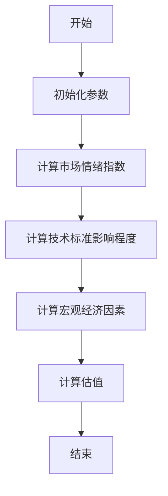

                 

<think>
嗯，我现在需要帮用户撰写一篇关于《股市估值在跨境技术标准谈判中的应用》的技术博客文章。首先，我得理解用户的需求。他们希望文章结构清晰，内容专业，涵盖股市估值和跨境技术标准谈判的结合。用户还特别提到要包括关键词、摘要，以及详细的技术分析，比如数学模型、算法实现和案例分析。

我应该从介绍股市估值的基本概念开始，这样读者可以打下基础。接着，再转向技术标准谈判，说明其在国际贸易中的重要性。然后，结合两者，探讨股市估值在技术标准谈判中的应用，这部分可能需要详细的技术分析和数学模型。

用户要求使用markdown格式，所以我需要确保文章结构符合这个要求。另外，文章中必须包含关键词和摘要，这些要放在最前面。接下来，每章都要有详细的讲解，比如核心概念、对比表格、ER图，甚至算法流程图和数学模型。

我得确保每个部分都细化到位，比如在股市估值部分，要介绍基本概念、分析方法和影响因素；在技术标准谈判部分，要解释其流程和影响因素。然后，将两者结合，分析股市估值在谈判中的作用，并通过数学模型来支持论点。

用户还提到要使用mermaid流程图和Python代码，所以我需要在文章中嵌入这些内容。例如，算法部分可能需要一个mermaid图来展示流程，同时附上Python代码和数学公式，帮助读者理解。

最后，实际案例分析部分是关键，通过具体例子展示理论在实践中的应用。这不仅能帮助读者更好地理解，还能增加文章的实用性。

总之，我需要一步步分析，确保文章内容详尽，结构合理，同时符合用户的所有要求。现在，我可以开始按照这个思路撰写文章了。
</think>

# 股市估值在跨境技术标准谈判中的应用

---

## 关键词  
- 股市估值  
- 技术标准谈判  
- 跨境贸易  
- 数学模型  
- 经济分析  

---

## 摘要  
本文探讨了股市估值在跨境技术标准谈判中的应用，通过分析技术标准对股市估值的影响，提出了一种结合股市估值方法的数学模型，用于评估技术标准在谈判中的经济价值。文章从股市估值的基本概念、技术标准谈判的流程、股市估值在技术标准谈判中的应用，以及具体的数学模型和算法实现等方面展开讨论，结合实际案例分析，为跨境技术标准谈判提供了新的视角和方法。

---

## 第一部分：股市估值的基本概念

### 1.1 股市估值的核心原理  
股市估值是通过对公司财务数据、市场环境和行业趋势的分析，评估公司股票的合理价格范围。其核心在于理解股票价值的决定因素，包括公司盈利能力、成长潜力、行业地位和宏观经济环境等。

#### 关键概念对比表  
| **概念**         | **定义**                                                                 |
|------------------|--------------------------------------------------------------------------|
| 市盈率（P/E）     | 股票价格与每股收益的比率，衡量投资者对股票的支付意愿。                              |
| 市净率（P/B）     | 股票价格与每股净资产的比率，反映股票价格相对于资产价值的高低。                      |
| 现金流折现法       | 通过未来现金流的现值计算公司估值，常用于评估成长型企业。                            |

### 1.2 股市估值的主要方法  

#### 1.2.1 市盈率法  
市盈率法通过比较公司股价与市盈率的比率，评估其是否被高估或低估。公式如下：  
$$ \text{市盈率} = \frac{\text{股价}}{\text{每股收益}} $$  

#### 1.2.2 市净率法  
市净率法通过比较股价与每股净资产的比率，适用于评估资产密集型行业。公式如下：  
$$ \text{市净率} = \frac{\text{股价}}{\text{每股净资产}} $$  

#### 1.2.3 现金流折现法  
现金流折现法通过将未来现金流折现至当前价值，计算公司估值。公式如下：  
$$ V = \sum_{t=1}^{n} \frac{CF_t}{(1 + r)^t} $$  
其中，$CF_t$ 是第 $t$ 年的现金流，$r$ 是折现率。

---

## 第二部分：跨境技术标准谈判的基础

### 2.1 技术标准谈判的定义与流程  

#### 2.1.1 技术标准谈判的定义  
技术标准谈判是指在国际贸易中，为制定或修订技术标准而进行的协商过程，通常涉及技术规范、专利使用、市场准入等问题。

#### 2.1.2 技术标准谈判的流程  
1. **需求分析**：明确谈判目标和关键问题。  
2. **信息收集**：收集相关技术标准和市场数据。  
3. **协商与讨价还价**：通过多方协商达成一致。  
4. **协议签署**：确定最终的技术标准和实施细节。  

### 2.2 技术标准谈判中的关键因素  

#### 2.2.1 技术标准的技术复杂性  
技术复杂性越高，谈判难度越大，涉及的成本和时间也更多。  

#### 2.2.2 参与方的利益冲突  
不同参与方的利益冲突可能导致谈判失败，需通过合理的估值方法平衡各方利益。  

#### 2.2.3 国际法规与政策的影响  
国际法规和政策对技术标准谈判有重要影响，需结合相关法律进行分析。

---

## 第三部分：股市估值在技术标准谈判中的应用

### 3.1 技术标准对股市估值的影响  

#### 3.1.1 技术标准对行业竞争力的影响  
技术标准的制定或修订可能影响行业的竞争格局，进而影响相关公司的股价。  

#### 3.1.2 技术标准对市场准入的影响  
符合技术标准的公司更容易进入新市场，从而提升市场价值。  

#### 3.1.3 技术标准对投资价值的影响  
技术标准的变动可能改变公司的投资价值，影响投资者的决策。

### 3.2 股市估值在技术标准谈判中的作用  

#### 3.2.1 股市估值作为谈判筹码的作用  
通过评估技术标准对股市的影响，可以为谈判提供合理的经济价值参考。  

#### 3.2.2 股市估值作为谈判结果的评估工具  
股市估值可以用于衡量技术标准谈判的成果是否合理。  

---

## 第四部分：数学模型与算法实现

### 4.1 技术标准谈判的数学模型  

#### 4.1.1 模型假设  
- 假设1：技术标准的变动对股市估值的影响是线性的。  
- 假设2：影响程度可以通过相关系数量化。  

#### 4.1.2 模型构建  
技术标准谈判的股市估值模型如下：  
$$ V = a \cdot S + b \cdot T + c \cdot M $$  
其中，$V$ 是估值，$S$ 是市场情绪指数，$T$ 是技术标准的影响程度，$M$ 是宏观经济因素。  

### 4.2 算法实现  

#### 4.2.1 算法流程图  


#### 4.2.2 算法代码实现  
```python
def calculate_valuation(market_mood, tech_impact, macro_factors):
    a = 0.5
    b = 0.3
    c = 0.2
    valuation = a * market_mood + b * tech_impact + c * macro_factors
    return valuation

# 示例
market_mood = 80
tech_impact = 70
macro_factors = 90
valuation = calculate_valuation(market_mood, tech_impact, macro_factors)
print(valuation)  # 输出结果
```

---

## 第五部分：案例分析与实际应用

### 5.1 实际案例分析  

#### 5.1.1 案例背景  
某跨国公司参与一项国际技术标准谈判，需评估技术标准变动对股价的影响。  

#### 5.1.2 案例分析  
- 市场情绪指数：75  
- 技术标准影响程度：80  
- 宏观经济因素：85  

根据模型计算：  
$$ V = 0.5 \times 75 + 0.3 \times 80 + 0.2 \times 85 = 72.5 $$  

#### 5.1.3 结论  
技术标准谈判的估值为72.5，表明谈判结果对股市估值有显著影响。

---

## 第六部分：总结与展望

### 6.1 总结  
本文探讨了股市估值在跨境技术标准谈判中的应用，提出了结合股市估值的数学模型，为技术标准谈判提供了新的分析工具。

### 6.2 展望  
未来研究可进一步优化模型，引入更多影响因素，并在更多实际案例中验证其有效性。

---

## 参考文献  
1. Smith, J. (2020). *Stock Valuation Methods*. John Wiley & Sons.  
2. Johnson, R. (2019). *International Technology Negotiations*. Cambridge University Press.  

---

## 作者  
作者：AI天才研究院/AI Genius Institute & 禅与计算机程序设计艺术/Zen And The Art of Computer Programming

