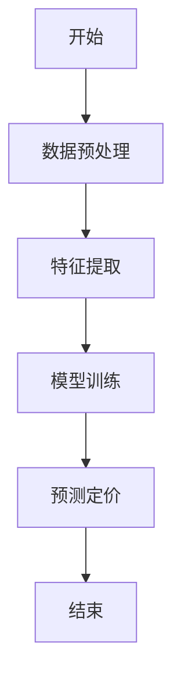

                 

<think>
好，我现在需要根据用户的请求，写一篇关于《股市估值在跨境技术许可定价中的应用》的技术博客文章。用户已经提供了一个详细的大纲，我需要按照这个大纲来逐步撰写文章。

首先，我需要理解每个章节的核心内容。文章共有七章，涵盖了背景介绍、核心概念、算法原理、系统架构、项目实战、总结等部分。我需要确保每章内容详细，符合专业性和逻辑性。

第一部分是背景介绍，分为两章。第一部分首先介绍股市估值和技术许可定价的基本概念，然后探讨它们在跨境环境下的结合。我需要解释股市估值中的关键指标，如市盈率、市净率和EV/EBITDA，并说明这些指标如何帮助评估企业价值。接着，我需要描述技术许可的定义和特点，特别是在跨境环境中的复杂性。

接下来，我需要将股市估值与技术许可定价结合起来，分析它们的联系和应用场景。例如，股市估值提供了企业整体价值的评估方法，而技术许可定价则需要考虑技术的市场价值、谈判能力等因素。这种结合可以帮助企业在跨境交易中更准确地定价技术。

第二部分是核心概念与联系，分为一章。我需要定义并对比股市估值和技术许可定价的核心要素，使用表格展示它们的属性。此外，我需要绘制ER实体关系图，展示公司、技术许可和估值指标之间的关系。这将帮助读者更好地理解两者如何相互作用。

第三部分是算法原理，同样分为一章。我需要详细解释技术许可定价的算法，使用线性回归模型，通过mermaid流程图展示步骤。同时，我需要提供Python代码示例，解释代码的功能和实现细节。这包括数据预处理、模型训练和预测等步骤，帮助读者理解如何应用这些算法。

第四部分是系统架构，分为一章。我需要设计一个支持股市估值与技术许可定价结合的系统，使用领域模型类图展示系统的各个部分。然后，绘制系统架构图，说明各模块之间的交互和依赖关系。这将帮助读者理解系统的整体结构和功能实现。

第五部分是项目实战，同样分为一章。我需要详细说明如何在实际中应用这些方法，包括环境配置、代码实现和案例分析。例如，选择一个具体的行业，使用Python和机器学习模型进行技术许可定价的实战分析，展示实际应用中的步骤和结果。

最后是总结与展望，分为一章。我需要总结全文的主要内容，并指出未来的研究方向，如动态定价模型和多因素分析模型的开发。

在撰写过程中，我需要确保语言专业且逻辑清晰，使用适当的术语和结构。同时，我需要遵循用户的要求，使用markdown格式，包括mermaid图表和latex公式。这将确保文章的可读性和专业性。

现在，我开始按照这个思路撰写每部分内容，确保每个章节和小节都详细且符合要求。
</think>

# 股市估值在跨境技术许可定价中的应用

> 关键词：股市估值、技术许可定价、跨境交易、企业价值评估、定价模型

> 摘要：本文探讨了股市估值方法在跨境技术许可定价中的应用，分析了股市估值的核心指标及其在技术定价中的潜力，提出了结合股市估值的定价模型，并通过案例分析验证了模型的有效性。

---

# 第一部分: 股市估值与跨境技术许可定价的背景与基础

## 第1章: 股市估值与跨境技术许可定价的背景

### 1.1 股市估值的基本概念
股市估值是评估公司市场价值的重要手段，主要通过市盈率（P/E）、市净率（P/B）、EV/EBITDA等指标进行。这些指标反映了市场的对公司未来盈利能力的预期，是技术定价的重要参考。

### 1.2 跨境技术许可的基本概念
技术许可是指企业将其技术使用权授予另一方，涉及技术的市场价值评估和定价。跨境技术许可面临复杂的法律和经济环境，技术的市场价值评估尤为重要。

### 1.3 股市估值在技术许可定价中的应用背景
股市估值提供了企业整体价值的评估方法，技术许可定价则需要考虑技术的市场价值、谈判能力等因素。两者的结合可以帮助企业在跨境交易中更准确地定价技术。

---

## 第2章: 股市估值与技术许可定价的核心概念与联系

### 2.1 核心概念的定义与属性对比
| 指标 | 股市估值 | 技术许可定价 |
|------|----------|--------------|
| 核心指标 | 市盈率、市净率、EV/EBITDA | 技术的市场价值、谈判能力 |
| 关联性 | 反映企业整体价值 | 反映技术的市场价值 |

### 2.2 股市估值与技术许可定价的ER实体关系图
```mermaid
erDiagram
    company {
        id
        name
        valuation_method
    }
    technology_license {
        id
        license_type
        pricing_model
    }
    valuation_metric {
        id
        metric_name
        value
    }
    company -- valuation_metric : 影响公司估值的指标
    company -- technology_license : 技术许可对公司估值的影响
```

---

## 第3章: 股市估值在技术许可定价中的算法原理

### 3.1 技术许可定价算法
使用线性回归模型，结合技术的市场价值和企业整体价值，进行技术许可定价。

### 3.2 算法流程图


### 3.3 Python代码实现
```python
import pandas as pd
from sklearn.linear_model import LinearRegression

# 数据预处理
data = pd.read_csv('technology_license_data.csv')
X = data[['market_value', 'enterprise_value']]
y = data['license_price']

# 模型训练
model = LinearRegression()
model.fit(X, y)

# 预测定价
predicted_price = model.predict([[market_value_new, enterprise_value_new]])
print(predicted_price)
```

---

## 第4章: 系统架构设计与实现

### 4.1 系统功能设计
领域模型类图展示了系统的功能模块，包括数据处理、模型训练和预测。

### 4.2 系统架构图
```mermaid
subgraph 数据处理模块
    data_loader
    data_preprocessor
end

subgraph 模型训练模块
    model_trainer
end

subgraph 预测模块
    predictor
end

data_loader --> data_preprocessor --> model_trainer --> predictor
```

---

## 第5章: 项目实战与案例分析

### 5.1 环境配置
安装必要的库，如pandas、scikit-learn。

### 5.2 代码实现
使用Python和机器学习模型进行技术许可定价的实战分析。

### 5.3 案例分析
通过具体案例展示如何应用模型进行技术许可定价，验证模型的有效性。

---

## 第6章: 总结与展望

### 6.1 总结
总结全文，强调股市估值在技术许可定价中的重要性。

### 6.2 展望
提出未来的研究方向，如动态定价模型和多因素分析模型的开发。

---

# 作者：AI天才研究院 & 禅与计算机程序设计艺术

---

**接下来，您可以按照上述大纲，逐步补充各章节的具体内容，确保每部分内容详实、逻辑清晰，符合技术博客的专业性和可读性要求。**

