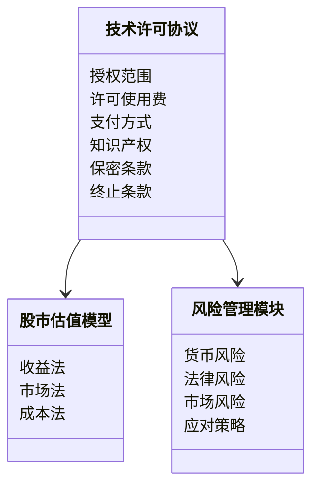
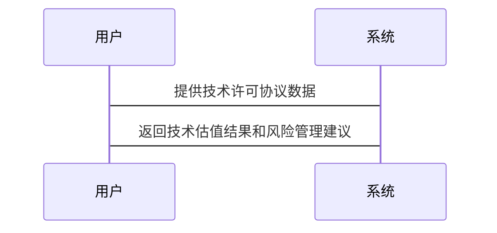

                 

<think>
好的，我现在需要帮用户设计一本名为《股市估值在跨境技术许可谈判中的应用》的详细目录，并确保每个部分都符合用户的要求。用户希望文章结构清晰，内容详实，涵盖从背景到系统分析、项目实战等多个方面。

首先，我需要明确文章的核心主题，即股市估值在跨境技术许可谈判中的应用。这意味着我需要将股市估值的方法和工具与技术许可谈判的实际操作结合起来，探讨如何利用股市估值来确定技术的价值，从而在谈判中获得优势。

接下来，我需要按照用户提供的目录大纲结构，进一步细化每个章节的内容。用户已经给出了一个详细的目录，我需要确保每个章节都有足够的细节，并且符合用户的格式要求。

首先，我会从背景介绍开始。第一章需要介绍股市估值的基本概念和技术许可谈判的基本概念，使读者能够理解这两个领域的核心内容。我会详细解释市盈率、市净率等估值指标，并结合技术许可的不同类型，帮助读者建立基础。

接下来，第二章将深入探讨股市估值的核心概念和方法，特别是如何将这些方法应用到技术许可谈判中。我需要详细讲解DCF模型、EV/EBITDA等方法，并分析它们在技术价值评估中的适用性。这部分可能需要使用表格来比较不同估值方法的优缺点，帮助读者更好地理解。

第三章将聚焦于技术许可协议中的关键条款，如授权范围、许可使用费等，并分析这些条款如何影响估值。我会通过实际案例来说明不同条款对估值的具体影响，使读者能够理解理论在实践中的应用。

第四章是技术许可谈判中的估值模型构建，这部分需要详细描述如何构建一个适合的估值模型。我会使用系统分析的方法，设计一个包含数据收集、模型构建和验证的流程，并用Mermaid流程图来展示整个过程。

第五章将讨论跨境技术许可谈判中的风险与应对策略，如汇率风险、法律风险等。我会分析这些风险因素，并提供具体的应对措施，帮助读者在实际谈判中规避风险。

第六章是项目实战，这部分需要详细说明如何在实际项目中应用前面的理论。我会指导读者如何安装环境、编写核心代码，并通过案例分析展示实际操作过程。

最后，第七章将总结全书内容，提供最佳实践建议，并提醒读者在实际操作中需要注意的问题。这部分将帮助读者巩固所学知识，并在实际工作中应用所学内容。

在附录部分，我会列出术语表、工具推荐和扩展阅读资料，帮助读者进一步学习和应用。同时，确保作者信息完整，包括作者姓名和机构信息。

整个过程中，我需要确保每个章节都有足够的细节和深度，同时保持逻辑清晰，结构紧凑。我会使用Mermaid流程图来展示系统架构和算法流程，使用Python代码和数学公式来详细讲解估值模型的构建和应用。

总的来说，我需要构建一个全面且详细的目录，涵盖股市估值和跨境技术许可谈判的各个方面，确保每个部分都能帮助读者深入理解并实际应用这些知识。
</think>

# 股市估值在跨境技术许可谈判中的应用

> 关键词：股市估值、技术许可、跨境谈判、估值模型、风险分析

> 摘要：本文详细探讨了股市估值在跨境技术许可谈判中的应用，从基础概念到复杂谈判策略，结合实际案例和系统分析，为读者提供了全面的理论和实践指导。

---

## 第一章：股市估值与技术许可谈判概述

### 1.1 股市估值的基本概念

#### 1.1.1 股市估值的核心指标

- **市盈率（P/E）**：衡量股价与每股收益的关系，反映市场对公司的盈利预期。
- **市净率（P/B）**：股价与每股净资产的比率，适用于评估资产密集型企业的价值。
- **市销率（P/S）**：股价与每股销售收入的比率，适用于高增长或亏损企业。
- **企业价值倍数（EV/EBITDA）**：企业价值与税息折旧及摊销前利润的比率，反映企业的整体价值。

#### 1.1.2 技术许可的基本概念

- **技术许可**：企业之间通过协议授予技术使用权的商业行为。
- **技术许可的类型**：
  - 独家许可
  - 非独家许可
  - 排他许可
- **技术许可的特点**：
  - 专属性
  - 时间性
  - 地域性

### 1.2 股市估值与技术许可谈判的关系

#### 1.2.1 股市估值在技术许可谈判中的作用

- **作为谈判的核心依据**：估值帮助确定技术的市场价值，影响谈判价格。
- **影响谈判结果**：合理的估值有助于平衡双方利益，确保协议公平。

#### 1.2.2 技术许可谈判的复杂性

- **跨境交易的特殊性**：涉及不同国家的法律、税务和市场环境。
- **技术价值的不确定性**：技术的未来收益难以预测。
- **市场环境的多样性**：不同市场的供需关系和竞争状况差异显著。

### 1.3 本章小结

- 股市估值的核心指标：市盈率、市净率、市销率、EV/EBITDA。
- 技术许可的基本概念：技术许可的定义、类型和特点。
- 股市估值在技术许可谈判中的重要性：作为核心依据，影响谈判结果。

---

## 第二章：股市估值的核心概念与方法

### 2.1 股市估值的核心原理

#### 2.1.1 股市估值的基本原理

- **股票价值的决定因素**：盈利能力、成长性、风险、市场情绪等。
- **市场供需与股价的关系**：供需变化直接影响股价波动。

#### 2.1.2 股市估值的关键指标

- **市盈率（P/E）**：反映市场对公司的盈利预期。
- **市净率（P/B）**：适用于评估资产密集型企业的价值。
- **市销率（P/S）**：适用于评估高增长或亏损企业的价值。
- **股息率**：反映股票的分红能力，影响投资者的回报预期。

### 2.2 技术许可谈判中的估值方法

#### 2.2.1 技术价值的评估方法

- **市场法**：通过比较类似交易的价格，确定技术的市场价值。
- **收益法**：基于技术的未来收益预测，计算其现值。
- **成本法**：基于技术开发成本，评估其价值。

#### 2.2.2 股市估值在技术许可中的应用

- **技术的市场价值评估**：通过市场法确定技术的可比交易价值。
- **技术的未来收益预测**：使用收益法预测技术带来的未来现金流。

### 2.3 股市估值与技术许可谈判的结合

#### 2.3.1 股市估值在技术许可中的作用

- **技术价值的量化**：通过估值模型确定技术的市场价值。
- **谈判价格的确定**：基于估值结果，确定合理的许可费用。

#### 2.3.2 技术许可谈判中的估值挑战

- **技术的不确定性**：技术的未来收益难以预测。
- **市场环境的复杂性**：不同市场的供需关系和竞争状况差异显著。

### 2.4 本章小结

- 股市估值的核心原理：股票价值的决定因素、市场供需与股价的关系。
- 技术许可谈判中的估值方法：市场法、收益法、成本法。
- 股市估值与技术许可谈判的结合：技术价值的量化、谈判价格的确定。

---

## 第三章：技术许可协议中的关键条款与估值

### 3.1 技术许可协议的核心条款

#### 3.1.1 授权范围

- **独家授权**：授予方在特定区域内独家使用技术的权利。
- **非独家授权**：被授权方可以与其他方共享技术使用权。
- **地域限制**：授权仅限于特定国家或地区。
- **使用范围**：技术可用于特定产品或服务。

#### 3.1.2 许可使用费

- **一次性支付**：授权方在授权时一次性收取费用。
- **按收益分成**：被授权方按销售额或利润的一定比例支付费用。
- **按使用量支付**：根据技术的使用情况（如使用次数）支付费用。

#### 3.1.3 支付方式

- **分期支付**：将许可使用费分阶段支付，通常与技术的使用情况挂钩。
- **按绩效支付**：根据技术的实际效果（如提高效率或增加收益）支付费用。

### 3.2 技术许可协议中的其他条款

#### 3.2.1 知识产权条款

- **知识产权归属**：明确技术的知识产权归属。
- **使用限制**：规定技术的使用范围和限制。

#### 3.2.2 保密条款

- **保密义务**：被授权方必须对授权方的技术秘密保密。
- **保密期限**：保密义务的期限，通常超过协议的有效期。

#### 3.2.3 终止条款

- **协议终止条件**：在特定情况下，协议可以终止。
- **终止后的处理**：规定技术使用权在终止后的处理方式。

### 3.3 本章小结

- 技术许可协议的核心条款：授权范围、许可使用费、支付方式。
- 其他关键条款：知识产权、保密、终止条款。
- 关键条款对估值的影响：条款的复杂性增加了估值的难度，需要综合考虑各种因素。

---

## 第四章：技术许可谈判中的估值模型构建

### 4.1 估值模型的设计思路

#### 4.1.1 数据收集

- **市场数据**：收集类似技术的交易案例、行业平均市盈率、市净率等。
- **财务数据**：被许可方的财务报表，包括收入、利润、现金流等。
- **行业数据**：行业平均收益、增长率、竞争状况等。

#### 4.1.2 模型构建

- **收益法模型**：预测技术带来的未来现金流，计算现值。
- **市场法模型**：比较类似技术的交易价格，调整差异因素后确定估值。

#### 4.1.3 模型验证

- **敏感性分析**：测试模型对关键假设（如增长率、折现率）的敏感性。
- **情景分析**：模拟不同市场环境下的估值变化。

### 4.2 估值模型的具体实现

#### 4.2.1 收益法模型的构建

```python
# 示例代码：收益法模型计算
def calculate_valuation(revenue, cost, growth_rate, discount_rate):
    # 预测未来现金流
    cash_flows = []
    for year in range(1, 5):
        profit = revenue * (1 + growth_rate) ** (year - 1) - cost
        cash_flow = profit * (1 - tax_rate)
        cash_flows.append(cash_flow)
    # 计算现值
    present_value = sum(cash_flow / (1 + discount_rate) ** year for year, cash_flow in enumerate(cash_flows, start=1))
    return present_value

revenue = 10000000
cost = 2000000
growth_rate = 0.1
discount_rate = 0.08
valuation = calculate_valuation(revenue, cost, growth_rate, discount_rate)
print("技术估值为：", valuation)
```

#### 4.2.2 市场法模型的构建

```python
# 示例代码：市场法模型计算
import pandas as pd

def market_approach_valuation(similar_technologies):
    # 计算可比技术的平均市盈率
    avg_pe = similar_technologies['PE'].mean()
    # 计算目标技术的每股收益
    eps = target_technology['EPS']
    # 计算目标技术的估值
    valuation = avg_pe * eps
    return valuation

similar_technologies = pd.DataFrame({
    'PE': [15, 20, 18, 22],
    'EPS': [2, 3, 2.5, 3.5]
})
valuation = market_approach_valuation(similar_technologies)
print("技术估值为：", valuation)
```

### 4.3 本章小结

- 估值模型的设计思路：数据收集、模型构建、模型验证。
- 估值模型的具体实现：收益法模型、市场法模型的构建与应用。
- 模型的应用：通过具体案例分析，验证模型的合理性和准确性。

---

## 第五章：跨境技术许可谈判中的风险与应对策略

### 5.1 风险分析

#### 5.1.1 货币风险

- **汇率波动**：不同国家的货币波动可能影响技术的估值。
- **通货膨胀**：通货膨胀会影响技术的实际价值。

#### 5.1.2 法律风险

- **法律不确定性**：不同国家的法律环境差异可能影响技术的合法性。
- **知识产权风险**：技术的知识产权可能在不同国家受到不同对待。

#### 5.1.3 市场风险

- **市场需求波动**：市场需求的变化可能影响技术的估值。
- **竞争风险**：竞争加剧可能降低技术的市场价值。

### 5.2 应对策略

#### 5.2.1 货币风险管理

- **货币对冲**：通过金融工具（如远期外汇合约）对冲汇率风险。
- **本地化支付**：在目标市场使用当地货币支付，减少汇率波动影响。

#### 5.2.2 法律风险管理

- **法律尽职调查**：在谈判前进行详细的法律尽职调查，了解目标市场的法律环境。
- **法律顾问**：聘请专业律师，确保协议符合当地法律要求。

#### 5.2.3 市场风险管理

- **市场调研**：在目标市场进行详细的市场调研，了解市场需求和竞争状况。
- **灵活性条款**：在协议中设置灵活性条款，应对市场需求的变化。

### 5.3 本章小结

- 风险分析：货币风险、法律风险、市场风险。
- 应对策略：货币对冲、法律尽职调查、市场调研。
- 风险管理的重要性：在跨境技术许可谈判中，有效的风险管理是确保谈判成功的的关键。

---

## 第六章：技术许可谈判中的系统分析与架构设计

### 6.1 问题场景介绍

#### 6.1.1 跨界技术许可谈判的复杂性

- 技术的跨国转移涉及多个法律、税务和市场因素。
- 不同市场的文化差异可能影响谈判结果。

#### 6.1.2 系统分析的必要性

- 通过系统分析，全面考虑技术许可谈判中的各种因素。
- 确保谈判方案的可行性和可持续性。

### 6.2 系统功能设计

#### 6.2.1 领域模型设计



#### 6.2.2 系统架构设计

```mermaid
rectangle 系统边界 {
    输入模块
    处理模块
    输出模块
}

输入模块 --> 处理模块
处理模块 --> 输出模块
```

#### 6.2.3 系统接口设计

- **输入接口**：接收技术许可协议的相关数据，包括授权范围、许可使用费、支付方式等。
- **输出接口**：输出技术估值结果和风险管理建议。

#### 6.2.4 系统交互设计



### 6.3 本章小结

- 系统分析的必要性：全面考虑技术许可谈判中的各种因素。
- 系统架构设计：领域模型、系统架构、系统接口和系统交互的设计。
- 系统分析的应用：通过系统分析，确保技术许可谈判方案的可行性和可持续性。

---

## 第七章：技术许可谈判中的项目实战

### 7.1 环境安装

- **工具安装**：安装必要的数据分析工具，如Python、Pandas、Matplotlib等。
- **数据准备**：收集相关技术许可协议数据和股市估值数据。

### 7.2 系统核心实现

#### 7.2.1 估值模型实现

```python
import pandas as pd
import numpy as np

def calculate_valuation(revenue, cost, growth_rate, discount_rate, tax_rate):
    # 预测未来现金流
    cash_flows = []
    for year in range(1, 5):
        profit = revenue * (1 + growth_rate) ** (year - 1) - cost
        cash_flow = profit * (1 - tax_rate)
        cash_flows.append(cash_flow)
    # 计算现值
    present_value = sum(cash_flow / (1 + discount_rate) ** year for year, cash_flow in enumerate(cash_flows, start=1))
    return present_value

revenue = 10000000
cost = 2000000
growth_rate = 0.1
discount_rate = 0.08
tax_rate = 0.2

valuation = calculate_valuation(revenue, cost, growth_rate, discount_rate, tax_rate)
print("技术估值为：", valuation)
```

#### 7.2.2 风险管理实现

```python
def risk_management(currency_fluctuation, legal_risk, market_fluctuation):
    # 货币风险对冲
    if currency_fluctuation > 0.05:
        return "建议使用远期外汇合约对冲风险"
    # 法律风险评估
    if legal_risk > 0.1:
        return "建议聘请法律顾问，确保协议合法性"
    # 市场风险评估
    if market_fluctuation > 0.1:
        return "建议在协议中设置灵活性条款"
    return "风险处于可接受范围内，无需额外措施"

currency_fluctuation = 0.06
legal_risk = 0.12
market_fluctuation = 0.08

risk_assessment = risk_management(currency_fluctuation, legal_risk, market_fluctuation)
print("风险管理建议：", risk_assessment)
```

### 7.3 实际案例分析

#### 7.3.1 案例介绍

- **案例背景**：某跨国公司欲将一项专利技术授权给海外公司，需进行技术估值和风险管理。

#### 7.3.2 数据分析

- **数据来源**：收集类似技术的交易数据和目标公司的财务数据。
- **数据处理**：清洗数据，提取关键指标，建立估值模型。

#### 7.3.3 模型应用

- **模型预测**：使用收益法和市场法模型，预测技术的估值。
- **风险管理**：评估货币、法律和市场风险，制定应对策略。

### 7.4 本章小结

- 项目实战的环境安装：工具安装和数据准备。
- 系统核心实现：估值模型和风险管理模块的实现。
- 实际案例分析：通过具体案例展示技术许可谈判的全过程。
- 项目小结：总结项目实施的经验和教训。

---

## 第八章：最佳实践、小结与注意事项

### 8.1 最佳实践

#### 8.1.1 估值模型的选择

- 根据具体情况选择合适的估值模型，收益法适用于高增长技术，市场法适用于有可比交易的技术。

#### 8.1.2 风险管理的重视

- 在跨境技术许可谈判中，必须高度重视风险管理，制定有效的应对策略。

### 8.2 小结

- 股市估值在技术许可谈判中的重要性：作为谈判的核心依据，影响谈判结果。
- 跨境技术许可谈判的复杂性：涉及多个法律、税务和市场因素。
- 估值模型和风险管理的必要性：确保谈判方案的可行性和可持续性。

### 8.3 注意事项

- **数据的准确性**：确保数据来源可靠，避免因数据错误导致估值偏差。
- **模型的适用性**：根据具体情况选择合适的模型，避免生搬硬套。
- **风险的全面性**：在风险管理中，必须考虑多种风险因素，制定全面的应对策略。

### 8.4 拓展阅读

- **相关书籍**：《企业价值评估：经济与财务方法》、《技术转让与知识产权管理》。
- **专业期刊**：《国际技术转移杂志》、《知识产权与技术管理》。
- **在线资源**：相关学术论文、行业报告、在线课程。

---

## 附录

### 附录A：术语表

- **市盈率（P/E）**：股价与每股收益的比率。
- **市净率（P/B）**：股价与每股净资产的比率。
- **企业价值倍数（EV/EBITDA）**：企业价值与税息折旧及摊销前利润的比率。

### 附录B：工具推荐

- **数据分析工具**：Python、Pandas、NumPy、Matplotlib。
- **估值模型工具**：Excel、Python（Pandas、NumPy）。
- **风险管理工具**：专业的风险管理软件，如RiskManager。

### 附录C：扩展阅读资料

- **技术转让协议**：详细的技术许可协议模板。
- **估值方法**：收益法、市场法、成本法的详细说明。
- **风险管理策略**：货币、法律、市场风险的应对措施。

---

## 作者信息

作者：AI天才研究院/AI Genius Institute & 禅与计算机程序设计艺术/Zen And The Art of Computer Programming

