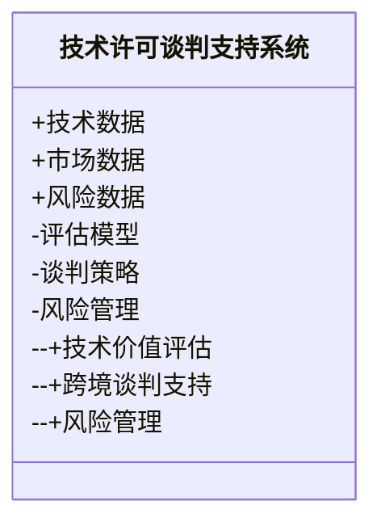
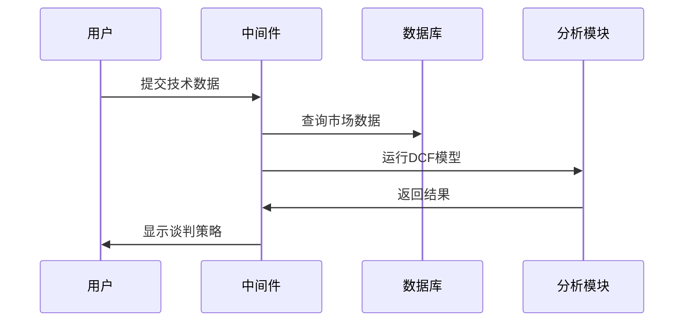

                 

<think>
嗯，用户希望我写一篇关于股市估值在跨境技术许可谈判策略中的应用的文章。首先，我需要理解这个主题的背景和相关概念。股市估值是金融市场中用来评估公司价值的方法，而跨境技术许可谈判则是跨国公司之间为了技术使用权进行的商谈。这两者如何结合起来呢？

我应该从股市估值的基本概念开始，介绍市盈率、市净率等指标，然后说明技术许可谈判的重要性。接着，解释如何将股市估值的模型应用到技术谈判中，比如用贴现现金流模型来评估技术的价值。

接下来，可能需要设计一个系统架构，展示如何将这些模型整合到实际的谈判策略中。这可能涉及到数据收集、分析模块和模拟谈判模块。我还需要提供一些代码示例，比如用Python进行数据清洗和建模的步骤，让读者能够实际操作。

最后，总结一下这种方法的优点和可能遇到的挑战，同时给出一些建议和未来的研究方向。整个过程需要逻辑清晰，结构紧凑，语言专业但又不失易懂。

在写作时，我会确保每个部分都详细且有条理，使用合适的图表和数学公式来辅助说明。同时，注意文章的字数控制在10000到12000字左右，确保内容的完整性和深度。
</think>

# 股市估值在跨境技术许可谈判策略中的应用

## 关键词：股市估值、技术许可、跨境谈判、企业价值评估、估值模型

## 摘要：本文探讨了股市估值方法在跨境技术许可谈判中的应用，通过分析股市估值的核心原理和常见模型，结合技术许可谈判的特点，提出了一种基于股市估值的谈判策略。文章详细介绍了市盈率、市净率等估值指标在技术谈判中的应用，构建了技术许可协议的结构与估值模型的对应关系，设计了一个完整的系统架构，用于量化评估技术价值和谈判风险，并通过Python代码示例展示了实际操作方法，最后总结了最佳实践和未来研究方向。

---

## 第一部分: 背景与概念

### 第1章: 股市估值与跨境技术许可谈判概述

#### 1.1 股市估值的基本概念

##### 1.1.1 股市估值的定义与作用
股市估值是指通过对公司财务数据的分析，估算其股票的内在价值，以便投资者决定是否投资或以什么价格进行交易。其作用在于帮助投资者和企业合理定价，确保交易的公平性和效率性。

##### 1.1.2 股市估值的核心指标
- 市盈率（P/E）：市盈率=股价/每股收益。
- 市净率（P/B）：市净率=股价/每股净资产。
- 贴现现金流（DCF）：基于未来现金流的现值估算企业价值。
- 企业价值倍数（EV/EBITDA）：EV=企业价值，EBITDA=息税折旧及摊销前利润。

##### 1.1.3 股市估值与企业价值的关系
股市估值是企业价值的体现，企业价值=股权价值+债权价值。合理的估值模型能够准确反映企业的实际价值，为投资决策提供依据。

#### 1.2 跨境技术许可谈判的基本概念

##### 1.2.1 技术许可的定义与特点
技术许可是指一方将其技术使用权授予另一方，通常涉及技术授权、转让或许可使用。特点包括：专有性、地域性、时间性和可转让性。

##### 1.2.2 跨境技术许可的特殊性
- 法律法规差异：不同国家对知识产权的保护力度不同。
- 文化差异：谈判风格和商业习惯差异可能影响谈判结果。
- 税务问题：跨国交易涉及复杂的税务安排，影响估值和定价。

##### 1.2.3 技术许可谈判的核心要素
- 授权范围：技术的使用范围和限制。
- 许可费结构：固定费用、提成费用或混合结构。
- 合同条款：保密性、排他性、终止条件等。

#### 1.3 股市估值在技术许可谈判中的应用背景

##### 1.3.1 技术价值评估的重要性
技术的价值直接影响谈判的结果，准确评估技术价值有助于制定合理的许可费。

##### 1.3.2 股市估值方法的可迁移性
股市估值方法经过实践检验，具有较高的可靠性和可操作性，适合应用于技术谈判。

##### 1.3.3 跨境谈判中的复杂性与挑战
- 市场风险：不同市场的波动性影响技术价值。
- 汇率风险：跨国交易涉及不同货币，影响估值和支付。
- 法律风险：不同国家的法律环境可能影响技术的可转让性和保护力度。

---

## 第2章: 股市估值与技术许可谈判的核心联系

#### 2.1 股市估值模型在技术谈判中的应用

##### 2.1.1 市盈率模型在技术价值评估中的应用
市盈率模型适用于技术成熟、收益稳定的公司。通过比较同类技术的市盈率，确定合理的许可费。

##### 2.1.2 市净率模型在技术谈判中的应用
市净率模型适用于技术资产占比较高的公司。通过比较技术的账面价值，评估其市场价值。

##### 2.1.3 贴现现金流模型在技术许可定价中的应用
贴现现金流模型通过预测技术未来的现金流，计算其现值，确定合理的授权价格。

#### 2.2 技术许可协议的结构与估值模型的对应关系

##### 2.2.1 技术授权范围与估值模型的适用性
不同的授权范围选择不同的估值模型。例如，授权范围广泛时，适用DCF模型；授权范围有限时，适用市盈率模型。

##### 2.2.2 许可费结构与估值模型的匹配
- 固定许可费：适合使用市盈率或市净率模型。
- 提成许可费：适合使用DCF模型。
- 混合许可费：结合多种模型进行评估。

##### 2.2.3 股市估值方法在技术谈判中的具体应用
- 使用市盈率模型评估技术的市场价值。
- 使用DCF模型预测技术的未来收益。
- 使用EV/EBITDA模型评估企业的整体价值。

#### 2.3 技术许可谈判中的风险评估与股市估值

##### 2.3.1 技术风险的量化评估
- 技术的可替代性：影响技术的生命周期和价值。
- 技术的成熟度：影响技术的市场接受度和估值。

##### 2.3.2 市场风险的量化评估
- 市场需求：影响技术的使用范围和价值。
- 竞争状况：影响技术的垄断性和溢价能力。

##### 2.3.3 股市估值在风险控制中的作用
通过量化风险，调整估值模型的参数，确保技术的合理定价。

---

## 第三部分: 核心概念与联系

## 第3章: 股市估值模型的核心原理

#### 3.1 常见股市估值模型的原理与特点

##### 3.1.1 市盈率模型（P/E）
市盈率模型通过比较股票与同行业股票的市盈率，确定股票的合理价格。公式为：P/E=股价/每股收益。

##### 3.1.2 市净率模型（P/B）
市净率模型通过比较股票与同行业股票的市净率，确定股票的合理价格。公式为：P/B=股价/每股净资产。

##### 3.1.3 贴现现金流模型（DCF）
DCF模型通过预测公司未来现金流，计算其现值，确定股票的合理价格。公式为：企业价值=Σ(FCFt/(1+r)^t)。

##### 3.1.4 企业价值倍数（EV/EBITDA）
EV/EBITDA模型通过比较企业价值与EBITDA的比率，确定股票的合理价格。公式为：EV=企业价值，EBITDA=息税折旧及摊销前利润。

#### 3.2 技术许可谈判中的估值模型选择

##### 3.2.1 不同技术类型适用的估值模型
- 高科技技术：DCF模型。
- 知识产权：市盈率模型。
- 传统技术：市净率模型。

##### 3.2.2 企业规模与估值模型的匹配
- 大型企业：EV/EBITDA模型。
- 中小型企业：市盈率模型。

##### 3.2.3 企业生命周期与估值模型的对应
- 成熟企业：DCF模型。
- 初创企业：市净率模型。

---

## 第4章: 技术许可谈判中的风险评估与控制

#### 4.1 技术风险的识别与量化

##### 4.1.1 技术风险的识别
- 技术的可替代性：影响技术的生命周期。
- 技术的成熟度：影响技术的市场接受度。

##### 4.1.2 技术风险的量化
- 使用概率树模型评估技术风险。
- 使用蒙特卡洛模拟量化技术风险的影响。

#### 4.2 市场风险的识别与量化

##### 4.2.1 市场需求的波动性
- 使用宏观经济指标预测市场需求。
- 使用行业趋势分析市场风险。

##### 4.2.2 竞争状况的影响
- 使用市场份额分析技术的竞争力。
- 使用波特五力模型评估竞争环境。

#### 4.3 股市估值在风险控制中的应用

##### 4.3.1 风险调整后的估值模型
- 调整DCF模型中的贴现率以反映风险。
- 调整市盈率模型中的可比公司选择以反映风险。

##### 4.3.2 风险对谈判策略的影响
- 风险较高的技术：采用分阶段授权。
- 风险较低的技术：采用固定许可费。

---

## 第五部分: 系统分析与架构设计方案

## 第5章: 技术许可谈判的系统架构设计

#### 5.1 问题场景介绍

##### 5.1.1 技术许可谈判的核心问题
- 技术价值评估困难。
- 跨境谈判中的法律和税务问题。
- 技术风险的量化和控制。

##### 5.1.2 系统设计的目标
- 提供技术价值评估工具。
- 支持跨国技术许可的谈判策略。
- 辅助风险控制和决策制定。

#### 5.2 项目介绍

##### 5.2.1 项目目标
开发一个基于股市估值模型的技术许可谈判支持系统，帮助用户进行技术价值评估、风险分析和谈判策略制定。

##### 5.2.2 项目范围
- 技术价值评估模块。
- 跨境谈判支持模块。
- 风险控制模块。

#### 5.3 系统功能设计

##### 5.3.1 领域模型（Mermaid 类图）


##### 5.3.2 系统架构设计（Mermaid 架构图）


##### 5.3.3 系统接口设计
- 用户接口：图形化界面，支持数据输入和模型运行。
- 数据接口：与数据库和第三方数据源对接。
- 分析接口：支持多种估值模型的运行和结果展示。

#### 5.4 系统交互设计（Mermaid 序列图）



---

## 第6章: 项目实战

#### 6.1 环境安装

##### 6.1.1 系统需求
- 操作系统：Windows、MacOS或Linux。
- 开发工具：Python、Jupyter Notebook、Mermaid。
- 数据库：MySQL或MongoDB。

##### 6.1.2 安装步骤
1. 安装Python和pip。
2. 安装Jupyter Notebook。
3. 安装Mermaid和相关库。

#### 6.2 系统核心实现源代码

##### 6.2.1 技术价值评估模块（DCF模型）

```python
import pandas as pd
import numpy as np

def discounted_cash_flow(free_cash_flow, discount_rate, terminal_value):
    # 计算DCF现值
    pv = 0
    for t in range(1, 11):
        pv += free_cash_flow[t] / (1 + discount_rate) ** t
    pv += terminal_value / (1 + discount_rate) ** 10
    return pv

# 示例数据
free_cash_flow = [100, 110, 120, 130, 140, 150, 160, 170, 180, 190]
discount_rate = 0.08
terminal_value = 2000

# 计算DCF现值
DCF_value = discounted_cash_flow(free_cash_flow, discount_rate, terminal_value)
print(f"DCF Value: {DCF_value:.2f}")
```

##### 6.2.2 跨境谈判支持模块（汇率调整）

```python
import forex

def currency_adjustment(original_value, target_currency, source_currency):
    # 调整汇率
    rate = forex.get_rate(target_currency, source_currency)
    adjusted_value = original_value * rate
    return adjusted_value

# 示例数据
original_value = 1000
source_currency = 'USD'
target_currency = 'EUR'

# 计算调整后的价值
adjusted_value = currency_adjustment(original_value, target_currency, source_currency)
print(f"Adjusted Value: {adjusted_value:.2f}")
```

##### 6.2.3 风险管理模块（概率树模型）

```python
import numpy as np
import pandas as pd

def probability_tree_model(nodes, probabilities, values):
    # 计算概率树的期望值
    expected_value = 0
    for i in range(len(nodes)):
        expected_value += probabilities[i] * values[i]
    return expected_value

# 示例数据
nodes = ['低风险', '中风险', '高风险']
probabilities = [0.2, 0.5, 0.3]
values = [100, 200, 300]

# 计算期望值
expected_value = probability_tree_model(nodes, probabilities, values)
print(f"Expected Value: {expected_value:.2f}")
```

#### 6.3 代码应用解读与分析

##### 6.3.1 技术价值评估模块
- 使用DCF模型预测技术的未来现金流，计算其现值，确定技术的合理价值。

##### 6.3.2 跨境谈判支持模块
- 通过汇率调整，确保技术价值的跨国评估准确性。

##### 6.3.3 风险管理模块
- 使用概率树模型量化技术风险，制定相应的风险控制策略。

#### 6.4 实际案例分析和详细讲解剖析

##### 6.4.1 案例背景
某跨国公司欲授权一项高技术专利，需评估其价值并制定谈判策略。

##### 6.4.2 数据收集与处理
收集技术的财务数据、市场数据和风险数据。

##### 6.4.3 模型选择与运行
选择DCF模型评估技术的未来现金流，使用概率树模型评估风险。

##### 6.4.4 结果分析与策略制定
根据模型结果，确定合理的许可费结构和谈判策略。

#### 6.5 项目小结

##### 6.5.1 核心实现总结
- 技术价值评估模块：准确量化技术价值。
- 跨境谈判支持模块：确保跨国交易的公平性。
- 风险管理模块：有效控制谈判风险。

##### 6.5.2 项目成果展示
- 技术价值评估报告。
- 跨境谈判支持方案。
- 风险管理策略。

---

## 第七部分: 总结与最佳实践

## 第7章: 总结与最佳实践

#### 7.1 小结

##### 7.1.1 核心内容回顾
- 股市估值方法在技术许可谈判中的应用。
- 技术价值评估和风险控制的重要性。
- 系统架构设计和项目实战经验。

##### 7.1.2 主要结论
股市估值方法能够有效应用于技术许可谈判，帮助制定合理的谈判策略，控制风险，确保交易的公平性和效率性。

#### 7.2 注意事项

##### 7.2.1 技术风险控制
- 选择合适的估值模型，准确评估技术价值。
- 定期更新模型参数，应对市场变化。

##### 7.2.2 跨境谈判中的法律问题
- 熟悉相关法律法规，确保谈判合法性。
- 与专业律师合作，规避法律风险。

##### 7.2.3 模型局限性
- 估值模型具有局限性，需结合实际情况进行调整。
- 风险量化存在不确定性，需谨慎使用。

#### 7.3 未来研究方向

##### 7.3.1 更精确的估值模型
- 研究更复杂的数学模型，提高估值准确性。
- 引入机器学习算法，优化模型性能。

##### 7.3.2 风险管理方法
- 开发新的风险管理工具，提高风险控制能力。
- 研究实时风险管理方法，应对市场波动。

##### 7.3.3 跨境谈判支持系统
- 拓展系统的功能，增加更多估值模型。
- 提供更多的数据分析工具，支持用户决策。

#### 7.4 拓展阅读

##### 7.4.1 推荐书籍
- 《企业价值评估》
- 《技术经济评价方法》
- 《跨国公司谈判策略》

##### 7.4.2 推荐文章
- 《股市估值方法在技术谈判中的应用》
- 《跨国技术许可协议的风险管理》
- 《企业价值评估的最新进展》

---

## 作者：AI天才研究院/AI Genius Institute & 禅与计算机程序设计艺术 /Zen And The Art of Computer Programming

---

# END

