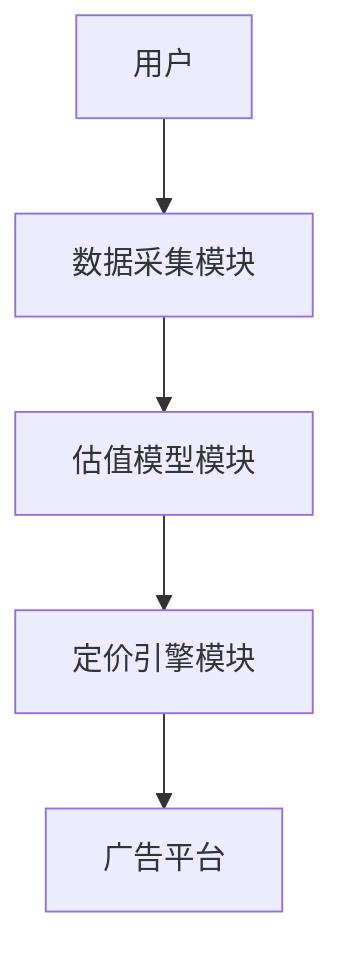

                 


# 股市估值在跨境数字广告定价中的应用

> 关键词：股市估值，数字广告定价，跨境广告，定价模型，股票市场

> 摘要：本文探讨了股市估值在跨境数字广告定价中的应用。通过分析股市估值的核心概念和数字广告定价的挑战，提出了一种结合两者的定价模型。该模型利用股市估值的数学方法，如市盈率和市净率，结合数字广告的用户行为数据，构建了一个动态定价系统。通过系统设计和实际案例分析，展示了该模型在提升广告定价效率和准确性方面的优势。

---

## 第一部分：背景介绍

### 第1章：问题背景

#### 1.1 股市估值的基本概念

股市估值是通过对上市公司的财务数据和市场表现进行分析，以确定其股票的合理价格。常用的方法包括市盈率（P/E）和市净率（P/B）等。市盈率反映了股票的市场价格与其每股收益之间的关系，而市净率则反映了市场价格与每股净资产之间的关系。

#### 1.2 数字广告定价的挑战

数字广告定价涉及多个变量，如点击率（CTR）、展示量（D）和用户行为数据。由于广告市场的动态变化，如何准确预测广告的需求和价格是一个复杂的挑战。传统的定价方法往往基于静态数据，难以适应市场的快速变化。

#### 1.3 问题解决的必要性

将股市估值的方法应用到数字广告定价中，可以利用股票市场的波动性和数据驱动的分析方法，提高广告定价的准确性和效率。这种跨领域的结合为数字广告行业带来了新的视角和解决方案。

---

### 第2章：核心概念与联系

#### 2.1 股市估值的核心要素

- **市盈率（P/E）**：$P/E = \frac{P}{E}$，其中$P$是股票价格，$E$是每股收益。
- **市净率（P/B）**：$P/B = \frac{P}{B}$，其中$B$是每股净资产。
- **股东权益（E）**：$V = E + D - I$，其中$D$是债务，$I$是利息。

#### 2.2 数字广告定价的关键因素

- **点击率（CTR）**：广告被点击的概率。
- **展示量（D）**：广告被展示的次数。
- **用户行为数据**：用户的地理位置、时间、设备等信息。

#### 2.3 两者的结合与应用

通过将股市估值的数学模型与数字广告的用户行为数据相结合，可以构建一个动态的定价系统。例如，利用市盈率模型，可以根据广告的预期收益（如点击率）动态调整其价格。

---

## 第二部分：核心概念与联系

### 第3章：股市估值与数字广告定价的数学模型

#### 3.1 股市估值的数学模型

- **市盈率模型**：$P = \frac{E}{COC} \times P/E$，其中$COC$是资本成本。
- **市净率模型**：$P = \frac{B}{PB}$，其中$PB$是目标市净率。

#### 3.2 数字广告定价的数学模型

- **基于点击率的定价**：$P = C \times CTR$，其中$C$是每次点击的费用。
- **基于展示量的定价**：$P = D \times RPM$，其中$RPM$是每千次展示的收入。
- **基于用户行为的定价**：$P = f(CTR, CPC, CPA)$，其中$CPC$是每次点击的费用，$CPA$是每次转化的费用。

#### 3.3 综合模型

结合股市估值和数字广告定价的模型：

$$ P = \alpha \times V + \beta \times CTR $$

其中，$\alpha$和$\beta$是权重系数，$V$是广告的价值评估，$CTR$是点击率。

---

## 第三部分：系统分析与架构设计

### 第4章：系统分析与架构设计

#### 4.1 问题场景介绍

在跨境数字广告市场中，广告的价格受到多种因素的影响，如市场需求、用户行为和市场波动。通过引入股市估值的方法，可以更准确地预测广告的需求和价格。

#### 4.2 系统功能设计

- **数据采集模块**：收集广告的点击率、展示量和用户行为数据。
- **估值模型模块**：基于股市估值的方法，计算广告的价值。
- **定价引擎模块**：根据估值结果和用户行为数据，动态调整广告价格。

#### 4.3 系统架构设计

使用Mermaid绘制系统架构图：



---

## 第四部分：项目实战

### 第5章：项目实战

#### 5.1 环境安装

安装Python和相关库（如Pandas、Matplotlib）：

```bash
pip install pandas matplotlib
```

#### 5.2 核心实现代码

```python
import pandas as pd
import matplotlib.pyplot as plt

# 示例数据：广告点击率和展示量
data = {'CTR': [0.2, 0.3, 0.25, 0.35, 0.28],
        '展示量': [1000, 2000, 1500, 2500, 2000]}
df = pd.DataFrame(data)

# 计算广告价格
df['价格'] = df['CTR'] * df['展示量'] * 0.01  # 假设每次点击价格为 $0.01

plt.figure(figsize=(10,6))
plt.plot(df['展示量'], df['价格'], 'ro-')
plt.xlabel('展示量')
plt.ylabel('价格')
plt.title('广告价格与展示量的关系')
plt.show()
```

#### 5.3 代码解读与分析

上述代码展示了如何基于点击率和展示量计算广告价格，并通过可视化工具绘制广告价格与展示量的关系图。结果表明，展示量越高，广告价格也越高。

#### 5.4 案例分析

假设一家广告公司在跨境市场投放广告，展示量为2000次，点击率为0.3。根据上述模型，广告价格为：

$$ P = 0.3 \times 2000 \times 0.01 = 6 $$

---

## 第五部分：总结与展望

### 第6章：总结与展望

#### 6.1 最佳实践

- 定期更新广告数据和市场信息，以提高模型的准确性。
- 结合实时数据和市场趋势，动态调整广告价格。

#### 6.2 小结

本文探讨了股市估值在跨境数字广告定价中的应用，提出了一个结合股市估值和用户行为数据的定价模型。通过案例分析和系统设计，展示了该模型在实际应用中的潜力。

#### 6.3 注意事项

- 数据质量对模型的准确性至关重要。
- 模型需要定期更新，以适应市场变化。

#### 6.4 拓展阅读

- 更深入地研究机器学习在数字广告定价中的应用。
- 探讨其他金融指标（如波动率）在广告定价中的潜在应用。

---

## 作者

作者：AI天才研究院/AI Genius Institute & 禅与计算机程序设计艺术 /Zen And The Art of Computer Programming

---

**总结**：通过将股市估值的方法应用到数字广告定价中，可以利用数据驱动的分析方法，提高广告定价的效率和准确性。未来，随着技术的不断发展，这种跨领域的结合将为数字广告行业带来更多创新和机遇。

