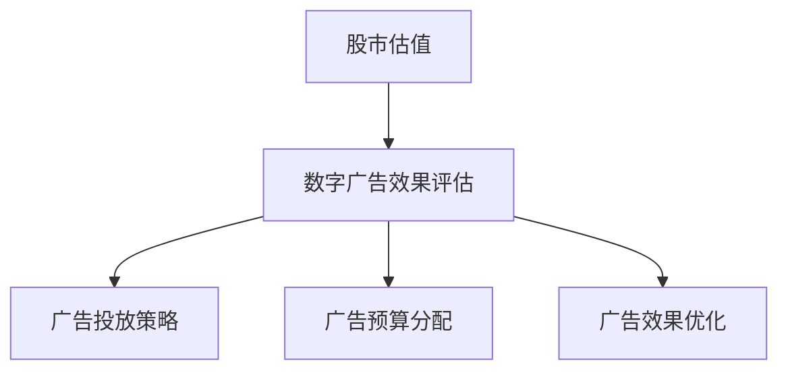
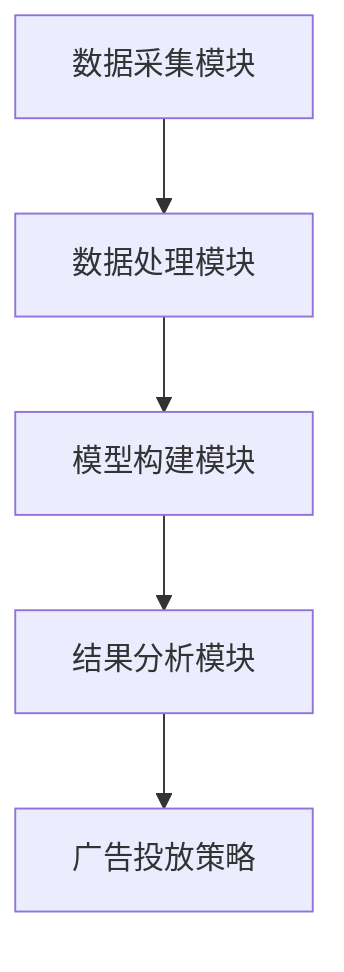

                 


# 股市估值在跨境数字广告效果评估中的应用

> 关键词：股市估值，数字广告，跨境广告，广告效果评估，广告收益预测

> 摘要：本文探讨了股市估值方法在跨境数字广告效果评估中的应用，通过分析广告效果评估的核心指标、算法原理、数学模型及系统架构，展示了如何利用股市估值的理论与方法来优化广告投放策略，提升广告效果预测的准确性与可靠性。

---

## 第一部分：背景介绍与核心概念

### 第1章：背景介绍

#### 1.1 股市估值的核心概念
股市估值是通过对企业的财务数据、市场环境和行业趋势进行分析，评估企业股票的合理价格区间。常用的估值方法包括市盈率（PE）、市净率（PB）、现金流折现模型（DCF）等。

- **市盈率（PE）**：$$PE = \frac{\text{股价}}{\text{每股收益}}$$
- **市净率（PB）**：$$PB = \frac{\text{股价}}{\text{每股净资产}}$$
- **现金流折现模型（DCF）**：$$\text{企业价值} = \sum_{t=1}^{n} \frac{\text{自由现金流}}{(1+r)^t} + \frac{\text{终值}}{(1+r)^n}$$

#### 1.2 数字广告效果评估的定义与特点
数字广告效果评估是通过数据采集和分析，衡量广告投放后的效果，包括点击率（CTR）、转化率（CVR）、投资回报率（ROI）等指标。

- **点击率（CTR）**：$$CTR = \frac{\text{点击量}}{\text{展示量}}$$
- **转化率（CVR）**：$$CVR = \frac{\text{转化量}}{\text{点击量}}$$
- **投资回报率（ROI）**：$$ROI = \frac{\text{广告收益} - \text{广告成本}}{\text{广告成本}} \times 100\%$$

#### 1.3 股市估值在数字广告效果评估中的应用背景
随着数字广告市场的全球化，跨国广告投放的需求日益增加。股市估值的理论和方法可以为广告效果评估提供新的视角，特别是在数据量大、变量复杂的场景下，通过量化分析提升广告效果预测的准确性。

---

### 第2章：核心概念与联系

#### 2.1 股市估值模型的原理与应用
股市估值模型通过分析企业的财务状况、行业地位和市场趋势，评估其股票的内在价值。这些模型的核心在于将企业的未来现金流折现为当前价值。

- **市盈率法**：适用于企业盈利稳定的场景，能够快速评估企业的估值水平。
- **现金流折现法**：适用于企业未来现金流可预测的场景，能够更精确地评估企业的内在价值。

#### 2.2 数字广告效果评估的指标体系
数字广告效果评估需要综合考虑广告投放的多个维度，包括用户行为、广告效果、投放策略等。

- **广告点击率（CTR）**：反映广告内容的吸引力。
- **广告转化率（CVR）**：反映广告的实际效果。
- **广告ROI**：综合衡量广告的投资回报率。

#### 2.3 股市估值与数字广告效果评估的实体关系图


---

## 第二部分：算法原理与数学模型

### 第3章：基于股市估值的广告效果预测模型

#### 3.1 模型输入数据的特征分析
广告效果预测模型的输入数据包括广告投放的地理位置、目标受众特征、广告内容、投放时间、历史广告数据等。

- **地理位置**：不同国家或地区的广告效果可能受到当地市场环境的影响。
- **目标受众特征**：包括年龄、性别、兴趣爱好等。
- **广告内容**：包括标题、描述、图片等。
- **投放时间**：广告投放的时间节点可能影响其效果。

#### 3.2 模型构建与优化
广告效果预测模型的构建需要结合股市估值的方法和广告效果评估的指标，通过回归分析、机器学习等方法进行建模。

- **线性回归模型**：用于预测广告点击率和转化率。
  $$ y = \beta_0 + \beta_1x_1 + \beta_2x_2 + \ldots + \beta_nx_n + \epsilon $$
- **随机森林模型**：用于处理高维数据和非线性关系。
- **神经网络模型**：用于复杂场景下的广告效果预测。

#### 3.3 模型的应用与验证
通过历史数据验证模型的准确性，调整模型参数，优化广告投放策略。

---

### 第4章：数学模型与公式

#### 4.1 股市估值的主要数学模型
- **市盈率（PE）**：$$PE = \frac{\text{股价}}{\text{每股收益}}$$
- **市净率（PB）**：$$PB = \frac{\text{股价}}{\text{每股净资产}}$$
- **现金流折现模型（DCF）**：$$\text{企业价值} = \sum_{t=1}^{n} \frac{\text{自由现金流}}{(1+r)^t} + \frac{\text{终值}}{(1+r)^n}$$

#### 4.2 广告效果评估的数学公式
- **广告点击率（CTR）**：$$CTR = \frac{\text{点击量}}{\text{展示量}}$$
- **广告转化率（CVR）：$$CVR = \frac{\text{转化量}}{\text{点击量}}$$
- **广告投资回报率（ROI）：$$ROI = \frac{\text{广告收益} - \text{广告成本}}{\text{广告成本}} \times 100\%$$

---

## 第三部分：系统分析与架构设计

### 第5章：系统功能设计

#### 5.1 系统功能模块
- **数据采集模块**：采集广告投放数据、用户行为数据、市场数据等。
- **数据处理模块**：对数据进行清洗、转换和特征提取。
- **模型构建模块**：基于股市估值方法和广告效果评估指标，构建预测模型。
- **结果分析模块**：输出广告效果评估结果，优化广告投放策略。

#### 5.2 系统架构设计


---

## 第四部分：项目实战与案例分析

### 第6章：项目实战

#### 6.1 环境安装与数据准备
- 安装Python、Pandas、Scikit-learn等工具。
- 准备广告数据、市场数据等。

#### 6.2 系统核心实现
- 数据清洗与特征提取。
- 模型训练与优化。
- 结果分析与策略调整。

#### 6.3 代码实现
```python
import pandas as pd
from sklearn.ensemble import RandomForestRegressor
from sklearn.metrics import mean_squared_error

# 数据加载
data = pd.read_csv('advertising.csv')

# 特征与目标变量分离
X = data.drop('ROI', axis=1)
y = data['ROI']

# 模型训练
model = RandomForestRegressor()
model.fit(X, y)

# 预测与评估
y_pred = model.predict(X)
print(mean_squared_error(y, y_pred))
```

---

## 第五部分：总结与展望

### 第7章：总结与展望

#### 7.1 小结
本文探讨了股市估值在跨境数字广告效果评估中的应用，通过分析广告效果评估的核心指标、算法原理、数学模型及系统架构，展示了如何利用股市估值的理论与方法来优化广告投放策略，提升广告效果预测的准确性与可靠性。

#### 7.2 展望
未来的研究方向可以包括：
1. 结合更多的市场数据，提升模型的预测精度。
2. 探索更复杂的机器学习模型，如深度学习模型，提升广告效果预测的准确性。
3. 研究广告投放策略的动态优化，实时调整广告投放参数，提升广告效果。

---

## 第六部分：最佳实践与注意事项

### 第8章：最佳实践

#### 8.1 数据质量的重要性
数据质量是广告效果评估的核心，确保数据的完整性和准确性。

#### 8.2 模型调优的技巧
通过交叉验证和网格搜索等方法，优化模型的参数，提升预测精度。

#### 8.3 系统架构的优化
合理设计系统架构，确保数据处理和模型计算的高效性。

---

## 作者：AI天才研究院/AI Genius Institute & 禅与计算机程序设计艺术 /Zen And The Art of Computer Programming

---

以上是《股市估值在跨境数字广告效果评估中的应用》的完整文章大纲和内容。通过系统的分析和实际案例的讲解，展示了如何利用股市估值的方法优化数字广告效果评估，为广告从业者和数据科学家提供了新的思路和方法。

