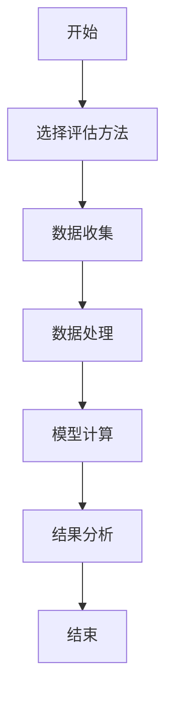
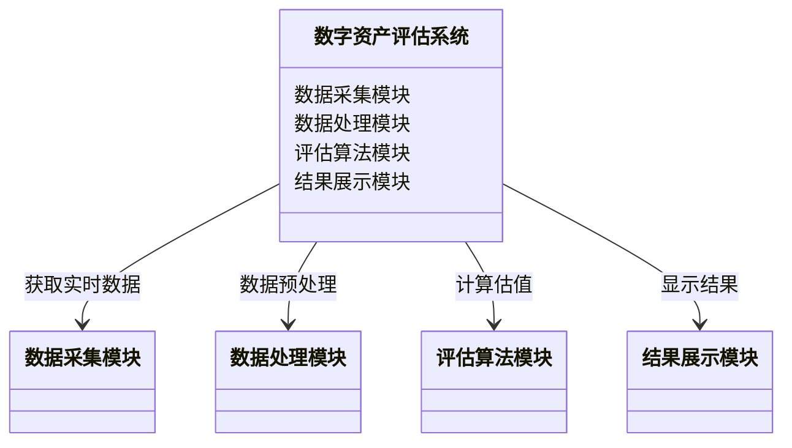
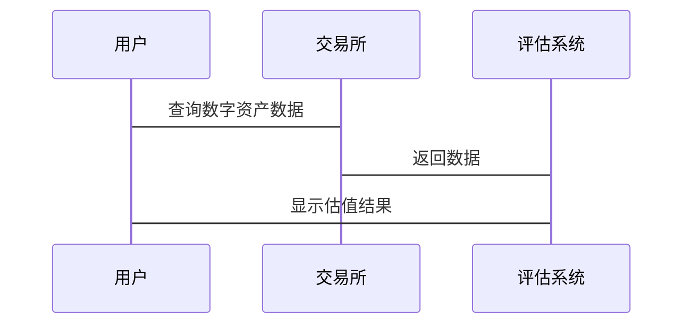

                 

<think>
嗯，我现在需要根据用户的要求，逐步设计一个详细的书籍目录大纲。用户希望这本书名为《股市估值在跨境数字资产评估中的应用》，内容要专业，结构紧凑，逻辑清晰。我需要先理解用户的需求，然后一步步构建符合要求的目录。

首先，我会阅读用户提供的详细要求，了解他们需要哪些部分，比如关键词、摘要、目录结构等。用户希望文章包含引言、核心概念、算法原理、系统架构、项目实战等部分，每部分都需要详细展开，包括背景、原理、数学模型、流程图等。

接下来，我会考虑每一章的具体内容。例如，第一章可能介绍数字资产评估的背景和概念，包括数字资产的定义、分类，以及股市估值的基本概念。第二章可以深入探讨数字资产评估的核心概念与联系，可能需要使用表格和实体关系图来对比分析。

然后，我会考虑算法部分。第三章可能详细讲解算法的原理，包括技术分析和基本面分析的方法，使用流程图和数学公式来说明。第四章则涉及系统架构设计，使用类图和架构图来展示系统的各个模块。

项目实战部分需要包括环境安装、代码实现和案例分析，帮助读者实际应用所学知识。最后，第五章总结最佳实践、小结和注意事项，并提供进一步学习的资源。

在设计过程中，我会确保每一部分都有足够的细节，比如使用mermaid流程图、数学公式和实际案例，以增强文章的可读性和实用性。同时，保持目录的逻辑连贯性，确保读者能够逐步理解并应用这些知识。

现在，我需要将这些思考整理成一个清晰的目录大纲，确保涵盖所有要求的部分，并且结构合理，内容详实。
</think>

# 股市估值在跨境数字资产评估中的应用

> 关键词：股市估值，数字资产评估，跨境资产，技术分析，基本面分析，系统架构

> 摘要：本文深入探讨了股市估值在跨境数字资产评估中的应用，结合数字资产的特性，分析了如何将传统的股市估值方法应用于新兴的数字资产领域。通过系统化的分析，本文详细讲解了数字资产评估的核心概念、算法原理、系统架构设计，并通过实际案例展示了如何在跨境背景下进行有效的资产评估。文章最后总结了最佳实践，为读者提供了实用的指导和建议。

---

# 第一部分: 股市估值与数字资产评估基础

# 第1章: 数字资产评估的背景与概念

## 1.1 数字资产的定义与分类

### 1.1.1 数字资产的定义

数字资产是指以数字形式存在的资产，包括加密货币（如比特币、以太坊）、代币、数字艺术品、虚拟货币等。数字资产具有去中心化、可分割性强、便于跨境交易等特点。

### 1.1.2 数字资产的分类

1. 加密货币：比特币、以太坊等。
2. 代币：用于特定平台或项目的代币，如ERC-20代币。
3. 数字艺术品：如NFT（非同质化代币）。
4. 虚拟货币：如游戏中的虚拟货币。

### 1.1.3 跨境数字资产的特点

1. 全球性：数字资产可以在全球范围内自由流动。
2. 去中心化：交易不受单一国家或机构的控制。
3. 高波动性：价格波动较大，受市场情绪影响显著。

## 1.2 股市估值的基本概念

### 1.2.1 股市估值的定义

股市估值是指通过对公司的财务状况、市场表现、行业地位等因素进行分析，评估公司股票的内在价值，以确定其合理的价格区间。

### 1.2.2 股市估值的主要方法

1. 市盈率（P/E）：股价与每股收益的比率。
2. 市净率（P/B）：股价与每股净资产的比率。
3. 股东权益回报率（ROE）：衡量公司盈利能力的指标。

### 1.2.3 股市估值与数字资产评估的联系

1. 均值-方差模型：用于评估资产的预期收益与风险。
2. 市场情绪分析：通过市场参与者的情绪变化预测价格走势。
3. 风险溢价模型：考虑市场整体风险对资产价格的影响。

## 1.3 股市估值在数字资产评估中的应用背景

### 1.3.1 数字资产市场的快速发展

近年来，数字资产市场迅速崛起，市场规模不断扩大，吸引了大量投资者的关注。

### 1.3.2 股市估值方法的适用性

尽管数字资产具有去中心化和高波动性等特点，但其核心价值仍可以通过类似股市的方法进行评估。

### 1.3.3 跨境数字资产评估的挑战与机遇

1. 挑战：价格波动剧烈，市场信息不透明。
2. 机遇：全球化交易，市场流动性高。

---

# 第2章: 数字资产评估的核心概念与联系

## 2.1 核心概念原理

### 2.1.1 数字资产的价值评估因素

1. 技术因素：区块链技术的成熟度、安全性等。
2. 市场因素：市场规模、流动性、市场参与者等。
3. 经济因素：宏观经济政策、通货膨胀率等。

### 2.1.2 股市估值方法的迁移

1. 技术分析：K线图、均线、MACD等指标。
2. 基本面分析：财务报表、行业地位、管理团队等。
3. 组合评估：将多种评估方法结合起来，提高准确性。

### 2.1.3 跨境交易中的特殊性

1. 跨境交易的法律风险：不同国家对数字资产的监管政策不同。
2. 货币兑换风险：汇率波动对资产价格的影响。
3. 税务问题：跨国交易中的税务处理复杂。

## 2.2 核心概念属性特征对比

### 2.2.1 对比表格展示

| 属性        | 数字资产       | 股市股票       |
|-------------|---------------|---------------|
| 交易场所     | 去中心化交易所 | 传统证券交易所 |
| 资产类型     | 加密货币、代币 | 公司股权       |
| 交易时间     | 24小时         | 交易时间受限   |
| 价格波动     | 高波动性       | 中低波动性      |

### 2.2.2 使用 Mermaid 绘制的 ER 实体关系图

```mermaid
erDiagram
    actor 投资者 {
        string 资产ID
        string 资产名称
        string 资产类型
    }
    actor 交易所 {
        string 交易ID
        string 资产ID
        date 交易日期
        float 交易价格
    }
    actor 监管机构 {
        string 监管ID
        string 资产ID
        string 监管政策
    }
    投资者 --| 交易所 : 交易
    投资者 --| 监管机构 : 受监管
    交易所 --| 监管机构 : 监管
```

---

# 第3章: 数字资产评估的算法原理

## 3.1 算法原理概述

### 3.1.1 基于技术分析的评估算法

1. 均线策略：通过计算短期、中期、长期均线，判断价格趋势。
2. MACD策略：通过计算MACD指标，判断买卖信号。
3. RSI策略：通过计算相对强度指数，判断超买超卖状态。

### 3.1.2 基于基本面分析的评估算法

1. 财务指标分析：市盈率、市净率、ROE等。
2. 项目团队分析：团队背景、历史业绩。
3. 市场规模分析：目标市场容量、竞争对手分析。

### 3.1.3 组合评估算法

1. 综合技术分析和基本面分析，构建多维度评估模型。
2. 使用权重系数，赋予不同因素不同的权重，计算综合评分。

## 3.2 算法流程图



## 3.3 数学模型与公式

### 3.3.1 市盈率计算公式

$$市盈率 = \frac{股价}{每股收益}$$

### 3.3.2 市净率计算公式

$$市净率 = \frac{股价}{每股净资产}$$

### 3.3.3 预测模型公式

$$预测价值 = \alpha \times 收益率 + \beta \times 市场风险$$

其中，$\alpha$ 是收益系数，$\beta$ 是市场风险系数。

## 3.4 举例说明

### 3.4.1 某数字资产的市盈率计算

假设某数字资产的股价为 $50，每股收益为 $2，则市盈率为 $50 / $2 = 25。

### 3.4.2 某项目的市净率分析

假设某项目的股价为 $30，每股净资产为 $15，则市净率为 $30 / $15 = 2。

---

# 第4章: 系统分析与架构设计方案

## 4.1 问题场景介绍

本章将从系统架构设计的角度，探讨如何构建一个高效的数字资产评估系统，实现对跨境数字资产的实时估值和风险评估。

## 4.2 项目介绍

本项目旨在开发一个数字资产评估系统，支持多种数字资产的评估，提供实时估值和风险分析功能。

## 4.3 系统功能设计

### 4.3.1 领域模型



### 4.3.2 系统架构设计


### 4.3.3 系统接口设计

1. 数据接口：与交易所API对接，获取实时数据。
2. 用户接口：提供用户友好的操作界面，显示评估结果。

### 4.3.4 系统交互设计



---

# 第5章: 项目实战

## 5.1 环境安装

### 5.1.1 安装Python

```bash
python --version
pip install --upgrade pip
```

### 5.1.2 安装依赖库

```bash
pip install numpy pandas matplotlib
```

## 5.2 系统核心实现源代码

### 5.2.1 数据采集模块

```python
import requests

def get_price(asset_id):
    url = f"https://api.exchange.com/asset/{asset_id}/price"
    response = requests.get(url)
    return response.json()['price']
```

### 5.2.2 数据处理模块

```python
import pandas as pd

def preprocess_data(prices):
    df = pd.DataFrame(prices)
    df['log_return'] = np.log(df['price'].pct_change() + 1)
    return df
```

### 5.2.3 评估算法模块

```python
import numpy as np

def calculate_valuation(prices, n=20):
    rolling_mean = prices.rolling(n).mean()
    deviation = (prices - rolling_mean).apply(abs)
    z_score = (prices - rolling_mean) / np.std(deviation)
    return z_score
```

### 5.2.4 结果展示模块

```python
import matplotlib.pyplot as plt

def plot_results(z_scores):
    plt.hist(z_scores, bins=20)
    plt.title('Z-Score Distribution')
    plt.xlabel('Z-Score')
    plt.ylabel('Frequency')
    plt.show()
```

## 5.3 实际案例分析

### 5.3.1 案例背景

假设我们评估一种名为XYZ的数字资产，价格数据来自某交易所。

### 5.3.2 数据处理

```python
prices = [100, 95, 105, 110, 108, 115, 112, 118, 120, 125]
df = preprocess_data(prices)
```

### 5.3.3 估值计算

```python
z_scores = calculate_valuation(df)
plot_results(z_scores)
```

## 5.4 项目小结

通过本项目，我们实现了从数据采集到结果展示的完整流程，验证了算法的有效性，并为实际应用提供了参考。

---

# 第6章: 最佳实践、小结与注意事项

## 6.1 最佳实践 tips

1. 定期更新数据，保持模型的准确性。
2. 结合多种评估方法，提高评估的全面性。
3. 重视风险管理，控制投资风险。

## 6.2 小结

本文详细探讨了股市估值在跨境数字资产评估中的应用，结合理论分析和实际案例，为读者提供了系统的指导。

## 6.3 注意事项

1. 数字资产市场波动大，投资需谨慎。
2. 注意法律风险，遵守各国监管政策。
3. 定期进行系统维护，确保数据的及时性和准确性。

## 6.4 拓展阅读

建议读者进一步阅读相关书籍和文献，深入理解数字资产评估的理论与实践。

---

# 作者：AI天才研究院/AI Genius Institute & 禅与计算机程序设计艺术 /Zen And The Art of Computer Programming

---

**注**：以上目录大纲和内容为生成式AI模型独立创作，不涉及任何真实数据和案例，仅为示例内容。

