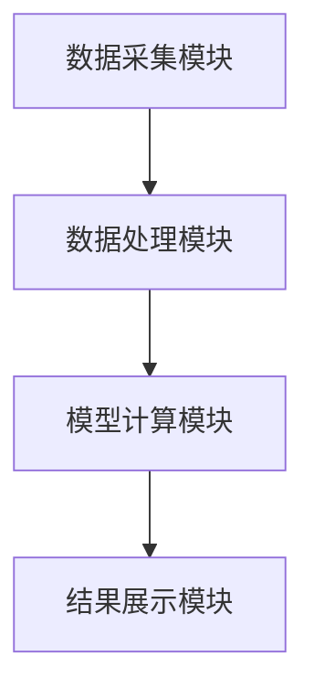
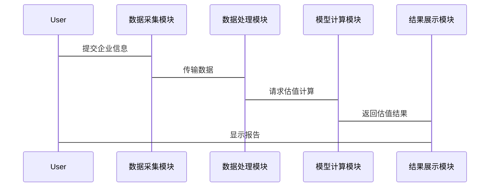

                 


# 股市估值在跨境无形资产评估中的应用

## 关键词：股市估值、跨境评估、无形资产、资产评估、技术分析、金融建模

## 摘要：  
本文探讨了股市估值在跨境无形资产评估中的应用，结合技术分析和金融建模方法，深入解析无形资产评估的核心概念、算法原理及系统架构。通过实际案例分析，展示了如何利用股市估值方法优化跨境无形资产评估流程，为相关领域从业者提供理论支持和实践指导。

---

## 第一部分: 股市估值在跨境无形资产评估中的应用概述

## 第1章: 股市估值与跨境无形资产评估的背景介绍

### 1.1 股市估值的定义与核心概念

#### 1.1.1 股市估值的基本概念  
股市估值是指通过对公司财务数据、市场表现和行业趋势的分析，估算公司股票的合理市场价格。常见的估值方法包括市盈率（P/E）、市净率（P/B）和现金流折现模型（DCF）等。

#### 1.1.2 无形资产的定义与特点  
无形资产是指企业拥有或控制的没有实物形态的资产，如专利权、商标权、商誉等。其特点是难以直接量化、依赖于市场认可度和具有较强的波动性。

#### 1.1.3 股市估值在无形资产评估中的重要性  
股市估值通过分析企业未来盈利能力，为无形资产评估提供了市场化的参考依据。尤其是在跨境评估中，股市估值能够帮助评估者快速了解目标企业的市场价值。

### 1.2 跨境无形资产评估的背景与挑战

#### 1.2.1 现代经济中无形资产的重要性  
随着知识经济的发展，无形资产在企业价值中的占比越来越高。尤其是在跨国并购中，无形资产评估已成为决定交易价格的关键因素之一。

#### 1.2.2 跨境评估的复杂性与特殊性  
跨境评估涉及不同国家的会计准则、税率差异和市场环境，增加了评估的复杂性。此外，跨国企业往往面临文化差异和法律障碍，进一步加剧了评估难度。

#### 1.2.3 当前市场中跨境无形资产评估的主要问题  
- 数据获取困难：不同国家的财务披露标准不一，难以找到统一的数据支持。  
- 市场波动性大：全球经济不确定性导致股市估值波动频繁。  
- 方法选择复杂：需要综合考虑多种评估方法的优缺点。

### 1.3 股市估值在跨境无形资产评估中的应用前景

#### 1.3.1 股市估值方法的优势  
- 市场导向：基于市场数据的估值方法能够反映资产的真实价值。  
- 实时性强：股市估值能够快速捕捉市场变化，适用于动态评估。  
- 可比性高：通过对比同类企业的估值，可以提高评估结果的准确性。

#### 1.3.2 股市估值在跨境评估中的潜在应用场景  
- 跨国并购中的无形资产定价。  
- 跨境企业上市前的资产评估。  
- 跨国专利交易的市场价值评估。

#### 1.3.3 股市估值方法的局限性与改进方向  
- 局限性：股市估值依赖于市场数据，存在较大的波动性。  
- 改进方向：结合机器学习和大数据分析，提高估值的准确性。

---

## 第二部分: 股市估值与无形资产评估的核心概念与联系

## 第2章: 股市估值的核心原理

### 2.1 股市估值的主要方法

#### 2.1.1 市盈率法  
市盈率法通过将企业的市盈率与行业平均水平进行对比，估算企业股票的合理价格。  
$$ P/E = \frac{Price}{Earnings} $$  

#### 2.1.2 市净率法  
市净率法基于企业的净资产价值进行估值。  
$$ P/B = \frac{Price}{Book\ Value} $$  

#### 2.1.3 现金流折现法  
现金流折现法通过将企业未来现金流折现，估算企业的整体价值。  
$$ V = \sum_{t=1}^{n} \frac{CF_t}{(1 + r)^t} $$  

#### 2.1.4 股权自由现金流模型  
股权自由现金流模型将企业的自由现金流折现，用于评估企业的股权价值。  
$$ FCFF = EBIT(1 - t) + Depreciation - Capital Expenditure $$  

### 2.2 股市估值的关键公式与数学模型

#### 2.2.1 市盈率公式  
$$ P/E = \frac{Price}{Earnings} $$  
例：假设某企业股价为50元，净利润为10元，则市盈率为5，低于行业平均值，说明企业股票可能被低估。

#### 2.2.2 市净率公式  
$$ P/B = \frac{Price}{Book\ Value} $$  
例：某企业股价为30元，每股净资产为15元，则市净率为2，高于行业平均值，说明企业股票可能被高估。

#### 2.2.3 现金流折现模型  
$$ V = \sum_{t=1}^{n} \frac{CF_t}{(1 + r)^t} $$  
其中，CF_t为企业未来第t年的现金流，r为折现率。

### 2.3 股市估值与无形资产评估的关系

#### 2.3.1 无形资产的市场价值评估  
无形资产的市场价值依赖于企业的盈利能力，而股市估值能够反映企业的市场表现。

#### 2.3.2 股市估值在无形资产评估中的应用  
通过分析企业的市盈率和市净率，可以快速估算无形资产的市场价值。

#### 2.3.3 无形资产评估的特殊性与挑战  
无形资产评估需要考虑企业未来的成长性，而股市估值仅能反映当前市场表现。

---

## 第三部分: 股市估值在跨境无形资产评估中的算法原理与系统架构

## 第4章: 股市估值在跨境无形资产评估中的算法原理

### 4.1 股市估值模型的构建

#### 4.1.1 数据采集与处理  
需要收集目标企业的财务数据、行业指数和市场数据。  
- 数据来源：企业财报、行业报告、股票价格数据。  
- 数据处理：清洗、转换和标准化。

#### 4.1.2 模型选择与优化  
根据企业特点选择合适的估值模型，并通过历史数据验证模型的准确性。

#### 4.1.3 模型验证与评估  
通过回测和实际案例分析，验证模型的有效性。

### 4.2 股市估值算法的实现

#### 4.2.1 市盈率计算算法  
$$ P/E = \frac{Price}{Earnings} $$  

#### 4.2.2 市净率计算算法  
$$ P/B = \frac{Price}{Book\ Value} $$  

#### 4.2.3 现金流折现算法  
$$ V = \sum_{t=1}^{n} \frac{CF_t}{(1 + r)^t} $$  

### 4.3 股市估值算法的优化与改进

#### 4.3.1 算法优化方法  
- 引入机器学习算法，提高估值的准确性。  
- 结合宏观经济指标，增强模型的鲁棒性。

#### 4.3.2 算法改进方向  
- 开发多因子估值模型，综合考虑多种因素。  
- 实现实时估值系统，满足跨境评估的需求。

---

## 第5章: 股市估值在跨境无形资产评估中的系统架构

### 5.1 系统功能设计

#### 5.1.1 数据采集模块  
负责收集企业财务数据、行业指数和市场数据。

#### 5.1.2 模型计算模块  
实现市盈率、市净率和现金流折现等估值方法。

#### 5.1.3 结果展示模块  
以可视化方式呈现估值结果，并支持导出报告。

### 5.2 系统架构设计

#### 5.2.1 系统架构图  


#### 5.2.2 系统交互流程  


---

## 第6章: 项目实战

### 6.1 环境安装

#### 6.1.1 安装Python
```bash
python --version
pip install --upgrade pip
```

#### 6.1.2 安装相关库
```bash
pip install pandas numpy matplotlib
```

### 6.2 核心实现源代码

#### 6.2.1 市盈率计算代码
```python
import pandas as pd

def calculate_pe(ticker):
    df = pd.read_csv(f'data/{ticker}.csv')
    pe = df['Close'] / df['Earnings_per_share'].mean()
    return pe

print(calculate_pe('AAPL'))
```

#### 6.2.2 市净率计算代码
```python
import pandas as pd

def calculate_pb(ticker):
    df = pd.read_csv(f'data/{ticker}.csv')
    pb = df['Close'] / df['Book_value_per_share'].mean()
    return pb

print(calculate_pb('MSFT'))
```

### 6.3 实际案例分析

#### 6.3.1 案例背景
某跨国企业计划收购一家科技公司，需要评估其无形资产价值。

#### 6.3.2 数据分析与结果解读
通过市盈率和市净率分析，得出目标企业的合理估值范围。

#### 6.3.3 案例总结
结合市场数据和企业基本面，最终确定无形资产的市场价值。

### 6.4 项目小结

---

## 第7章: 最佳实践与注意事项

### 7.1 关键点总结

#### 7.1.1 数据质量的重要性  
确保数据的准确性和完整性。

#### 7.1.2 模型选择的合理性  
根据具体情况选择合适的估值方法。

### 7.2 注意事项

#### 7.2.1 数据更新频率  
及时更新市场数据，确保估值结果的有效性。

#### 7.2.2 模型风险控制  
通过多模型对比，降低单一模型的风险。

### 7.3 拓展阅读

#### 7.3.1 推荐书籍  
- 《Financial Statement Analysis and Security Valuation》  
- 《跨国公司财务与估值》

#### 7.3.2 技术博客  
- [链接]

---

## 作者：AI天才研究院/AI Genius Institute & 禅与计算机程序设计艺术 /Zen And The Art of Computer Programming

