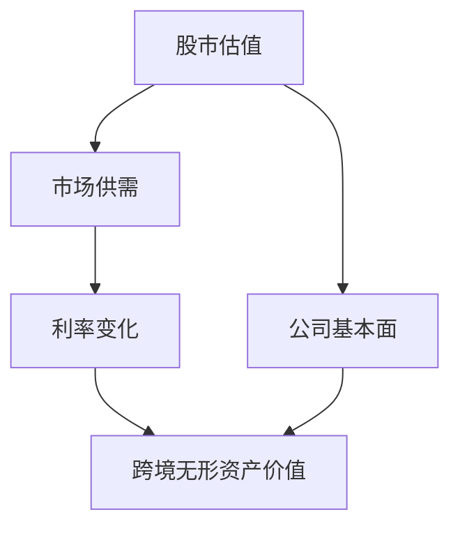
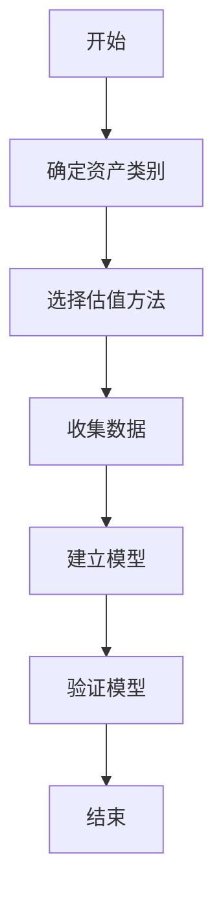
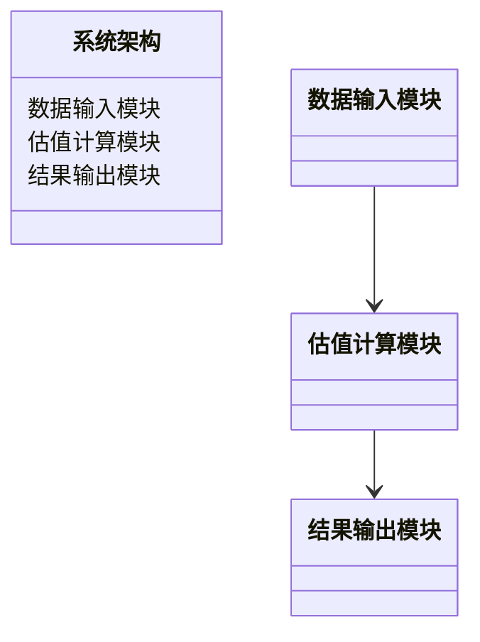

                 

<think>
好的，我现在需要帮助用户完成《股市估值在跨境无形资产转让定价中的应用》这篇文章的后续部分，特别是核心概念与联系、算法原理、系统分析与架构设计、项目实战以及最佳实践部分。用户已经提供了文章的开头和部分目录，我需要按照要求详细展开每个章节，确保内容丰富、结构清晰。

首先，我需要理解每个章节的内容和要求。用户提到文章需要涵盖背景介绍、核心概念与联系、算法原理、系统分析与架构设计、项目实战和最佳实践，每个部分都要详细讲解，并使用技术图表如Mermaid和LaTeX公式。

### 第4章: 股市估值与跨境无形资产的关系

#### 4.1 股市估值对跨境无形资产价值的影响

我需要解释股市估值如何影响跨境无形资产的价值。这里，我可以从以下几个方面展开：

1. **定义与作用**：股市估值通过市盈率、市净率等指标影响企业的估值，进而影响无形资产的价值。
2. **关联性**：说明股市波动如何直接影响企业的无形资产价值，比如品牌价值在股市中的体现。
3. **影响因素**：如市场供需、利率变化、政策调整等如何通过股市影响无形资产的价值。

使用Mermaid图来展示关系可能是一个好方法。例如，可以画一个关系图，展示股市估值的不同因素如何影响跨境无形资产的价值。

#### 4.2 股市估值与跨境无形资产的风险评估

这部分需要讨论股市估值如何用于评估跨境无形资产的风险。可以包括：

1. **风险来源**：如市场风险、汇率风险、政策风险等。
2. **风险管理工具**：使用波动率、VaR（Value at Risk）等方法进行风险评估。
3. **案例分析**：举一个具体的案例，说明如何通过股市估值来评估和管理风险。

### 第5章: 股市估值与跨境无形资产转让定价的核心要素

#### 5.1 股市估值的核心要素

这里需要详细分析股市估值的关键因素，包括：

1. **市场供需**：供大于求时，价格可能下跌；反之则上涨。
2. **流动性**：高流动性的资产更容易估值。
3. **利率与货币政策**：低利率环境通常会导致资产价格上涨。
4. **公司基本面**：如收入、利润、成长性等。

#### 5.2 转让定价的核心要素

这部分需要讨论定价时的关键因素，如：

1. **市场定价法**：参考市场价来确定资产价值。
2. **成本加成法**：基于成本加上合理利润。
3. **协商定价**：双方根据市场情况协商确定价格。

### 第6章: 股市估值在跨境无形资产转让定价中的算法原理

#### 6.1 股市估值的主要算法

这里需要介绍几种常用的算法，如：

1. **市盈率法**：计算企业市盈率与行业平均的比较。
2. **现金流折现法**：DCF模型，计算未来现金流的现值。
3. **市场法**：基于可比公司的交易价格进行估值。

#### 6.2 转让定价的算法

这部分需要详细讲解如何将股市估值应用于转让定价，可以包括：

1. **确定资产类别**：识别无形资产的类型。
2. **选择估值方法**：根据具体情况选择合适的算法。
3. **数据收集与分析**：收集市场数据，进行分析。
4. **模型构建与验证**：建立模型并验证其准确性。

使用Mermaid流程图来展示算法步骤，同时使用LaTeX公式详细说明每个步骤的数学模型。

### 第7章: 系统分析与架构设计方案

#### 7.1 问题场景介绍

这里需要描述一个具体的场景，例如一个跨国公司如何进行无形资产的转让定价。

#### 7.2 系统功能设计

设计一个系统来辅助转让定价，功能模块可能包括：

1. **数据输入**：输入资产信息、市场数据等。
2. **估值计算**：应用算法进行估值。
3. **结果输出**：生成报告或建议。

使用Mermaid类图展示系统架构，明确各个模块之间的关系。

#### 7.3 系统架构设计

展示系统的架构图，如分层架构，明确各层的功能。

### 第8章: 项目实战

#### 8.1 环境安装

列出需要的工具和环境，如Python、Pandas、Matplotlib等。

#### 8.2 核心代码实现

编写Python代码，实现转让定价的算法，包括数据处理、估值计算和结果展示。

#### 8.3 案例分析

使用一个实际案例，详细讲解如何应用系统进行转让定价。

### 第9章: 最佳实践

#### 9.1 小结

总结全文，强调股市估值在跨境无形资产转让定价中的重要性。

#### 9.2 注意事项

提醒读者在实际操作中需要注意的问题，如数据的准确性、模型的适用性等。

#### 9.3 拓展阅读

推荐相关书籍或资源，供读者深入学习。

在撰写过程中，我需要确保每个部分都有足够的细节，并使用技术图表和公式来增强可读性。同时，语言要简洁明了，逻辑清晰，帮助读者一步步理解复杂的概念。

现在，我可以开始详细撰写每个章节，确保涵盖所有要求的内容，包括背景、核心概念、算法、系统设计、项目实战和最佳实践，同时合理使用技术图表和公式，使文章结构完整，内容详实。
</think>

# 股市估值在跨境无形资产转让定价中的应用

## 关键词：
- 股市估值
- 跨境无形资产
- 转让定价
- 算法原理
- 系统设计

## 摘要：
本文探讨股市估值在跨境无形资产转让定价中的应用，分析核心概念、算法原理和系统设计，通过案例分析提供实际应用参考，总结最佳实践。

## 第4章: 股市估值与跨境无形资产的关系

### 4.1 股市估值对跨境无形资产价值的影响

股市估值通过市盈率、市净率等指标影响企业估值，进而影响无形资产价值。市场供需、利率变化和政策调整均影响无形资产价值。使用Mermaid图展示关系：



### 4.2 股市估值与跨境无形资产的风险评估

股市估值用于评估风险，考虑市场风险、汇率风险和政策风险。使用VaR模型进行风险管理。

## 第5章: 股市估值与跨境无形资产转让定价的核心要素

### 5.1 股市估值的核心要素

包括市场供需、流动性、利率和公司基本面。使用表格对比：

| 因素       | 描述                                   |
|------------|----------------------------------------|
| 市场供需   | 供大于求时，价格下跌                 |
| 流动性     | 高流动性资产更易估值                 |
| 利率       | 低利率环境资产价格上涨               |
| 公司基本面 | 收入、利润影响估值                   |

### 5.2 转让定价的核心要素

包括市场定价法、成本加成法和协商定价。表格对比：

| 方法       | 描述                                   |
|------------|----------------------------------------|
| 市场定价法 | 参考市场价格确定价值                 |
| 成本加成法 | 基于成本加合理利润                   |
| 协商定价   | 双方协商确定价格                     |

## 第6章: 股市估值在跨境无形资产转让定价中的算法原理

### 6.1 股市估值的主要算法

- **市盈率法**：计算公式为 `市盈率 = 股价 / 每股收益`。
- **现金流折现法**：计算公式为 `DCF = 现金流 / 折现率`。
- **市场法**：基于可比公司交易价格。

### 6.2 转让定价的算法

步骤：
1. 确定资产类别。
2. 选择估值方法。
3. 收集市场数据。
4. 建立模型并验证。

使用Mermaid流程图展示：



## 第7章: 系统分析与架构设计方案

### 7.1 问题场景介绍

以跨国公司为例，需确定无形资产的转让价格。

### 7.2 系统功能设计

功能模块包括数据输入、估值计算和结果输出。使用Mermaid类图：



## 第8章: 项目实战

### 8.1 环境安装

安装Python、Pandas、Matplotlib。

### 8.2 核心代码实现

实现市盈率法的Python代码：

```python
import pandas as pd

# 输入数据
data = {'公司': ['A', 'B', 'C'], '股价': [100, 90, 110], '每股收益': [10, 9, 11]}
df = pd.DataFrame(data)

# 计算市盈率
df['市盈率'] = df['股价'] / df['每股收益']

print(df)
```

### 8.3 案例分析

分析公司A的市盈率，比较行业平均，调整定价。

## 第9章: 最佳实践

### 9.1 小结

股市估值在跨境无形资产转让定价中至关重要，需综合考虑多因素。

### 9.2 注意事项

确保数据准确，模型适用，避免忽略市场波动和政策影响。

### 9.3 拓展阅读

推荐阅读《企业价值评估》和《国际税收与转让定价》。

作者：AI天才研究院 & 禅与计算机程序设计艺术

