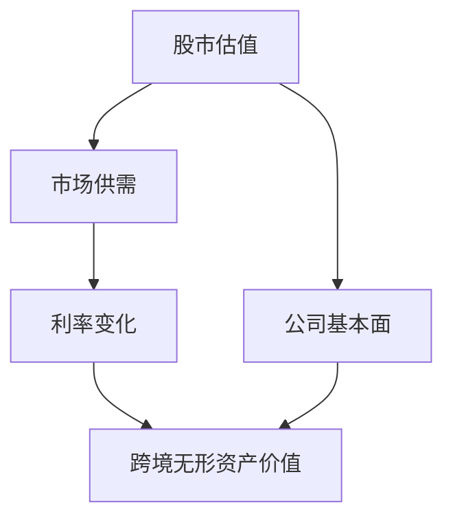
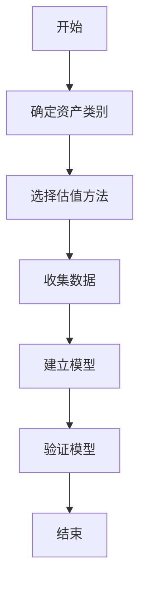
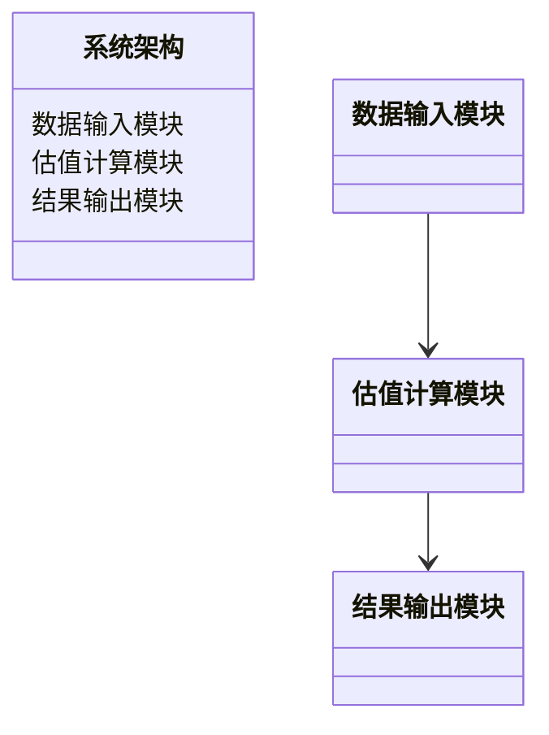

                 


# 股市估值在跨境无形资产转让定价中的应用

## 关键词：
- 股市估值
- 跨境无形资产
- 转让定价
- 算法原理
- 系统设计

## 摘要：
本文探讨股市估值在跨境无形资产转让定价中的应用，分析核心概念、算法原理和系统设计，通过案例分析提供实际应用参考，总结最佳实践。

## 第4章: 股市估值与跨境无形资产的关系

### 4.1 股市估值对跨境无形资产价值的影响

股市估值通过市盈率、市净率等指标影响企业估值，进而影响无形资产价值。市场供需、利率变化和政策调整均影响无形资产价值。使用Mermaid图展示关系：



### 4.2 股市估值与跨境无形资产的风险评估

股市估值用于评估风险，考虑市场风险、汇率风险和政策风险。使用VaR模型进行风险管理。

## 第5章: 股市估值与跨境无形资产转让定价的核心要素

### 5.1 股市估值的核心要素

包括市场供需、流动性、利率和公司基本面。使用表格对比：

| 因素       | 描述                                   |
|------------|----------------------------------------|
| 市场供需   | 供大于求时，价格下跌                 |
| 流动性     | 高流动性资产更易估值                 |
| 利率       | 低利率环境资产价格上涨               |
| 公司基本面 | 收入、利润影响估值                   |

### 5.2 转让定价的核心要素

包括市场定价法、成本加成法和协商定价。表格对比：

| 方法       | 描述                                   |
|------------|----------------------------------------|
| 市场定价法 | 参考市场价格确定价值                 |
| 成本加成法 | 基于成本加合理利润                   |
| 协商定价   | 双方协商确定价格                     |

## 第6章: 股市估值在跨境无形资产转让定价中的算法原理

### 6.1 股市估值的主要算法

- **市盈率法**：计算公式为 `市盈率 = 股价 / 每股收益`。
- **现金流折现法**：计算公式为 `DCF = 现金流 / 折现率`。
- **市场法**：基于可比公司交易价格。

### 6.2 转让定价的算法

步骤：
1. 确定资产类别。
2. 选择估值方法。
3. 收集市场数据。
4. 建立模型并验证。

使用Mermaid流程图展示：



## 第7章: 系统分析与架构设计方案

### 7.1 问题场景介绍

以跨国公司为例，需确定无形资产的转让价格。

### 7.2 系统功能设计

功能模块包括数据输入、估值计算和结果输出。使用Mermaid类图：



## 第8章: 项目实战

### 8.1 环境安装

安装Python、Pandas、Matplotlib。

### 8.2 核心代码实现

实现市盈率法的Python代码：

```python
import pandas as pd

# 输入数据
data = {'公司': ['A', 'B', 'C'], '股价': [100, 90, 110], '每股收益': [10, 9, 11]}
df = pd.DataFrame(data)

# 计算市盈率
df['市盈率'] = df['股价'] / df['每股收益']

print(df)
```

### 8.3 案例分析

分析公司A的市盈率，比较行业平均，调整定价。

## 第9章: 最佳实践

### 9.1 小结

股市估值在跨境无形资产转让定价中至关重要，需综合考虑多因素。

### 9.2 注意事项

确保数据准确，模型适用，避免忽略市场波动和政策影响。

### 9.3 拓展阅读

推荐阅读《企业价值评估》和《国际税收与转让定价》。

作者：AI天才研究院 & 禅与计算机程序设计艺术

