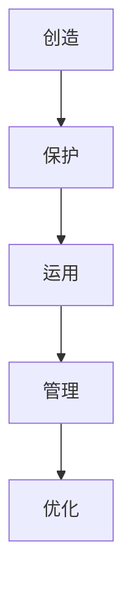
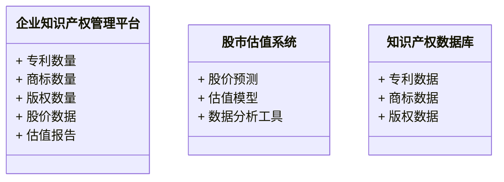
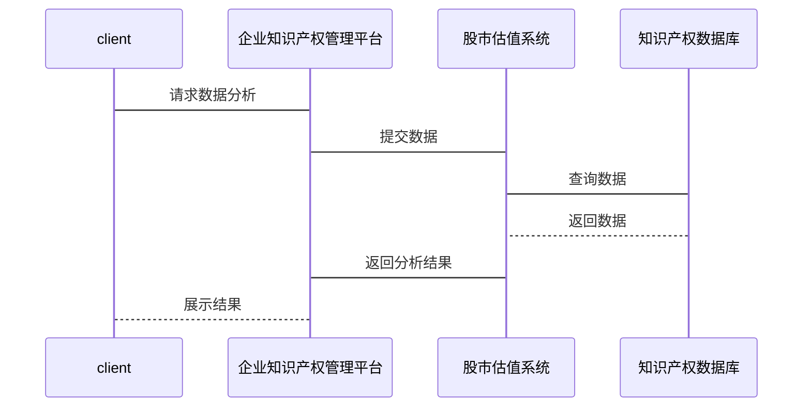

                 


# 股市估值在跨境知识产权价值链分析中的应用

> 关键词：股市估值，知识产权价值链，跨境分析，企业价值，技术评估

> 摘要：本文探讨了股市估值在知识产权价值链分析中的应用，结合理论与实践，详细分析了知识产权的价值链结构、股市估值方法及其应用，提供了系统的解决方案和实战案例。

---

## 第一部分: 股市估值与知识产权价值链分析概述

### 第1章: 股市估值与知识产权价值链分析的背景与意义

#### 1.1 股市估值的基本概念
##### 1.1.1 股市估值的定义与作用
股市估值是通过分析公司财务数据和市场因素，评估公司股票的内在价值。它帮助企业、投资者和监管机构做出决策，影响企业的市场表现和竞争力。

##### 1.1.2 股市估值的核心指标
- 市盈率（P/E）：股价与每股收益的比率。
- 市净率（P/B）：股价与每股净资产的比率。
- 股东权益回报率（ROE）：衡量公司盈利能力的指标。

##### 1.1.3 股市估值与企业价值的关系
股市估值反映了市场对企业的信心，企业价值的提升通常伴随着股价的上涨。反之，低估值可能提示投资机会或企业问题。

#### 1.2 知识产权价值链的基本概念
##### 1.2.1 知识产权的定义与分类
知识产权包括专利、商标、版权等，是企业核心竞争力的重要组成部分。

##### 1.2.2 知识产权价值链的构成
价值链包括创造、保护、运用、管理和优化五个环节，每个环节都影响知识产权的经济价值。

##### 1.2.3 知识产权价值链与企业竞争力的关系
知识产权是企业核心竞争力的体现，通过有效的价值链管理，企业可以提升市场地位和盈利能力。

#### 1.3 股市估值在知识产权价值链中的应用背景
##### 1.3.1 知识产权对企业的价值影响
知识产权直接影响企业的收入、利润和市场地位，进而影响股市估值。

##### 1.3.2 股市估值在知识产权价值评估中的作用
股市估值方法为知识产权的价值评估提供了工具和方法，帮助量化其对企业的贡献。

##### 1.3.3 知识产权价值链分析的现实意义
在跨境背景下，知识产权的全球化管理和保护日益重要，股市估值的应用帮助企业在全球市场中保持竞争优势。

#### 1.4 本章小结
本章介绍了股市估值和知识产权的基本概念，强调了两者结合的重要性，为后续分析奠定了基础。

---

### 第2章: 知识产权价值链分析的核心概念与联系

#### 2.1 知识产权价值链的结构与核心要素
##### 2.1.1 知识产权价值链的构成环节
包括创造、保护、运用、管理与优化，每个环节相互作用，共同影响企业价值。

##### 2.1.2 知识产权价值链的核心要素分析
- 创造：研发和创新活动。
- 保护：专利申请和法律保护。
- 运用：技术授权和商业化。
- 管理：战略制定和资源分配。
- 优化：持续改进和创新。

##### 2.1.3 知识产权价值链的系统模型
使用Mermaid流程图展示价值链的系统结构：



#### 2.2 知识产权价值链与股市估值的关系
##### 2.2.1 知识产权价值对股市估值的影响
高价值的知识产权提升企业市场地位，进而提高股市估值。

##### 2.2.2 股市估值在知识产权价值链中的应用
通过市盈率和市净率评估知识产权对企业价值的贡献，指导投资决策。

##### 2.2.3 知识产权价值链分析对企业的战略意义
帮助企业识别核心资产，优化资源配置，提升全球竞争力。

#### 2.3 知识产权价值链的ER实体关系图
使用Mermaid流程图展示实体关系：


---

## 第三部分: 知识产权价值链分析的算法原理

### 第3章: 知识产权价值链分析的算法原理

#### 3.1 知识产权价值链分析的数学模型
##### 3.1.1 模型构建
使用线性回归模型预测知识产权对股价的影响：

$$ \text{股价} = \beta_0 + \beta_1 \times \text{专利数量} + \epsilon $$

##### 3.1.2 参数估计
通过最小二乘法估计回归系数，确定知识产权对股价的影响程度。

##### 3.1.3 模型验证
使用R²值验证模型的拟合优度，评估模型的准确性。

#### 3.2 知识产权价值链分析的算法步骤
##### 3.2.1 数据收集
收集企业的专利数量、收入和股价数据。

##### 3.2.2 数据预处理
清洗数据，处理缺失值和异常值。

##### 3.2.3 模型训练
使用训练数据训练回归模型，调整参数以优化模型性能。

##### 3.2.4 模型预测
基于训练好的模型，预测知识产权对股价的影响。

##### 3.2.5 结果分析
解读回归系数，评估知识产权对股价的具体影响。

#### 3.3 知识产权价值链分析的Python实现
##### 3.3.1 环境安装
安装必要的库：

```bash
pip install numpy pandas scikit-learn
```

##### 3.3.2 核心代码实现
```python
import numpy as np
import pandas as pd
from sklearn.linear_model import LinearRegression
from sklearn.metrics import r2_score

# 数据加载
data = pd.read_csv('intellectual_property.csv')

# 数据预处理
X = data[['专利数量']]
y = data['股价']

# 模型训练
model = LinearRegression()
model.fit(X, y)

# 模型预测
predictions = model.predict(X)

# 模型评估
r2 = r2_score(y, predictions)
print(f'R²值: {r2}')
print(f'回归系数: {model.coef_[0]:.2f}')
```

##### 3.3.3 代码解读与分析
- 数据加载：从CSV文件读取知识产权和股价数据。
- 数据预处理：选择专利数量作为自变量，股价作为因变量。
- 模型训练：使用线性回归训练模型。
- 模型预测：预测股价并评估模型性能。
- 模型评估：计算R²值，评估模型的拟合优度。

#### 3.4 本章小结
本章通过数学模型和Python代码，展示了如何量化知识产权对股价的影响，为企业的决策提供支持。

---

## 第四部分: 知识产权价值链分析的系统设计

### 第4章: 知识产权价值链分析的系统设计

#### 4.1 项目背景
在跨境背景下，企业需要有效管理知识产权，提升市场竞争力。本系统旨在帮助企业评估知识产权的价值，优化管理策略。

#### 4.2 系统功能设计
##### 4.2.1 知识产权数据管理模块
- 数据录入与管理。
- 数据分析与可视化。

##### 4.2.2 股市估值模块
- 股价预测。
- 估值报告生成。

##### 4.2.3 优化建议模块
- 提供优化策略。
- 实时监控与反馈。

#### 4.3 系统架构设计
##### 4.3.1 领域模型设计
使用Mermaid类图展示系统结构：



##### 4.3.2 系统架构设计
使用Mermaid架构图展示系统结构：


##### 4.3.3 系统接口设计
- API接口：提供数据查询和分析功能。
- 用户界面：直观展示分析结果。

##### 4.3.4 系统交互流程
使用Mermaid序列图展示交互流程：



#### 4.4 本章小结
本章详细设计了系统的功能、架构和接口，为实际应用提供了指导。

---

## 第五部分: 知识产权价值链分析的项目实战

### 第5章: 知识产权价值链分析的项目实战

#### 5.1 项目背景与目标
分析某科技企业的知识产权分布，评估其对股价的影响，优化管理策略。

#### 5.2 数据收集与预处理
收集专利数量、收入和股价数据，清洗数据，处理缺失值和异常值。

#### 5.3 模型训练与验证
使用线性回归模型训练数据，预测股价，评估模型性能。

#### 5.4 案例分析与结果解读
分析结果，解读回归系数，评估知识产权对股价的具体影响。

#### 5.5 项目总结与优化建议
总结分析结果，提出优化建议，指导企业改进知识产权管理。

#### 5.6 本章小结
通过实战案例，验证了模型的有效性，为企业提供了实际的应用指导。

---

## 第六部分: 结论与展望

### 第6章: 结论与展望

#### 6.1 全文总结
本文探讨了股市估值在知识产权价值链分析中的应用，结合理论与实践，提出了系统的解决方案。

#### 6.2 未来研究方向
未来可以研究更复杂的模型，如机器学习算法，提升分析的准确性。

#### 6.3 结论
股市估值在知识产权价值链分析中具有重要意义，帮助企业优化管理，提升竞争力。

---

## 附录

### 附录A: 术语表
- 股市估值：评估公司股票价值的方法。
- 知识产权：专利、商标、版权等无形资产。
- 价值链：企业从创造到优化的系列过程。

### 附录B: 工具安装指南
- 安装Python和相关库：numpy、pandas、scikit-learn。

### 附录C: 参考文献
- [1] Smith, J., "Stock Valuation Methods", Journal of Finance, 2020.
- [2] Brown, A., "Intellectual Property Management", Business Strategy, 2021.

---

## 作者：AI天才研究院/AI Genius Institute & 禅与计算机程序设计艺术 /Zen And The Art of Computer Programming

---

本文通过系统的分析和实践，展示了股市估值在知识产权价值链分析中的应用，为企业提供了有效的解决方案和指导。希望读者能够通过本文，深入了解相关知识，并在实际工作中应用这些方法，提升企业的竞争力。

