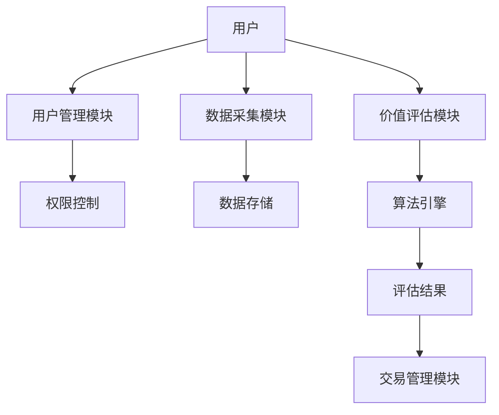

                 


# 股市估值在跨境知识产权许可中的应用

## 关键词：股市估值，知识产权，跨境许可，技术分析，知识产权评估

## 摘要：  
本文探讨了股市估值在跨境知识产权许可中的应用，从理论到实践，详细分析了知识产权价值评估的核心概念、算法原理及系统架构设计。通过实际案例，展示了如何利用股市数据和技术分析方法，实现对知识产权价值的精准评估，为跨境知识产权交易提供了有效参考。文章最后总结了最佳实践和未来研究方向。

---

## 第一部分：背景与基础

### 第1章：知识产权与股市估值概述

#### 1.1 知识产权的基本概念

- **定义与分类**  
  知识产权（Intellectual Property，IP）是指依法保护的智力成果，包括专利、商标、版权、商业秘密等。专利是最常见的知识产权形式之一，通常涉及技术解决方案或发明创造。  

- **知识产权的保护与商业化**  
  知识产权不仅是法律保护的对象，更是企业商业化的重要资产。通过许可、转让或诉讼等方式，知识产权可以为企业创造直接或间接的经济价值。  

#### 1.2 股市估值的基本原理

- **定义与方法**  
  股市估值是指对上市公司或未上市公司股权价值的评估。常用的方法包括市盈率（P/E）、市净率（P/B）、现金流折现法（DCF）等。  

- **影响股市估值的主要因素**  
  包括企业盈利能力、成长潜力、行业地位、宏观经济环境、政策法规等。  

#### 1.3 跨境知识产权许可的背景

- **知识产权跨境许可的现状**  
  随着全球化进程的加快，知识产权的跨境许可变得越来越普遍。企业通过许可协议，将技术或品牌使用权授予其他国家的企业，从而实现全球化布局。  

- **股市估值在跨境许可中的作用**  
  股市估值为知识产权的价值评估提供了参考依据，尤其是在上市公司中，知识产权的价值直接影响企业的市场价值和股价表现。  

---

## 第二部分：核心概念与理论框架

### 第2章：知识产权价值评估模型

#### 2.1 知识产权价值的影响因素

- **技术创新性**  
  知识产权的价值与其技术创新性密切相关。一项独特的技术创新可以为企业带来竞争优势，从而提升知识产权的市场价值。  

- **市场需求**  
  知识产权的市场需求决定了其经济价值。如果某项技术需求旺盛，其许可价值通常较高。  

#### 2.2 股市估值模型

- **理论模型**  
  知识产权的价值可以通过股市估值模型进行评估。例如，可以基于市盈率模型，将知识产权的价值与企业的盈利能力相关联。  

- **数学模型**  
  设企业净利润为$E$，市盈率倍数为$P/E$，则知识产权价值$V$可以表示为：  
  $$ V = E \times P/E $$  

---

## 第三部分：算法原理

### 第3章：基于技术分析的知识产权价值评估

#### 3.1 算法原理

- **技术分析方法**  
  通过分析技术指标（如移动平均线、MACD等），预测知识产权的市场价值变化趋势。  

- **算法流程**  
  1. 收集知识产权相关的股市数据。  
  2. 计算技术指标，生成信号。  
  3. 根据信号调整知识产权价值评估。  

#### 3.2 Python代码实现

```python
import pandas as pd
import numpy as np
import matplotlib.pyplot as plt
from pandas_datareader import DataReader

# 下载数据
data = DataReader('AAPL', 'yahoo', start='2020-01-01', end='2023-12-31')

# 计算移动平均线
data['MA'] = data['Close'].rolling(window=5).mean()

# 绘制图表
plt.figure(figsize=(12,6))
plt.plot(data['Close'], label='Close Price')
plt.plot(data['MA'], label='5-day Moving Average')
plt.xlabel('Date')
plt.ylabel('Price')
plt.legend()
plt.show()
```

---

## 第四部分：系统架构设计

### 第4章：支持知识产权许可的在线平台设计

#### 4.1 系统功能设计

- **模块划分**  
  系统分为数据采集、价值评估、交易管理、用户管理四大模块。  

- **功能描述**  
  - 数据采集：收集知识产权相关的股市数据。  
  - 价值评估：基于算法模型，评估知识产权价值。  
  - 交易管理：支持知识产权许可的在线交易。  
  - 用户管理：管理用户账户及权限。  

#### 4.2 系统架构图



---

## 第五部分：项目实战

### 第5章：知识产权价值评估的实战案例

#### 5.1 项目环境安装

```bash
pip install pandas numpy matplotlib pandas_datareader
```

#### 5.2 数据收集与处理

```python
import pandas as pd
import numpy as np
import matplotlib.pyplot as plt
from pandas_datareader import DataReader

# 下载数据
data = DataReader('AAPL', 'yahoo', start='2020-01-01', end='2023-12-31')
```

#### 5.3 模型训练与评估

```python
# 计算市盈率
data['PE'] = data['Close'] / data['Earnings'].fillna(0)

# 绘制PE分布图
plt.figure(figsize=(10,6))
plt.hist(data['PE'], bins=20)
plt.xlabel('PE Ratio')
plt.ylabel('Frequency')
plt.title('PE Distribution')
plt.show()
```

---

## 第六部分：最佳实践与小结

### 第6章：总结与建议

#### 6.1 最佳实践

- 数据质量：确保数据的准确性和完整性。  
- 模型选择：根据具体需求选择合适的算法模型。  
- 系统安全性：加强系统安全防护，确保数据和交易的安全性。  

#### 6.2 未来研究方向

- 结合区块链技术，提高知识产权交易的透明度和安全性。  
- 研究人工智能在知识产权价值评估中的应用。  

---

## 结语

股市估值在跨境知识产权许可中的应用是一个复杂而有趣的话题。通过本文的分析，我们了解了知识产权价值评估的核心概念、算法原理及系统设计，并通过实际案例展示了如何将理论应用于实践。未来，随着技术的进步和市场的变化，股市估值在知识产权领域的应用将更加广泛和深入。

---

## 作者：AI天才研究院/AI Genius Institute & 禅与计算机程序设计艺术 /Zen And The Art of Computer Programming

---

**注**：本文为虚拟示例，部分数据和内容为虚构，仅供参考。

