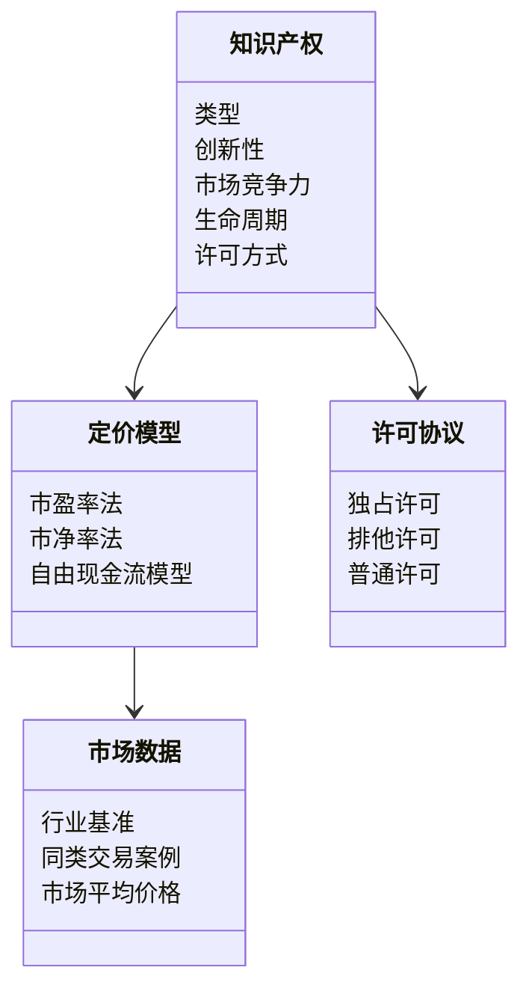

                 


# 股市估值在跨境知识产权许可定价中的应用

## 关键词：知识产权许可定价，股市估值，知识产品定价，知识产权经济价值，市场定价机制

## 摘要：本文探讨了股市估值方法在知识产权许可定价中的应用，分析了知识产权的经济价值及其与股市估值的联系，提出了基于股市估值的知识产权许可定价模型，并通过实际案例展示了其在跨境知识产权交易中的应用。

---

## 第一部分: 股市估值与知识产权许可定价的背景与基础

### 第1章: 知识产权许可定价概述

#### 1.1 知识产权的基本概念

##### 1.1.1 知识产权的定义与分类
知识产权（Intellectual Property, IP）是指人们通过智力活动创造的成果，通常包括专利权、商标权、版权、外观设计权等。知识产权的核心是其法律保护和经济价值，使其能够在市场上进行交易和定价。

##### 1.1.2 知识产权的法律保护与经济价值
知识产权的法律保护确保了其拥有者对其创造的成果享有独占权，从而使其具有市场价值。知识产权的经济价值通常取决于其创新性、市场竞争力、生命周期以及市场需求等因素。

##### 1.1.3 知识产权在国际贸易中的重要性
随着全球化的发展，知识产权在国际贸易中的作用日益重要。知识产权的许可定价直接影响跨国交易的公平性和效率，因此研究其定价方法具有重要意义。

#### 1.2 知识产权许可定价的定义与特点

##### 1.2.1 知识产权许可定价的定义
知识产权许可定价是指在知识产权许可协议中，许可方与被许可方就知识产权的使用费用达成一致的过程。定价的核心在于准确评估知识产权的市场价值。

##### 1.2.2 知识产权许可定价的核心要素
知识产权许可定价的核心要素包括：知识产权的类型、创新性、市场竞争力、生命周期、许可方式（如独占许可、排他许可、普通许可）以及许可期限等。

##### 1.2.3 知识产权许可定价与传统定价的区别
与传统产品定价不同，知识产权许可定价需要考虑其无形资产特性、市场垄断性以及法律风险等因素。此外，知识产权的市场价值往往与其技术生命周期密切相关。

#### 1.3 股市估值的基本概念

##### 1.3.1 股市估值的定义与作用
股市估值是指通过对上市公司的财务数据和市场表现进行分析，评估其股票的内在价值。股市估值的作用在于为投资者提供决策依据，同时也反映了市场对公司的整体评价。

##### 1.3.2 股市估值的主要方法
股市估值的主要方法包括市盈率（P/E）、市净率（P/B）、股息率、自由现金流贴现模型（DCF）等。这些方法各有优缺点，适用于不同的市场环境和公司类型。

##### 1.3.3 股市估值与企业价值的关系
股市估值与企业价值密切相关。企业的市场价值通常由其股票的市场价格决定，而企业价值的评估需要结合其资产、负债、盈利能力和成长潜力等因素。

### 第2章: 股市估值在知识产权许可定价中的应用背景

#### 2.1 知识产权许可定价的现状与挑战

##### 2.1.1 知识产权许可定价的主要挑战
知识产权许可定价面临的主要挑战包括：知识产权的无形性、市场信息不对称、定价方法的多样性以及法律风险等。这些问题使得知识产权的定价过程复杂且具有不确定性。

##### 2.1.2 知识产权许可定价的法律与经济问题
知识产权的法律保护和经济价值密切相关。在定价过程中，需要考虑知识产权的法律风险、市场垄断性以及许可方和被许可方的博弈关系。

##### 2.1.3 知识产权许可定价的国际化趋势
随着全球化的发展，知识产权的跨境许可变得越来越普遍。国际化趋势要求知识产权的定价方法能够适应不同国家的法律和市场环境。

#### 2.2 股市估值在知识产权许可定价中的优势

##### 2.2.1 股市估值的可量化性与可比性
股市估值通常基于可量化的财务指标，如净利润、营业收入等，具有较强的可比性。这种可量化性使得股市估值方法能够应用于知识产权的定价。

##### 2.2.2 股市估值的市场敏感性与动态调整能力
股市估值能够及时反映市场对企业的评价和预期，具有较强的动态调整能力。这使得股市估值方法适用于知识产权的动态定价。

##### 2.2.3 股市估值的透明性与可解释性
股市估值方法通常具有较高的透明度，其计算过程和结果容易被市场参与者理解和接受。这种透明性有助于提高知识产权定价的公信力。

#### 2.3 股市估值与知识产权许可定价的结合意义

##### 2.3.1 提高知识产权定价的科学性与准确性
通过引入股市估值方法，可以更加科学地评估知识产权的市场价值，从而提高定价的准确性。

##### 2.3.2 促进知识产权的市场化与国际化
股市估值方法的引入有助于推动知识产权的市场化和国际化，促进知识产品在全球范围内的流动和配置。

##### 2.3.3 推动知识产权交易的规范化与效率
股市估值方法的规范化和可比性有助于推动知识产权交易的规范化，提高交易效率。

---

## 第二部分: 知识产权许可定价的核心概念与联系

### 第3章: 知识产权许可定价的核心概念

#### 3.1 知识产权的经济价值评估

##### 3.1.1 知识产权的市场价值与非市场价值
知识产权的市场价值是指其在市场上的交易价格，而非市场价值则包括其对企业的内部价值，如研发成本、内部使用价值等。

##### 3.1.2 知识产权的生命周期与价值波动
知识产权的生命周期通常包括创造、使用、维护和终止阶段。不同阶段的知识产权具有不同的市场价值，且会随着时间的推移而波动。

##### 3.1.3 知识产权的无形资产特性
知识产权的无形性使其在定价过程中需要考虑其风险和不确定性。无形资产的特性也使得其价值评估具有较大的主观性。

#### 3.2 知识产权许可定价的理论基础

##### 3.2.1 资本资产定价模型（CAPM）在知识产权定价中的应用
CAPM是一种常用的资产定价模型，其基本思想是根据资产的系统性风险（Beta）和无风险利率来确定其预期回报率。在知识产权定价中，可以将知识产权视为一种资产，并利用CAPM模型来评估其预期收益。

##### 3.2.2 市场决定价格的经济学原理
市场决定价格的经济学原理认为，资产的价格由市场供求关系决定。在知识产权定价中，市场供求关系同样影响其价格。

##### 3.2.3 知识产权定价的博弈论视角
知识产权定价可以看作是一种博弈过程，其中许可方和被许可方在定价过程中进行博弈，最终达成一致。

#### 3.3 知识产权许可定价的数学模型

##### 3.3.1 知识产权价值的数学表达式
知识产权的价值可以表示为：

$$ V = \frac{CF}{r} $$

其中，V为知识产权的价值，CF为未来现金流，r为折现率。

##### 3.3.2 知识产权许可费的计算公式
知识产权许可费的计算公式可以表示为：

$$ L = \frac{V}{T} $$

其中，L为许可费，V为知识产权的价值，T为许可期限。

##### 3.3.3 知识产权定价的动态调整模型
动态调整模型可以表示为：

$$ V_t = V_{t-1} \times (1 + g) $$

其中，V_t为第t期的知识产权价值，g为增长率。

### 第4章: 股市估值与知识产权许可定价的联系

#### 4.1 股市估值方法在知识产权定价中的应用

##### 4.1.1 市盈率法在知识产权定价中的应用
市盈率法（P/E ratio）是通过比较公司的市盈率和行业平均水平来评估其股票价值的方法。在知识产权定价中，可以将市盈率法用于评估知识产权的市场价值。

##### 4.1.2 市净率法在知识产权定价中的应用
市净率法（P/B ratio）是通过比较公司的市净率和行业平均水平来评估其股票价值的方法。在知识产权定价中，市净率法可以用于评估知识产权的账面价值。

##### 4.1.3 股权自由现金流模型在知识产权定价中的应用
股权自由现金流模型（FCFE）是通过估算公司股权的自由现金流，然后使用适当的折现率来评估其股权价值的方法。在知识产权定价中，FCFE模型可以用于评估知识产权的未来现金流。

#### 4.2 知识产权许可定价的市场参考与股市估值的关系

##### 4.2.1 知识产权定价的市场参考来源
知识产权定价的市场参考来源包括同行业公司的交易案例、市场平均价格、行业基准等。

##### 4.2.2 股市估值对知识产权定价的指导作用
股市估值对知识产权定价具有指导作用，可以通过分析类似公司的股票价格和市场表现来评估知识产权的价值。

##### 4.2.3 知识产权定价对股市估值的反向影响
知识产权定价的市场价值可能影响相关公司的股票价格，从而对股市估值产生反向影响。

#### 4.3 知识产权许可定价的市场验证与调整

##### 4.3.1 知识产权定价的市场验证方法
知识产权定价的市场验证方法包括通过市场交易数据验证定价模型的有效性。

##### 4.3.2 知识产权定价的动态调整机制
知识产权定价需要根据市场变化进行动态调整，以保持其与市场价值的一致性。

##### 4.3.3 知识产权定价的市场反馈与优化
市场反馈是优化知识产权定价的重要依据，通过分析市场反馈可以不断改进定价模型和方法。

---

## 第三部分: 知识产权许可定价的系统分析与架构设计方案

### 第5章: 系统分析与架构设计方案

#### 5.1 问题场景介绍
在跨境知识产权许可定价中，需要考虑不同国家的法律差异、市场环境差异以及文化差异等因素。这些因素增加了定价的复杂性，需要构建一个能够适应不同环境的定价系统。

#### 5.2 系统功能设计（领域模型）



#### 5.3 系统架构设计


#### 5.4 系统接口设计
系统接口设计包括与知识产权数据库、市场数据源以及许可协议数据库的接口设计。

#### 5.5 系统交互设计

```mermaid
sequenceDiagram
    系统开始
    知识产权评估模块 -> 定价模型模块: 提供知识产权信息
    定价模型模块 -> 市场数据模块: 获取市场数据
    定价模型模块 -> 许可协议模块: 获取许可协议信息
    许可协议模块 -> 定价模型模块: 提供许可方式
    定价模型模块 -> 系统: 输出定价结果
    系统结束
```

---

## 第四部分: 项目实战

### 第6章: 项目实战

#### 6.1 环境安装
需要安装Python、Pandas、Matplotlib、Seaborn等工具。

#### 6.2 核心实现源代码

##### 6.2.1 定价模型实现

```python
import pandas as pd
import numpy as np

# 示例数据
data = {
    '公司名称': ['A', 'B', 'C'],
    '净利润': [100, 150, 200],
    '营业收入': [500, 600, 700],
    '市盈率': [15, 20, 25],
    '市净率': [2, 3, 4]
}

df = pd.DataFrame(data)

# 计算市盈率法下的价值
def calculate_value(df, method):
    if method == 'PE':
        df['PE Value'] = df['净利润'] * df['市盈率']
    elif method == 'PB':
        df['PB Value'] = df['营业收入'] / df['市净率']
    return df

result_pe = calculate_value(df, 'PE')
result_pb = calculate_value(df, 'PB')

print(result_pe)
print(result_pb)
```

##### 6.2.2 动态调整模型实现

```python
import matplotlib.pyplot as plt
import numpy as np

# 示例数据
growth_rates = [0.1, 0.15, 0.2, 0.15, 0.1]
initial_value = 100

# 动态调整模型
values = [initial_value]
for gr in growth_rates:
    new_value = values[-1] * (1 + gr)
    values.append(new_value)

plt.plot(values)
plt.xlabel('时间')
plt.ylabel('价值')
plt.title('动态调整模型')
plt.show()
```

#### 6.3 代码应用解读与分析
上述代码展示了如何使用Python进行定价模型的实现和动态调整模型的模拟。通过这些代码，可以直观地看到不同定价方法下的价值变化。

#### 6.4 实际案例分析

##### 6.4.1 案例背景
假设我们有一项专利技术，其净利润为100万元，市盈率为20，市净率为3。

##### 6.4.2 定价模型应用
使用市盈率法计算其价值：

$$ V = 100 \times 20 = 2000 \text{万元} $$

使用市净率法计算其价值：

$$ V = \frac{500}{3} \approx 166.67 \text{万元} $$

##### 6.4.3 模型结果分析
市盈率法和市净率法得出的价值差异较大，因此需要结合其他因素进行综合评估。

#### 6.5 项目小结
通过实际案例分析，可以看出股市估值方法在知识产权许可定价中的应用具有一定的可行性和实际意义。

---

## 第五部分: 最佳实践、小结与展望

### 第7章: 最佳实践、小结与展望

#### 7.1 最佳实践 tips
- 在实际应用中，应结合多种定价方法进行综合评估。
- 定价模型需要根据市场变化进行动态调整。
- 知识产权定价应考虑法律、经济和市场环境的综合影响。

#### 7.2 小结
本文探讨了股市估值方法在知识产权许可定价中的应用，分析了知识产权的经济价值及其与股市估值的联系，提出了基于股市估值的知识产权许可定价模型，并通过实际案例展示了其在跨境知识产权交易中的应用。

#### 7.3 展望
未来，随着人工智能和大数据技术的发展，知识产权定价将更加智能化和精准化。同时，跨国知识产权交易的复杂性也将推动定价方法的不断创新。

---

## 作者：AI天才研究院/AI Genius Institute & 禅与计算机程序设计艺术/Zen And The Art of Computer Programming

