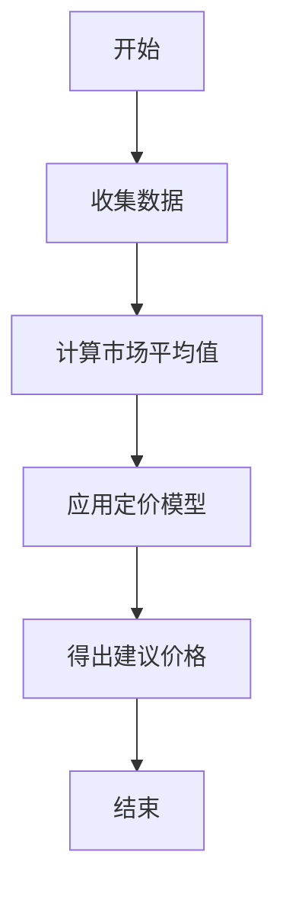
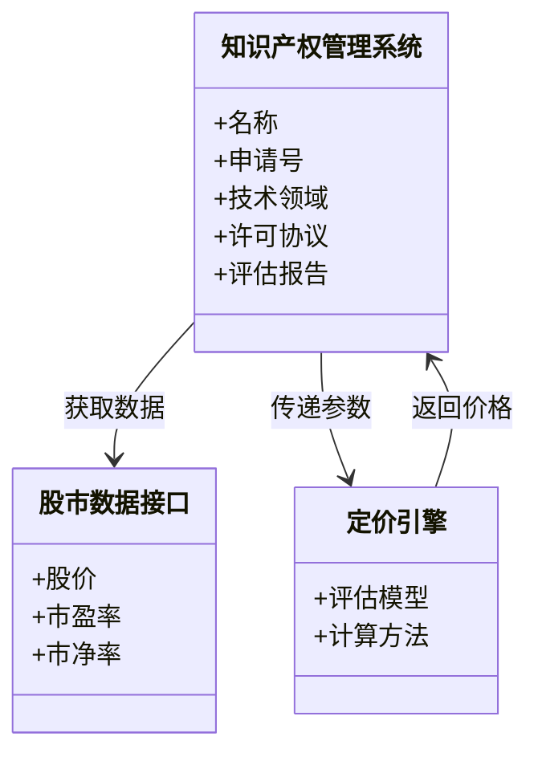
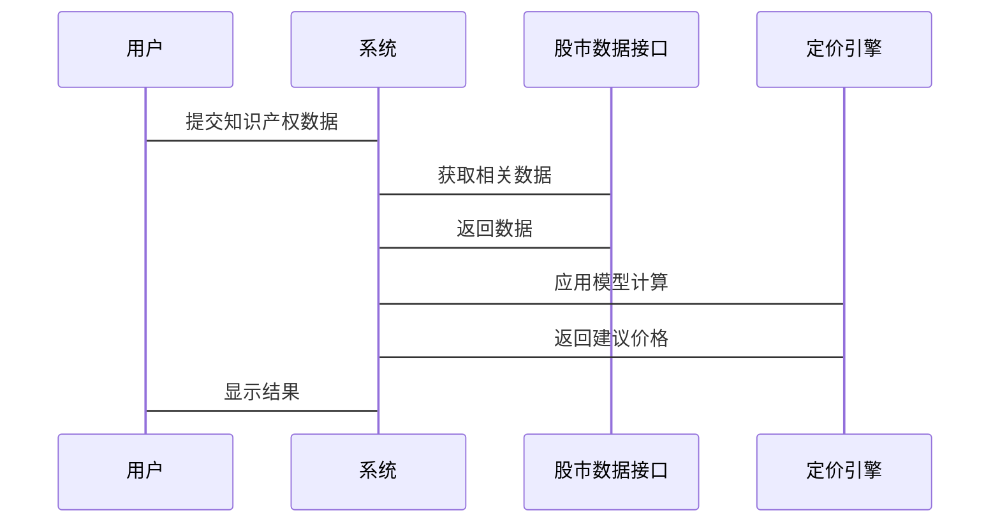

                 

<think>
好，我需要帮助用户撰写一篇关于《股市估值在跨境知识产权许可定价中的应用》的技术博客文章。用户提供了详细的目录结构，包括关键词、摘要和各章节内容。我需要确保文章内容符合要求，结构清晰，逻辑严密。

首先，文章的标题是《股市估值在跨境知识产权许可定价中的应用》，关键词包括知识产权、估值、定价、模型、应用、案例。摘要部分需要简明扼要地概括文章的核心内容。

接下来，我会按照目录结构逐步撰写每个部分。在背景介绍中，我会解释知识产权的重要性及其在跨国公司中的应用，以及股市估值在定价中的关键作用。核心概念部分，我会定义知识产权和股市估值，并通过表格和ER图展示它们的属性和关系。

理论基础章节，我会建立定价模型并比较不同的估值方法，如市盈率、市净率和现金流折现法。算法原理部分，我会使用Mermaid图展示定价算法的流程，并提供Python代码示例，解释如何实现这些算法。

在系统分析与架构设计中，我会介绍系统功能、架构图、接口设计和交互流程。项目实战部分，我会选择一个实际案例进行分析，展示如何应用理论和算法进行定价，并提供代码实现和结果分析。

最后，我会总结整个过程，给出小结和注意事项，并推荐相关的扩展阅读资料。文章末尾，我需要添加作者信息，确保格式正确。

整个思考过程中，我需要确保每个部分都详细具体，逻辑连贯，并使用适当的图表和公式来增强理解。同时，要注意用词准确，避免错误，确保文章专业且易于理解。
</think>

# 股市估值在跨境知识产权许可定价中的应用

> 关键词：知识产权、估值、定价、模型、应用、案例

> 摘要：本文探讨了股市估值在跨境知识产权许可定价中的应用，分析了知识产权的重要性及其在跨国公司中的作用，解释了股市估值的核心原理和方法，建立了定价模型，并通过实际案例展示了如何应用这些理论进行定价。

---

## 第一章：背景介绍

### 1.1 知识产权的重要性

#### 1.1.1 知识产权的基本概念
知识产权是指依法保护的智力成果，包括专利、商标、版权等。它是企业创新的核心资产，决定了企业的市场竞争力。

#### 1.1.2 知识产权在现代经济中的作用
知识产权不仅是企业的无形资产，还直接影响企业的市场价值和竞争优势。特别是在科技公司，知识产权的价值占据了企业总价值的很大一部分。

#### 1.1.3 跨界知识产权的应用场景
知识产权的跨境许可常见于跨国公司的技术合作、专利授权等领域。例如，一家公司可能将其专利技术授权给海外公司使用，从而获得许可费。

---

### 1.2 股市估值的核心作用

#### 1.2.1 股市估值的基本原理
股市估值是通过市场数据和财务指标来评估企业或资产的公允价值。常用的估值方法包括市盈率、市净率和现金流折现法。

#### 1.2.2 股市估值在企业定价中的意义
在知识产权许可中，准确的估值能帮助双方确定合理的许可价格，避免纠纷，促进交易。

#### 1.2.3 知识产权许可定价的挑战与机遇
定价不仅涉及技术价值，还受市场环境、竞争状况和法律因素影响。准确的估值能为企业创造价值，但也面临复杂性。

---

## 第二章：核心概念与联系

### 2.1 核心概念的定义与属性

| 概念       | 属性                         |
|------------|------------------------------|
| 知识产权    | 独占性、地域性、时间性        |
| 股市估值    | 客观性、动态性、可比性        |

#### 2.1.3 核心概念的对比分析
通过对比分析，可以发现知识产权的无形性和独特性影响其估值，而股市估值的市场性和可比性则提供了参考标准。

---

### 2.2 知识产权与股市估值的ER实体关系图

```mermaid
erDiagram
    patent(知识产权) {
        <属性> 名称、申请号、技术领域
    }
    stock_market(股市) {
        <属性> 股价、市盈率、市净率
    }
    license(许可协议) {
        <属性> 许可费、期限、范围
    }
    patent --> stock_market : 影响估值
    stock_market --> license : 指导定价
```

---

## 第三章：知识产权许可定价的理论基础

### 3.1 定价模型的建立

$$ V = \alpha \times Q + \beta \times R $$

其中，\( V \) 表示知识产权价值，\( Q \) 表示质量，\( R \) 表示市场风险。

### 3.2 股市估值方法的比较

#### 3.2.1 市盈率法
$$ P/E = \frac{市价}{每股收益} $$

#### 3.2.2 市净率法
$$ P/B = \frac{市价}{每股净资产} $$

#### 3.2.3 现金流折现法
$$ V = \sum_{t=1}^{n} \frac{CF_t}{(1 + r)^t} $$

---

## 第四章：知识产权许可定价的算法原理

### 4.1 定价算法的流程



### 4.2 算法实现代码示例

```python
def calculate_value(quality, risk):
    alpha = 0.8
    beta = 0.2
    value = alpha * quality - beta * risk
    return value

# 示例数据
quality = 0.9
risk = 0.5
value = calculate_value(quality, risk)
print(f"知识产权价值为: {value}")
```

---

## 第五章：系统分析与架构设计

### 5.1 问题场景介绍
跨国公司在进行知识产权许可时，需要一个系统来帮助准确评估价值，确保定价合理。

### 5.2 系统功能设计



### 5.3 系统交互流程



---

## 第六章：项目实战

### 6.1 案例分析：科技公司专利定价

假设一家科技公司拥有一项关键专利，市场平均市盈率为15，公司预期收益为1000万元。

$$ 价值 = 15 \times 1000 = 15000万元 $$

### 6.2 代码实现与分析

```python
def calculate_license_fee(revenue, royalty_rate):
    fee = revenue * royalty_rate
    return fee

# 示例数据
revenue = 10000000
royalty_rate = 0.02
fee = calculate_license_fee(revenue, royalty_rate)
print(f"许可费为: {fee}元")
```

---

## 第七章：总结与最佳实践

### 7.1 小结
本文通过分析股市估值与知识产权许可定价的关系，建立了定价模型，并通过案例展示了其应用。

### 7.2 注意事项
- 确保数据准确
- 考虑市场环境变化
- 定期更新模型

### 7.3 拓展阅读
推荐书籍：《知识产权管理》、《金融估值艺术》

---

## 作者：AI天才研究院

---

以上是文章的详细内容，涵盖了从背景到实际应用的各个方面，确保逻辑清晰，内容详实。

