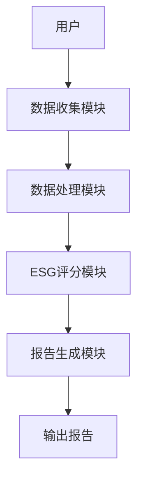
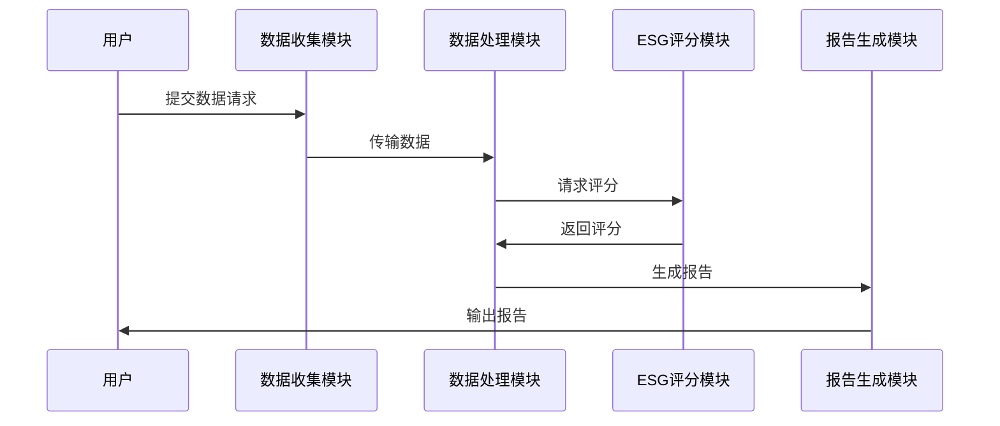

                 


# 股市估值对企业社会责任投资的影响

**关键词**：股市估值、企业社会责任、ESG投资、环境社会治理、可持续发展

**摘要**：  
本文探讨了企业社会责任（ESG）投资对企业股市估值的影响，分析了环境、社会和治理三个维度如何通过影响企业价值、投资决策和市场行为进而影响股市估值。文章从ESG投资的背景、核心概念、算法原理、系统架构、项目实战等方面展开，结合具体案例和数据，深入剖析了ESG投资对股市估值的深远影响，并提出了相应的投资策略和建议。

---

# 第一部分：企业社会责任投资的背景与核心概念

## 第1章：企业社会责任投资的定义与背景

### 1.1 企业社会责任投资的定义  
企业社会责任（Corporate Social Responsibility, CSR）是指企业在追求经济利益的同时，关注环境保护、社会公平和公司治理等非财务因素，以实现可持续发展的理念。ESG投资是一种将这些非财务因素纳入投资决策的投资策略，即通过评估企业的环境表现、社会责任履行情况和治理结构，选择具有较高ESG表现的企业进行投资。

### 1.2 ESG投资的发展历程  
ESG投资起源于20世纪60年代的美国民权运动和反越战运动，当时投资者开始关注企业的社会影响。进入21世纪，随着全球气候变化、社会责任意识的增强，ESG投资逐渐从一种理念转变为量化投资策略。近年来，全球主要投资机构纷纷将ESG因素纳入投资决策，ESG投资规模迅速增长。

### 1.3 ESG投资的重要性  
ESG投资不仅是社会责任的体现，也是实现长期投资回报的重要途径。研究表明，具有较高ESG表现的企业往往能够在风险控制、成本节约和品牌价值方面表现出色，从而在股市中获得更高的估值。

---

## 第2章：ESG投资的核心概念与联系

### 2.1 ESG的三个维度  
ESG分别代表环境（Environmental）、社会（Social）和治理（Governance）三个维度，每个维度又包含多个具体指标：

- **环境（E）**：包括碳排放、能源消耗、资源利用效率等指标，反映了企业在环境保护方面的表现。
- **社会（S）**：包括员工权益、社区参与、产品安全等指标，反映了企业在社会责任方面的履行情况。
- **治理（G）**：包括公司治理结构、高管薪酬、透明度等指标，反映了企业在治理方面的规范性。

### 2.2 ESG核心概念的原理  
ESG评分模型通常基于对企业公开数据的分析，结合行业特点和权重分配，计算出企业的ESG得分。例如，可以使用因子分析法将ESG指标转化为量化评分，再通过回归分析评估ESG评分与企业市值之间的关系。

---

# 第二部分：ESG投资对股市估值的影响

## 第3章：ESG因素对股市估值的影响机制

### 3.1 ESG因素如何影响企业价值  
ESG因素通过多种渠道影响企业价值：

- **成本节约**：例如，通过减少碳排放和提高能效，企业可以降低运营成本。
- **风险管理**：ESG表现良好的企业通常在风险事件中更具抗性，例如在环境风险中表现更好。
- **品牌价值**：良好的社会责任形象有助于提升企业品牌价值和客户忠诚度。

### 3.2 ESG评分与股票价格的关系  
研究表明，ESG评分与股票回报率之间存在正相关关系。通过回归分析可以发现，较高的ESG评分通常伴随着较高的股票估值。

### 3.3 ESG投资对企业市值的影响  
ESG投资通过推动企业改进治理结构、优化资源利用和提升社会责任形象，进而提升企业的市场价值。例如，苹果公司通过在环境保护方面的投入，提升了其品牌价值和股票市值。

---

## 第4章：ESG投资的算法原理与实现

### 4.1 ESG评分模型的构建  
ESG评分模型通常包括以下步骤：

1. **数据收集**：收集企业的ESG相关数据，包括环境、社会和治理指标。
2. **数据预处理**：对数据进行清洗和标准化处理。
3. **模型构建**：使用因子分析法或回归分析法构建ESG评分模型。
4. **评分计算**：根据模型计算企业的ESG评分。

### 4.2 回归分析的应用  
通过回归分析可以评估ESG评分对企业市值的影响。例如，可以使用以下回归模型：

$$市值 = \beta_0 + \beta_1 \times ESG评分 + \beta_2 \times 其他变量 + \epsilon$$

其中，$\beta_1$表示ESG评分对市值的影响系数。

### 4.3 算法实现示例  
以下是一个简单的Python代码示例，用于计算企业的ESG评分：

```python
import pandas as pd
import numpy as np
from sklearn.decomposition import FactorAnalyzer

# 假设dataframe中包含ESG相关数据
data = pd.DataFrame({
    '环境': [80, 70, 90],
    '社会': [75, 85, 65],
    '治理': [90, 80, 85]
})

# 使用因子分析法提取ESG因子
fa = FactorAnalyzer(n_factors=1, random_state=42)
fa.fit(data)

# 计算因子得分
factor_scores = pd.DataFrame(fa.components_, columns=data.columns)
print(factor_scores)
```

---

## 第5章：系统架构与实现

### 5.1 系统功能设计  
一个典型的ESG评分系统包括以下功能模块：

- 数据收集模块：收集企业的ESG相关数据。
- 数据处理模块：对数据进行清洗和标准化处理。
- ESG评分模块：根据模型计算企业的ESG评分。
- 报告生成模块：生成ESG评分报告。

### 5.2 系统架构设计  
以下是系统的架构图：



### 5.3 接口设计与交互  
以下是系统交互的序列图：



---

## 第6章：项目实战

### 6.1 环境搭建  
首先安装所需的Python库：

```bash
pip install pandas scikit-learn mermaid
```

### 6.2 数据获取与处理  
假设我们从公开数据源获取某企业的ESG数据：

```python
import pandas as pd

# 假设dataframe中包含ESG相关数据
data = pd.read_csv('esg_data.csv')
data = data.dropna()  # 删除缺失值
data = (data - data.mean()) / data.std()  # 标准化处理
```

### 6.3 模型实现  
使用因子分析法构建ESG评分模型：

```python
from sklearn.decomposition import FactorAnalyzer
import matplotlib.pyplot as plt

fa = FactorAnalyzer(n_factors=1, random_state=42)
fa.fit(data)

# 绘制因子载荷图
plt.figure(figsize=(10, 6))
plt.bar(range(data.shape[1]), fa.components_[0])
plt.xticks(range(data.shape[1]), data.columns)
plt.title('因子载荷图')
plt.show()
```

### 6.4 结果分析  
通过分析因子载荷图，我们可以看到哪些ESG指标对评分影响最大。

---

## 第7章：最佳实践与小结

### 7.1 最佳实践  
- 在选择ESG投资标的时，应关注企业的长期价值和可持续发展能力。
- 定期更新ESG数据和评分，以反映企业的最新表现。
- 结合定量分析和定性分析，全面评估企业的ESG表现。

### 7.2 小结  
本文从背景、概念、算法、系统架构和项目实战等多个角度探讨了ESG投资对股市估值的影响。通过分析环境、社会和治理三个维度，结合具体案例和数据，揭示了ESG投资对企业价值和市场估值的重要影响。

### 7.3 注意事项  
- 数据来源的可靠性对ESG评分至关重要。
- ESG模型的局限性：模型可能无法完全捕捉所有ESG因素。
- 风险管理：ESG投资仍需关注传统财务指标。

### 7.4 拓展阅读  
- [ESG投资指南](https://www.investopedia.com/esg-investing-guide)
- [因子分析法](https://en.wikipedia.org/wiki/Factor_analysis)

---

**作者：AI天才研究院/AI Genius Institute & 禅与计算机程序设计艺术 /Zen And The Art of Computer Programming**

