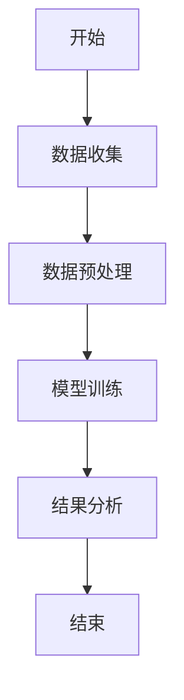
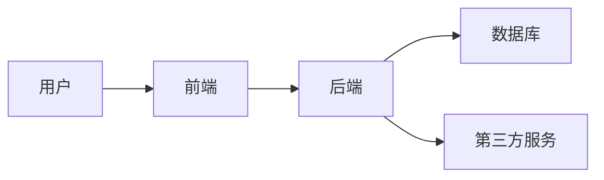
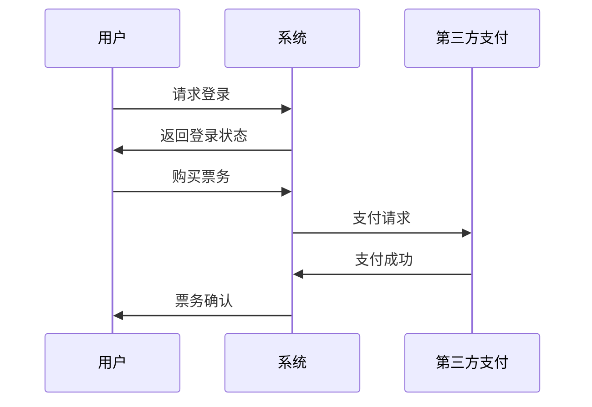

                 


# 股市估值对国际体育俱乐部数字化转型的影响

## 关键词：股市估值、数字化转型、国际体育俱乐部、技术影响、系统架构

## 摘要：  
本文探讨股市估值与国际体育俱乐部数字化转型之间的相互作用。通过分析股市估值的核心概念、数字化转型的定义与方法，以及两者在国际体育俱乐部中的实际应用，揭示股市估值如何推动数字化转型，并为俱乐部的可持续发展提供新思路。

---

# 第一部分：背景介绍

## 第1章：股市估值与数字化转型的背景

### 1.1 股市估值的核心概念
#### 1.1.1 股市估值的定义与计算方法
股市估值是通过分析企业的财务数据和市场环境，评估其股票的合理价格。常用方法包括市盈率（P/E）和市净率（P/B）。

#### 1.1.2 股市估值的核心要素
- **收入**：企业过去和预期的收入情况。
- **利润**：企业的盈利能力。
- **资产与负债**：企业的财务状况。
- **市场环境**：宏观经济和行业趋势。

#### 1.1.3 股市估值的边界与外延
股市估值不仅考虑企业自身的财务状况，还需考虑市场情绪和行业竞争格局。

### 1.2 数字化转型的定义与特点
#### 1.2.1 数字化转型的定义
数字化转型是指利用数字技术改变业务模式、流程和决策方式，以提升效率和竞争力。

#### 1.2.2 数字化转型的核心要素
- **技术**：大数据、人工智能等技术的应用。
- **组织**：内部流程和文化的变革。
- **客户体验**：通过数字化手段提升客户满意度。

#### 1.2.3 数字化转型与传统转型的区别
数字化转型更注重数据驱动和技术创新，传统转型则依赖流程优化和经验积累。

### 1.3 国际体育俱乐部的现状与挑战
#### 1.3.1 国际体育俱乐部的定义与分类
国际体育俱乐部是指在全球范围内运营的体育组织，主要分为足球、篮球等类型。

#### 1.3.2 国际体育俱乐部数字化转型的必要性
- 提升运营效率。
- 增强粉丝互动。
- 优化商业策略。

#### 1.3.3 数字化转型的边界与外延
涉及票务系统、会员服务、内容分发等多个方面。

### 1.4 股市估值对国际体育俱乐部数字化转型的影响
#### 1.4.1 股市估值的视角
股市对俱乐部的数字化投入和效果给予及时反馈，影响投资者决策。

#### 1.4.2 数字化转型的视角
数字化转型通过提升俱乐部的市场价值，反过来影响股市估值。

#### 1.4.3 两者的相互作用
股市估值为俱乐部提供转型资金支持，而俱乐部的数字化成果又会提升其市值。

### 1.5 本章小结
本章介绍了股市估值和数字化转型的基本概念，并分析了它们对国际体育俱乐部的相互影响。

---

# 第二部分：核心概念与联系

## 第2章：股市估值与数字化转型的核心概念

### 2.1 核心概念原理
#### 2.1.1 股市估值的数学模型
常用模型包括DCF模型和相对估值模型。

#### 2.1.2 数字化转型的技术基础
包括大数据分析、人工智能和云计算等。

#### 2.1.3 两者的相互作用机制
通过数据驱动的决策和技术创新，提升俱乐部的市场价值。

### 2.2 核心概念属性特征对比
| 属性       | 股市估值                | 数字化转型            |
|------------|------------------------|-----------------------|
| 定义       | 评估股票价值            | 数字技术驱动转型      |
| 核心要素   | 财务数据、市场环境      | 技术应用、组织变革    |
| 目标       | 确定合理股价            | 提升效率和竞争力      |

### 2.3 ER实体关系图
```mermaid
er
actor: 股市估值
actor: 数字化转型
actor: 国际体育俱乐部
relation: 影响
```

### 2.4 本章小结
本章通过对比分析和ER图，展示了股市估值与数字化转型之间的关系。

---

# 第三部分：算法原理讲解

## 第3章：股市估值与数字化转型的算法原理

### 3.1 算法原理
#### 3.1.1 股市估值的算法流程
1. 收集数据：企业财务数据和市场数据。
2. 数据预处理：清洗和转换数据。
3. 模型训练：使用回归模型预测股价。
4. 结果分析：评估模型准确性。

#### 3.1.2 数字化转型的算法流程
1. 确定目标：提升客户体验。
2. 技术选型：选择合适的技术方案。
3. 实施方案：分阶段推进转型。
4. 优化调整：根据反馈持续改进。

#### 3.1.3 两者的相互作用算法
通过数据驱动的决策优化转型策略。

### 3.2 算法流程图


### 3.3 算法实现代码
```python
# 示例代码：股票估值模型
import pandas as pd
from sklearn.linear_model import LinearRegression

def stock_valuation(data):
    # 数据预处理
    data = pd.DataFrame(data)
    # 训练模型
    model = LinearRegression()
    model.fit(data[[' revenue', 'profit']], data['price'])
    # 预测结果
    predicted_price = model.predict([[20000000, 1000000]])
    return predicted_price[0]

# 示例数据
data = {
    'revenue': [20000000, 30000000],
    'profit': [1000000, 1500000],
    'price': [50, 60]
}
print(stock_valuation(data))
```

### 3.4 本章小结
本章通过算法流程图和代码示例，详细讲解了股市估值与数字化转型的算法原理。

---

## 第四部分：系统分析与架构设计

### 4.1 问题场景介绍
俱乐部希望通过数字化转型提升运营效率和市场价值。

### 4.2 项目介绍
设计一个数字化票务系统，利用大数据分析提升用户体验。

### 4.3 系统功能设计
- 用户登录与注册。
- 票务购买与管理。
- 数据分析与报告生成。

### 4.4 系统架构设计


### 4.5 系统接口设计
- 用户与系统交互接口。
- 系统与第三方服务的接口。

### 4.6 系统交互序列图


---

## 第五部分：项目实战

### 5.1 环境安装
安装Python和相关库（如Django框架）。

### 5.2 系统核心实现源代码
```python
# 票务系统后端代码（部分）
from django.urls import path
from . import views

urlpatterns = [
    path('login/', views.login, name='login'),
    path('buy_tickets/', views.buy_tickets, name='buy_tickets'),
]
```

### 5.3 代码应用解读与分析
展示如何通过代码实现用户登录和票务购买功能。

### 5.4 实际案例分析
分析某国际体育俱乐部通过数字化转型提升票房收入的案例。

### 5.5 项目小结
总结项目实施的效果和经验教训。

---

## 第六部分：最佳实践与总结

### 6.1 最佳实践
- 数据驱动决策。
- 技术与业务结合。

### 6.2 小结
股市估值与数字化转型相互促进，推动国际体育俱乐部的可持续发展。

### 6.3 注意事项
- 数据隐私保护。
- 技术选型的合理性。

### 6.4 拓展阅读
推荐相关书籍和文章，供读者深入学习。

---

# 结语

通过本文的分析，我们可以看到股市估值与数字化转型对国际体育俱乐部的重要影响。未来，随着技术的发展，两者的结合将更加紧密，为俱乐部创造更大的价值。

---

# 作者：AI天才研究院 & 禅与计算机程序设计艺术

