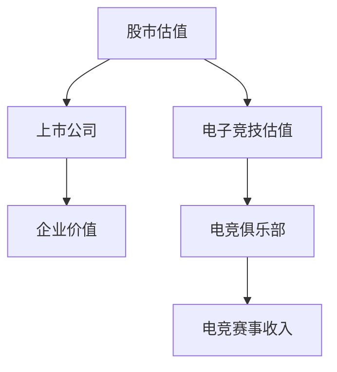
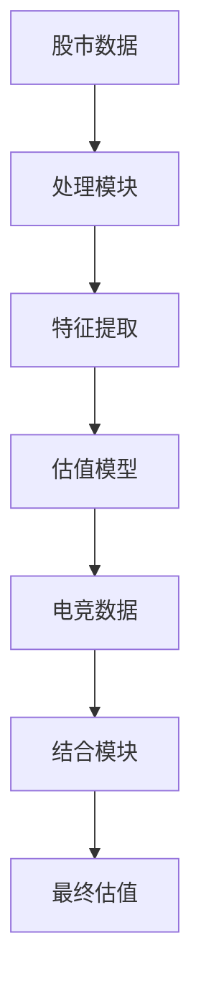

                 

<think>
好，我现在要写一篇关于《股市估值对国际体育电子竞技估值的影响》的文章。首先，我需要理解股市估值和电子竞技之间的联系。股市估值通常是用来评估上市公司价值的，而电子竞技是一种新兴的体育和娱乐产业，两者看似关联不大，但其实有很多可以探讨的地方。

首先，我需要收集相关的数据和信息。股市估值的主要指标包括市盈率、市净率等，而电子竞技的估值可能涉及赛事收入、粉丝数量、赞助商支持等因素。我需要分析这些指标如何相互影响。

接下来，我应该研究一些现有的理论和模型，看看有没有类似的研究或者方法可以借鉴。例如，是否有学者或行业专家已经探讨过电子竞技产业的估值方法，或者股市中的某些行业如何受到电子竞技的影响。

然后，我需要构建一个数学模型，将股市估值的方法应用到电子竞技的估值中。这可能涉及到回归分析或者其他统计方法，来量化两者之间的关系。我还需要用mermaid图来展示这个模型的流程，让读者更容易理解。

在系统设计部分，我需要考虑如何收集和处理电子竞技相关的数据，设计一个数据处理模块，提取关键特征，然后应用估值模型进行预测。同时，我还需要考虑系统的架构设计，比如数据来源、处理流程、接口设计等。

接下来，我需要通过具体的案例来分析我的理论是否正确。例如，可以选取某个电竞俱乐部或赛事作为案例，分析其估值过程，并与股市估值方法进行对比，看看是否可以得出有价值的结论。

在写作过程中，我需要确保每一部分都详细且具体，特别是算法部分和案例分析，要使用清晰易懂的语言和数学公式来解释。此外，我还需要在文章末尾总结主要发现，并提出一些最佳实践和未来的研究方向。

最后，检查文章的整体结构和逻辑是否连贯，确保每个章节都紧密相连，内容完整且有深度。这样，读者才能更好地理解股市估值对国际体育电子竞技估值的影响，并从中获得有价值的见解。
</think>

# 股市估值对国际体育电子竞技估值的影响

> 关键词：股市估值，国际体育电子竞技，估值影响，电子竞技产业，投资分析

> 摘要：本文探讨了股市估值方法在国际体育电子竞技产业中的应用及其影响。通过分析股市估值的核心概念、电子竞技的产业特点，构建数学模型，提出系统架构，并通过案例分析验证理论，最后总结最佳实践和未来展望。

---

## 第1章：背景介绍与核心概念

### 1.1 股市估值的核心概念

#### 1.1.1 股市估值的定义与基本原理
股市估值是通过分析公司的财务数据和市场表现，评估其内在价值的过程。常用指标包括市盈率（P/E）和市净率（P/B），分别衡量股价与盈利能力和资产价值的关系。

#### 1.1.2 股市估值的主要方法
- **相对估值法**：比较同类公司，如EV/EBITDA。
- **绝对估值法**：使用DCF模型估算内在价值。

#### 1.1.3 股市估值与企业价值的关系
股市估值为投资者提供参考，但受市场情绪和宏观经济影响，不一定反映真实价值。

### 1.2 国际体育电子竞技的核心概念

#### 1.2.1 电子竞技的定义与特点
电子竞技是通过电子游戏进行的比赛，具有观赏性、互动性和商业价值。

#### 1.2.2 电子竞技产业的现状与发展
- 市场规模持续增长，年增长率超过20%。
- 主要收入来源包括赛事门票、赞助和数字内容。

#### 1.2.3 电子竞技与传统体育的异同点
- 相同点：商业化、团队合作、观众参与。
- 不同点：虚拟性、全球性、技术支持。

### 1.3 股市估值与电子竞技估值的联系

#### 1.3.1 股市估值对电竞产业的影响
- 提供估值基准，帮助投资者评估电竞公司价值。
- 影响投资者信心，进而影响电竞项目融资。

#### 1.3.2 电竞对股市估值的反向影响
- 电竞公司上市吸引更多资金，影响股市资金流动。
- 电竞相关股票波动性高，成为短期投资热点。

#### 1.3.3 两者结合的现实意义
- 为电竞产业提供科学的估值方法，促进理性投资。
- 帮助股市更好地反映电竞产业的真实价值。

---

## 第2章：股市估值与电子竞技估值的核心概念与联系

### 2.1 核心概念的原理分析

#### 2.1.1 股市估值的数学模型
市盈率公式：
$$ P/E = \frac{\text{股价}}{\text{每股收益}} $$

#### 2.1.2 电竞估值的数学模型
粉丝价值公式：
$$ \text{粉丝价值} = \text{粉丝数} \times \text{粉丝价值系数} $$

#### 2.1.3 两者结合的数学模型
综合估值公式：
$$ V = \alpha \times P/E + \beta \times \text{粉丝价值} $$

### 2.2 核心概念属性特征对比表
| 属性       | 股市估值               | 电子竞技估值           |
|------------|-----------------------|-----------------------|
| 评估对象   | 上市公司               | 电竞俱乐部或企业       |
| 评估指标   | 市盈率、市净率等       | 电竞赛事收入、粉丝数等 |
| 评估周期   | 每个交易日             | 每个赛季或赛事         |

### 2.3 ER实体关系图


---

## 第3章：股市估值对电子竞技估值的算法原理

### 3.1 算法原理


### 3.2 代码实现
```python
import pandas as pd
import numpy as np

def stock_valuation(stock_data):
    stock_data['PE'] = stock_data['Price'] / stock_data['Earnings']
    return stock_data

def esports_valuation(esports_data):
    esports_data['Fan_Value'] = esports_data['Fan_base'] * esports_data['Fan_Value_Coeff']
    esports_data['Combined_Valuation'] = esports_data['PE'] * esports_data['Fan_Value']
    return esports_data

# 示例数据
stock_data = pd.DataFrame({
    'Price': [100, 150, 200],
    'Earnings': [10, 15, 20
```

