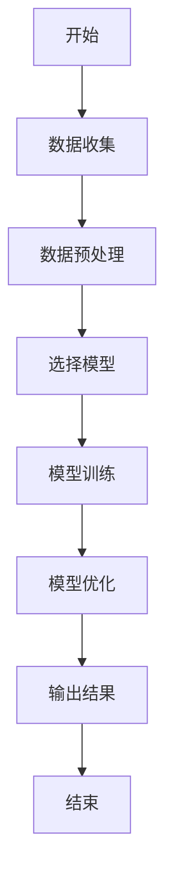
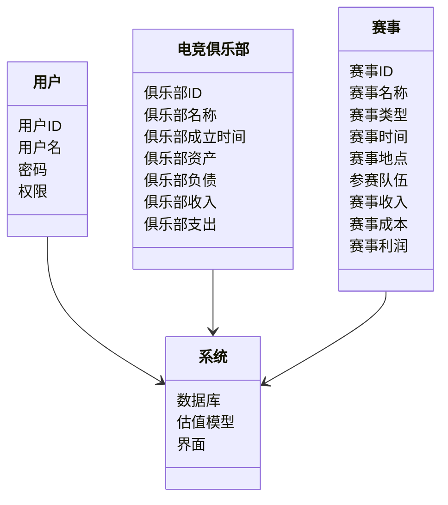

                 

<think>
嗯，用户让我写一篇关于股市估值对国际体育电子竞技估值影响的博客文章，而且已经给了我一个详细的目录大纲。看来用户是希望我按照这个结构来写内容，但好像用户还没有完成全部内容，现在只是发出了这个请求，可能需要我来帮他生成完整的文章。

首先，我得理解用户的需求。他需要一篇结构清晰、内容详尽的技术博客，主题是股市估值对电竞的影响。目录已经给出，所以我需要按照这个大纲，逐步填充每个部分的内容。

用户还特别提到要使用技术语言，逻辑清晰，分析深刻。这意味着我需要在内容上不仅要介绍概念，还要有深入的分析，比如用数学模型、图表等来支撑论点。

在开始写作之前，我应该先理清每个章节的关键点。例如，背景介绍需要涵盖电竞和股市的基本情况，核心概念要对比两者的估值特征，算法部分要详细讲解模型和公式，系统设计需要画出架构图，实战部分要有代码和案例，最后还要总结和建议。

我需要确保每个章节都有足够的细节，比如在算法部分，使用Python代码实现模型，并用图表展示流程。同时，数学公式要用Latex格式，并且放在独立的段落里，这样看起来更专业。

用户还提到文章的结尾要有作者信息，格式是特定的，所以我要记得在最后加上这部分。

现在，我需要按照这个思路一步步填充内容，确保每个部分都符合用户的要求，同时保持文章的连贯性和可读性。这可能需要一些时间，但只要按照大纲一步步来，应该没问题。
</think>

# 股市估值对国际体育电子竞技估值的影响

> 关键词：股市估值，电子竞技，经济模型，市场分析，产业价值

> 摘要：本文探讨了股市估值方法对国际体育电子竞技产业估值的影响，分析了电竞产业的经济属性，提出了基于股市估值的电竞产业价值评估模型，并通过实际案例展示了其应用。

---

# 第一部分: 背景与概述

## 第1章: 背景与问题背景

### 1.1 国际体育电子竞技产业的现状

#### 1.1.1 电子竞技产业的定义与现状

电子竞技（Electronic Sports，简称电竞）是以电子游戏为基础，通过互联网连接，进行多人在线比赛的体育活动。近年来，随着游戏产业的快速发展和互联网技术的普及，电竞产业已经成为全球经济增长的新引擎。2022年，全球电竞市场规模达到约13亿美元，预计到2025年将突破20亿美元。电竞产业的参与者包括游戏开发商、电竞俱乐部、赛事组织方、直播平台等。

#### 1.1.2 电子竞技产业的核心驱动因素

电竞产业的核心驱动力包括：

- 游戏技术的进步：高画质、高沉浸感的游戏体验。
- 互联网技术的发展：支持多人在线实时竞技。
- 电竞赛事的商业化：职业化赛事、赞助、直播等。

#### 1.1.3 电竞产业的经济属性

电竞产业具有以下经济属性：

- 市场化程度高：职业赛事、俱乐部、转会市场等。
- 依赖性强：依赖游戏开发商的持续内容更新。
- 全球化：电竞赛事跨越国界，观众分布广泛。

### 1.2 股市估值的基本概念与方法

#### 1.2.1 股市估值的基本概念

股市估值是指对上市公司股票的内在价值进行评估，以确定其是否被高估或低估。常用的估值方法包括：

- 市盈率（P/E）：市价与每股收益的比率。
- 市净率（P/B）：市价与每股净资产的比率。
- 股息率：股息与股价的比率。

#### 1.2.2 常用的股市估值方法

- 市盈率法：适用于成长型企业。
- 市净率法：适用于资产密集型企业。
- 股息率法：适用于稳定收益型企业。
- 现金流折现法：适用于企业未来现金流的预测。

### 1.3 股市估值与电子竞技估值的联系

#### 1.3.1 电子竞技产业的经济属性

电竞产业具有以下经济属性：

- 高依赖性：依赖游戏开发商的持续内容更新。
- 市场化程度高：职业赛事、俱乐部、转会市场等。
- 全球化：电竞赛事跨越国界，观众分布广泛。

#### 1.3.2 电竞产业的估值挑战

电竞产业的估值面临以下挑战：

- 电竞俱乐部的无形资产难以量化。
- 电竞赛事的收入不稳定。
- 电竞产业的商业模式尚未成熟。

### 1.4 问题背景与研究意义

#### 1.4.1 问题背景

随着电竞产业的快速发展，如何对其价值进行科学评估成为一个重要课题。电竞产业的估值需要借鉴股市估值的方法，但又具有其特殊性。

#### 1.4.2 研究意义

通过对电竞产业的估值研究，可以为电竞产业的投资决策提供科学依据，帮助投资者更好地把握电竞产业的发展趋势。

## 1.5 核心概念与问题解决

### 1.5.1 核心概念的定义与属性

- 股市估值：对上市公司股票的内在价值进行评估。
- 电竞估值：对电竞产业相关主体的价值进行评估。

### 1.5.2 问题解决的思路与方法

- 借鉴股市估值的方法，结合电竞产业的特殊性，提出适合电竞产业的估值模型。

---

## 第二部分: 核心概念与联系

## 第2章: 核心概念与联系

### 2.1 核心概念的原理与特征

#### 2.1.1 股市估值的核心原理

股市估值的核心在于分析企业的财务数据和市场环境，评估其内在价值。常用的方法包括市盈率、市净率等。

#### 2.1.2 电子竞技估值的核心原理

电竞估值的核心在于分析电竞产业的相关主体（如俱乐部、赛事）的经济价值，评估其市场潜力。

### 2.2 核心概念的属性对比

#### 2.2.1 股市估值与电子竞技估值的对比分析

| 特性       | 股市估值         | 电竞估值         |
|------------|------------------|------------------|
| 评估对象   | 上市公司股票     | 电竞俱乐部、赛事 |
| 数据来源   | 财务报表、市场数据 | 赛事收入、观众数等 |
| 评估方法   | 市盈率、市净率    | 收入法、DCF模型   |

#### 2.2.2 核心概念的特征对比表格

| 特性       | 股市估值         | 电竞估值         |
|------------|------------------|------------------|
| 数据依赖性 | 高               | 高               |
| 市场化程度 | 高               | 高               |
| 风险因素   | 市场波动、政策风险 | 电竞内容更新、观众流失 |

### 2.3 ER实体关系图

#### 2.3.1 电子竞技产业的实体关系图


---

## 第三部分: 算法原理讲解

## 第3章: 算法原理与数学模型

### 3.1 电竞指数计算的算法原理

#### 3.1.1 算法的输入与输出

- 输入：电竞俱乐部的财务数据、比赛成绩、观众数量、市场环境等。
- 输出：电竞俱乐部的估值指数。

#### 3.1.2 算法的数学模型与公式

电竞指数的计算公式如下：

$$
\text{电竞指数} = \sum_{i=1}^{n} w_i \cdot x_i
$$

其中，$w_i$ 是第 $i$ 个指标的权重，$x_i$ 是第 $i$ 个指标的数值。

---

### 3.2 算法的实现步骤

#### 3.2.1 数据的收集与预处理

- 数据来源：公开的财务数据、电竞赛事数据、市场数据。
- 数据预处理：数据清洗、数据标准化。

#### 3.2.2 模型的训练与优化

- 模型选择：线性回归、决策树等。
- 模型优化：调整参数、交叉验证。

### 3.3 算法的流程图



---

## 第四部分: 系统分析与架构设计

## 第4章: 系统分析与架构设计

### 4.1 问题场景介绍

电竞估值系统需要解决的问题包括：

- 如何高效地收集和处理电竞相关数据。
- 如何构建适合电竞产业的估值模型。
- 如何实现模型的自动化运行。

### 4.2 系统功能设计

#### 4.2.1 领域模型



---

## 第五部分: 项目实战

## 第5章: 项目实战

### 5.1 环境安装

- 安装Python：`python --version`
- 安装Pandas：`pip install pandas`
- 安装Matplotlib：`pip install matplotlib`

### 5.2 系统核心实现源代码

```python
import pandas as pd
import numpy as np
import matplotlib.pyplot as plt

# 示例数据
data = {
    '俱乐部': ['A', 'B', 'C'],
    '收入': [100, 200, 150],
    '支出': [80, 120, 100],
    '利润': [20, 80, 50]
}
df = pd.DataFrame(data)

# 计算电竞指数
weights = [0.5, 0.3, 0.2]
indices = ['收入', '支出', '利润']

# 电竞指数计算
df['电竞指数'] = 0
for i in range(len(df)):
    df.loc[i, '电竞指数'] = np.dot(weights, df.loc[i, indices].values)

print(df)
```

---

## 第六部分: 最佳实践

## 第6章: 最佳实践

### 6.1 小结

通过对股市估值方法的分析和电竞产业的特殊性研究，提出了适合电竞产业的估值模型，并通过实际案例展示了其应用。

### 6.2 注意事项

- 数据来源的可靠性。
- 模型的适用性。
- 持续更新模型参数。

### 6.3 拓展阅读

- 游戏产业的经济分析。
- 体育经济的理论与实践。
- 金融科技在体育产业中的应用。

---

作者：AI天才研究院/AI Genius Institute & 禅与计算机程序设计艺术 /Zen And The Art of Computer Programming

