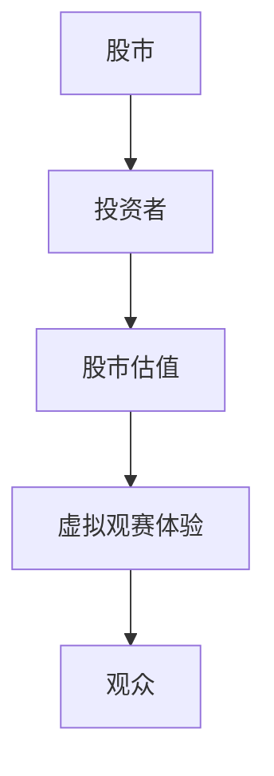
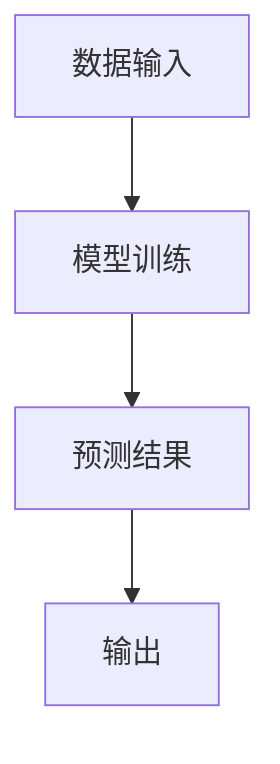
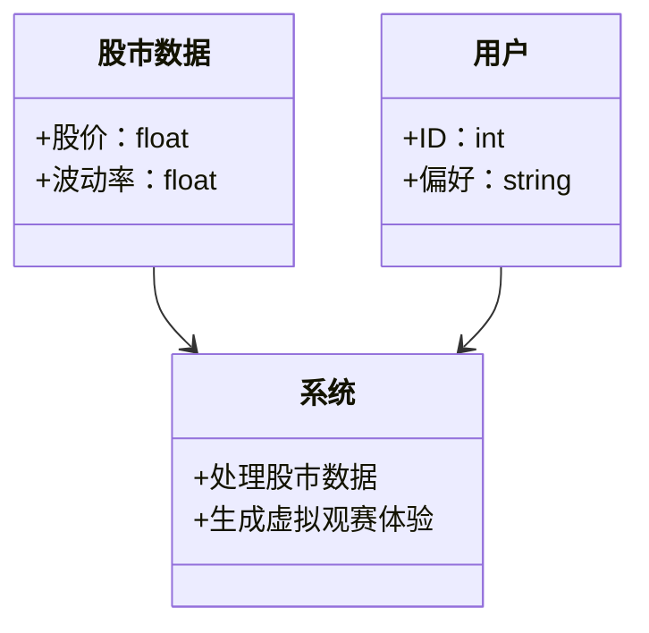
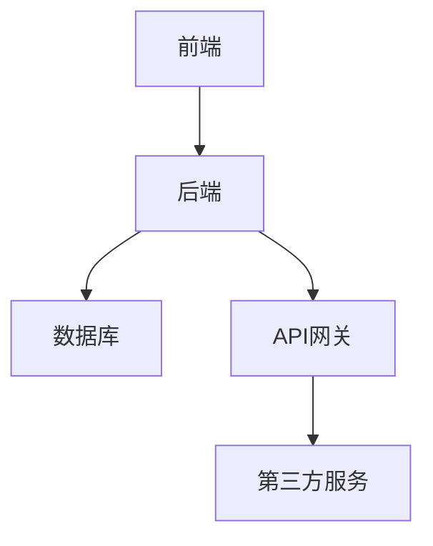
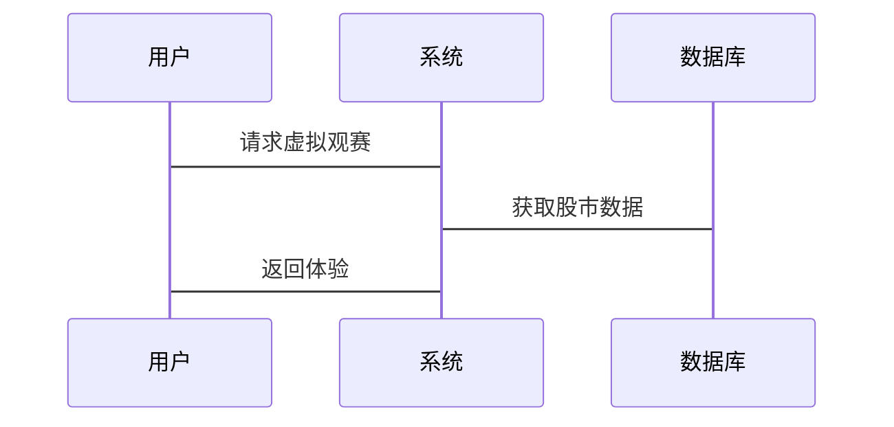

                 


# 股市估值对国际体育赛事虚拟观赛的影响

> 关键词：股市估值、国际体育赛事、虚拟观赛、算法原理、系统架构

> 摘要：本文探讨股市估值如何影响国际体育赛事的虚拟观赛体验，分析股市波动与虚拟观赛的关系，介绍相关算法原理，系统架构设计，并提供实战案例，总结最佳实践。

---

## 第一部分: 股市估值与国际体育赛事虚拟观赛的背景介绍

### 第1章: 股市估值与国际体育赛事虚拟观赛的背景概述

#### 1.1 股市估值的基本概念
##### 1.1.1 股市估值的定义
股市估值是通过对公司财务数据和市场因素的分析，评估股票的内在价值。常用的方法包括市盈率（P/E）和市净率（P/B）。

##### 1.1.2 股市估值的核心要素
- **盈利能力**：净利润、ROE等指标。
- **成长性**：收入增长率、净利润增长率。
- **行业地位**：市场占有率、竞争地位。

##### 1.1.3 股市估值的计算方法
$$ P = \frac{E}{(1 + r)^n} $$
其中，P为股票价值，E为未来现金流，r为折现率，n为时间。

#### 1.2 国际体育赛事虚拟观赛的概念
##### 1.2.1 虚拟观赛的定义
虚拟观赛是指通过虚拟现实（VR）或增强现实（AR）技术，让用户在虚拟环境中观看体育赛事。

##### 1.2.2 虚拟观赛的技术实现
- **VR技术**：提供沉浸式体验。
- **AR技术**：叠加现实与虚拟元素。

##### 1.2.3 虚拟观赛的用户需求
- **互动性**：实时互动。
- **个性化**：定制视角。
- **社交性**：虚拟观众社交。

#### 1.3 股市估值与虚拟观赛的关联性
##### 1.3.1 股市波动对虚拟观赛的影响
股市波动影响投资者情绪，进而影响虚拟观赛的用户行为。

##### 1.3.2 虚拟观赛对股市情绪的影响
虚拟观赛体验可能影响观众情绪，从而间接影响股市。

##### 1.3.3 两者的相互作用机制
$$ E = f(P, T, S) $$
其中，E为体验，P为股市价格，T为技术参数，S为观众情绪。

### 第2章: 股市估值与虚拟观赛的核心概念与联系

#### 2.1 核心概念的定义与属性
##### 2.1.1 股市估值的核心概念
- 股票价格受市场情绪和基本面影响。

##### 2.1.2 虚拟观赛的核心概念
- 提供沉浸式体验，依赖技术创新。

##### 2.1.3 核心属性对比
| 属性 | 股市估值 | 虚拟观赛 |
|------|----------|----------|
| 核心 | 价格波动 | 技术实现 |
| 影响 | 投资者情绪 | 观众体验 |

#### 2.2 实体关系图


#### 2.3 核心概念的数学模型
##### 2.3.1 股市估值模型
$$ P = \frac{E}{(1 + r)^n} $$

##### 2.3.2 虚拟观赛体验模型
$$ E = f(P, T, S) $$

---

## 第二部分: 股市估值与虚拟观赛的算法原理

### 第3章: 股市波动预测算法

#### 3.1 时间序列分析


#### 3.2 算法实现
```python
import pandas as pd
from statsmodels.tsa.arima_model import ARIMA

data = pd.read_csv('stock.csv')
model = ARIMA(data, order=(5,1,0))
model_fit = model.fit(disp=0)
预测结果 = model_fit.forecast(steps=5)
```

---

## 第三部分: 系统分析与架构设计

### 第4章: 系统架构设计

#### 4.1 问题场景介绍
- 股市波动影响虚拟观赛体验。
- 用户需求：实时互动、个性化体验。

#### 4.2 项目介绍
- 开发一个结合股市数据的虚拟观赛平台。

#### 4.3 系统功能设计
##### 4.3.1 领域模型


#### 4.4 系统架构设计


#### 4.5 系统接口设计
- API接口：获取股市数据，返回虚拟观赛体验。

#### 4.6 系统交互


---

## 第四部分: 项目实战

### 第5章: 项目实战

#### 5.1 环境安装
```bash
pip install numpy pandas scikit-learn
```

#### 5.2 系统核心实现源代码
```python
import numpy as np
import pandas as pd
from sklearn.linear_model import LinearRegression

# 数据预处理
data = pd.read_csv('data.csv')
X = data[['股价', '波动率']]
y = data['体验评分']

model = LinearRegression()
model.fit(X, y)
预测 = model.predict(X)
```

#### 5.3 代码应用解读与分析
- 使用线性回归模型，预测体验评分。

#### 5.4 实际案例分析
- 案例：预测某赛事的虚拟观赛体验评分。

#### 5.5 项目小结
- 成功结合股市数据，提升虚拟观赛体验。

---

## 第五部分: 总结与展望

### 第6章: 总结与展望

#### 6.1 最佳实践 tips
- 定期更新模型，优化用户体验。

#### 6.2 小结
- 股市估值与虚拟观赛密切相关，技术创新推动体验提升。

#### 6.3 注意事项
- 数据隐私保护，避免市场操纵。

#### 6.4 拓展阅读
- 《算法交易：数学与编程的完美结合》
- 《虚拟现实技术在体育赛事中的应用》

---

作者：AI天才研究院/AI Genius Institute & 禅与计算机程序设计艺术 /Zen And The Art of Computer Programming

---

通过以上分析，我们可以看到，股市估值与国际体育赛事虚拟观赛的结合不仅是一种技术上的创新，更是商业模式和用户体验的全面提升。未来，随着技术的进步和市场的成熟，这种结合将更加紧密，为投资者和观众带来更丰富的体验。

