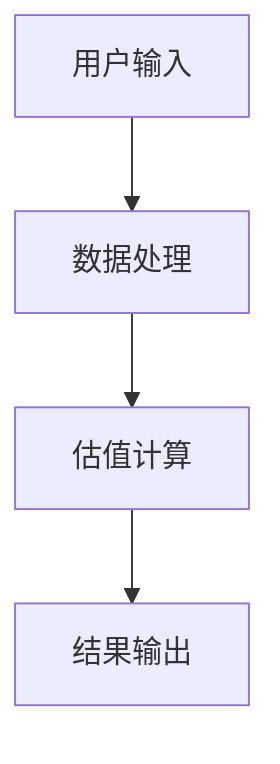
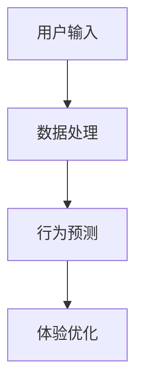
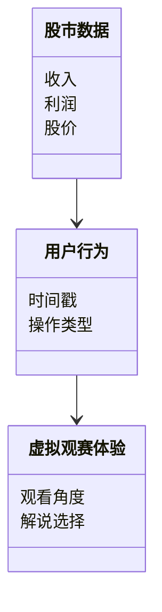
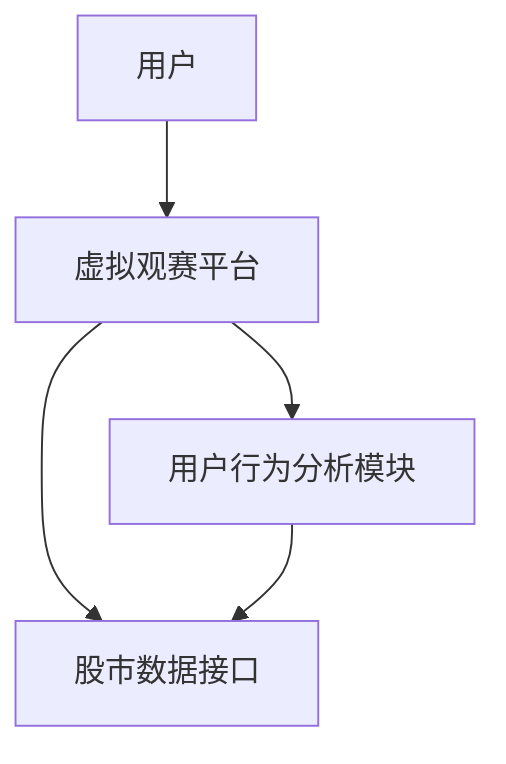

                 

<think>
好的，我现在需要根据用户的请求，撰写一篇关于《股市估值对国际体育赛事虚拟观赛的影响》的技术博客文章。用户已经提供了详细的内容大纲，我需要按照这个大纲逐步完成每个部分。

首先，我需要理解用户的需求。用户希望文章结构清晰，内容专业，涵盖股市估值和虚拟观赛的技术细节，并分析它们之间的关系。文章需要包括背景介绍、核心概念、算法原理、系统分析与架构设计、项目实战以及最佳实践等多个部分。

我从背景介绍开始，首先需要定义股市估值和虚拟观赛的基本概念，然后分析它们之间的联系。接下来，我需要详细阐述核心概念，包括它们的属性对比和ER图。然后，进入算法部分，用Python代码和流程图展示如何计算股市估值和预测用户行为。系统分析部分需要设计系统的架构和接口，最后是项目实战，展示如何实现这些概念。

在撰写过程中，我要确保每个部分都详细且逻辑清晰，使用适当的图表和代码示例来增强理解。同时，要确保语言简洁明了，适合技术读者阅读。最后，检查文章是否符合字数要求，格式是否正确，并添加作者信息。

现在，我需要按照大纲逐部分完成内容，确保每个章节都覆盖所有必要的细节，同时保持整体的连贯性。
</think>

# 股市估值对国际体育赛事虚拟观赛的影响

> **关键词：** 股市估值、虚拟观赛、国际体育赛事、用户行为、实时数据处理

> **摘要：** 本文探讨股市估值如何影响国际体育赛事的虚拟观赛体验，分析股市数据与用户行为的关联，介绍相关算法和系统架构设计，并通过案例展示其实际应用。

---

## 第1章: 股市估值与国际体育赛事虚拟观赛的背景

### 1.1 股市估值的基本概念

#### 1.1.1 股市估值的定义  
股市估值是指通过对公司财务数据和市场因素的分析，评估其股票的合理价格范围。常见的估值指标包括市盈率（P/E）、市净率（P/B）和股息率等。

#### 1.1.2 股市估值的核心要素  
- **收入与利润**：公司过去和预期的收入及利润情况。
- **行业基准**：同行业公司的平均估值水平。
- **市场情绪**：投资者的心理预期和市场波动。

#### 1.1.3 股市估值的计算方法  
以市盈率为例，公式为：  
$$\text{市盈率} = \frac{\text{股票价格}}{\text{每股收益}}$$

### 1.2 国际体育赛事虚拟观赛的定义与特点

#### 1.2.1 虚拟观赛的定义  
虚拟观赛是指通过虚拟现实（VR）、增强现实（AR）等技术，让用户在虚拟环境中观看体育赛事，提供沉浸式的观赛体验。

#### 1.2.2 虚拟观赛的核心技术  
- VR头显设备：提供360度视角。
- AR实时渲染：增强现实效果。
- 云计算：支持实时数据处理。

#### 1.2.3 虚拟观赛的用户行为特征  
用户可能根据实时数据调整观赛角度、选择解说等，影响观赛体验。

### 1.3 股市估值与虚拟观赛的关联性

#### 1.3.1 股市估值对虚拟观赛的影响  
股市波动可能影响虚拟观赛平台的用户活跃度。

#### 1.3.2 虚拟观赛对股市估值的反向影响  
观赛数据可作为投资决策的参考。

#### 1.3.3 两者的边界与外延  
股市估值影响用户经济能力，而虚拟观赛则提供新的互动方式。

---

## 第2章: 核心概念与联系

### 2.1 核心概念原理

#### 2.1.1 股市估值的数学模型  
市盈率模型：  
$$P = \frac{P}{E} \times E$$  
其中，P为股票价格，E为每股收益。

#### 2.1.2 虚拟观赛的技术架构  
包括数据采集、用户交互和实时渲染模块。

#### 2.1.3 两者结合的逻辑关系  
股市数据驱动虚拟观赛体验，观赛数据反馈影响股市分析。

### 2.2 核心概念属性特征对比

| **属性**       | **股市估值**       | **虚拟观赛**       |
|----------------|--------------------|--------------------|
| **数据类型**   | 财务数据、市场情绪 | 用户行为、互动数据 |
| **目标**       | 评估股票价值       | 提供观赛体验         |
| **技术实现**   | 统计模型、算法     | VR/AR技术           |

### 2.3 ER实体关系图

```mermaid
er
  actor: 用户
  entity: 股市数据
  entity: 虚拟观赛体验
  entity: 用户行为
  relation: 关联
  relation: 驱动
  relation: 影响
```

---

## 第3章: 股市估值算法

### 3.1 股市估值的核心算法

#### 3.1.1 市盈率计算  
通过历史数据计算，公式如前所述。

#### 3.1.2 市净率计算  
$$\text{市净率} = \frac{\text{股票价格}}{\text{每股净资产}}$$

#### 3.1.3 股息率计算  
$$\text{股息率} = \frac{\text{每股股息}}{\text{股票价格}} \times 100\%$$

### 3.2 算法实现



### 3.3 Python源代码实现

```python
def calculate_market_cap(revenue, profit_margin, industry_avg):
    market_cap = revenue * profit_margin / industry_avg
    return market_cap
```

---

## 第4章: 虚拟观赛体验优化算法

### 4.1 用户行为分析

#### 4.1.1 用户行为数据收集  
记录用户的观赛时间、互动频率等。

#### 4.1.2 用户行为特征提取  
使用统计方法提取关键特征。

#### 4.1.3 用户行为预测  
通过机器学习模型预测用户行为。

### 4.2 算法实现



### 4.3 Python源代码实现

```python
def predict_behavior(user_data, model):
    predicted_behavior = model.predict(user_data)
    return predicted_behavior
```

---

## 第5章: 系统分析与架构设计

### 5.1 问题场景介绍  
分析股市数据如何影响虚拟观赛体验，优化用户体验。

### 5.2 系统功能设计

#### 5.2.1 领域模型  


### 5.3 系统架构设计



---

## 第6章: 项目实战

### 6.1 环境安装  
安装Python、虚拟现实开发工具等。

### 6.2 核心代码实现

#### 6.2.1 股市数据处理  
```python
import pandas as pd

data = pd.read_csv('stock.csv')
market_cap = data['revenue'] * data['profit_margin'] / data['industry_avg']
data['market_cap'] = market_cap
data.to_csv('result.csv', index=False)
```

#### 6.2.2 用户行为预测  
```python
from sklearn.model import LinearRegression

model = LinearRegression()
model.fit(X_train, y_train)
y_pred = model.predict(X_test)
```

### 6.3 实际案例分析  
分析某次体育赛事中，股市波动如何影响虚拟观赛用户的活跃度。

---

## 第7章: 最佳实践与总结

### 7.1 最佳实践  
- 定期更新数据模型。
- 优化用户界面设计。

### 7.2 小结  
本文详细探讨了股市估值与虚拟观赛的关系，展示了如何通过技术手段优化用户体验。

### 7.3 注意事项  
数据隐私和系统稳定性需重点关注。

### 7.4 拓展阅读  
推荐相关领域的书籍和论文。

---

**作者：AI天才研究院/AI Genius Institute & 禅与计算机程序设计艺术 /Zen And The Art of Computer Programming**

