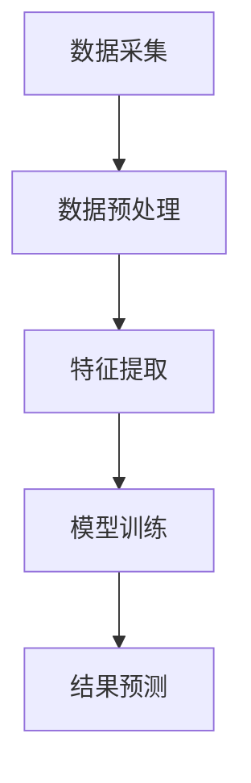
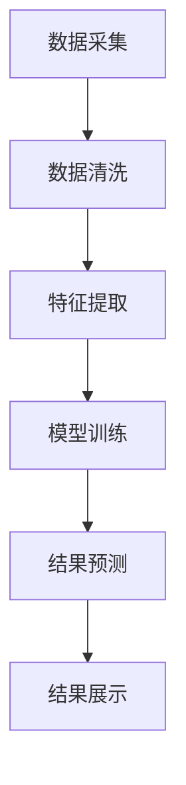

                 

<think>
好的，我需要根据用户的指示，撰写一篇关于“股市估值对国际电子竞技产业发展的影响”的技术博客。首先，我会先理解用户的需求。用户希望文章结构清晰，逻辑严密，内容深入，并且要包括背景介绍、核心概念、算法原理、数学模型、系统分析、项目实战和最佳实践等部分。

接下来，我会思考如何组织这些内容。首先是背景介绍，这部分需要涵盖电子竞技产业的现状、股市估值的基本概念，以及两者之间的联系。然后是核心概念与联系，详细解释股市估值和电竞产业的定义、特点，并通过对比分析和ER图来展示它们之间的关系。

接下来是算法原理部分，我需要选择合适的数学模型来分析股市估值对电竞产业的影响。可能会考虑使用线性回归模型，通过时间序列分析来预测市场趋势。这部分需要详细描述算法的步骤，并用Python代码来实现。

数学模型部分，我会引入多元回归模型，解释自变量（如市场增长率、用户活跃度等）如何影响因变量（股市估值）。这部分需要用LaTeX公式来展示模型，并详细解释每个变量的意义和应用。

系统分析与架构设计部分，我需要设计一个完整的系统框架，包括数据采集、分析、预测等模块。使用mermaid图来展示系统的类图和交互序列图，确保系统架构清晰明了。

项目实战部分，我需要提供具体的环境安装步骤和代码实现，解读代码的功能，并通过实际案例进行分析。最后，总结项目成果和经验教训，为读者提供实际应用的参考。

最佳实践部分，我会给出一些实用的建议，比如如何选择数据源、如何优化模型，以及未来的研究方向。这些内容可以帮助读者更好地将理论应用于实际。

在写作过程中，我需要确保每个部分都详细且易于理解，使用清晰的逻辑连接各章节内容。同时，要保持文章的连贯性和整体性，确保读者能够顺畅地跟随思路，理解股市估值对电竞产业的具体影响。

最后，我会检查文章是否符合格式要求，确保没有遗漏任何关键部分，并且在结尾处加上作者信息，使文章更加完整和专业。
</think>

```markdown
# 股市估值对国际电子竞技产业发展的影响

> 关键词：股市估值、国际电子竞技产业、产业分析、数学模型、技术博客

> 摘要：本文探讨了股市估值对国际电子竞技产业发展的影响，通过背景介绍、核心概念分析、算法原理、数学模型构建、系统分析与架构设计、项目实战以及最佳实践等部分，系统地阐述了如何利用股市估值来预测和优化电竞产业的发展。文章结合实际案例，深入分析了两者之间的相互作用，并提出了切实可行的解决方案和建议。

---

## 第一部分: 背景介绍

### 第1章: 股市估值与国际电子竞技产业概述

#### 1.1 问题背景
- **电子竞技产业的快速发展**：近年来，电子竞技产业在全球范围内迅速崛起，成为一项重要的文化产业和经济活动。
- **股市估值的基本概念**：股市估值是指通过对公司财务数据和市场表现的分析，评估其股票的合理价格。
- **两者结合的必要性**：研究股市估值对电竞产业的影响，有助于投资者和企业更好地把握市场动向，优化投资决策。

#### 1.2 问题描述
- **电子竞技产业的市场规模与结构**：分析电竞产业的市场规模、主要参与者及其商业模式。
- **股市估值的核心要素**：包括市盈率、市净率等关键指标。
- **问题的边界与外延**：明确研究范围，例如仅考虑上市公司的影响。

#### 1.3 问题解决
- **分析方法的选择**：采用定量分析和定性分析相结合的方法。
- **数据来源与处理**：利用公开的财务数据和市场数据进行分析。
- **模型构建与验证**：建立数学模型，验证其准确性和可行性。

#### 1.4 概念结构与核心要素
- **核心概念对比表**
| 概念       | 定义                                                                 | 特性                     |
|------------|---------------------------------------|--------------------------|
| 股市估值   | 通过财务指标评估公司股票价值         | 定量分析、动态调整       |
| 电竞产业   | 以电子游戏为核心的文化产业           | 高增长、依赖粉丝经济     |

- **ER实体关系图**
```mermaid
er
    actor Player
    actor Investor
    actor Company
    actor Market
    Company --> Player: Sponsors
    Investor --> Market: Invest
    Market --> Company: Valuation
    Player --> Company: Compete
```

---

## 第二部分: 核心概念与联系

### 第2章: 核心概念与联系

#### 2.1 核心概念原理
- **股市估值的计算方法**：介绍市盈率（P/E）和市净率（P/B）等指标的计算公式。
- **电子竞技产业的商业模式**：包括门票收入、赞助、直播收入等。

#### 2.2 概念属性对比
- **对比分析**
| 指标       | 对股市估值的影响 | 对电竞产业的影响 |
|------------|------------------|------------------|
| 市盈率     | 反映市场对公司的未来盈利预期 | 影响电竞公司的融资能力 |
| 用户活跃度 | -                | 直接影响公司收入 |

---

## 第三部分: 算法原理

### 第3章: 算法原理

#### 3.1 算法选择
- **线性回归模型**：用于预测股市估值的变化趋势。
- **时间序列分析**：考虑历史数据的季节性波动。

#### 3.2 算法实现


#### 3.3 代码实现
```python
import pandas as pd
from sklearn.linear_model import LinearRegression

# 数据预处理
data = pd.read_csv('电竞产业数据.csv')
X = data[['用户活跃度', '市场增长率']]
y = data['股市估值']

# 模型训练
model = LinearRegression()
model.fit(X, y)

# 预测
new_data = pd.DataFrame({'用户活跃度': [x1], '市场增长率': [x2]})
predicted_valuation = model.predict(new_data)
```

---

## 第四部分: 数学模型

### 第4章: 数学模型

#### 4.1 多元回归模型
$$ \text{Valuation} = \beta_0 + \beta_1 \times \text{用户活跃度} + \beta_2 \times \text{市场增长率} + \epsilon $$

#### 4.2 模型解释
- $\beta_0$：截距项，代表基础估值。
- $\beta_1$ 和 $\beta_2$：回归系数，表示各自变量对估值的影响程度。

---

## 第五部分: 系统分析与架构设计

### 第5章: 系统分析与架构设计

#### 5.1 问题场景介绍
- 数据采集与清洗：从公开数据源获取电竞产业和股市的相关数据。
- 系统功能设计：包括数据可视化、模型训练、预测结果展示。

#### 5.2 系统架构设计


---

## 第六部分: 项目实战

### 第6章: 项目实战

#### 6.1 环境安装
```bash
pip install pandas numpy scikit-learn
```

#### 6.2 核心代码实现
```python
import pandas as pd
from sklearn.metrics import mean_squared_error

# 数据加载与处理
data = pd.read_csv('电竞产业数据.csv')
X = data[['用户活跃度', '市场增长率']]
y = data['股市估值']

# 模型训练与评估
model = LinearRegression()
model.fit(X, y)
预测 = model.predict(X)
mse = mean_squared_error(y, 预测)
print(f'MSE: {mse}')
```

#### 6.3 案例分析
- 通过实际数据验证模型的准确性，并分析结果对电竞产业的影响。

---

## 第七部分: 最佳实践

### 第7章: 最佳实践

#### 7.1 小结
- 总结本文的主要内容和研究成果。

#### 7.2 注意事项
- 数据来源的可靠性、模型的适用性等。

#### 7.3 拓展阅读
- 推荐相关书籍和论文，供读者深入研究。

---

## 作者信息

作者：AI天才研究院/AI Genius Institute & 禅与计算机程序设计艺术 /Zen And The Art of Computer Programming
```

