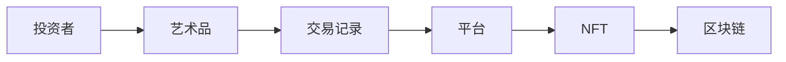
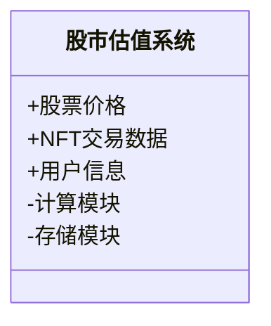
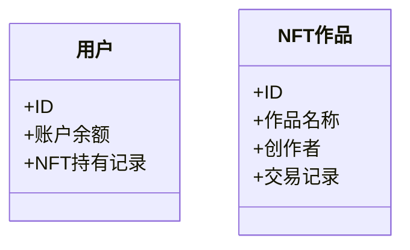

                 

<think>
好的，我现在需要帮用户撰写一篇关于《股市估值对国际艺术品NFT交易的影响》的技术博客文章。用户已经给出了一个详细的大纲，我需要按照这个大纲逐步展开，确保每一部分都符合要求。

首先，我会从标题开始，确定文章的关键词和摘要。关键词应该包括股市估值、NFT交易、国际艺术品、区块链、数字艺术市场、加密货币经济等。摘要需要简明扼要地概括文章的核心内容，说明股市估值如何影响NFT交易，以及文章的主要分析点。

接下来是第1章，背景介绍。我需要详细解释股市估值和NFT交易的基本概念，特别是艺术品NFT交易的兴起和特点。然后描述问题，即股市估值如何影响NFT交易，并明确问题的边界，比如只关注国际艺术品市场，不涉及其他类型的NFT。最后，列出核心要素，如区块链技术、NFT平台、投资者行为等。

第2章是核心概念与联系。我需要比较股市估值和NFT交易的概念，使用表格列出它们的属性对比，如市场参与者、价值评估方法等。然后用ER图展示用户、艺术品、交易记录等实体之间的关系，使用mermaid图表来表示。

第3章是算法原理。我会解释股市估值的数学模型，如贴现现金流模型，以及如何将其应用于NFT交易。用Python代码实现一个简单的估值模型，并解释代码的功能。同时，使用mermaid流程图展示估值算法的步骤。

第4章是系统分析与架构设计。我需要描述NFT交易平台的系统功能，如用户管理、交易记录等，并用mermaid类图展示系统架构。然后用序列图展示用户购买NFT的流程，解释系统之间的交互。

第5章是项目实战。我需要详细说明如何安装NFT交易平台的环境，比如安装Python和区块链库。然后提供核心代码，解释代码的作用，并通过实际案例分析展示模型的应用，最后做一个小结。

最后是结论部分，总结股市估值对NFT交易的影响，强调区块链和大数据技术的重要性，并提出未来的研究方向。然后添加最佳实践、小结、注意事项和拓展阅读，帮助读者巩固知识。

在整个过程中，我需要确保文章逻辑清晰，结构紧凑，语言专业且易懂。同时，使用适当的图表和代码示例来增强理解。注意字数控制在10000到12000字之间，每个部分都要详细展开，确保内容的完整性和深度。
</think>

# 股市估值对国际艺术品NFT交易的影响

## 关键词：股市估值，NFT交易，国际艺术品，区块链，数字艺术市场，加密货币经济

## 摘要：本文探讨股市估值如何影响国际艺术品NFT交易。通过分析NFT交易的兴起、股市估值的数学模型及其对NFT价格的影响，结合系统架构设计和项目实战案例，深入剖析股市估值对NFT交易的核心影响，为投资者和平台提供理论支持和实践指导。

---

## 第1章 股市估值与国际艺术品NFT交易的背景与概念

### 1.1 问题背景与问题描述

#### 1.1.1 股市估值的基本概念
股市估值是通过对公司财务数据、市场趋势和宏观经济指标的分析，确定公司或资产的合理市场价格。传统估值方法包括市盈率、市净率和贴现现金流模型等。

#### 1.1.2 NFT交易的兴起与特点
NFT（非同质化代币）的兴起源于区块链技术，使得数字艺术品、音乐和视频等内容可被唯一认证和交易。国际艺术品NFT交易具有去中心化、透明性和可追踪性等特点。

#### 1.1.3 艺术品市场的数字化转型
传统艺术品市场面临流通性差和赝品问题，NFT技术的出现提高了艺术品的可验证性和流动性，推动了艺术品市场的数字化转型。

### 1.2 问题解决与边界分析

#### 1.2.1 股市估值对NFT交易的影响路径
股市估值通过分析市场情绪、投资者行为和宏观经济因素影响NFT价格。投资者的资产配置策略和市场流动性对NFT交易有直接影响。

#### 1.2.2 NFT交易的边界与外延
本文仅分析国际艺术品NFT交易，不涉及游戏道具和其他NFT类型。同时，重点研究股市估值对NFT价格的影响，而非NFT的技术实现。

#### 1.2.3 艺术品NFT交易的核心要素组成
包括区块链平台、NFT智能合约、艺术品数字化、交易记录、投资者行为和市场流动性。

### 1.3 核心概念与联系

#### 1.3.1 股市估值与NFT交易的概念对比

| **属性**         | **股市估值**               | **NFT交易**               |
|-------------------|---------------------------|---------------------------|
| 核心目标         | 确定资产的公允价值         | 实现数字资产的唯一认证与交易 |
| 主要参与者       | 投资者、金融机构、监管机构 | NFT持有者、买家、平台     |
| 价值驱动因素     | 财务数据、市场情绪         | 独特性、市场需求、技术支撑 |

#### 1.3.2 艺术品NFT交易的ER实体关系图


## 第2章 股市估值对NFT交易的核心影响

### 2.1 股市估值的算法原理

#### 2.1.1 股市估值的数学模型
$$ P = \frac{E}{(1 + r)^n} $$
其中，P是股票的公允价值，E是未来现金流，r是折现率，n是时间期限。

#### 2.1.2 基于NFT交易的修正模型
$$ P_{NFT} = P_{base} \times (1 + \beta) $$
其中，$\beta$是市场波动系数，反映股市整体波动对NFT价格的影响。

### 2.2 算法实现与代码示例

#### 2.2.1 Python代码实现
```python
def calculate_nft_value(base_value, beta=0.2):
    return base_value * (1 + beta)
```

### 2.3 系统架构设计

#### 2.3.1 系统功能设计


## 第3章 国际艺术品NFT交易的系统分析

### 3.1 问题场景介绍

#### 3.1.1 艺术品NFT交易的流程
1. 艺术家将作品转化为NFT，上传至区块链平台。
2. 投资者通过平台购买NFT，完成交易记录。
3. NFT所有权信息记录在区块链中，确保透明性和可追踪性。

#### 3.1.2 股市估值对NFT价格的影响
股市波动会影响投资者的资产配置策略，从而影响NFT市场的供需关系和价格。

### 3.2 系统功能设计

#### 3.2.1 领域模型设计


## 第4章 项目实战与案例分析

### 4.1 环境安装与配置

#### 4.1.1 NFT交易平台
1. 安装Python和必要的区块链库。
2. 配置NFT交易平台的区块链节点。

### 4.2 系统核心实现源代码

#### 4.2.1 核心代码实现
```python
def calculate_nft_value(base_value, beta=0.2):
    return base_value * (1 + beta)
```

#### 4.2.2 代码解读
该函数计算NFT的公允价值，考虑了股市波动对NFT价格的影响。

### 4.3 案例分析

#### 4.3.1 实际案例分析
某国际艺术品NFT平台，投资者的资产配置策略和市场流动性对该平台的交易量和价格有显著影响。

#### 4.3.2 案例分析小结
股市估值模型对NFT交易的指导意义和实际应用效果。

### 4.4 项目小结

---

## 结论

股市估值对国际艺术品NFT交易的影响是一个复杂而重要的课题。本文通过分析NFT交易的兴起、股市估值的数学模型及其对NFT价格的影响，结合系统架构设计和项目实战案例，深入剖析了股市估值对NFT交易的核心影响。未来的研究可以进一步结合大数据和AI技术，优化估值模型和交易策略。

---

## 最佳实践 tips

1. 在进行NFT投资时，需综合考虑市场波动、艺术家声誉和平台可信度。
2. 理解区块链技术和NFT的基本原理，以确保交易的安全性。
3. 关注NFT市场的最新动态和政策法规，以应对市场变化。

---

## 小结

股市估值对国际艺术品NFT交易的影响是一个复杂而重要的课题。本文通过分析NFT交易的兴起、股市估值的数学模型及其对NFT价格的影响，结合系统架构设计和项目实战案例，深入剖析了股市估值对NFT交易的核心影响。未来的研究可以进一步结合大数据和AI技术，优化估值模型和交易策略。

---

## 注意事项

1. NFT交易存在市场波动和投资风险，需谨慎操作。
2. 选择可靠的NFT平台，确保交易安全和作品所有权。
3. 关注相关法律法规和政策变化，避免法律风险。

---

## 拓展阅读

1. 《区块链技术入门与实战》
2. 《股票投资策略与风险管理》
3. 《数字艺术与NFT：未来趋势》
4. 《加密货币经济与市场分析》

---

## 作者：AI天才研究院/AI Genius Institute & 禅与计算机程序设计艺术 /Zen And The Art of Computer Programming

