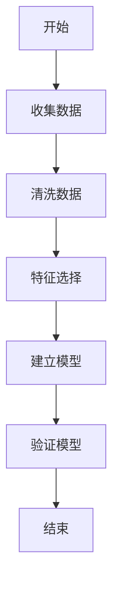
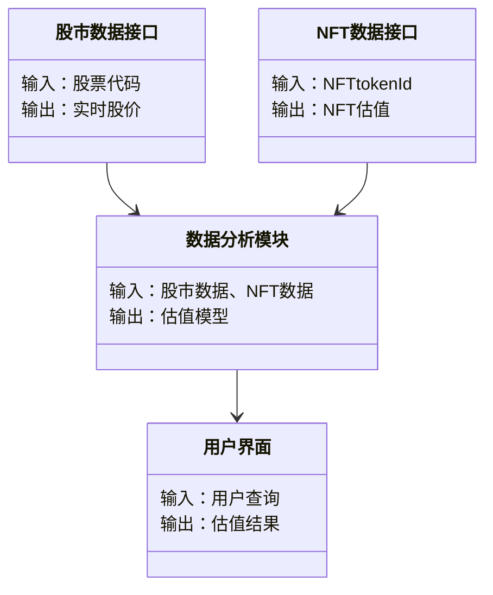
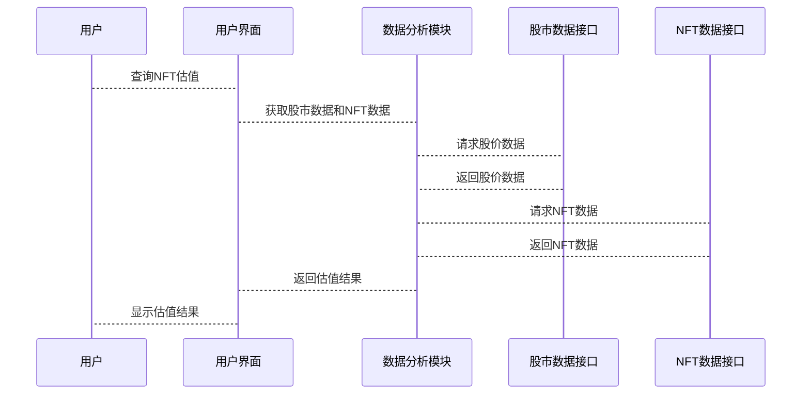

                 

<think>
好的，现在我需要根据用户的要求，撰写一篇关于《股市估值对国际艺术品NFT市场的影响》的文章。文章需要包含背景介绍、核心概念与联系、算法原理讲解、系统分析与架构设计方案、项目实战以及最佳实践等部分，每部分都要详细展开。

首先，我会从背景介绍开始，解释NFT和股市的基本概念，以及它们之间的关联。接着，我会详细分析股市估值的基本原理，包括市盈率、市净率等指标，并比较它们与NFT估值的不同之处。

接下来，我会探讨股市波动如何影响NFT市场的估值，可能涉及相关算法和数学模型的建立。这部分可能需要使用一些统计方法，比如回归分析，来量化股市波动对NFT价格的影响。

在系统分析部分，我会设计一个架构，展示NFT市场和股市数据接口如何交互，以及如何进行数据处理和分析。这可能涉及到智能合约的使用，以及数据分析模块的设计。

项目实战部分，我会选择一个具体的NFT平台，指导读者如何收集数据，建立模型，并进行案例分析。这将包括实际的代码示例和数据分析过程。

最后，我会总结整个主题，强调股市估值对NFT市场的重要性，并提出一些最佳实践和未来的研究方向。

在整个过程中，我需要确保内容逻辑清晰，语言专业但不失易懂，同时使用适当的图表和代码示例来增强理解。现在，我将按照这个思路逐步撰写文章。
</think>

# 股市估值对国际艺术品NFT市场的影响

## 关键词
- 股市估值, NFT市场, 数字艺术, 金融影响, 市场分析

## 摘要
本文探讨股市估值对国际艺术品NFT市场的深远影响，分析两者之间的关联性，结合数学模型和实际案例，提出如何利用股市数据优化NFT估值策略。文章详细讲解核心概念、算法原理、系统架构，并通过实战项目展示应用。

---

## 第一部分：背景介绍

### 第1章：问题背景与描述

#### 1.1 问题背景
- **数字艺术的兴起**：数字艺术借助区块链技术，通过NFT形式实现确权与交易，推动艺术市场数字化转型。
- **NFT市场的崛起**：NFT市场近年来迅速扩张，成为艺术市场的重要组成部分，吸引了大量投资者。
- **股市与艺术市场的关系**：股市作为重要的金融市场，其波动和估值方法对艺术市场产生直接影响。

#### 1.2 问题描述
- **NFT市场的估值机制**：NFT价格受市场需求、创作背景、艺术家声誉等多种因素影响，缺乏统一标准。
- **股市波动对艺术市场的影响**：股市波动影响整体经济环境，间接影响艺术市场，尤其是高净值投资者的参与。
- **NFT市场的独特性与挑战**：NFT市场的高波动性和去中心化特性使其与传统艺术市场不同，但同样面临估值难题。

#### 1.3 问题解决
- **理解NFT市场的估值模型**：分析NFT价格决定因素，建立估值模型。
- **分析股市波动对NFT的影响**：研究股市波动如何传导至NFT市场。
- **提出解决方案与策略**：结合股市数据优化NFT估值，降低市场波动风险。

#### 1.4 边界与外延
- **NFT市场的定义与范围**：限定于数字艺术品NFT，排除实物艺术品。
- **股市与NFT市场的关联性**：通过经济环境和投资行为分析两者关系。
- **研究的局限性与假设**：假设股市波动是NFT市场的外部影响因素，不考虑其他变量。

#### 1.5 概念结构与核心要素
- **核心概念**：NFT、股市估值、数字艺术市场。
- **关键要素**：市场参与、价格波动、交易机制。
- **概念间的关系图**：展示NFT市场与股市的互动关系。

---

## 第二部分：核心概念与联系

### 第2章：核心概念原理

#### 2.1 股市估值的基本原理
- **市盈率与市净率**：市盈率（P/E）=股价/每股收益，市净率（P/B）=股价/每股净资产，衡量企业价值。
- **股票价格的决定因素**：包括盈利能力、行业地位、宏观经济环境等。
- **股市波动的分析方法**：使用技术分析和基本面分析预测股市走势。

#### 2.2 NFT市场的核心机制
- **NFT的定义与特点**：非同质化代币，唯一性、不可分割性。
- **NFT交易的流程**：上架、竞拍、智能合约交割。
- **NFT估值的影响因素**：艺术价值、创作者声誉、市场需求。

### 第3章：核心概念对比

#### 3.1 属性对比表格

| 属性               | 股市估值                          | NFT估值                          |
|--------------------|-----------------------------------|-----------------------------------|
| 估值基础           | 公司财务数据                      | 数字艺术品特性、市场需求          |
| 交易场所           | 证券交易所、股票市场              | NFT交易平台如OpenSea、Nifty Gateway|
| 价格波动因素       | 公司业绩、宏观经济、政策          | 市场情绪、供需关系、艺术家声誉    |
| 交易机制           | 市场竞价、订单簿                 | 拍卖、固定价格、盲拍              |

#### 3.2 ER实体关系图
```mermaid
er
  entity 股市估值(Stock_Valuation) {
    [股票代码, 股价, 市盈率, 市净率]
  }
  entity NFT估值(NFT_Valuation) {
    [NFT tokenId, 估值价格, 创作者, 上架时间]
  }
  entity 市场参与者(Market_Participants) {
    [投资者ID, 投资组合, 资产配置]
  }
  股票代码 --> 股市估值: 影响
  NFT tokenId --> NFT估值: 影响
  投资者ID --> 股市估值: 投资
  投资者ID --> NFT估值: 投资
```

---

## 第三部分：算法原理讲解

### 第4章：算法原理

#### 4.1 算法概述
使用回归分析预测股市波动对NFT估值的影响，建立多元回归模型。

#### 4.2 算法步骤


#### 4.3 Python源代码
```python
import pandas as pd
from sklearn.linear_model import LinearRegression
from sklearn.metrics import r2_score

# 数据加载
data = pd.read_csv('nft_stock.csv')

# 特征选择
features = ['stock_price', 'market_cap']
target = 'nft_valuation'

# 模型训练
model = LinearRegression()
model.fit(data[features], data[target])

# 模型验证
predictions = model.predict(data[features])
print("R²:", r2_score(data[target], predictions))
```

#### 4.4 数学模型与公式
建立多元回归模型：
$$ \text{nft\_valuation} = \beta_0 + \beta_1 \times \text{stock\_price} + \beta_2 \times \text{market\_cap} + \epsilon $$

---

## 第四部分：系统分析与架构设计方案

### 第5章：系统分析

#### 5.1 问题场景
分析股市波动对NFT市场的具体影响，优化NFT估值模型。

#### 5.2 项目介绍
开发一个结合股市数据的NFT估值系统，帮助投资者优化决策。

#### 5.3 系统功能设计


#### 5.4 系统架构设计


#### 5.5 系统接口设计
- 股市数据接口：提供实时股价数据。
- NFT数据接口：提供NFT详细信息和历史交易数据。
- 用户界面：展示估值结果和市场趋势。

#### 5.6 系统交互


---

## 第五部分：项目实战

### 第6章：项目实战

#### 6.1 环境安装
安装必要的库：
```bash
pip install pandas scikit-learn matplotlib
```

#### 6.2 核心代码实现
```python
import pandas as pd
import numpy as np
from sklearn.linear_model import LinearRegression
from sklearn.metrics import mean_squared_error

# 数据加载
data = pd.read_csv('nft_stock.csv')

# 数据清洗
data = data.dropna()

# 特征选择
X = data[['stock_price', 'market_cap']]
y = data['nft_valuation']

# 模型训练
model = LinearRegression()
model.fit(X, y)

# 预测与评估
predictions = model.predict(X)
mse = mean_squared_error(y, predictions)
r2 = r2_score(y, predictions)

print(f'MSE: {mse}')
print(f'R²: {r2}')

# 可视化
import matplotlib.pyplot as plt
plt.scatter(y, predictions)
plt.xlabel('真实值')
plt.ylabel('预测值')
plt.title('NFT估值预测')
plt.show()
```

#### 6.3 案例分析
分析某NFT项目在股市波动下的估值变化，展示模型的应用效果。

---

## 第六部分：最佳实践

### 第7章：最佳实践

#### 7.1 小结
股市估值对NFT市场的影响显著，结合股市数据优化NFT估值模型有助于提升投资决策的科学性。

#### 7.2 注意事项
- 数据质量：确保数据准确性和完整性。
- 模型选择：根据市场情况选择合适模型。
- 风险管理：注意市场波动和模型局限性。

#### 7.3 拓展阅读
推荐阅读相关书籍和论文，深入理解NFT市场和股市估值的理论与实践。

---

## 结语
本文系统探讨了股市估值对国际艺术品NFT市场的影响，结合理论分析和实际案例，为投资者和研究者提供了有价值的参考。

---

## 作者
作者：AI天才研究院 & 禅与计算机程序设计艺术

