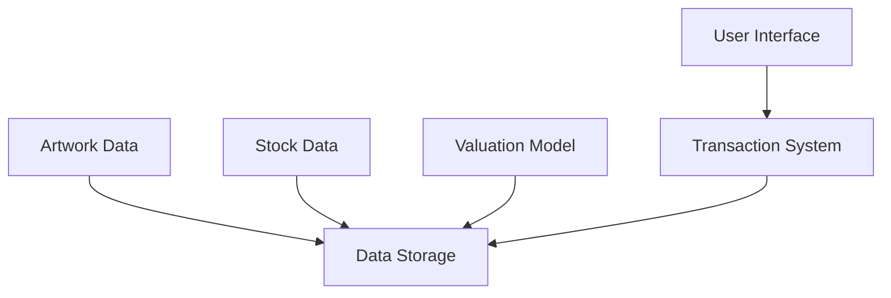
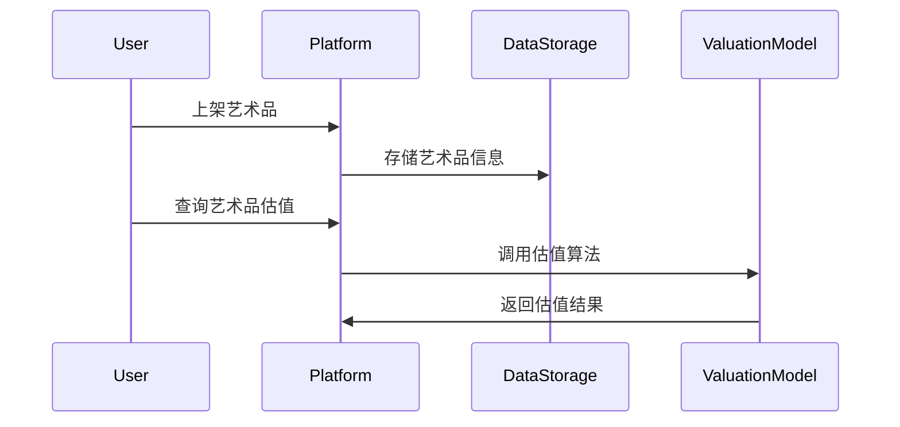

                 


# 股市估值对国际艺术品数字化交易平台的影响

> 关键词：股市估值、国际艺术品、数字化交易平台、区块链技术、数据可视化

> 摘要：本文探讨了股市估值对国际艺术品数字化交易平台的影响，从背景介绍、核心概念分析到系统架构设计，再到项目实战，详细阐述了如何通过技术手段优化艺术品交易流程和提升交易效率。文章还提供了具体的算法实现和系统设计，帮助读者理解如何将股市估值与数字化交易结合，为行业提供新的视角和解决方案。

---

# 第一部分: 背景介绍

## 第1章: 股市估值与国际艺术品数字化交易的背景

### 1.1 问题背景
#### 1.1.1 股市估值的核心概念
股市估值是指通过对公司财务数据、市场趋势和宏观经济指标等多方面的分析，评估公司股票的合理价格区间。常用的方法包括市盈率（P/E）、市净率（P/B）等。

#### 1.1.2 数字化艺术品交易的兴起
随着区块链技术的发展，艺术品的数字化交易逐渐兴起。通过区块链技术，艺术品的版权和交易记录可以被安全地记录和追踪。

#### 1.1.3 两者的关联性与研究意义
股市估值与数字化艺术品交易的关联主要体现在市场波动对艺术品价值的影响。通过分析股市的波动，可以为艺术品的估值提供参考，从而优化交易策略。

### 1.2 问题描述
#### 1.2.1 股市估值的基本原理
股市估值通常基于基本面分析和技术分析。基本面分析关注公司的财务状况，而技术分析则关注价格和成交量的变化。

#### 1.2.2 数字化艺术品交易的现状
当前，数字化艺术品交易主要通过区块链平台进行，但仍面临流动性不足、市场波动大等问题。

#### 1.2.3 当前存在的主要问题与挑战
- 艺术品价值难以量化
- 市场流动性不足
- 缺乏统一的估值标准

### 1.3 问题解决
#### 1.3.1 股市估值对数字化交易的影响路径
股市的波动直接影响投资者的资产配置，进而影响艺术品市场的交易活跃度。

#### 1.3.2 数字化交易平台的优化方向
- 提高交易透明度
- 引入智能合约优化交易流程
- 利用大数据和人工智能优化艺术品估值

### 1.4 边界与外延
#### 1.4.1 股市估值的边界条件
- 数据的完整性和准确性
- 市场的稳定性

#### 1.4.2 数字化交易的边界条件
- 技术的安全性和可靠性
- 法律法规的合规性

#### 1.4.3 两者的相互影响与外延
股市波动影响艺术品市场，而艺术品市场的变化也会反向影响股市投资行为。

---

# 第二部分: 核心概念与联系

## 第2章: 核心概念的原理与联系

### 2.1 核心概念原理
#### 2.1.1 股市估值的数学模型
股市估值常用的模型包括：
- 市盈率模型：$P/E = \text{股价} / \text{每股收益}$
- 市净率模型：$P/B = \text{股价} / \text{每股净资产}$

#### 2.1.2 数字化艺术品交易的模式
通过区块链技术实现艺术品的数字化确权和交易，确保交易的安全性和透明性。

#### 2.1.3 两者之间的关联机制
股市波动影响艺术品市场的需求和价格，而艺术品市场的变化也会影响投资者的资产配置。

### 2.2 核心概念属性对比
#### 2.2.1 股市估值与数字化交易的对比表格

| 属性         | 股市估值            | 数字化艺术品交易        |
|--------------|---------------------|-------------------------|
| 主体         | 投资者、机构         | 艺术品买家、卖家、平台 |
| 工具         | 财务报表、技术分析    | 区块链、智能合约        |
| 目标         | 确定股票价值          | 优化艺术品交易流程      |

#### 2.2.2 两者的属性特征分析
- 股市估值注重数据的可量性和可比性
- 数字化交易注重技术的安全性和透明性

### 2.3 ER实体关系图
```mermaid
erd
    Artwork
    Investor
    Transaction
    StockIndex
    Platform
    Artwork --(拥有)-- Investor
    Artwork --(交易)-- Transaction
    Transaction --(参考)-- StockIndex
    Artwork --(上架)-- Platform
```

---

# 第三部分: 算法原理讲解

## 第3章: 算法原理与实现

### 3.1 算法原理
#### 3.1.1 基于机器学习的艺术品价值预测
使用随机森林模型对艺术品价值进行预测：
$$ \text{预测价值} = f(\text{特征向量}) $$
其中，特征向量包括艺术家声誉、历史成交价等。

#### 3.1.2 基于时间序列的市场趋势预测
使用LSTM模型预测市场趋势：
$$ \text{预测趋势} = \text{LSTM}(\text{历史价格数据}) $$

### 3.2 算法实现
#### 3.2.1 随机森林模型
```python
from sklearn.ensemble import RandomForestRegressor

# 训练模型
model = RandomForestRegressor(n_estimators=100)
model.fit(X_train, y_train)

# 预测
y_pred = model.predict(X_test)
```

#### 3.2.2 LSTM模型
```python
from tensorflow.keras.models import Sequential
from tensorflow.keras.layers import LSTM, Dense

# 模型构建
model = Sequential()
model.add(LSTM(64, input_shape=(timesteps, features)))
model.add(Dense(1))
model.compile(optimizer='adam', loss='mean_squared_error')

# 训练
model.fit(X_train, y_train, epochs=100, batch_size=32)
```

---

# 第四部分: 系统分析与架构设计

## 第4章: 系统架构与设计

### 4.1 问题场景介绍
艺术品数字化交易平台需要支持艺术品的上架、竞拍、成交等流程，同时需要结合股市数据进行估值。

### 4.2 系统功能设计
- 数据采集模块：采集艺术品交易数据和股市数据
- 估值模型模块：基于机器学习的估值算法
- 交易系统模块：支持在线交易和智能合约
- 用户界面模块：提供直观的交易界面

### 4.3 系统架构设计


### 4.4 接口设计与交互


---

# 第五部分: 项目实战

## 第5章: 项目实战与案例分析

### 5.1 项目环境安装
```bash
pip install numpy pandas scikit-learn tensorflow
```

### 5.2 核心代码实现
```python
import numpy as np
import pandas as pd
from sklearn.ensemble import RandomForestRegressor
from tensorflow.keras.models import Sequential
from tensorflow.keras.layers import LSTM, Dense

# 数据加载
data = pd.read_csv('art_data.csv')

# 特征工程
X = data.drop('price', axis=1)
y = data['price']

# 模型训练
model = RandomForestRegressor()
model.fit(X_train, y_train)

# LSTM模型
model_lstm = Sequential()
model_lstm.add(LSTM(64, input_shape=(timesteps, features)))
model_lstm.add(Dense(1))
model_lstm.compile(optimizer='adam', loss='mean_squared_error')
model_lstm.fit(X_train, y_train, epochs=100, batch_size=32)
```

### 5.3 案例分析
以某件艺术品为例，分析其估值变化与股市波动的关系，展示算法的应用效果。

---

# 第六部分: 最佳实践与总结

## 第6章: 最佳实践与小结

### 6.1 最佳实践
- 数据的准确性和完整性是关键
- 选择合适的算法模型
- 系统的安全性和稳定性

### 6.2 小结
通过结合股市估值和数字化交易技术，可以显著提升艺术品交易的效率和透明度，为投资者和艺术家带来更大的价值。

### 6.3 注意事项
- 数据隐私和安全问题
- 模型的实时更新和优化
- 系统的可扩展性和可维护性

### 6.4 拓展阅读
推荐相关书籍和论文，供读者深入学习。

---

# 作者

作者：AI天才研究院/AI Genius Institute & 禅与计算机程序设计艺术 /Zen And The Art of Computer Programming

