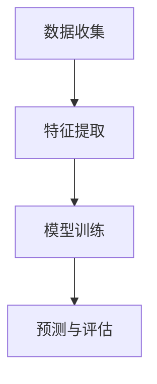
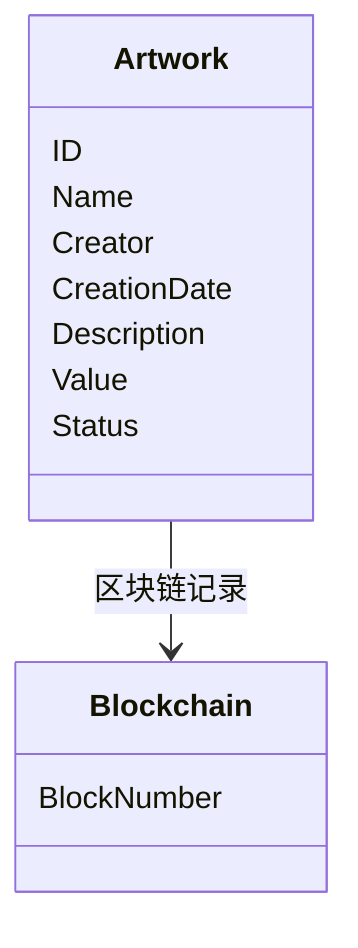

                 


# 股市估值对国际艺术品数字化交易的影响

## 关键词
- 股市估值
- 数字化交易
- 国际艺术品
- 区块链
- NFT

## 摘要
本文探讨股市估值方法在国际数字艺术品交易中的应用，分析其影响和启示。通过对比股市和数字艺术品市场的特点，构建回归模型，结合区块链技术，提出了一套适用于数字艺术品定价的评估体系。案例分析和项目实战展示了如何在实际中应用这些方法，为数字艺术品交易提供了新的视角和策略。

---

# 第一部分: 背景介绍

## 第1章: 股市估值与国际艺术品数字化交易的背景

### 1.1 问题背景与定义
#### 1.1.1 股市估值的基本概念
股市估值是通过市盈率、市净率等指标评估企业价值的过程，帮助投资者确定股票的合理价格。

#### 1.1.2 数字化交易的定义与特点
数字艺术品交易借助区块链技术，实现去中心化、透明性和不可篡改性，NFT成为主要交易形式。

#### 1.1.3 股市估值与数字化交易的关联性
数字化交易的市场波动与股市相似，估值方法可为数字艺术品提供定价参考。

### 1.2 国际艺术品数字化交易的现状
#### 1.2.1 数字艺术的兴起
数字艺术借助互联网和区块链技术迅速发展，NFT成为主流交易形式。

#### 1.2.2 区块链技术在艺术品交易中的应用
区块链确保数字艺术品的唯一性和所有权，提升交易透明度和可信度。

#### 1.2.3 当前国际艺术品市场的痛点与挑战
市场流动性不足、估值困难、交易成本高等问题亟待解决。

### 1.3 股市估值对数字化交易的影响
#### 1.3.1 股市估值方法的可迁移性
股市估值方法可借鉴到数字艺术品定价，提供参考价值。

#### 1.3.2 数字化交易市场的波动性与风险
市场波动性大，需结合股市估值方法降低交易风险。

#### 1.3.3 股市估值对数字艺术品定价的启示
通过数据驱动的方法，建立科学的定价模型，提升市场流动性。

### 1.4 本章小结
本章介绍了股市估值和数字化交易的基本概念，分析了它们的关联性和当前市场痛点，为后续内容奠定了基础。

---

# 第二部分: 核心概念与联系

## 第2章: 股市估值的核心原理

### 2.1 股市估值的关键要素
#### 2.1.1 市盈率与市净率
市盈率=股价/每股收益，市净率=股价/每股净资产，用于评估企业价值。

#### 2.1.2 股息率与股息支付率
股息率=股息/股价，股息支付率=股息支付/净利润，反映企业分红能力和利润质量。

#### 2.1.3 资产负债率与财务健康度
资产负债率=负债/资产，衡量企业财务杠杆和偿债能力。

### 2.2 数字化交易的核心机制
#### 2.2.1 数字艺术品的定义与分类
数字艺术品是通过数字技术创作的作品，NFT确保其唯一性和所有权。

#### 2.2.2 区块链技术在数字艺术品交易中的作用
区块链技术确保交易透明、不可篡改，降低信任成本。

#### 2.2.3 NFT的经济模型
NFT通过智能合约实现自动交易，市场流动性受供需关系影响。

### 2.3 股市估值与数字化交易的联系
#### 2.3.1 股市估值方法在数字艺术品定价中的应用
将市盈率、市净率等指标应用于数字艺术品估值，提供定价参考。

#### 2.3.2 数字化交易市场的流动性与股市的相似性
数字艺术品市场与股市相似，流动性影响价格波动。

#### 2.3.3 股市波动对数字艺术品交易的潜在影响
股市波动可能传导至数字艺术品市场，影响其价格走势。

## 第3章: 核心概念对比与ER实体关系图

### 3.1 股市估值与数字化交易的核心概念对比
#### 3.1.1 核心概念属性对比表
| 属性       | 股市估值                  | 数字化交易                |
|------------|--------------------------|--------------------------|
| 估值对象   | 企业价值                  | 数字艺术品                |
| 估值方法   | 市盈率、市净率             | 智能合约、区块链技术      |
| 交易市场   | 二级市场                  | 数字资产交易平台          |

#### 3.1.2 估值方法的异同点分析
股市估值注重企业基本面，而数字化交易注重艺术品的唯一性和市场需求。

### 3.2 ER实体关系图
```mermaid
er
  Artwork
  -------
  ID, Name, Creator, CreationDate, Description, Value, Status

  Blockchain
  -------
  BlockNumber

  Artwork
  -------
  one-to-one
  Blockchain
```

---

# 第三部分: 算法原理

## 第4章: 算法原理与实现

### 4.1 算法原理
通过收集数字艺术品的交易数据，提取特征，建立回归模型预测价格。

### 4.2 算法实现
```python
import pandas as pd
from sklearn.linear_model import LinearRegression
from sklearn.metrics import mean_squared_error

# 数据加载
data = pd.read_csv('digital_art_data.csv')

# 特征提取
X = data[['Artist Fame', 'Artwork Age', 'Transaction Volume']]
y = data['Price']

# 模型训练
model = LinearRegression()
model.fit(X, y)

# 预测与评估
predictions = model.predict(X)
print(mean_squared_error(y, predictions))
```

### 4.3 算法流程图


---

# 第四部分: 数学模型

## 第5章: 数学模型与公式推导

### 5.1 线性回归模型
$$ y = \beta_0 + \beta_1x_1 + \beta_2x_2 + \epsilon $$

### 5.2 评估指标
$$ R^2 = 1 - \frac{\sum (y_i - \hat{y}_i)^2}{\sum (y_i - \bar{y})^2} $$

---

# 第五部分: 系统分析与架构设计

## 第6章: 系统分析与架构设计

### 6.1 问题场景介绍
数字艺术品市场流动性不足，需通过估值模型提升交易效率。

### 6.2 领域模型


### 6.3 系统架构设计


---

# 第六部分: 项目实战

## 第7章: 项目实战与案例分析

### 7.1 环境安装
安装Python、Pandas、Scikit-learn、Mermaid工具。

### 7.2 核心代码实现
```python
import pandas as pd
from sklearn.linear_model import LinearRegression

# 加载数据
data = pd.read_csv('digital_art_data.csv')

# 特征选择
X = data[['Artist Fame', 'Artwork Age', 'Transaction Volume']]
y = data['Price']

# 模型训练
model = LinearRegression()
model.fit(X, y)

# 预测
print(model.predict([[10, 5, 1000]]))
```

### 7.3 案例分析
分析某数字艺术品的交易数据，应用模型预测其未来价格走势。

### 7.4 项目小结
详细记录项目过程中的问题、解决方案及经验教训。

---

# 第七部分: 最佳实践与总结

## 第8章: 最佳实践与总结

### 8.1 小结
总结全文内容，强调股市估值对数字艺术品交易的重要性和应用前景。

### 8.2 注意事项
提醒读者注意市场波动、数据质量和模型局限性。

### 8.3 拓展阅读
建议读者深入研究区块链技术、NFT经济模型及机器学习在金融领域的应用。

---

# 作者：AI天才研究院 & 禅与计算机程序设计艺术

